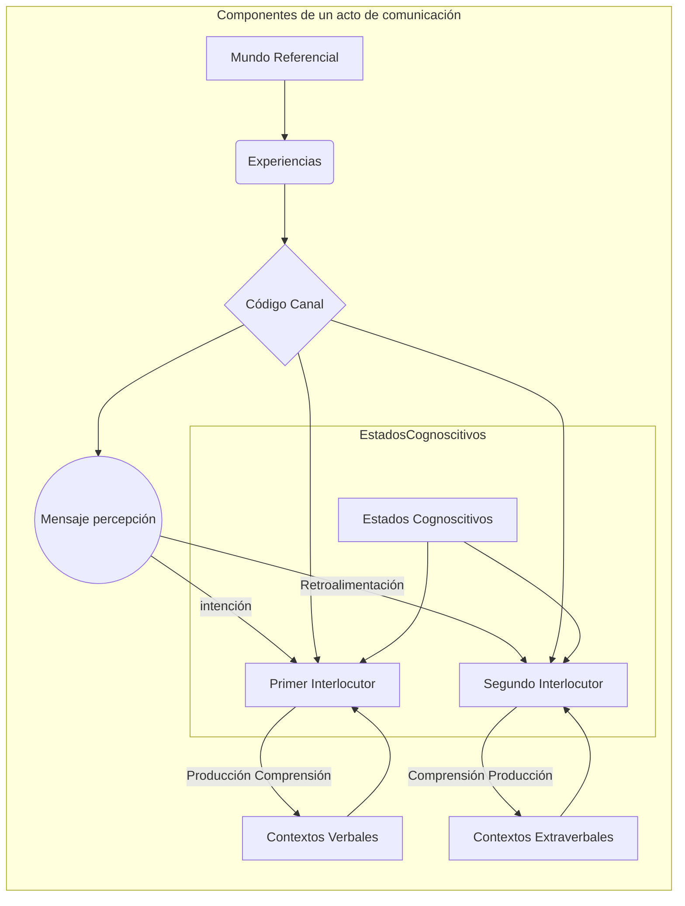

**Unidad 1**

**La comunicación**

-   **Actividad:** documento escrito
-   **Objetivo:** reconocer la estructura de la comunicación como elemento que exige el desarrollo de habilidades escriturales y retóricas.

**Instrucciones**

1.  Conformar un equipo de máximo cuatro personas.
2.  Realizar un ejercicio de consulta y análisis sobre:

-   La estructura básica de la comunicación
-   Tipos de comunicación
-   Implicaciones de los vacíos comunicativos
-   Falacias en la comunicación
-   Interferencias en el proceso de la comunicación

1.  Construir un documento con aplicación de las Normas APA en citas de textos, imágenes, referencias y demás partes del texto. Este documento debe contar con las siguientes partes:

-   Portada
-   Introducción
-   Contenido de al menos cuatro páginas
-   Conclusiones. Cada uno de los integrantes del grupo debe aportar una
-   Referencias

1.  Cada estudiante debe subir a la plataforma el archivo.

Forma de entrega

1.  Documento en Word con todas las partes solicitadas y debida aplicación de las Normas APA 7.
2.  Cada estudiante debe realizar el montaje del archivo en la plataforma.

**Materiales de lectura**

-   Presentación unidad 1
-   Vídeo importancia de la retórica
-   Documento de apoyo 3\_La retórica
-   Libro Competencias en la comunicación

**Observaciones para tener en cuenta**

• La calificación máxima posible de obtener corresponde a 50, lo que equivale a una nota de cinco punto cero (5.0). Recuerde que se evalúa en la escala de 00 a 50 y que la nota de aprobación es a partir de 30 equivalente a una nota de tres punto cero (3.0).

• Entregar la actividad por un medio diferente a la plataforma de Escolme Virtual se califica con cero (00).

• Cualquier copia de internet o de libro parcial o total y no referenciada correctamente de acuerdo con las normas APA, se evaluará como cero (00) y acarreará las sanciones establecidas en el Reglamento Académico Estudiantil.

• La sumatoria de todos los valores máximos asignados a los criterios debe dar 50.

El modelo que hemos adoptado parte de la base de los componentes que propone Sebeok, aunque no hablaremos de "fuente" y "destino", sino de primero y segundo interlocutor. No habría inconveniente en seguirles dando el nombre tradicional de emisor y receptor (o destinatario), aunque no son términos muy afortunados, pues restringen el sentido: asocian sólo la emisión y la recepción, respectivamente. Como se ilustra en la siguiente figura, además de los elementos que considera Sebeok, es necesario mencionar otros que, aunque se encuentran fuera del proceso, se complementan, suponen o implican: mundo referencial, estados cognoscitivos, propósito o intención, experiencias (información) y retroalimentación.

