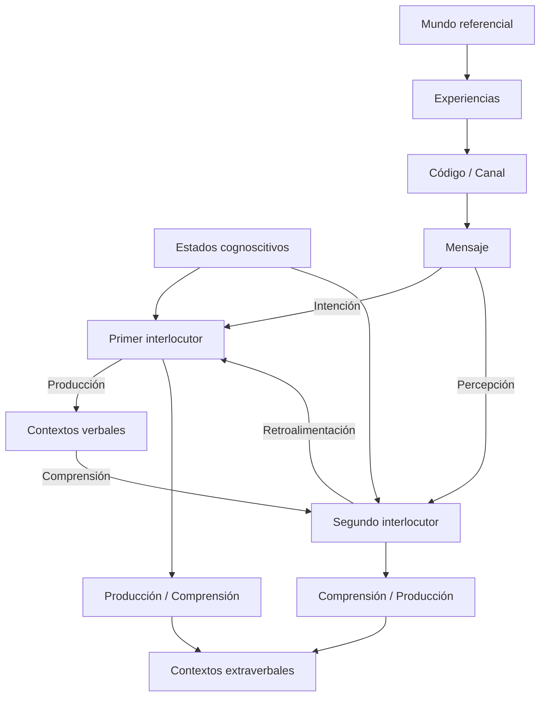

Prefacio

Las transformaciones sociales de comienzos del siglo XXI están demostrando que la comunicación humana no sólo es una necesidad vital para la supervivencia, sino una obligación y un derecho de todos. Kaplún (1998) afirma que "los hombres y los pueblos de hoy se niegan a seguir siendo receptores pasivos y ejecutores de órdenes. Sienten la necesidad y exigen el derecho de participar de ser actores, protagonistas, en la construcción de la nueva sociedad auténticamente democrática. Así como reclaman justicia, igualdad, el derecho a la salud, el derecho a la educación, etc., reclaman también su derecho a la comunicación". Sin duda, es un imperativo promover la comunicación a través de la educación de la palabra. Y la misión espiritual de la educación resiste en "enseñar la comprensión entre las personas como condición y garantía de la solidaridad intelectual y moral de la humanidad", según Morin (1990). Lo cual quiere decir, que cualquier estrategia que tienda a mejorar la comunicación en los distintos ámbitos de actuación de las personas, será a su vez, una estrategia para mejorar las condiciones de vida de la familia humana.

En este marco, la nueva edición de Competencias en la comunicación – Hacia las prácticas del discurso pretende justamente tratar de responder a las necesidades y aspiraciones de los lectores de hoy. La idea es suscitar respuestas a las inquietudes del hombre moderno en la comunicación interpersonal, verbal y no verbal: ¿cómo entender la comunicación? ¿Cómo afianzar las prácticas comunicativas en el quehacer cotidiano, la vida universitaria, el ejercicio profesional, el desempeño de la docencia y en los quehaceres de la administración? ¿Qué ofrecen al respecto las disciplinas humanísticas como la teoría de la comunicación y la lingüística del texto? ¿En fin, de qué manera involucrar y desarrollar las habilidades comunicativas a nivel superior?

Tiva a ser dirigida a la orientación que propende por un equilibrio entre la teoría y la práctica. Es decir, a partir de una descripción de las competencias y sus implicaciones, se busca animar y encauzar la audición-tendiente a alcanzar las capacidades que habilitan para la comunicación, ejercitar oral y lecto-escrita. Estamos hablando de promocionar potencialidades para producir y comprender discurso en contextos auténticos. Se trata, por tanto, de generar procesos de escritura de textos de lectura y comprensión que favorezcan el debate, la documentación, la investigación, la presentación de trabajos escritos, la participación en actividades orales y sustentación de ponencias. Sin embargo, este proceso se presenta de bidamente apoyado en los aportes de las diversas disciplinas relacionadas con la comunicación y el uso del lenguaje. El enfoque es eminentemente autónomo y transdisciplinario.

El propósito del libro, con las mejoras de la revisión y actualización de esta tercera edición, es contribuir al aprendizaje y crecimiento intelectual de los estudiantes universitarios, y a un mejor desempeño de todos los lectores, como son los docentes, profesionales, inspectores, empleados, ejecutivos y cuantos buscan fortalecer el dominio y uso del instrumento primario para la construcción del conocimiento: el lenguaje en las prácticas audio-orales y lecto-escritas. Se quiere que el libro sirva de guía para una mejor expresión del pensamiento y la afectividad, y para el manejo de un discurso eficiente y significativo en las diversas actividades educativas, científicas y laborales. Naturalmente, con ello el autor quiere subsidiar la abnegada labor de los colegas docentes, quienes podrán aprovechar, tanto los contenidos en sí como los ejercicios propuestos al final de los capítulos.

La experiencia en cuanto al uso y aplicación del libro, en sus dos primeras ediciones, nos ha instruido para apoyar el aprendizaje de la lengua materna a nivel superior, nos ha dado a entender que es grande el éxito y la satisfacción que logran nuestros lectores o usuarios. Es por eso que lo seguimos recomendado como manual o guía didáctica para el desarrollo de cursos y programas universitarios, como los siguientes:

*   Procesos o técnicas de comunicación.
*   Cursos de expresión oral y escrita.
*   Talleres de lectura, interpretación de textos y expresión escrita.
*   Producción de textos, redacción o comunicación escrita.
*   Cursos sobre competencias lingüísticas, orales y escritas.
*   Talleres de semiótica y comunicación.
*   Habilidades de comunicación o expresión oral.

De igual manera, el libro resulta de suma utilidad como estrategia para implementar diplomados, seminarios o cursos especiales, presenciales o a distancia, que tengan como objetivo la promoción de las habilidades comunicativas. Y desde luego, será un excelente medio para despertar el aprendizaje autónomo de lectores de habla hispana. Para ellos la sugerencia más importante es que realicen sistemáticamente los ejercicios, además de seguir concienzudamente la lectura de los capítulos.

En síntesis, en la tercera edición cada capítulo está presentado de la siguiente manera:

*   **Primero. Elementos significativos de la comunicación.** Se presenta una reseña sobre el proceso de comunicación, sus componentes y las competencias relacionadas con el lenguaje. Se tocan las interferencias en la comunicación.
*   **Segundo. Proceso cíclico de producción y comprensión de discurso.** Se exponen las concepciones de discurso y texto, resaltando las unidades lingüísticas, las propiedades textuales y cualidades básicas. Igualmente se analiza el proceso cíclico de emisión y comprensión de discurso. En la tercera edición se reagrupa materia y se hacen precisiones y actualizaciones conceptuales.
*   **Tercero. La producción y comprensión de discurso oral.** Dentro de una notable mejora, se describe el proceso de habla y comprensión, y se dan orientaciones técnicas sobre cómo desempeñarse en actividades orales, interpersonales, en intervenciones ante un público y en reuniones grupales. En la tercera edición los aspectos que más se ampliaron fueron la expresividad corporal, el diálogo, la entrevista, la conferencia y el desarrollo de la oratoria.
*   **Cuarto. La comprensión y análisis de textos.** Se señalan las características y etapas del proceso de lectura, niveles, estrategias e indicadores de comprensión y tipos de textura. Termina con la presentación de dos modelos para abordar el análisis textual. En la tercera edición se hicieron más precisiones y se introdujeron las técnicas del resumen.

Los capítulos quinto, sexto y séptimo, que tratan la producción escrita, recibieron en la tercera edición notables cambios para facilitarle al lector mayor claridad sobre la temática. Dichos capítulos quedaron así:

*   **Quinto. El camino a la creación de un texto escrito.** Empieza con una reflexión sobre el acto de escribir y sobre la ruta preparatoria para este proceso. Se proponen técnicas para generar y recoger ideas, organizarlas y planear el escrito. Termina con unas orientaciones para motivar a escribir, materia que, en la tercera edición, se trajo de comienzos del capítulo sexto de la segunda edición.
*   **Sexto. El proceso de composición de un texto escrito.** Se inicia con algunas estrategias generales para la composición. Se aborda el estudio de los párrafos como unidades de pensamiento, la construcción de frases y oraciones y se terminan con aclaraciones sobre las posibles dudas de carácter gramatical y léxico. Los esquemas textuales pasan al capítulo séptimo; en cambio se pasó del capítulo séptimo al sexto la revisión y reelaboración de un escrito, por ser ésta la parte que culmina el proceso escritor, en general.
*   **Séptimo. Producción de algunos tipos de textos escritos.** Se empieza con la presentación de una tipología textual que puede orientar a lector-escritor. En seguida se exponen los arquetipos textuales básicos que estaban en el capítulo sexto (descriptivo, narrativo, etcétera). Se culmina con orientaciones y sugerencias para escribir textos concretos de carácter académico, como son los informes, ensayos y el cuento.

Es de anotar que la guía para la ejercitación y la evaluación, la cual se encontraba antes al final del libro, se pasó para terminar cada capítulo, a fin de facilitarle al lector su trabajo de aplicación práctica.

Agradezco a los lectores y usuarios del libro tanto por su honrosa acogida, como por sus comentarios y aportes hechos a las dos primeras ediciones, lo cual permitió concretar algunos reajustes en la revisión y actualización para sacar la tercera edición. Al fin al cabo, ellos son la razón de ser de esta obra y sus mejoras. En especial mi va reconocimiento, en primer lugar, para el equipo humano de la casa editorial ECOE EDICIONES, que con su quijotesca labor hacen que estas letras lleguen a su destino, los lectores. En segundo lugar, el reconocimiento es para el profesor Guillermo Hernández, por sus sabias palabras plasmadas en el prólogo. Mis reconocimientos son también para mis colegas docentes de distintas universidades (la UPCT de Tunja, la Universidad de La Salle y la Libre de Bogotá, entre varias), mis ex-alumnos y estudiantes. Gracias a todos, incluidos mis hermanos, mis tres hijos y todos aquellos que me honran con su amistad, por su colaboración y su voz de apoyo.

Capítulo primero

Elementos significativos de la competencia comunicativa

"Aprender lengua significa aprender a usarla, a comunicarse o, si ya se domina algo, aprender a comunicarse mejor y en situaciones más complejas." (Daniel Cassany)

Introducción

La comunicación aparece como algo esencial ligado a la vida humana y como instrumento para la construcción del tejido social. Da fuerza y nutre a una comunidad, como lo hacen el agua, el aire o los alimentos en la vida biológica. No estamos solos. Desde el nacimiento entramos en contacto con otros seres de la misma especie, con quienes interactuamos dentro de una convivencia indispensable para crecer y subsistir. Se afirma que un adulto normal gasta un 70% de su actividad cotidiana comunicándose (David Berlo, 1977).

Este don de los seres humanos permite inferir una capacidad maravillosa -la de poder comunicarse entre sí- que sólo la cibernética ha podido desafiar a través de la historia humana. Y aún más, como afirma Juárez (2003), también es innegable que “necesitamos comunicarnos con nosotros mismos para descubrir nuestros valores interiores y, desde ahí, construirnos como personas para poder impregnar todo lo que expresamos de nuestra propia humanidad". Este don y capacidad se han constituido en objeto de investigación y de estudio. Entonces surgen interrogantes como los siguientes, cuya respuesta se aborda en este capítulo: ¿cómo se describe y explica el proceso de comunicación humana? ¿Qué competencias están comprometidas en el ejercicio de los actos de comunicación? ¿Cuáles son los saberes y usos, lingüísticos o no lingüísticos, que hacen parte de la competencia comunicativa?

**1. El maravilloso mundo de la comunicación**

A lo largo de la historia, la comunicación ha jugado un papel determinante en el desarrollo de la humanidad, y mucho más en la época presente, que se podría denominar la "era de las comunicaciones".

En verdad, las relaciones humanas (familiares, educativas, laborales, políticas, socio-económicas, científicas, artísticas y religiosas) toman como requisito una eficaz comunicación entre los miembros del grupo, si se quiere que sean armoniosas y saludables. Para lograrlo, la ciencia y la tecnología han llegado a poner al servicio de las comunidades medios y sistemas increíblemente complejos y sofisticados, cada vez con una mayor velocidad y eficacia: pensemos, por ejemplo, en la comunicación que establecen los astronautas en las bases terrestres, los contactos que se pueden realizar entre personas de distintos puntos del planeta, a través del teléfono, la televisión y la navegación a través de Internet, para no mencionar más. ¿No es esto asombroso?

Sin embargo, en contraste con el progreso científico y tecnológico, la comunicación interpersonal, es decir, el intercambio que tienen las personas en su vida cotidiana, científica y administrativa sigue soportando peligros, cuya superación se requieren estrategias de formación en este campo. Mientras la tecnología de las comunicaciones va en jet en cohete, la comunicación intra e interpersonal va en carro, o algo menos.

**1.1. Los actos comunicativos**

Todo lo anterior permite indicar que los seres humanos gozan de una capacidad especial, la función semiótica¹, la cual los habilita para adquirir, crear, aprender y usar códigos, constituidos por signos. Esta capacidad posibilita el desarrollo y ejercicio de la competencia comunicativa, conocimiento diverso y amplio que, como se explicará (Cf. p.23), abarca un conjunto de subcompetencias que habilitan a los interlocutores para producir o comprender mensajes.

Dentro de la práctica de la competencia comunicativa es posible distinguir un acto comunicativo que corresponde a una acción unitaria mediante la cual alguien produce un enunciado con sentido sobre el mundo con destino a otra persona por medio de un código y en un contexto real determinado. Una clase de acto comunicativo son los actos de habla, que tienen existencia en el uso de una lengua, oral o escrita, el medio fundamental por excelencia de la comunicación humana. En la práctica comunicativa real, los actos comunicativos o los actos de habla no se producen aislados, sino que se encadenan en la acción del discurso (Cf. p.47). A vía de ejemplo, si hacemos un recorrido imaginario por los espacios de vida de las personas, se identifican múltiples actos comunicativos, como en las siguientes situaciones:

*   Al ingresar a la oficina, Mary saluda a su jefe.
*   En la cafetería existo se me sirve un delicioso café.
*   Un estudiante se excusa con su profesora por ingresar tarde a la clase.
*   Atiendo a mi vecina, que solicita se le indique un número telefónico.
*   El expositor responde a uno de sus oyentes.
*   El Director del Colegio escribe una instrucción en la pizarra.
*   Mi padre lee la fórmula médica que me entregó el doctor.
*   En la casa observan un programa de televisión.

Como se observa por los ejemplos anteriores, los actos comunicativos son actos sociales o contos compartidos, los cuales tienen lugar en una situación real determinada, con la participación mínima de dos personas que se contactan para intercambiar o compartir sus experiencias. Behi y Zani (1990) consideran el acto comunicativo como la “mínima unidad de análisis”, en la cual se combinan elementos "verbales y no verbales". Los autores afirman que un acto comunicativo es:

…la unidad más pequeña susceptible de formar parte de un intercambio comunicativo y que una persona puede emitir con una única y precisa intención. Puede estar constituido por la producción de una sola palabra, de un gesto, aunque más a menudo suele ir acompañado de una combinación de elementos verbales y no verbales. Puede representar una pregunta, una afirmación, una amenaza, una promesa, etcétera.

**1.2. El concepto de comunicación**

Desde Jacobson (1973) es común atribuir al lenguaje natural la comunicación, como función principal y, en efecto, si ésta es difícil concebir un su juicio como lo afirma el filósofo alemán Habermas (1996): “el lenguaje disociado de su uso comunicativo, es decir, tal lenguaje completamente monológico no puede pensarse consistentemente como lenguaje”.

En principio, es fácil distinguir tres niveles de comunicación: a) la intrapersonal, que nos permite manejar nuestras ideas, pensamientos y sentimientos para entenderse uno a sí mismo; b) la comunicación interpersonal que se da de persona a persona; y c) la comunicación social, si extiende a las comunidades. Haciendo resaltar lo intrapersonal, Juárez (2003) afirma: “cuando pronunciamos la palabra comunicamos inmediatamente pensamos en una apertura hacia los demás, hacia el exterior de nosotros mismos; pero existe también una comunicación hacia adentro, interior informal, miras nuestro propio yo, que no construye también como si que nos dirige hacia otras personas”.

Situándonos en la comunicación interpersonal (entre dos personas), una primera forma de entenderla, por cierto muy común, es concebirla como la acción de informar, emitir mensajes, transmitir algo así como transferir información de una persona a otra a través de algún medio. Diremos, en tal caso, que es una comunicación unilateral o unidireccional, que se da únicamente desde la perspectiva del primer interlocutor y se le aplica más el verbo "comunicar" que el de "comunicarse". El concepto de comunicación de Berson y Steiner, citados por Kaplún (1998), recoge muy bien esta idea: “la comunicación consiste en la transmisión de información, ideas, emociones, habilidades, etcétera, mediante el empleo de signos y palabras”.

Una segunda concepción de la comunicación interpersonal, una poco más amplia, nos permite pensar en una comunicación bidireccional o dialógica. En este sentido, da la idea de diálogo, intercambio, correspondencia, reciprocidad (Kaplún, 1998). El verbo más apropiado sería el de "comunicarse".

Las dos concepciones, la unilateral y la dialógica, implican un perfil de grupo social, una cultura, unas prácticas sociales. “En el fondo de las dos acepciones, subyace una opción básica a la que se enfrenta la humanidad. Definir qué entendemos por comunicación, equivale a decir en qué clase de sociedad queremos vivir”, afirma Kaplún (1998). Pues en el primer caso (la unilateral), impera el monólogo, la unidireccionalidad, la verticalidad y el monopolio; y en el segundo, el diálogo, la bidireccionalidad, la horizontalidad y la participación. En una se produce un proceso en una sola vía, y en la otra, en dirección de ida y vuelta.

Desde el punto de vista de la comunicación dialógica (de ida y vuelta), comunicarse es el acto de hacer circular, compartir o intercambiar por algún medio, experiencias (conocimientos, opiniones, actitudes, emociones, deseos, requerimientos, etcétera) entre dos o hasta más personas, con un propósito particular, y en situaciones reales de la vida humana.

**1.3. Los componentes de un acto de comunicación**

Para el análisis y descripción de un acto comunicativo, como hecho sociocultural y como proceso, se han formulado diversos modelos. Aristóteles veía en el acto de uso de la palabra, el orador, el distinguido y el auditorio. David Berlo (1977) propone un modelo en el que se encuentran: la fuente, el codificador, el mensaje, el canal, el decodificador y el receptor. Incluye el código como parte del mensaje, aspectos que pocos consideran separados.

En un proceso como el de la comunicación humana cabría preguntarse por qué, quién, para quién, para qué, cómo, en qué situación, con qué, ETC. Tal vez una respuesta articulada permitiria la descripcion de los elementos que se dan en un acto comunicativo, Al señalar el objeto y el campo de investigacion de semiotica, Sebeok (1996) propone seis elementos, en parejas: mensajes y codigo, fuente y destino, canal y contexto, aunque segun el, un elemento fundamental del proceso semiotico sigue siendo el signo.

El modelo que hemos adoptado parte de la base de los componentes que propone Sebeok, aunque no hablaremos de "fuente" y "destino", sino de primero y segundo interlocutor. No habría inconveniente en seguirles dando el nombre tradicional de emisor y receptor (o destinatario), aunque no son términos muy afortunados, pues restringen el sentido: asocian sólo la emisión y la recepción, respectivamente. Como se ilustra en la siguiente figura, además de los elementos que considera Sebeok, es necesario mencionar otros que, aunque se encuentran fuera del proceso, se complementan, suponen o implican: mundo referencial, estados cognoscitivos, propósito o intención, experiencias (información) y retroalimentación.



Componentes formales

Emisor o primer interlocutor. La idea de interlocutor es usada por varios autores como Coseriu (1969), y aquí se relaciona directamente de manera binaria: primero y segundo interlocutor. Los teóricos de la comunicación mencionan como punto de partida una fuente, que según Berlo (1977), “es la persona o grupo de personas con una razón para ponerse en comunicación”. La idea de emisor implica necesariamente aceptar la existencia de un destinatario - persona o personas- a quien se dirige el mensaje. Quien produce un mensaje siempre tiene en cuenta para quién y qué efecto busca. Ese destinatario es el receptor intencional, o sea aquel a quien normalmente se dirige el mensaje. Por ejemplo, alguien presenta una solicitud por medio de un escrito ante un juez. El funcionario que recibe dicha solicitud es el destinatario intencional, pero si otras personas también acceden a su lectura, tendremos otro de tipo de receptor, el receptor no intencional. Un buen emisor tiene en cuenta no sólo el receptor intencional, sino los receptores no intencionales.

Receptor o segundo interlocutor. Corresponde al agente complementario del proceso, cuya tarea es captar el mensaje en forma de señal y comprender la información. Implica el reconocimiento de los signos o código común al emisor, para la descodificación y para la interpretación y recuperación del significado.

De manera similar a la labor desplegada por el emisor para producir el mensaje, el receptor compete una actividad bastante activa y compleja, tanto, que de ésta depende finalmente el éxito de la comunicación. Pues, como se explicará (Cf. p.65), a él le corresponde no solamente percibir y descodificar la señal sino, ante todo, descubrir e interpretar el contenido desde su propia experiencia y con referencia a algún aspecto del mundo.

**Código.** Para ilustrar los signos y códigos imaginemos que pedimos a una persona que nos indique por distintos medios, cómo llegar de un sitio a otro de la ciudad. Él tendrá muchas alternativas para formular su respuesta, como por ejemplo:

*   Nos dirá de manera oral que vayamos por esta o aquella avenida hasta el sitio correspondiente.
*   Podrá escribirnos y explicarnos en un papel.
*   Nos dibujará una mapa.
*   Intentará hacerse entender por gestos o movimientos corporales.
*   Hace una dramatización, o nos pone una canción en donde se explica el asunto.
*   En fin, nos invita a ver un video en el que se aclara la respuesta.

Como se observa por los ejemplos anteriores, hay códigos verbales y extraverbales, es decir, lenguajes verbales y no verbales. Tanto en la comunicación interpersonal como en social es rica la gama de opciones encontrada en los sistemas de signos (códigos) usados en la vida cotidiana: publicidad, el cine, la red

Decir “código” equivale a hacer referencia a los principios o leyes que presiden el uso de un determinado tipo de signos. Estos existen como un recurso para "significar", en consecuencia para hacer realidad el proceso de significación. La ciencia que ha estudiado los códigos y signos se ha llamado semiótica o semiología (Niño Rojas, 2007, cap. I).

La noción de código, como sistema de comunicación, con sus signos y reglas, pertenece al ámbito cultural y social. Berstein (1997) define el código como “un principio regulador, adquirido de forma tácita, que selecciona e integra significados relevantes, formas de realización de los mismos y contextos evocadores”. El autor distingue dos tipos de códigos: códigos restringidos, los que pueden delimitar el entorno natural de las personas, y códigos elaborados, aquellos que les permiten introducirse en el mundo de la creación cultural.

Según Guiraud (1991), existen códigos lógicos, estéticos y sociales. Poyatos (1994) distingue lenguaje, paralenguaje y kinésica. Siguiendo la idea de estos autores, si se toma como referencia el código de la lengua, podríamos pensar en los siguientes tres grupos: códigos lingüísticos, paralingüísticos y extralingüísticos. Los primeros están constituidos por las lenguas naturales que se hablan sobre el planeta, en un número aproximado de tres mil. Los códigos paralingüísticos son los que facilitan la representación gráfica de la lengua, por ejemplo, la escritura, o apoyan y enriquecen la realización oral: la entonación, la voz y la kinesis. Esta última se refiere a la expresión corporal.

Los códigos extralingüísticos se basan en signos poco relacionados con la lengua. Pueden ser los códigos lógicos/o científicos), sociales y estéticos, de que nos habla Guiraud. Los códigos lógicos facilitan al hombre la construcción del conocimiento, por ejemplo, los símbolos empleados en las diferentes ciencias o disciplinas: matemática, lingüística, física, química, geografía. Son códigos sociales aquellos que apoyan las relaciones en la vida cotidiana de los seres humanos: la urbanidad, la política, los ritos, normas y costumbre, y demás prácticas de grupo. Los códigos estéticos son la forma de expresión de la belleza en las diversas artes, como la música, la arquitectura, la pintura, la literatura, etcétera?

Mensaje. En el centro de todo acto comunicativo, el mensaje se presenta como el eje con el que se relacionan directamente los componentes del proceso. Así, respecto del emisor, el mensaje es un producto de emisión estructurado con una intención comunicativa y en relación con el receptor; es una unidad formal útilizable (señal) que le puede resultar significativa.

Diariamente, con la ayuda del lenguaje o de otros tipos de códigos, la gente emite un gran número de mensajes, aun sin tener plena conciencia de ello e, igualmente, le llegan otros tantos que, provenientes de diferentes emisores, no siempre tienen la fortuna de ser percibidos o comprendidos plenamente. Un mensaje puede ser un cuadro pictórico, una pieza musical, una serie de golpes, una bandera, una caricatura, unas palmadas, una frase pronunciada con sentido, un párrafo, un cuento, un discurso oratorio, un aviso publicitario, un simple movimiento de hombros, una carta, una conferencia, una canción, una audiencia de radio, un artículo de periódico, una obra de teatro, una película, una cartelera, una historieta, una revista, un poema, un guiño de ojo o movimiento de cabeza, un mapa, una flecha, un correo electrónico, etcétera. Otro ejemplo de mensaje es una oración como la de un estudiante universitario cuando le dice a su amiga "terminemos el informe y así podremos salir a ver un cine".

Un mensaje se caracteriza por poseer una estructura organizativa y un estilo propio. La estructura resulta de una configuración en que se interrelacionan significados con las formas que se manifiestan en una o varias extensiones, y en conjuntos de elementos o unidades, jerárquicamente conectados, según reglas. En el caso de la frase emitida por el estudiante, el mensaje se configura en una estructura lingüística: identifica una información la cual codifica dentro del propósito de hacer una propuesta a su amiga, a través de los sonidos, sílabas, palabras y la frase, que, en este caso, constituye una oración.

Un buen mensaje consulta los intereses, necesidades y características de la contraparte, y no es únicamente un producto bien codificado y emitido, sin vida. "De ahí resulta el mensaje desencarnado, en el vacío; un mensaje que no se preocupa por el efecto (si va a llegar, si va a ser asumido por el destinatario, si le va a servir) ni por la respuesta. No va en pos de una respuesta, de una participación; no trata de entablar un diálogo, una relación con el interlocutor" (Kaplún, 1998).

**Canal.** Se entiende como el medio físico que impresiona los sentidos del receptor en forma de señal, haciendo posible la transmisión y la correspondiente recepción del mensaje. Hay quienes hablan de canal verbal y no verbal. En el caso del verbal, la señal estaría dada por las ondas sonoras que producen el aparato fonador y articulatorio del hablante y que captura acústicamente el receptor; y en el caso de la lengua escrita, es la señal que se manifiesta en la cadena de signos gráficos que representan los grafemas.

Ejemplo de medios pueden constituir un canal:

*   Títeres, muñecos, pantomima, danza, movimientos, juegos.
*   Cartelera, letras, libros, folletos, fotografías, aviso, dibujo.
*   Sonidos, música, canto, zumbido.
*   Proyecciones, películas, diapositivas, dibujos.
*   Voces, gestos, expresiones, señas, colores.

Los contextos. Desde un punto de vista funcional los contextos son ciertas restricciones internas o externas a la emisión y recepción del mensaje; son elementos determinantes. Como en el próximo capítulo (Cf. p.56) habrá oportunidad de especificar con mayor detenimiento la naturaleza y función del contexto en el desarrollo del discurso, aquí sólo se hace referencia a los contextos, como elementos visibles e inmediatos que acompañan el proceso.

El contexto fue mencionado por el lingüista Eugenio Coseriu (1969), quien lo entendió como "la realidad que rodea un signo, un acto verbal o un discurso, como presencia física, como saber de los interlocutores y como actividad". Según él, el contexto idiomático relacionado con las características y tipo de código lingüístico, el contexto verbal, o sea, los elementos de lengua que acompañan en forma inmediata la emisión lingüística, y el contexto extraverbal, que se relaciona con los factores o circunstancias no propiamente lingüísticas que rodean el acto comunicativo y son percibidas por el receptor. Este contexto se refiere a las cosas que están al alcance perceptual, el entorno de objetos no presente, y las circunstancias históricas, culturales y sociales.

Otros elementos implicados

**El mundo referencial.** Se trata del referente que es el mundo real y posible sobre el cual se construye significado, se asocian las experiencias y se produce la comunicación. Van Dijk (1980) define este mundo así:

Un conjunto de hechos es un mundo posible, es decir, un mundo posible es todo lo que es el caso. Así, el mundo en que vivimos es un tal mundo [un mundo real]. Pero, por supuesto, podemos imaginar otros mundos posibles en donde otros hecho existen, o aun mundos (algo remoto del nuestro) en donde otro tipo de hechos existen (por ejemplo, caballos voladores, animales parlantes, etcétera).

Se constituyen como referentes de los actos comunicativos no solamente los objetos del mundo externo perceptible por los sentidos, como los seres vivos, la naturaleza y las cosas que fabrica el hombre, sino también los entes culturales, por ejemplo, el concepto de sociedad, arte, ciencia e ideas que representan lo ficticio y fantástico (mundo posible), tal es el caso de los textos literarios.

**La intención o propósito.** Los propósitos son parte de toda acción humana. La gente actúa para algo, para conseguir un fin, para obtener efectos en sí mismo o en los demás. ¿Para qué se comunica la gente? Podría decirse que para realizarse como seres humanos, para desarrollarse y para encontrarse con otros: intercambiar experiencias, solidarizarse y convivir (Kaplún 1998) afirma;

para pensar juntos. Pero nos comunicamos también para expresar emociones, sentimientos, afectos, esperanzas, ensueños. Basta pensar en los gestos: una caricia, una palmada afectuosa en el hombro del compañero que está triste, un apretón de manos no tienen "significado" racional; no tienen valor de información, de conocimiento. Y sin embargo, dicen y significan muchísimo.

Si un propósito es consciente suele entenderse como una intención, intención de comunicar o dar entender algo su interlocutor por medio del mensaje. La intención es la que desencadena y pone en acción el cerebro y demás organismos para producir mensaje en una situación específica.

**Experiencias e información.** Las experiencias son el qué de la comunicación entre las personas. Podría pensarse que corresponden a la información que codifica el emisor. Sin embargo, depende de cómo conciba la “información”, pues en el sentido corriente se suele entender como la representación de los datos, como conocimientos producidos y representados. En dicho caso, la información es sólo una parte de las experiencias comunicables (Cf. p.35). Claro que por información también se puede entender como la carga semántica (el significado) de que es portador un mensaje, objeto de interpretación por parte del receptor; cubriría una amplia gama significativa, en que los contenidos cognitivos estarían afectados, o tal vez enriquecidos, por lo afectivo, valorativo y sociocultural. Entonces, al mencionar experiencias, estaríamos hablando de los conocimientos, sentimientos y demás contenidos psicosocio-afectivos, que pretende compartir el primer interlocutor y que interpreta y entiende el segundo interlocutor.

**Retroalimentación.** La retroalimentación (feedback) o información de retorno corresponde a aquella información que regresa del receptor al emisor en el curso de la comunicación, la cual permite afinar o reajustar la emisión y asegurar así su efectividad. La retroalimentación es palpable en la comunicación cara a cara, por ejemplo, mediante la mirada, la sonrisa, la distancia, la posición o movimiento de rostro o manos, del cuerpo, forma de sentarse, sentimientos de cabeza, bostezo, estiramientos de brazos, mirada al suelo, ojos expresivos y concentración, expresión de agrado o desagrado, lectura, cuchicheo, etcétera.

Es muy importante para el emisor capturar cualquier tipo de retroalimentación y preguntarse internamente, a medida que avanza en su emisión: ¿se está interesado? ¿Entiende? ¿Me está siguiendo? ¿Algo anda mal? Por qué pregunta o afirma eso? En definitiva, en hablando sino escuchando. La principal condición de un buen comunicador es saber escuchar” (Kaplún, 1998).

**1.4. Significado y fuentes**

**La significación**

Un intercambio de experiencias, por cualquier medio que se dé, constituye indiscutiblemente una cadena de actos de comunicación. Uno de los componentes del proceso es aquello de que es portador el mensaje, lo que se quiere dar a entender, es decir, el significado, el cual se produce gracias a los signos del código utilizado. Ahora bien, los signos existen para "significar" algo sobre alguien y para alguien”, dando origen al proceso de significación, objeto de estudio de la semiótica y de semántica (Niño Rojas, 2007, cap. I).

La significación es inherente a la comunicación, o dicho de otra manera, toda comunicación humana se apoya en un proceso de significación. Así hay significación en un programa radial, un aviso publicitario, un programa de televisión, un video, un artículo periodístico, una conferencia, una conversación, un mensaje por Internet.

¿Y qué se entiende por significación? Según Guiraud (1991), "la significación es el proceso que asocia un objeto, un ser, una noción, un acontecimiento a un signo susceptible de evocarlos: una nube es signo de lluvia, un fruncimiento de ceño es signo de perplejidad...". Es de suponer que esta asociación tiene lugar en la mente y se apoya en una relación recíproca: de la señal a aquello que se asocia, y de esto a la señal que hace de signo. Como se ha dicho (Cf. p.2), sólo a los humanos les es dado el don de producir o interpretar mensajes con significado, o lo que es lo mismo, únicamente estos seres gozan de la capacidad de crear signos para "significar". El significado, por tanto, se genera en y por los signos, y es producto de la mente, con apoyo social.

Sin embargo, la significación no es reductible a una simple asociación, como pudiera entenderse hasta ahora, de acuerdo con la idea de Guiraud. Es más bien "un proceso de construcción de sentido acerca del mundo, de sí mismo o de la relación con demás” (Bahena, 1976), en la cual el sujeto estructura cognitiva-mente la realidad, en que es decisiva la mediación social, pues la existencia misma de los signos reposan en este tipo de convención. Así, en lengua castellana los hispanohablantes estamos de acuerdo en que la palabra "leche" asocia o permite interpretar la idea de ese líquido vital que producen las hembras lácteas, “críos, pero bien podríamos ponerlo de acuerdo y llamarla 'hibida párea' u 'osido blanco alimenticio', o con un nombre más sustancioso si se da de conocer su composición química en toda su amplitud”.

Fuentes y niveles de significación

Ya dijimos (Cf. p.10) que el significado se manifiesta como información, aunque entendida ésta en un sentido más amplio que un simple registro de datos, nociones o conocimientos. Si bien la naturaleza, los seres vivos y objetos inmateriales, son fuente de información, lo cierto es que sólo los grupos humanos son quienes la producen o procesan. Ahora bien, la información es procesada y registrada por el ser humano por muy diversos medios: las computadoras, las bibliotecas, CD, discos, cintas y demás medios. De manera que toda información, como producto humano, puede ser objeto de significación y ser codificada y portada por un mensaje.

¿Entonces qué cubre y de dónde procede el significado que se produce o interpreta en la comunicación? Veamos qué pretende “significar” el ser humano con los signos. Empecemos por situar el significado en cada uno de los tres campos donde tienen realización las funciones del lenguaje: lo representativo (o cognitivo), lo afectivo y lo sociocultural.

En un primer nivel de significación, desde el punto de vista representativo, los signos abren la posibilidad, tanto en el trajín de la vida cotidiana, como en el quehacer de las ciencias, de aprehender simbólicamente el mundo (Piaget, 1979) y dotarlo de sentido. Es decir, el lenguaje proporciona el poder de representar, relacionar, clasificar, ordenar y organizar, las construcciones mentales sobre los objetos y hechos de la realidad. Como afirma Gutiérrez (1975), “una lengua no es un mero calco ni trasunto de la realidad, sino que implica una estructuración y un análisis de la misma, que no es necesariamente idéntica en todas las lenguas”.

Esto por cuanto cada idioma implica, hasta cierto límite, "analizar la realidad" de manera distinta, elemento importante para la definición de la cultura de cada pueblo. Y es que los signos del lenguaje son el medio para crear y comunicar el conocimiento acerca del mundo. Como anota Bruner (1994), “el lenguaje no sólo transmite, sino que constituye el conocimiento”.

En la medida en que la representación se da en la mente sobre el mundo exterior, es útil la teoría referencial del significado expuesta por Ogden y Richard (1964), según la cual el significado surge como mención a objetos o aspectos de la realidad, con la cual, sin embargo, los signos no guardan una relación directa, sino comunicantes, vale decir, en la relación de influjo que va de emisor a receptor. En dicha interacción se manejan aspectos de tipo cognitivo, pero más frecuentemente se intercambian significados interactivos, como órdenes, solicitudes y acciones, muchas veces cargados de aspectos afectivos como amor, amistad, odio, envidia, simpatía, competencia.

Es de anotar que el significado cambia, según los contextos, los estilos y los registros que se den en la comunicación. Obsérvese, por ejemplo, cómo varía la significación en las expresiones “sírvame un tinto” [en Colombia es un pequeño café negro, en España es una copa de vino], “véndame un tinto”, “por favor, sírvame un tinto”, "por favor, véndame un tinto", "por favor, un tinto”, “¿hay tinto?”, “un café negro”, etcétera.

**1.5. Tipología de la comunicación**

Así como las actividades y ocupaciones del hombre son variadas, de la misma manera es posible registrar muchas formas de comunicación, según sea la perspectiva o punto de vista, y de acuerdo con el grado de incidencia en el proceso por parte de los componentes: emisor, destinatario, código, mensaje y canal. Se-gún esto, se podría hablar de comunicación recíproca o unilateral, interpersonalesocial, lingüística o extralingüística, privada o pública, interna o externa, directa o indirecta, y otras más, como se ilustra en la tabla que viene a continuación.

| **Criterio** | **Tipo** | **Explicación** | **Ejemplos** |
|---|---|---|---|
| 1. Grado de participación del emisor y destinatario. | • Recíproca  • Unilateralidad | • Cambio continuo de papeles de emisor y destinatario.  • No hay cambio de papeles; sólo se da un ciclo comunicativo. | • Un diálogo, una conversación, una entrevista.  • Un aviso radial, una cartelera, un discurso oratorio. |
| 2. Tipo de emisor y destinatario. | • Interpersonal  • Colectiva | • Interrelación de persona a persona: el medio por excelencia es el lenguaje oral.  • El emisor puede ser una persona o institución y el destinatario una colectividad. | • Conversación, entrevista cara a cara.  • Comunicación televisiva, radial, por prensa, cine. |
| 3. Tipo de código | • Lingüística  • Extralingüística | • El medio es el lenguaje natural, apoyado por los paralingüísticos.  • Empleo de códigos distintos al lenguaje. | • Comunicación oral y escrita, en tus formas.  • Comunicación con señales, banderines, humo. |
| 4. Tipo de mensaje | • Privada  • Pública | • No trasciende el ámbito personal, es cerrada.  • Trasciende lo personal, es abierta, se dirige a un público. | • Conversación, carta personal.  • Pieza musical de prensa, aviso publicitario. |
| 5. Estilo | • Informal  • Formal | • Espontánea y libre, sin planeación ni sujeción a patrones.  • Se ajusta a patrones o exigencias establecidas, además de las del código. | • Expresiones corporales, carta familiar, conversación.  • Texto expositivo, conferencia, etiquetas, cartas comerciales. |
| 6. Radio de acción | • Interna  • Externa | • No trasciende la comunidad o institución, relativamente cerrada.  • Trasciende a la comunidad o institución, es abierta. | • Cartelera, órdenes, memorando.  • Cuadros en exposición, avisos generales. |
| 7. Naturaleza del canal | • Oral  • Audio-visual  • Visual | • De naturaleza vocal-auditiva.  • Impresiona el oído y la vista.  • Sólo impresiona la vista. | • Grabación, conversación, mensaje radial.  • Cine, T.V., video.  • Libros, signos de los sordomudos, tablero, escritos. |
| 8. Dirección | • Horizontal  • Vertical (ascendente/descendente) | • Se da entre miembros de un mismo rango.  • Flujo comunicativo entre personas de mayor a menor rango o viceversa. | • Reunión de sindicato, diálogos.  • Leyes, decretos, solicitudes. |
| 9. Extensión del canal | • Directa  • Indirecta | • Se da a través de canales simples: implica presencialidad.  • Se da a través de canales complejos, que implican cadenas de medios. | • Proyección en una sala, coloquio.  • Periódico, avisos. |

Si se analizan los actos comunicativos que se practican a diario en la vida comunitaria, es interesante encontrar combinaciones diversas; por ejemplo, en la emisión-recepción de un mensaje por radio podría distinguirse una comunicación lingüística, formal, unilateral, pública, indirecta, abierta, etcétera; y en una llamada telefónica se identificaría una comunicación lingüística, informal, recíproca, privada, oral, etcétera. Del cuadro anterior cabe destacar la llamada comunicación interpersonal y la comunicación social, si bien en cierta medida los dos tipos de comunicación poseen a la vez lo personal y social. Sin embargo, aunque tienen elementos en común, son muy diferentes, por sus características y ámbitos de realización. De acuerdo con la tipología, a la comunicación interpersonal le cabe el ser lingüística, privada, casi siempre directa y más informal que formal. En cambio, la comunicación social es unilateral, además de lingüística se apoya en diversos medios, es pública, suele ser indirecta y es más formal que informal.

En la comunicación social es posible que la fuente sea distinta al emisor operativo; además, no existen interlocutores directos y, en consecuencia, no hay reciprocidad, es decir, no existe cambio de papeles de emisor y destinatario. En el plano omiso pueden estar una o varias personas para interpretar y codificar una información personal o institucional (fuente); los mensajes son transmitidos (emitidos) a través de diversos medios, como la radio, la T.V., la prensa escrita, las revistas, las cartas circulares, la red de internet, etcétera, para ser recibidos y descodificados por un grupo, en quienes por la información recibida, se genera lo que se llama la opinión. En este tipo de comunicación no es viable la retroalimentación. Individualmente, los miembros del grupo pueden enviar respuestas, pero establecien-do otros actos de comunicación, que en este caso pasa a ser interpersonal (por ejemplo, cartas, llamadas telefónicas, entrevistas).

**2. Bases para entender la idea de competencia**

**2.1. Aproximaciones al concepto**

# Sentidos de la palabra

La palabra "competencia" es polesemica, es decir, tiene muchas aplicaciones o usos (Tobón, 2005): como jurisdicción (de una autoridad o juez), función (de un administrador), capacidad para desempeñar un oficio, un conocimiento que se aplica, etcétera. La etimología de la palabra no aclara exactamente el sentido de lo que nos interesa, pero sí arroja ciertas luces. Viene del verbo latino "competere" que significa: "concordar, corresponder, estar en armonía con, ir al encuentro de". A su vez, se compone de los vocablos latinos "cum" (con, en compañía) y "petere" (dirigirse a, intentar llegar, solicitar). Vemos que la etimología sugiere una relación armónica entre dos puntos. Lo que nos permitiría plantear una primera hipótesis: ¿competencia será la correspondencia o relación entre dos aspectos? Si consultamos el diccionario de la Real Academia Española (2001), encontraremos dos unidades léxicas diferentes: 1. "Competencia" como contienda, rivalidad (en castellano existe el verbo competir), y 2. "Competencia" entendida en dos acepciones: "incumbencia" (relacionada con el verbo castellano competar) y "pericia, aptitud, idoneidad para hacer algo o intervenir en un asunto determinado". Seguimos pensando en una relación, en un puente, pues en el diccionario se dice "pericia, aptitud, idoneidad" (primera parte de la relación) "para hacer algo" (segunda parte).

## Algunos antecedentes

La noción de competencia irrumpió en el desarrollo de la cultura contemporánea como fuerte intento por trazar, una vez más, puentes entre el conocimiento y su aplicación, entre la teoría y la práctica, entre las capacidades subyacentes y el ejercicio. Cabe advertir, sin embargo, que este intento siempre ha existido a través de la historia de la filosofía y de la ciencia

Aunque hasta Chomsky (1965) no se hablaba propiamente de competencias, las concepciones en este terreno se situaban -desde distintas miradas- más o menos en tres distintas direcciones: a) resaltar el conocimiento abstracto sin que importara mucho su aplicación; b) dar fuerza al desempeño o ejercicio, olvidando hasta cierto punto su vínculo con el conocimiento; y c) buscar una relación entre el conocimiento y su uso (su aplicación o el desempeño).

Ciertos antecedentes lejanos se remontan a la filosofía griega, en especial a Aris-tóteles, autor que distinguía la *potencia* y el *acto*, haciendo alusión a que los humanos poseemos ciertas facultades que se pueden expresar o ejecutar. Situándonos en la psicología, Piaget (1981) desarrolló su teoría del *desarrollo cognitivo*. Al hablar de las operaciones de la mente, considera la existencia de un conocimiento abstracto del sujeto, que al actualizarlo le permite realizar tareas concretas y resolver problemas.

Ya en el campo del lenguaje, el término y la idea de competencia entran a los campos del saber por iniciativa del lingüista Noam Chomsky (1975), con su "competencia lingüística" y posteriormente por los aportes del sociolingüista Dell Hymes (1996), quien replantea el concepto dando origen a la "competencia comunicativa". De estos dos tipos de competencias hablaremos enseguida.

En el campo de la educación, según políticas educativas contemporáneas de las naciones y organismos internacionales del ramo, se han venido inculcando ciertos términos, con un significado muy afín al de competencia. Nos referimos a *desempeño*, *proceso*, *logro*, *indicador de logro* y *estándares*. Aunque aparentemente se refieren a lo mismo, con *desempeño* se quiso hacer énfasis en la ejecución de ciertas conductas y tareas por parte del alumno; *proceso* alude a un seguimiento del desempeño, obviando un poco los resultados; *logro* es la meta de lo que se busca en la acción educativa, es la ganancia en su formación -esperada u obtenida- por

parte del alumno; el *indicador de logro* es la señal mediante la cual llegamos a saber si un logro se ha alcanzado o no; en fin, con los *estándares educativos*, los planificadores formulan los logros comunes y fundamentales que todos los estudiantes de un nivel educativo y de un grupo social deben obtener.

## Conocimiento interiorizado y actuación

El primero en hablar de competencia fue un lingüista, Noam Chomsky (1975), quien introdujo el concepto de *competencia lingüística*, concebida como el conocimiento intuitivo y práctico de un hablante nativo ideal que lo habilita para producir y comprender oraciones sin ningún límite, formadas según las reglas del sistema de la lengua. La acción de producir y comprender oraciones formadas de acuerdo con la gramática resulta de la aplicación de dicho conocimiento, a la cual llamó *actuación lingüística*, constituida por actos de habla.

Chomsky se inscribe dentro de una concepción mentalista, es decir, el lenguaje se explica como manifestación de ciertas capacidades innatas del individuo humano. Por eso creía que las oraciones se generaban según ciertas reglas abstractas presentes como *estructuras profundas* en la mente. Su gramática se llamó gramática generativa. Esta posición contrasta con la de los estructuralistas de la primera mitad del siglo XX que le daban mayor importancia a la parte formal y funcional del lenguaje.

El conocimiento que da base a la *competencia lingüística* reúne ciertas características:

- Es intuitivo, abstracto y espontáneo, en otras palabras, reside como algo innato e interiorizado en la mente. Así cualquier persona, por el sólo hecho de ser hablante normal de castellano, sabe que se dice "me gusta la lectura del libro" y no otra cosa, como podría ser "me gustamos la lectura de la libro", sin que nadie le haya hablado de la conjugación de verbos, del género y número de los artículos o de la concordancia gramatical. Por tanto, no se trata de un conocimiento teórico, como lo haría una gramática escrita, sino un conocimiento sobre cómo actuar con el lenguaje.

- Es *universal*, pues lo poseen todos los hablantes normales nativos de una lengua.

- Es *creativo*, pues, como explicaremos más adelante, permite la producción o comprensión de oraciones siempre nuevas sin límite.

Al distinguir la competencia lingüística como un conocimiento interno, diferente a la actuación en la que se expresa o ejecuta dicho conocimiento, Chomsky se coloca en posición bien interesante frente al concepto: por una parte, lo considera como un saber interior situado en la mente; pero por otra, lo relaciona con su aplicación en la práctica del habla, la actuación lingüística. En consecuencia, competencia lingüística y actuación son dos conceptos diferentes pero relacionados e implican el uno al otro. La competencia es *para* producir, para el ejercicio del habla y, a su vez, la *actuación* es para ejecutar el conocimiento de las reglas de la lengua ya existente en la mente. Una vez más, vemos que competencia tiene que ver con una relación, la relación o el puente que se establece entre conocimiento (en el presente caso, de la lengua) y ejecución (uso concreto de dicho sistema).

## "Un saber hacer en contexto"

La posición de Chomsky contrasta con la idea de competencia, muy difundida en ciertos escenarios y momentos, entendida como "un saber hacer en contexto", lo que resulta poco clara, incompleta y deficiente. Lo primero que se observa es que sólo alude al segundo punto de la relación, a que nos hemos referido, el "saber hacer", el dominio de la acción, aunque añade un elemento positivo: el tomar en cuenta el contexto donde se aplica el saber. Sin embargo, no aclara en qué sentido se toma en cuenta el contexto.

Por demás, esta concepción parece traer a la mente cierta remembranza de la tecnología educativa de los años setenta. La tecnología educativa le daba prelación a la eficiencia y eficacia. Lo importaban ciertas conductas observables y medibles, más que los conocimientos, según los cánones de la psicología conductista, en la que se inspiraba.

El "saber hacer en contexto" implica eficiencia y desconoce el conocimiento, por cuanto el objeto de dicho "saber" es ni más ni menos que el "hacer". Se trata de asegurar el procedimiento, el desempeño en sí, olvidando que en el ser humano dicho desempeño tiene un referente, distinto a la acción en sí misma. Un "saber hacer" humano implica un saber inteligente que no se puede limitar a un procedimiento, por excelente que sea, como podría ejecutarlo una máquina. Al respecto, Tobón (1975) formula seis duras críticas a la concepción de competencia, en el sentido de un saber hacer. De las seis críticas son bien interesantes estas dos: la "desarticulación con valores personales" y el "no tener en cuenta la asunción de responsabilidades por el actuar humano".

## Dominio de un conocimiento y de su uso

Es una verdad innegable que la idea de competencia ha ganado terreno en el campo de la educación y la evaluación, y también en el terreno personal, comunicativo y laboral (Tobón, 2005). Ahora bien, en cualquiera de estos escenarios, la idea que más nos satisface es aquella según la cual una *competencia* es un *saber* y el *saber aplicarlo* o, dicho de otra manera, el *dominio de un conocimiento relacionado con el uso que se le da a dicho conocimiento*. Entonces optamos por basar la competencia en un saber que relaciona o, mejor, integra dos saberes (el teórico y el práctico) en un solo saber.

Daniel Bogoya Maldonado (2000), uno de los más activos defensores del enfoque de competencias en la educación, toma como base precisamente el puente entre el saber y su aplicación cuando dice que la idea de competencia “está siempre asociada con algún campo del saber, pues se es competente o idóneo en circunstancias en las que el saber se pone en juego… se expresa al llevar a la práctica, de manera pertinente, un determinado saber teórico”.

Quizás de manera más sólida, y en posiciones más recientes, competencia se ha venido entendiendo como capacidad o conjunto de capacidades que incluyen, desde luego el conocimiento, y el uso del conocimiento. Bogoya (2000) afirma al respecto que la competencia es vista “como una potencialidad o una capacidad para poner en escena una situación problemática y resolverla, para explicar una solución y para controlar y posicionarse en ésta”. Hymes (1996), promotor del concepto de competencia comunicativa, ya había expresado la misma idea con las siguientes palabras: “debo tomar competencia como el término más general para referirme a las capacidades de una persona”.

Torrado (2000), una de las personas que más ha logrado investigar sobre el tema, entiende competencia como “el conocimiento que alguien posee y el uso que ese alguien hace de dicho conocimiento al resolver una tarea con contenido y estructura propia en una situación específica, y de acuerdo con un contexto, unas necesidades y unas exigencias concretas”. Como se ve, la competencia no es el uso ni la acción en sí tampoco un conocimiento puro. Más bien es una relación o puente que implica el conocimiento y el saber usarlo. Obsérvese que aparecen otros importantes elementos de ese saber como la situación específica, contexto, necesidades y exigencias, de lo cual se infiere que implica habilidades, aptitudes, actitudes, valores y normas que de alguna manera rigen y condicionan las actuaciones.

**2.2. Competencia y creatividad**

Competencia y creatividad andan parejas o, mejor, la primera implica la segunda. No hay competencia sin creatividad, pues de por sí ésta es aplicación de la inteligencia, y establece una relación que se desplaza de un saber hacia su aplicación en la vida.

En el contexto educativo, Kimberly y Bentley (1999) casi funden en una sola idea competencia y creatividad cuando afirman: “la creatividad es, en nuestra opinión, la aplicación de conocimientos y habilidades, de nuevas maneras, con el fin de alcanzar un objetivo valorado”. Para ello los autores fijan como condición el poseer cuatro habilidades fundamentales: a) la capacidad identificar nuevos problemas, b) la capacidad de transferir a otros contextos los conocimientos adquiridos, c) el convencimiento de que el aprendizaje es un proceso incremental, y d) la capacidad de centrar la atención en la persecución de un objetivo.

La creatividad -defendida por Descartes como la nota típica que diferencia al hombre de los animales- es la base de la idea de competencia lingüística de Chomsky, pues se fundamenta en un conocimiento que genera la producción de oraciones. El secreto de la palabra misma está encerrado en la creatividad, y así lo entienden muy bien los escritores y poetas. La palabra libera, les da alas, les abre la mente y el corazón para sensibilizarlos dentro de su cultura y potenciar su habilidad expresiva. Así la creatividad llega a manifestarse de muchas formas, como “idea, inspiración, intuición, imaginación, productividad, originalidad, inventiva, innovación, descubrimiento y espontaneidad” (Baquero, Cañón y Parra, 1996).

Son seis las habilidades básicas de un ciudadano para afrontar el futuro (Kimberly y Nentley, 1999), las cuales se derivan de la creatividad como “la capacidad de aplicar y generar conocimientos en una amplia variedad de contextos con el fin de cumplir un objetivo específico de un modo nuevo”. Dichas habilidades son:

*   **Habilidad para la gestión de la información:** nadie puede negar que el volumen de información con que nos encontramos en los distintos contextos de la vida (cotidiana, educativa, científica, laboral) es supramentemente alta, hoy cuando los medios de comunicación social y las tecnologías de la información y comunicación nos invaden. Por tal razón, es un imperativo de las personas la capacidad para seleccionar, valorar, organizar y aplicar la información.
*   **Habilidad para la auto-organización:** es una urgencia del ser humano ante las necesidades de definir, metas, planear las actividades en el tiempo, asumir responsabilidades, determinar recursos y, según el campo, aplicar las mejores estrategias para el conocimiento.
*   **Capacidad para la interdisciplinariedad:** se hace necesario afrontar el conocimiento y la misma solución de problemas desde diferentes miradas, saberes y disciplinas.
*   **Habilidades personales e interpersonales:** cualquiera sea el mundo en el que se desempeñe una persona, ella requiere de habilidades fundamentales, como la capacidad para comunicarse, para cooperar con otros y perseguir objetivos comunes. Para tal fin, se requiere de una atención especial al conocimiento de uno mismo, a la motivación y al manejo de las mejores relaciones interpersonales, entre otras exigencias.
*   **Habilidad para la reflexión, la evaluación y autoevaluación:** esto exige, entre otras, la capacidad para observar, analizar, valorar, emitir juicios equilibrados, sopesar opciones, tomar decisiones y ajustarse a la realidad, según el contexto.
*   **Asumir la gestión del riesgo:** los riesgos varían de una persona a otra, de una sociedad a otra y, en general, de un contexto a otro. Además, los riesgos se dan a muy diferentes niveles: en el conocimiento, en las conductas y procedimientos, vida personal (salud, empleo..), desempeño social, etcétera.

**2.3. Competencia y otras nociones afines**

Cuando se habla de competencias, muchas veces la gente las confunde o las asmila con algunas nociones afines. Para no ir más lejos, en las anteriores consideraciones sobre creatividad inspiradas en Kimberly y Bentley (1999) pareciera que lo esencial son los conocimientos y habilidades. ¿Serán éstos unas competencias? ¿O son parte de ellas?

Para esclarecer la cuestión, Tobón (2005) propone un cuadro muy completo e interesante en el que precisa las relaciones de varios conceptos con el de competencia. A continuación haremos referencia a estos conceptos y su relación con la idea de competencias:

*   **Inteligencia:** las actuaciones que hacen parte de las competencias caen en el ámbito de la inteligencia humana.
*   **Conocimientos:** son la base de las competencias, pero además éstas se extienden a otras dimensiones, como lo relacionado con la actuación.
*   **Funciones:** tiene lugar en un tipo específico de competencias, las laborales.
*   **Calificaciones profesionales:** también son un elemento usual en las competencias de tipo laboral.
*   **Aptitudes:** como potencialidades propias de los humanos, son sin duda un punto de referencia para el desarrollo de las competencias.
*   **Capacidades:** muchos autores equiparan competencias con capacidades. Pero más bien, son una forma de entender las competencias, pues éstas se basan en capacidades cognitivas, afectivas, psicomotoras, etcétera.
*   **Destrezas:** a veces se confunden con habilidades. Pero mientras éstas son de carácter integral que nacen de la inteligencia, las destrezas son manuales. Por eso son también una forma de desarrollar o aplicar las competencias.
*   **Habilidades:** son procesos integrales generados en la inteligencia que aseguran la eficiencia y la eficacia. Por tal razón, como un punto de apoyo para el desarrollo, son componente de las competencias.
*   **Actitudes:** la afectividad y los valores propios del ser humano se integran a la actuación de las competencias. Es un componente integral de las mismas.

A manera de una visión global, es bueno considerar que los anteriores conceptos de alguna manera se encierran o se tocan con los cuatro pilares de la educación que formuló la UNESCO: saber conocer, saber hacer, saber ser y saber convivir. En este marco, hechas ya las aclaraciones pertinentes, y viendo el asunto desde el punto de mira de las competencias en la comunicación, parece que lo que es común a la competencia son los conocimientos (saber conocer), habilidades y aptitudes (saber hacer), actitudes (saber ser), y las normas y valores (saber convivir).

**2.4. Tipología de las competencias**

¿Qué clase de competencias existen? Depende del campo de desempeño, del área del saber o de la perspectiva desde cual se analicen. En educación, Bogoya (2000) habla de tres niveles de competencias: nivel interpretativo, argumentativo y propositivo. También se las denominan competencias básicas cognitivas, a las que deberá añadirse la competencia comunicativa, para hablar de las cuatro habilidades básicas en la educación.

*   **Competencia interpretativa:** se basa en capacidades para la comprensión de la información con base en los sistemas simbólicos y a partir de la captación del sentido de los textos, mapas, esquemas, mensajes auditores o multimediales, interpretación de textos virtuales y demás material, para la formulación de teorías o la reconstrucción del conocimiento. En el proceso de comunicación, se ejercita principalmente en la escucha, la lectura y el desciframiento de otros tipos de textos, para la cual es necesario el conocimiento de lenguajes verbales y no verbales.
*   **Competencia argumentativa:** su propósito es dar razón de las tesis o afirmaciones que el ser humano hace con base en los datos que la información le proporciona. Este dar razón se basa en la formulación y articulación de argumentos, en planteamientos, nuevas teorías, establecimientos de causas, efectos y relaciones, la formulación de conclusiones y la formulación del pensamiento lógico y científico, en general. En la comunicación esta competencia se ejercita en la producción de discursos especialmente expositivos, argumentativos y directivos.
*   **Competencia propositiva:** busca formular hipótesis explicativas, resolver problemas concretos, mostrar alternativas en el campo del conocimiento y de la acción, señalar formas de resolver conflictos o de hacer aplicaciones, informar sobre resultados, etcétera. Se ejercita en la producción de discurso oral y texto escrito en la medida en que los comunicadores dan a conocer por medio del lenguaje sus puntos de vista y su pensamiento.
*   **Competencia comunicativa:** es transversal en las tres competencias anteriores, es decir, está presente o implicada en ellas. La naturaleza y características de esta competencia se abordarán a continuación.

**3. La competencia comunicativa**

### 3.1. Cómo entenderla

En la misma línea en que se plantea la concepción general de las competencias, según los planteamientos anteriores, la competencia comunicativa se basa en relación de un de un conocimiento con su aplicación en actos comunicativos. Desde esta perspectiva Correa (2001) concibe la competencia comunicativa como una realidad triádica en la que coexisten, dialógicamente:

*   Unos saberes acerca de reglas y normas, estrategias y procedimientos establecidos por el sistema para formalizar y actualizar toda acción discursiva en la situación comunicativa (...)
*   Unas realizaciones de tales saberes en contextos comunicativos que les dan plena validez.
*   Unas actitudes del usuario del código con respecto al conocimiento, a la acción discursiva a los integrantes del proceso comunicativo; a sus valores y sus implicaciones tanto en el orden teórico como en el pragmático.

Nótese que el tercer componente de la tríada es inseparable del primero, como es inseparable en el ser humano la cognición de la afectividad. Se podría pensar que los saberes y las actitudes son parte que habilita para la realización. En consecuencia, podría adoptarse como concepto la primera parte complementada con la tercera, con la implicación de la segunda, que es su finalidad, así:

| SABERES + ACTITUDES, VALORES, ETC. | → | REALIZACIONES |

Entonces la cuestión sería determinar qué saberes, actitudes y demás aspectos habilitan al comunicador y cómo pasar de esos saberes a la realización eficiente, en los actos comunicativos.

De manera similar, Zuanelli (citado por Behí y Zani, 1990), concibe la competencia comunicativa como el “conjunto de precondiciones, conocimientos y reglas que hacen posible y actuable para todo individuo el significar y el comunicar”.

Esta posición, vista desde una perspectiva intrapersonal, no sólo mantiene la idea de la relación conocimiento ↔ uso, sino que promueve de manera interesante la razón de ser del acto comunicativo, o sea, el significar y el comunicar, que al fin y al cabo es la finalidad de todo acto comunicativo:

```
   PRECONDICIONES + CONOCIMIENTOS + REGLAS
          ↓
      hacen
          ↓
    ┌──────┴─────────┐
    │               │
POSIBLE        Y ACTUABLE
    │               │
    │               ↓
SIGNIFICAR Y COMUNICAR
```

Por otro lado, es muy importante tomar en cuenta que la competencia comunicativa es un saber complejo conducente a unas realizaciones, que no son otras que las prácticas del discurso en los diversos escenarios de la vida humana, como se explicará en capítulos venideros. La competencia comunicativa cubre, por tanto, un “conjunto de procesos y conocimientos de diverso tipo -lingüísticos, socio-lingüísticos, estratégicos y discursivos- que el hablante oyente y escritor lector deberá poner en juego para producir o comprender discursos adecuados a la situación y al contexto de comunicación y al grado de formalización requerido” (Lomas, 1998). Por ejemplo, un expositor ante un público posee un dominio de las precondiciones, conocimientos y reglas (lingüísticas, temáticas, discursivas, etcétera) que lo hacen apto para dirigir la palabra, expresar significado y comunicarse ante el grupo con idoneidad y eficacia en el momento y lugar señalado.

El primero en hablar de competencia comunicativa fue Hymes (1996) quien afirmó al respecto:

> El niño adquiere la competencia relacionada con el hecho de cuándo sí y cuándo no hablar, y también sobre qué hacerlo, con quién, dónde y en qué forma. En resumen, llega a ser capaz de llevar a cabo un repertorio de actos de habla, de tomar parte en eventos comunicativos y de evaluar la participación de otros. Por tanto, la competencia comunicativa tiene como base un saber comunicarse integral, con todas sus implicaciones intrapersonales y extrapersonales.

Concluyendo, en términos de una propuesta para la discusión, entendemos la competencia comunicativa como un saber comunicarse en un campo del conocimiento y un saber aplicarlo, saberes que comprenden conocimientos, habilidades, actitudes y valores (precondiciones, criterios, usos, reglas, normas, etcétera) que habilitan para realizar actos comunicativos eficientes, en un contexto determinado, según necesidades y propósitos.

### 3.2. Otras competencias afines o implícitas en la competencia comunicativa

La complejidad de los saberes comprendidos en la competencia comunicativa (lingüísticos, psicológicos, culturales y sociales) conduce a interrogarse si están implicadas otras competencias (o subcompetencias), como en efecto se menciona en la literatura que circula en los medios educativos, en el campo del lenguaje. Una propuesta bien interesante es la de Correa (2001) quien diseñó un modelo de competencia comunicativa, la cual comprende, en cierto orden, otras competencias como se ve en el siguiente diagrama.


El modelo incluye las siguientes competencias (o subcompetencias) de carácter específico:

- **Competencia lingüística**: comprende los saberes del código de la lengua (lenguaje verbal) con las reglas que rigen la construcción y emisión de enunciados oracionales, párrafos y textos, y la consiguiente comprensión de los mismos (es decir la gramática “interiorizada”). En otras palabras, se refiere a la capacidad para producir e interpretar cadenas de signos verbales.
- **Competencia pragmática**: según Correa (2002), es un “saber interiorizado por los hablantes en forma inconsciente. (...) Incluye saberes acerca de los integrantes, las intenciones y los contextos temporales y espaciales”. En síntesis, lo pragmático se refiere a saber emitir de acuerdo con la intención y motivación de los participantes y según la situación. En el capítulo segundo habrá oportunidad de analizar con más detenimiento lo que comprende una competencia pragmática (Cf. p. 44 y ss), entre cuyos componentes hay quienes nombran otras dos competencias: la competencia discursiva y la competencia textual.
- **Competencia tímica**: este novedoso saber tiene que ver con la expresión y manejo de la emotividad de parte de los sujetos que participan en un acto de comunicación. Dicho saber influye en la construcción del mensaje, además de ser la realización de la función expresiva. Se encuentra presente “en toda interacción comunicativa, e influye sobre la determinación y construcción de contextos, así como sobre el saber lingüístico mismo” (Correa, 2002).
- **Competencia cultural**: corresponde al “saber acerca de las representaciones hechas sobre el mundo”, es decir, el referente de la comunicación. De alguna manera podría también llamarse competencia cognitiva. Sin embargo, existe cierta diferencia, pues lo cognitivo hace referencia a saber representar, en cambio, la competencia cultural, aunque también tiene que ver con el saber representar, su punto de vista es la cultura del grupo social al cual pertenecen los comunicadores. Una verdad indiscutible es que al comunicase las personas, no solamente lo hacen dentro de una determinada cultura, sino que al mismo tiempo la reflejan en sus actos comunicativos (Poyatos, 1994).
- **Competencia ideológica**: se trata de un saber sustentado en la apropiación de las creencias no argumentadas que permite justificar el poder que ostenta un grupo, dando cuenta de su ubicación en la organización social. Inicialmente propuesta por Verón (según Bustamante, 2002), la competencia ideológica “no sólo subyace en las demás competencias sino que -ante todo- interviene dinámicamente en la selección, estructuración y depuración de los elementos culturales” (Correa, 2001). Pues salta a la vista, que los ideales se encuentran ligados a las culturas y sus correspondientes prácticas sociales.

En este modelo, Correa no incluye explícitamente la competencia textual, que se basa en un saber construir textos con adecuación, coherencia y cohesión. Sin embargo, pensamos que está de alguna manera comprendida en la competencia pragmática, pues quien está en condiciones de producir discurso, por el mismo hecho, estará capacitado para producir texto (Cf. p.44 y ss).

Si bien las anteriores competencias explican bastante bien las implicaciones de la competencia comunicativa, si tomamos en cuenta otros puntos de vista, hay quienes creen que existen otros tipos de competencias comunicativas. Por ejemplo, Behi y Zani (1990), además de las competencias lingüística y pragmática, ya indicadas en el modelo de Correa, añaden las siguientes competencias:

> - La competencia paralingüística que es la capacidad de acompañar el mensaje de elementos significativos como el tono, el acento, la voz, la pronunciación, etcétera (Poyatos, 1994).
> - La competencia kinésica la cual tiene que ver con el manejo de la expresividad corporal mediante gestos, la mirada, el rostro y movimientos.
> - La competencia proxémica, que consiste en saber dar sentido a los espacios en la comunicación, como puede ser la distancia (o la mesa y sillas) que dejan los interlocutores en una entrevista.
> - La competencia sociocultural, o capacidad de reconocer situaciones sociales, por ejemplo, rangos, roles, conflictos, etcétera.

### 3.3. Saberes y usos verbales

Por lo expuesto hasta el momento, saber comunicarse supone, primeramente, saber conocer y pensar, pero al mismo tiempo también saber interpretar las diversas experiencias, codificar, emitir, percibir, descodificar y comprender. En el caso del lenguaje verbal, la competencia comunicativa implica la competencia lingüística, es decir, saber escuchar, hablar, leer y escribir en una lengua. Lo anterior exige el dominio del código gramatical y los códigos paralingüísticos necesarios, y también el dominio de los mecanismos de emisión y recepción lingüística (Cf. p.57 y ss). No hay duda que la competencia lingüística (o gramatical) es tan solo un componente de la competencia comunicativa (Hymes, 1996). ¿Y qué comprende de la competencia lingüística? A continuación se hace referencia a ella, desde la perspectiva de la lengua española.

#### Saber la lengua y usar la lengua

El lenguaje humano se puede entender de dos maneras: como lenguaje en sentido amplio (o lenguaje total = lenguajes verbales y no verbales) y como lenguaje en sentido estricto (sólo el lenguaje verbal). El lenguaje total cubre la función semiótica de los humanos, es decir la capacidad de adquirir, desarrollar y usar cualquier sistema de signos, tanto en la vida cotidiana como laboral o científica. Desde este ángulo se acepta como lenguaje el braille propio de los invidentes, el alfabeto de los sordomudos, las señales de tránsito y los códigos usados en las ciencias y en todo tipo de actividad social, entre otros.

El lenguaje en sentido estricto (lenguaje verbal) es la facultad o función humana que se manifiesta en las lenguas naturales o idiomas, constituidos por sistemas de signos fónicos y articulados utilizados por una comunidad, nacional o internacional, para su convivencia, desarrollo y comunicación. Dichos signos se configuran como sonidos, fonemas, palabras o cadenas de frases y oraciones que varían de una lengua a otra. Aunque la gente puede hablar varios idiomas, lo cierto es que cada persona posee de cuna una lengua, que es su lengua materna. Bien se sabe que la lengua materna de la mayoría de los hispanoamericanos es el español o castellano.

El código de la lengua castellana, se sustenta en un sistema común de reglas, de manera que por medio de ella logran entenderse hablantes de diversas nacionalidades y regiones del mundo. Pero no todos los hispanohablantes hacen igual uso del idioma. En realidad cada persona y cada grupo emplean una variedad de lengua marcada por diferencias motivadas por factores socioculturales y geográficos. Las peculiaridades del habla de un individuo constituyen su idiolecto y las características lingüísticas asociadas a un grupo social o geográficamente considerado, constituyen un dialecto. Pedro y María tienen cada uno su idiolecto. Pero los hablantes de la zona andaluz de España tienen su variedad dialectal, el andaluz.

La lengua común (o estándar) se basa en un sistema de reglas que los hablantes conocen, acatan y aplican en la comunicación, en el contexto de toda la comunidad en que se usa. El estudio de estas reglas corresponde a la gramática, de la cual hacen parte, entre otras disciplinas, la semántica o estudio de los significados, la morfosintaxis o estudio de las palabras y la construcción de frases y oraciones, la fonología y la fonética, que analizan el material sonoro de la lengua, y la ortografía, disciplina normativa que regula el uso de los signos de la escritura.

El dominio de la lengua se inicia con la adquisición y desarrollo de las estructuras básicas en la primera infancia, se afianza progresivamente con la educación y se perfecciona a lo largo de toda la vida, lo que es posible mediante la reflexión unida a la práctica, como es la propuesta del presente libro. El saber la lengua o saberla hablar y escribir, es precisamente el objeto de la competencia lingüística, conocimiento que poseen en el cerebro quienes consideran la lengua como propia; en cambio, actuación es la práctica, que se manifiesta en los actos de habla, entre los que se cuentan los actos de escritura.

El saber la lengua es un conocimiento práctico y no necesariamente teórico. Por ejemplo, saber usar los verbos según las conjugaciones, así no sepa que se llaman verbos y que sus variaciones son las conjugaciones. Saber hacer el plural de los sustantivos, así no sepa que se llaman sustantivos y que dicha variación es singular y plural, saber emplear los adjetivos, aplicar la concordancia en las oraciones, etcétera y evitar toda clase de errores gramaticales. No obstante, la ciencia introdujo también la teoría para explicar y representar lo que ya tenemos en el cerebro. Los conocimientos teóricos son muy útiles, pues permiten llevar a la conciencia lo que sabemos por intuición; puede ayudar, orientar, aclarar dudas, inspirar, dar seguridad y hace más racional la práctica.

#### Dominio de la lengua oral y escrita

El saber la lengua (competencia lingüística) se manifiesta en actos de habla que pertenecen a dos modalidades de realización: la audio-oral y la lecto-escrita. Cabría la duda: ¿son diferentes lenguas, la del oyente y hablante, y la del lector y escritor? No ciertamente. Es una misma lengua, un mismo código lingüístico. Sin embargo, el escuchar y hablar la lengua, y leer y escribir por medio de ella, si bien se valen del mismo código común, tienen profundas diferencias. Hay quienes piensan en lengua hablada y lengua escrita, pero en realidad se trata de una lengua que se realiza como código oral y como código escrito. Las características del lenguaje oral y del lenguaje escrito pueden ser contextuales y textuales. Las primeras tienen que ver con factores pertenecientes al contexto en se produce la comunicación: espacio, tiempo, modo, relaciones entre los sujetos, etcétera.

Las características textuales pertenecen más al campo gramatical como la construcción de frases y palabras, la corrección, cohesión y otras. En la siguiente tabla el lector encontrará algunas de las características más notables (contextuales y textuales), tanto del código oral como del código escrito:

| Código audio-oral | Código lecto-escrito |
|---|---|
| Se apoya en el canal auditivo, aunque suele apoyarse en otros medios visuales. | Se apoya en el canal visual. |
| Es más espontáneo e informal. El hablante puede rectificar, pero no borrar lo dicho. La comprensión debe ser simultánea, no da tiempo. | El escritor está en condiciones de corregir y hasta borrar totalmente. Para la comprensión el lector puede tomarse su tiempo. |
| Se produce en un presente, es inmediato. Sigue la línea del tiempo. | Se difiere en el tiempo. Un escrito remonta el tiempo y la geografía. |
| La comunicación oral es efímera. Se puede perder, a no ser que se registre, por ejemplo en medios electrónicos. | El mensaje escrito es duradero, permanece en el papel u otro material. |
| Se apoya en medios no verbales (voz, tono, gestos, acento, mirada, distancias, imágenes, señales, etcétera). | Carece de estos medios, pero usa otras señales, como por ejemplo, los signos de puntuación, gráficas, esquemas, mapas, etcétera. |
| Se vale de comodines o muletillas: eh, ya, hola, bien, mm.., a ver, carraspeos, etcétera. | Casi no existen. |
| Se nota el lenguaje dialectal, en que se refleja la cultura del grupo. Se perdonan más los errores e incorrecciones. | Tiende a la lengua común, culta o "estándar". Las equivocaciones e incorrecciones se notan más. Se perdonan menos. |
| Se basa en cadenas de sonidos, que se perciben en la línea del tiempo. | Se vale de cadenas de grafemas, o signos escritos que representan los fonemas de la lengua. |
| El hablante puede hacer pausas, o hablar en diferentes ritmos. | Las pausas van por cuenta del lector. |
| Estructura de discurso más libre, es bastante informal, según el contexto y el tipo de discurso. | La estructura discursiva es más rígida. El discurso más elaborado y formal. |

### Semejanzas y diferencias del código audio-oral y lecto-escrito

Como se observa, el código lecto-escrito posee rasgos que lo hacen relativamente autónomo con respecto al código audio-oral. Aunque el hecho de saber la lengua, en la modalidad audio-oral ya es un buen primer paso para el dominio lecto-escrito, este último exige el aprendizaje de reglas y condiciones propias.

Salta a la vista que la modalidad lecto-escrita incluye saber leer y escribir; el primero es requisito del segundo. Aún más, el mejor método para aprender a escribir comienza con la lectura. En consecuencia, cuando en adelante aparezcan los términos *escritura, lengua escrita, código escrito, lenguaje escrito o texto escrito*, estaremos aludiendo a la modalidad lecto-escrita, en sus fases de comprensión y producción.

De todo lo anterior se concluye que dentro de la competencia lingüística se distinguen dos competencias de menor extensión -dos subcompetencias- a saber: la competencia audio-oral y la competencia lecto-escriora. En el capítulo tercero se tratará el desarrollo del discurso oral; en el cuarto el discurso escrito en su fase de comprensión lectora, y en el quinto, sexto y séptimo el discurso escrito, en su fase de producción.

#### 3.4. Saberes y usos no verbales

En esta parte se hará referencia a ciertos saberes, intrapersonales, interpersonales y transpersonales, que no atañen propiamente al lenguaje verbal (oral o escrito) sino a códigos y estrategias de índole más general, como elementos también pertenecientes a la competencia comunicativa.

##### Conocimiento del código

Se parte de la base de un conocimiento interiorizado y espontáneo del lenguaje natural, verbal, desarrollado en la primera infancia (primera lengua o lengua materna), y de un conocimiento de otros códigos verbales (otras lenguas) o no verbales, adquiridos según experiencias y necesidades específicas de los individuos y grupos. Implica, por tanto, "poseer un lenguaje" o un "conocimiento del lenguaje", que es propio de toda persona por el hecho de hablar un idioma, así no lo haya estudiado. Estudiarlo conduciría a un "conocimiento teórico sobre el lenguaje", o sea *metalinguaje*, de carácter reflexivo, el cual constituye la lingüística y sus disciplinas (Niño Rojas, 2007).

Es evidente que si alguien se mete a jugar un partido de fútbol o uno de ajedrez, tendrá que conocer las reglas del juego, o de lo contrario fracasará. De igual manera los comunicadores -emisores y destinatarios- tendrán que conocer bien el código con el cual operan, es decir, el sistema de signos con los cuales arman y producen los mensajes. Si dicho conocimiento es deficiente, también resultará deficiente o con ruidos la producción de mensajes, y, en consecuencia, se dará una comprensión difícil de los significados correspondientes. Naturalmente, dentro del conocimiento de un código hay grados: por ejemplo, en relación con una lengua, siempre habrá quien la hable o escriba mejor, o quien la hable o escriba con dificultad.

#### Capacidades cognitivas

Comprenden el conocimiento como construcción, es decir, en proceso, y también el *producto* de dicha construcción. El conocimiento implicado en la competencia comunicativa es diverso y amplio. Además de los dominios ya señalados anteriormente, como el conocimiento del código, es importante hacer algunas consideraciones sobre el conocimiento del tema y sobre las habilidades de pensamiento.

##### Conocimiento del tema. Nadie puede dar de sí lo que no tiene, ni enseñar a los demás si no sabe. Al contrario, un magnífico saber garantiza una buena comunicación; como dice el Evangelio, "de la abundancia del corazón habla la boca". Es necesario conocer el tema o tópico sobre el que versa la comunicación y el cual se engloba en cualquiera de los campos del saber y del hacer de los humanos.

Al respecto, para lograr el éxito comunicativo, conviene considerar algunas condiciones:

- Para ser buenos comunicadores se necesita una preparación o cultivo de la persona a través de la observación, la lectura, el estudio y la investigación.
- En todo acto de comunicación es importante poseer seguridad y claridad, no sólo sobre los propósitos, sino también sobre el contenido o tema.
- Todo comunicador deberá adaptarse al nivel de conocimiento y de interés de sus interlocutores, es decir, al marco de conocimiento común.

##### Habilidades de pensamiento. Todo individuo posee por naturaleza ciertas estructuras cognitivas que le permiten al sujeto aprehender el mundo, interactuar con él y descubrir sentido. Estas estructuras han sido desarrolladas desde la primera infancia, de manera asociada con la adquisición y desarrollo del lenguaje.

La capacidad comunicativa está estrechamente correlacionada con la *capacidad de pensamiento* del individuo. A mayor riqueza de pensamiento, mayor riqueza comunicativa; a mayor claridad de ideas, conceptos y opiniones, también mayor claridad en el flujo de la producción-comprensión. El pensamiento se desarrolla aprovechando al máximo la experiencia diaria, en el aprendizaje de la ciencia y de la cultura, en la interacción social y, desde luego, ejercitando la inteligencia.

Es preciso, en primer lugar, desarrollar la capacidad comprendida en las operaciones cognitivas básicas como la observación, percepción, conceptualización, intuición y análisis para la identificación estructural de las distintas realidades (física, psíquica, biológica y sociocultural), para saber discriminar lo concreto de lo abstracto y lo real de lo fantasioso. Como consecuencia, es necesario facilitar la formación de los conceptos, mediante el uso de símbolos y signos, en procesos de abstracción y generalización, comparaciones, analogías y aplicaciones, y permitir las operaciones más elevadas del pensamiento racional en donde tiene importancia la transferencia, la solución de problemas, el análisis y síntesis, las diversas inferencias, la argumentación y la crítica.

A lo anterior se añade la necesidad de *asimilar otras experiencias asociadas*. Por ejemplo, los antiguos griegos formaron su pensamiento a partir del goce perceptivo de unos mares azules surcados de dedos, de montes escarpados bañados de brisa, bajo un cielo claro y diáfano, capaz de estimular una reflexión densa y reposada, pero todo dentro de una experiencia humana típica: una cultura, una raza y una historia propias, una manera peculiar de sentir, una forma particular de afrontar sus necesidades y de resolver sus conflictos. Y así como supieron asimilar su medio y su experiencia, lograron sobresalir en el desarrollo del pensamiento. De igual manera, si formamos nuestro pensamiento a partir de un ambiente urbano moderno, bullicioso, concentrado en necesidades y conflictos, lo lograremos desarrollando capacidades intelectuales, de acuerdo con nuestro temperamento, nuestras reacciones específicas, nuestras apetencias y necesidades, nuestro modo de sentir, nuestra ideología, nuestras creencias y todo lo que nos pertenece. En este sentido, aprender a pensar es también aprender a asimilar las propias experiencias para integrarlos al conocimiento y a los imperativos de la razón. Por algo se ha dicho que hablar-escuchar es encontrarse a sí mismo.

### Actitudes y valores

Las actitudes y valores son factores que condicionan o influyen en un acto comunicativo. Una actitud implica una experiencia subjetiva que, relacionada con el mundo objetivo, orienta la personalidad dentro de unas tendencias, negativas o positivas. Así, un alumno puede perder su examen por una tendencia hacia la poca aceptación del maestro: hay aquí una actitud negativa (que puede ser desconfianza, recelo, antipatía). Un participante en un acto literario, científico o deportivo puede, así mismo, ganar la competencia gracias a una convicción interna de lograrlo: se trata de una actitud positiva (tal vez de agrado, confianza, fe, entusiasmo). En verdad "comunicarse es una aptitud, una capacidad; pero sobre toda una actitud. Supone ponernos en disposición de comunicar, cultivar en nosotros la voluntad de entrar en comunicación con nuestros interlocutores" (Kaplún, 1998). Y van Dijk (1980) reafirma al respecto:

Las actitudes organizan las maneras en que comprendemos, interpretamos y aceptamos información, en que ponemos o cambiamos percepción del mundo no sean todavía la que nosotros anhelamos. Significa estar personalmente comprometidos con ellos.

En cuanto a los valores (morales, científicos, religiosos, culturales, sociales...), que proceden de las formas de concebir, aceptar y apreciar los diversos aspectos de la vida y el mundo social y natural circundante, también generan actitudes y comportamientos. Existen valores compartidos y no compartidos. Cualquiera que sea el valor que posean los interlocutores, éste se refleja, de alguna manera, en los actos comunicativos.

### Capacidades de interacción cultural

#### Capacidad para el intercambio de experiencias. La interacción cultural se da principalmente por el intercambio de experiencias según el grupo al que se pertenece. "Sin experiencias comunes no hay comunicación" (Kaplún, 1998). Y ésta es una gran verdad, pues ahí reside el secreto del saber compartir en la *comunidad*, la comunicación, cuyo éxito se persigue. Pero son importantes tanto las experiencias del primero como del segundo interlocutor. Sigamos escuchando a Kaplún:

> Antes de intentar comunicar un hecho o una idea, el comunicador tiene, pues, que conocer cuál es la experiencia previa de la población destinataria en relación con esa materia o ese hecho. Partir siempre de situaciones que sean conocidas y experimentadas por ella. No sólo debemos esforzarnos por hablar en el mismo lenguaje de nuestros destinatarios, sino también por encontrar qué elementos de su ámbito experiencial pueden servir de punto de partida, de imagen generadora para entablar la comunicación, de modo que ellos puedan asociar el nuevo conocimiento con situaciones y percepciones que ya han experimentado y vivido.

**La experiencia cotidiana** es uno de los temas destacados por Habermas (1996) en su teoría sobre la acción comunicativa. Es interesante la forma como llama la atención no sólo sobre la naturaleza integral de dicha experiencia, que cubre tanto lo cognitivo como lo afectivo, sino también sobre la importancia de su carácter compartido e intersubjetivo, expresable en sistemas simbólicos:

> La experiencia cotidiana se forma no sólo cognitivamente, sino en conexión con actitudes afectivas, intenciones e intervenciones prácticas en el mundo objetivo. Las necesidades y las actitudes afectivas, las valoraciones y acciones constituyen un horizonte de intereses naturales, sólo dentro del cual las experiencias pueden producirse y corregirse. Finalmente, la experiencia cotidiana no es asunto privado: es parte de un mundo compartido intersubjetivamente, en el que cada sujeto vive, habla y actúa en cada caso con los demás sujetos. Esa experiencia

intersubjetivamente comunicada se expresa en sistemas simbólicos, sobre todo en el sistema simbólico que es el lenguaje natural, en el cual el saber acumulado está dado al sujeto particular como tradición cultural.

Al respecto Schramm (1966) proponía tomar en cuenta el “marco de referencia”, entendido como las experiencias y significados previos, a los cuales se asocia la interpretación de un mensaje:

> Los signos pueden tener solamente el significado que la experiencia del individuo le permita leer en ellos. Podemos elaborar un mensaje solamente con los signos que conocemos y podemos dar a esos signos solamente el significado que hemos aprendido con respecto a ellos. A esta colección de experiencias y significados le llamamos `marco de referencia`, y decimos que una persona puede comunicarse solamente en función de su propio marco de referencia.

Ejemplo de ello es el caso imaginario del aterrizaje por primera vez de un avión en tierras donde la comunidad no conozca este tipo de aparatos. Ellos lo asimilan a un pájaro gigante metálico, que es lo que más se aproxima a su experiencia.

#### Desempeño de roles. La conciencia, tanto por parte del emisor como del receptor, del rol ocupado por cada cual en el sistema socio-cultural dentro del cual se desenvuelven, también incide en el éxito de toda comunicación. No es lo mismo una comunicación entre un político y un grupo de empleados, que la que se da entre un sacerdote y un médico indígena, entre dos amigos profesionales, o entre el Ministro de Educación y un artista. ¿Se ha pensado cómo variará el mensaje de una situación de comunicación entre Pedro y el doctor Ruiz, como su amigo, a otra situación comunicativa entre Pedro, como ciudadano común, y el Dr. Ruiz, como Presidente de la República? Cada cual acomodará el proceso comunicativo, de acuerdo con su situación personal, el rol social o cultural y, en fin, según las normas, expectativas y exigencias del grupo.

Los roles son una de las condiciones sociales que afectan la producción y comprensión de mensajes en el desarrollo del discurso. “Puedo darle la orden a alguien sólo si tengo una posición social que me permita hacerlo, es decir, si hay una relación de jerarquía y de poder entre el oyente y yo. En otros casos las condiciónes sociales son institucionales: sólo los jueces pueden llevar a cabo los actos de habla de perdonar y condenar y sólo los policías pueden arrestar a la gente” (Dijk, 1980). Como se comprenderá, las posiciones sociales afectan la comunicación en algún aspecto: el lenguaje, el estilo, la información.

### Dominio situacional

Los conocimientos anteriores no servirán de mucho, si el hablante-oyente no tiene la capacidad para adaptar su comunicación al contexto (Cf. p. 56), a la situación concreta en que vive y en la cual tienen realización sus actos comunicativos. Es decisivo tener conciencia sobre cuándo hablar, callar, escuchar, alargarse, cortar, etcétera. “Hay que saber qué registro conviene utilizar en cada situación, qué hay que decir, qué temas son apropiados, cuáles son el momento o momentos, el lugar y los interlocutores adecuados, las rutinas comunicativas, etcétera. Así la competencia comunicativa es la capacidad de usar el lenguaje apropiadamente en las diversas situaciones que se nos presentan cada día” (Lomas, 2001).

## 4. Interferencias en la comunicación

### 4.1. Los ruidos

Los ruidos comprenden no sólo las interferencias de canal sino también todos los factores que reducen efectividad en la comunicación o pueden distorsionar su proceso. Se consideran como ruidos todo obstáculo o dificultad que entorpece el normal desarrollo del flujo comunicativo o interfiera en él para disminuirle eficacia. “Ruido es, pues, para la teoría de la información todo lo que altera el mensaje e impide que éste llegue correcto y fielmente al destinatario; todo lo que perturba la comunicación, la obstaculiza, la interfiere o la distorsiona” (Kaplún, 1998).

Aunque la palabra “ruido” está asociada a interferencias de tipo acústico-auditivo, por extensión se aplica también a elementos de naturaleza psicológica, social o técnica, que perturban la comunicación. De acuerdo con esto, existen varios tipos de ruidos:

- **Ruidos de origen físico:** que tienen que ver con el lugar, ambiente, distancia física entre los interlocutores, interferencias de ondas o de imágenes y todos los obstáculos a nivel del canal.
- **Ruidos originados en factores psicológicos:** los que se refieren a diferentes campos de experiencias, dificultades neuromotoras, dificultades articulatorias o auditivas, falta de atención, deficiencia en la motivación, actitud defensiva del receptor, manejo errado del propósito, desfases en la percepción, respuestas inadecuadas del receptor, falla de la vista en la lectura, mala audición, etcétera.
- **Ruidos de origen técnico:** simultaneidad de mensajes, densidad de propósitos o contenidos, dificultades de interpretación semántica, desconocimiento del tema o del código, codificación o descodificación deficiente, configuración lingüística del mensaje con algún grado de desviación, en fin, la ausencia de todos los requisitos y exigencias, de acuerdo con el código y con las circunstancias comunicativas, en el desarrollo del discurso. Otros ruidos se basan en fallas de impresión, letra, distribución de elementos, legibilidad, dificultades motrices para la escritura, tartamudez, desconocimiento del contexto o del tema, etcétera. Hay también ruidos en el uso de signos o codificación, manejo de texto, recargo semiótico o de contenido, diagramación, manejo léxico, etcétera.

### 4.2. Las barreras

Las barreras son graves obstáculos y dificultades que impiden casi totalmente establecer relaciones comunicativas. Hay barreras psicológicas, como por ejemplo, en dos personas que se evitan o no se hablan, a pesar de tener algún contacto personal. Una barrera física se da, por ejemplo, en dos personas materialmente distanciadas (una en Colombia y otra en Estados Unidos, sin ningún medio de comunicación, o si el teléfono no les funciona). Una barrera técnica existe cuando dos personas intentan comunicarse oralmente, pero cada una habla un idioma distinto.

Identificar algún tipo de ruido y barrera a tiempo y aplicar los correctivos, permitirá un flujo más diáfano en la comunicación, con lo cual las personas disfrutarán de los conocimientos y afectos transmitidos y la vida de comunidad se hará más amable y productiva. Se evitarán muchas incomprendisiones, conflictos, malentendidos, respuestas inadecuadas, conductas erradas, pérdida de tiempo, rompimiento de amistades, desinformación, poco aprendizaje, ineficiencias laborales, dificultades institucionales, desajustes familiares y sociales, y hasta los enfrentamientos colectivos y las guerras.

### 4.3. Los rumores

Son elementos que también perturban o distorsionan la comunicación interpersonal o colectiva. Surgen como información divulgada, no verificada o poco fidé digna, y se manifiestan en mensajes que socialmente se toman por ciertos, sin que realmente lo sean. “Sus consecuencias -dice el escritor Gabriel García Márquez-, los conflictos, los malos entendidos a nivel personal, familiar, laboral, saltan a la vista”. (Del encabezamiento al cuento *Parábola del pesimismo*).

La expansión del rumor a través de la repetición de un mensaje en cadena suele añadir elementos subjetivos, que agigantan los efectos sociales negativos. ¿Qué hacer frente a este fenómeno? No es fácil darle un adecuado tratamiento. Parece que se hace necesaria una toma de conciencia y la realización de actos de freno y depuración; es decir, discernir entre lo que es o no es rumor, no participar en ellos, o comunicar sólo lo que las circunstancias exijan, dentro del criterio de responsabilidad.

4.4. La ética en la comunicación

Como se infiere de lo anterior, en el proceso comunicativo es muy importante tener conciencia sobre las posibles barreras, ruidos y rumores, y aplicar estrategias para superarlos. Además de la habilidad comunicativa, se requiere de una dosis de ética y alta de responsabilidad en los comunicadores, la cual exige de éstos medir sus palabras, pensar en lo que se dice y en las respuestas, reacciones o consecuencias que puedan suscitar con sus actos comunicativos en las demás personas. En los evangelios se lee que *no es lo que entra a la boca lo que mancha al hombre, sino lo que sale de ella*, o sea, lo que en un momento dado dice la gente, con lo cual puede hacerse daño a sí mismo o a la demás.

La ética en *la comunicación* obliga, igualmente, a escuchar, respetar y valorar los mensajes de los demás, según cada contexto, reconocer a nuestro interlocutor, no herirlo en su susceptibilidad, respetar su posición, comprender su punto de vista, compartir nuestra experiencia y nuestro saber, etcétera. No olvidemos, por demás, que a la verdad se puede faltar de muchas maneras: afirmando la mentira o disfrazándola de verdad, enunciando la verdad a medias, callando cuando no se debía callar, hablando (o escribiendo) cuando no era necesario hacerlo, etcétera.

### Guía para la ejercitación y evaluación

#### 1. El maravilloso mundo de la comunicación humana

- Identifique y describa actos comunicativos, en situaciones como las siguientes:
  - Al culminar una conferencia en un aula.
  - Al encontrarse con un amigo en la calle.
  - Al preguntar por un libro en una biblioteca.

- Valiéndose de uno de los casos anteriores, explique el concepto de comunicación.

- Con base en uno de los ejemplos que usted dio, analice:
  - Componentes de la comunicación: interlocutores, canales, mensajes, códigos, etcétera.
  - Otros elementos implicados (mundo referencial, propósito comunicativo, etc.).

- Indique la clase de comunicación a la cual pertenece cada uno de los siguientes ejemplos. Aplique todos los criterios.
  - La cartelería de una empresa. → *Colectiva, visual, pública, formal, externa.*
  - Diálogo entre padre e hijo. → *Recíproca, interpersonal, lingüística, privada, formal, interna, oral.*
  - Entrevista con un ministro. → *Unilateral, colectiva, verbal, directa, pública, formal, externa, oral.*
  - Un aviso comercial en la radio. → *Unilateral, colectiva, visual, indirecta, pública, formal, externa, lingüística.*
  - Carta familiar a mi primo. → *Recíproca, interpersonal, lingüística, privada, formal, externa, escrita.*
  - Llamada telefónica de un amigo. → *Recíproca, interpersonal, lingüística, privada, informal, oral.*
  - Programa de televisión cultural. → *Unilateral, colectiva, visual, pública, informal, externa, audiovisual.*
  - Conferencia científica. → *Unilateral, colectiva, verbal, directa, pública, formal, externa, oral.*
  - Un mural callejero (un graffiti). → *Colectiva, visual, pública, informal, externa, gráfica.*
  - Palabras de felicitación a un amigo. → *Recíproca, interpersonal, lingüística, privada, informal, oral.*

- Dé ejemplos que se adapten a cada grupo, según la clase de comunicación:
  - Unilateral, colectiva, visual, indirecta, pública, formal, externa, lingüística.
  - Recíproca, interpersonal, lingüística, privada, formal, externa, oral, indirecta.

- Visite una agencia o empresa de comunicación social, y averigüe cómo es el proceso de creación y emisión un mensaje. Elabore un informe escrito u oral.

#### 2. Bases para entender la idea de competencia

- En un corto ensayo exponga cómo percibe usted la idea general de competencia.
- Elabore un cuadro en que se sinteticen las más importantes concepciones de competencia.
- Busque casos concretos en que se manifieste la creatividad como cualidad de las competencias.
- Escriba la respuesta: ¿Qué tienen que ver las competencias con conocimiento, habilidad, actitud, valor y otros conceptos?
- Señale ejemplos competencia interpretativa, argumentativa, propositiva y comunicativa.

#### 3. La competencia comunicativa

- Explique el concepto de competencia comunicativa con un ejemplo.
- Explique la diferencia entre lenguaje verbal y lenguaje no verbal. Dé ejemplos.
- Explique por escrito el concepto de lengua común.
- Busque rasgos que diferencien la lengua oral de la lengua escrita.
- Con base en el cuento “Parábola del pesimismo: Yo les dije que algo grave iba a suceder” (página siguiente), explique cómo afectan la comunicación las actitudes y los valores.
- Relate una anécdota en la que se evidencien la simpatía, antipatía y empatía.

#### 4. Interferencias en la comunicación

- Explique por escrito qué son barreras, ruidos y rumores. Busque ejemplos.
- Participe en la siguiente experiencia: Todos los participantes se colocan en círculo. Alguien inventa un mensaje y lo dice en voz baja a su vecino de la derecha. Éste hace lo mismo, diciendo lo que escuchó al siguiente, y así hasta dar la vuelta. Comparen y comenten el mensaje final, en relación con el inicialmente entregado. ¿Hubo ruidos? ¿Se dio el rumor? Ejemplo de mensaje inicial: “El que se distrae es como el astronauta que atraviesa las nubes y visita otros mundos, y cuando regresa encuentra todo cambiado a su alrededor.”
- Haga un balance de las habilidades y dificultades que usted tiene en sus prácticas comunicativas diarias:
  - Identifique en su entorno ruidos, barreras y rumores y analice cómo se superan.
  - En el contexto del cuento “Parábola del pesimismo: Yo les dije que algo grave iba a suceder” explique el origen, causas y consecuencias del rumor.

---

### PARÁBOLA DEL PESIMISMO:
#### Yo les dije que algo grave iba a suceder…

**Por Gabriel García Márquez**

Les voy a contar por ejemplo, la idea que me está dando vueltas en la cabeza hace ya varios años y sospecho que la tengo bastante redonda.

Imagínese un pueblo muy pequeño donde hay una señora vieja que tiene dos hijos, uno de 17 y la hija menor de 14. Está sirviéndoles el desayuno a sus hijos y se le advierte una expresión muy preocupada. Los hijos le preguntan qué le pasa y ella responde:

“No sé, pero he amanecido con el pensamiento de que algo grave va a suceder en el pueblo”. Ellos ríen de ella, dicen que esos son pensamientos de vieja, cosas que pasan. El hijo se va a jugar billar y en el momento en que va a tirar una carambola sencillísima, el adversario le dice: “Te apuesto un peso a que no la haces”. Todos se ríen, él se ría, tira la carambola y no la hace. Pagó un peso y le preguntan: “¿Pero qué pasó si era una carambola tan sencilla?”. Dice: “Es cierto, pero me ha quedado la preocupación de una cosa que me dijo mi mamá sobre algo grave que va a suceder en este pueblo”. Todos se ríen de él y el que ha ganado el peso regresa a su casa, donde está su mamá. Feliz con su peso le dice: “Le gané este peso a Dámaso en la forma más sencilla, porque es un tonto”.

“¿Y por qué es un tonto?” Dice: “Hombre, no pudo hacer una carambola sencillísima estorbado por una preocupación de que su mamá amaneció hoy con la idea de que algo muy grave va a suceder en este pueblo”. Entonces le dice la mamá: “No te burles de los presentimientos de los viejos, porque a veces salen”. Una parienta le oye y va a comprar la carne. Ella le dice al carnicero: “Véndame una libra de carne”, y en el momento en que está cortando agrega: “Mejor véndame dos porque andan diciendo que algo muy grave va a pasar y lo mejor es estar preparado”. El carnicero despacha su carne y cuando llega otra señora a comprar una libra de carne le dice: “Lleve dos porque hasta aquí llega la gente diciendo que algo muy grave va a pasar en este pueblo y se están preparando, y andan comprando cosas”. Entonces la vieja responde: “Tengo varios hijos, mire mejor deme cuatro libras”. Se lleva cuatro libras y para no hacer largo el cuento, diré que el carnicero en media hora agota toda la carne y se va esparciendo el rumor. Llega el momento en que todo el mundo está esperando que pase algo.

Se paralizan las actividades y de pronto, a las dos de la tarde, hace calor como siempre. Algún dice: “¿Se han dado cuenta el calor que está haciendo?”. “Pero si en este pueblo siempre ha hecho calor”. Tanto calor que es un pueblo donde los músicos tenían los instrumentos remendados con breña y tocaban siempre a la sombra porque si tocaban al sol se les caían a pedazos. “Sin embargo, -dice uno- nunca a esta hora ha hecho calor”. “Pero si a las dos de la tarde es cuando hay más calor”. “Sí, pero no tanto calor como ahora”.

Al pueblo desierto, a la plaza desierta, baja de pronto un pajarito y se corre la voz: “Hay un pajarito en la plaza”. Y viene todo el mundo espantado a ver el pajarito. “Pero señores, siempre ha habido pajaritos que bajan”. “Sí, pero nunca a esta hora”. Llega un momento de tal tensión que los habitantes del pueblo están desesperados por irse y no tienen el valor de hacerlo. “Yo sí soy un macho -gritó uno- yo me voy”. Agarra sus muebles, sus hijos, sus animales, los mete en una carreta y atraviesa la calle central donde está el pobre pueblo viéndole. Hasta el momento en que dicen: “Si éste se atreve a irse, pues nosotros también nos vamos”, y empiezan a desmantelar literalmente el pueblo. Se llevan las cosas, los animales, todo. Y uno de los últimos que abandona el pueblo dice: “Que no venga la desgracia a caer sobre lo que queda de nuestra casa” y entonces incendia la casa y otros incendian otras casas. Huyen en un temendo y verdadero pánico, como en un éxodo de guerra, y en medio de ellos va la señora que tuvo el presagio clamando: “Yo lo dije, que algo grave iba a pasar y me dijeron que estaba loca”.

# Capítulo segundo

## Proceso cíclico de producción y comprensión de discurso

“Me fascina la idea de que uno pudiera usar el lenguaje para maldecir o para bendecir”  
(Humberto Maturana).

### Introducción

Tradicionalmente en los estudios del lenguaje se le daba prelación como unidad de análisis a la oración y dentro de ésta a sus partes. Se pensaba que era la mínima unidad del habla con sentido completo. Por los avances en las ciencias del lenguaje y, en especial de la pragmática, hoy día sabemos que la unidad más pequeña de comunicación no es la oración sino un acto de habla. Aún más, en la práctica tampoco nos comunicamos con un acto de habla sino con secuencias de actos de habla, lo cual constituye el discurso. Y éste surge cuando ponemos en uso la lengua para expresar el pensamiento en contextos reales de la vida familiar, laboral y científica.

Al hacer discurso producimos texto con significado para ser interpretado por un segundo interlocutor, en un proceso cíclico de comunicación. En consecuencia, el discurso se puede ver desde la perspectiva de quien lo produce y desde la mirada de quien lo interpreta y se beneficia de él. Acto de habla, texto, discurso, producción y comprensión constituyen, por tanto, los centros de atención cuando se trata de analizar la comunicación desde una mirada global. Entonces podríamos preguntarnos, con el propósito de buscar respuestas en este capítulo: ¿qué comprenden un acto de habla, texto y discurso? ¿Cómo es la macroestructura de un texto? ¿Qué fases se dan en la enunciación e interpretación del discurso? ¿Qué tipos de discurso existen?

---

## 1. Actos de habla y discurso

Como desarrollo de la competencia comunicativa, a la cual se le dedicó el capítulo anterior, ahora se trata de analizar qué implicaciones tienen la *competencia pragmática* y la *competencia textual*, como la clave para entender la producción y comprensión de discurso en el proceso de comunicación.

En principio diremos que la pragmática “analiza los signos verbales en relación con el uso social que los hablantes hacen de ellos; las situaciones, los propósitos, las necesidades, los roles de los interlocutores, las presuposiciones, etcétera. La competencia pragmática es el conjunto de estos conocimientos no lingüísticos que tiene interiorizados el usuario ideal” (Cassany, 1999). Vale decir, la *competencia pragmática* tiene que ver con la capacidad de realizar actos de habla y producir discurso en contextos reales de la vida humana. Así, por ejemplo, un estudiante universitario aplica su competencia pragmática cuando mantiene una conversación con un amigo, cuando expone un tema en clase o cuando prepara y presenta un informe.

En cuanto a la *competencia textual*, ésta se deriva de la competencia pragmática y tiene como soporte la capacidad de producir texto en el discurso, es decir, asignar la macroestructura semántica y las relaciones de coherencia y cohesión, de las cuales se hablará más adelante (Cf. p.53-55). Está ligada a la esencia del texto, por eso Lozano (1982) la entiende como “una especie de mecanismo de generación de coherencia”. En la acción del discurso aplicamos igualmente la competencia textual, por ejemplo, cuando presentamos coherentemente por escrito un informe o cuando escribimos un ensayo.

### 1.1. Actos de habla

Comprender el sentido de acto de habla permitirá entender también la concepción de discurso, pues éste es en realidad un acto de habla en grande, un *macroacto de habla*.

Se debe al filósofo Austin (1971) haber introducido la idea de acto de habla, entendido como una acción o actividad de uso del lenguaje que incluye: el acto de decir algo, el que tiene lugar al decir algo, y el que acaece por decir algo. Adoptaremos los términos de *acto de habla locutivo*, *ilocutivo* y *perlocutivo*, para referirnos a las tres subactividades de un acto de habla.

Desde el punto de vista de la función que cumplen en la comunicación, Austin considera que existen dos tipos de actos de habla: los *actos constativos* y los *actos performativos*. Los actos constativos son aquellos cuya función es esencialmente asertiva, es decir, exponer verdades o describir hechos. Los actos performativos, en cambio, tienen como finalidad cumplir una función social, es decir, hacer algo con el uso de la palabra.

En vez de actos de habla, Lyons (1995) preferiría hablar de “actos de lengua”, por cuanto no se refieren sólo a la realización oral de los enunciados sino también a la realización escrita. Así que en la realidad del uso de lengua, hay actos de habla cuya realización se da por el medio audio-oral, y actos de habla cuya realización se canaliza por medio de la lengua escrita. Sin embargo, aún teniendo razón Lyons, seguiremos empleando el término “acto de habla”, por estar ya generalizado en la literatura de la pragmática.

Por otro lado, un acto de habla se incorpora a lo que hemos denominado acto de comunicación o acto comunicativo (Cf. p. 2), pues no sólo nos comunicamos con el uso de la lengua sino con otros muchos medios. De esta manera el discurso se convierte en un proceso expresivo al que convergen diversos registros semióticos.

De manera general, se considera un acto de habla como *la mínima unidad de acción en que se pone en uso la lengua*, donde un agente personal emite un enunciado portador de una información con destino a un receptor, en un determinado contexto de la vida real. La esencia de este tipo de actos reside, pues, en una *acción lingüística* ejecutada de una manera real, por personas reales y en una situación real. En la práctica de la comunicación, a estos actos se les imprime una fuerza ilocutiva (actos ilocutivos), es decir, una *intención comunicativa o propósito de manifestar y querer algo del interlocutor*, con la respectiva acción. Para ilustrar los aspectos que estamos tratando nos valdremos de un texto corto y sencillo pero hermoso, la leyenda bíblica de Caín y Abel, en versión atribuida a Borges.

**Caín y Abel**

Abel y Caín se encontraron después de la muerte de Abel. Caminaban por el desierto y se reconocieron desde lejos, porque los dos eran muy altos. Los hermanos se sentaron en la tierra, hicieron un fuego y comieron. Guardaron silencio, a la manera de la gente cansada cuando declina el día. En el cielo asomaba alguna estrella, que aún no había recibido su nombre. A la luz de las llamas, Caín advirtió en la frente de Abel la marca de la piedra y dejó caer el pan que estaba por llevarse a la boca y pidió que le fuera perdonado su crimen.

Abel contestó:  
- ¿Tú me has matado o yo te he matado? Ya no recuerdo, aquí estamos juntos como antes.  
- Ahora sé que en verdad me has perdonado -dijo Caín-, porque olvidar es perdonar. Yo trataré también de olvidar.  

Abel dijo despacio:  
Así es. Mientras dura la culpa, dura el remordimiento.  
(Jorge Luis Borges)

El *acto de habla locutivo* se da por el hecho de producir un enunciado oracional en el que se aplican las reglas de la gramática y en que se configura un significado proposicional, del cual hace parte el tema y la información que se refiere al tema: así el enunciado “¿Tú me has matado o yo te he matado?” incluye la proposición “alguien mató a otro”. Incorpora las propiedades de los enunciados constativos y lo esencial es tener significado referencial. El *acto de habla ilocutivo* añade al hecho de decir algo, cierta fuerza de intención (fuerza ilocutiva), la cual se manifiesta mediante acciones del hablante y las condiciones de la emisión lingüística; esto permite ejecutar acciones comunicativas, como aseverar, preguntar, mandar, amenazar, responder, etcétera, como en la producción de los siguientes enunciados:

- Aseveración: “Mientras dura la culpa, dura el remordimiento”.  
- Deseo: “Ojalá me hayas perdonado”.  
- Advertencia: “Si no olvidas, sufrirás remordimiento”.  
- Amenaza: “¡Ay de ti si te atreves a tocarme!”  
- Promesa: “Yo trataré también de olvidar”.  
- Pregunta: “¿Tú me has matado o yo te he matado?”  
- Exhortación: “Por favor, perdóname”.  

La fuerza ilocutiva imprime, por tanto, el carácter social a los actos del habla y les asigna una función o uso específico en el proceso comunicativo que media entre emisor y receptor. La fuerza ilocutiva la decide en primera instancia la configuración lingüística (entradas léxicas, estructuras oracionales, estructuras modales, entonación, puntuación), pero desde luego también la situación y el contexto en que se produce la emisión. Por ejemplo, la pregunta “¿a qué horas llega el vuelo de Madrid?” sólo se da como acto ilocutivo en la situación en que alguien, en un aeropuerto diferente al de Madrid, espera a una persona o pretende viajar en el avión que procede de allá.

Los *actos perlocutivos* son aquellos que se realizan como consecuencia de los actos ilocutivos, en la relación del hablante-oyente. Así, una cosa es amenazar (acto ilocutivo) y otra muy distinta, que el receptor se sienta alarmado, airado, se irrite o busque mecanismos de defensa (efectos perlocutivos). Por ejemplo, Abel pudo haber pedido un pan de manos de Caín (petición), y éste pudo dárselo, negárselo o entregarle sólo una parte (perlocutivo).

¿Cómo se relacionan los actos de habla con el discurso? La realidad del uso de la lengua lleva a pensar que la gente no se comunica con un acto de habla aislado, sino con secuencias, con cadenas de actos de habla debidamente conectados, es decir, con un *macroacto de habla*. Esto sitúa el problema en el discurso como “unidad observacional” que resulta de la puesta en práctica de la lengua, vista desde una globalidad. Igual que cualquier acto de habla, como macroacto, el discurso soporta una fuerza ilocutiva.En el caso de la leyenda, al relatarla Luis Borges realizó un discurso que se vino a representar mediante un texto escrito, con la intención de compartir una versión original y sensibilizar hacia su moraleja. Como se ve, el autor puso en práctica la lengua para exteriorizar su pensamiento y comunicarlo a un oyente / lector, con un propósito específico, y dentro de un contexto particular.

### 1.2. La inintencionalidad en los actos comunicativos

Cuando las personas hablan de intenciones comunicativas (fuerza ilocutiva) se refieren a ciertas elecciones fugaces que realizan en la mente, en relación con el propósito y los contenidos significativos de un mensaje. Dichas elecciones casi siempre se dan en forma instantánea, empírica, intuitiva. Así concebida, una intención no se diferencia sino en grados de los propósitos de carácter involuntario. Es decir, en la práctica no hay una línea divisoria clara entre lo que es consciente y voluntario y entre lo que no lo es.

Frecuentemente en la comunicación interpersonal cotidiana, de nivel empírico, se participa en la emisión o recepción de mensajes sin darse plena cuenta, como en la lectura de un aviso al orientarse en la vía, o al conversar en el trabajo sobre cosas sin importancia. En un flujo de actos continúan alternan propósitos conscientes, inconscientes, o más o menos conscientes. Ésta es precisamente otra de las características del discurso lingüístico.

A veces se dicen o se escuchan preguntas como: "¿te das cuenta de lo que estás diciendo?". Los grados de conciencia varían de emisor a receptor en un mismo acto comunicativo: el emisor se da cuenta de su propósito, y el receptor percibirá en forma igualmente consciente; el emisor enviará su mensaje en forma más o menos consciente y el receptor lo percibirá de manera inconsciente; o el emisor transmitiría su mensaje sin mayor conciencia y el receptor lo percibirá como tal, y de manera consciente; o, finalmente, tanto el emisor como el emisor se comunicarían de manera más o menos mecánica o inconsciente. Es de sospechar que la gente se comunica sin darse plena cuenta de lo que dice, o de lo que cree entender, más frecuentemente de lo que se piensa.

---

## 2. Texto y discurso

### 2.1. ¿Cómo entenderlos?

En el estudio del discurso confluyen hoy día muchas disciplinas (ejemplo, la filosofía del lenguaje, la psicolingüística y sociolingüística, la lingüística misma, la retórica, etcétera). Pero las ciencias que aportan más a la comprensión de lo que se llama discurso son la *pragmática* que estudia de cerca los actos de habla y la *semiótica*, que más allá de la simple teoría de los signos, analiza el proceso de significación y comunicación mediante los textos. Como diría Lozano (1982), "lo específico del hacer semiótico no es ya la aplicación de una teoría de los signos; sino el examen de la significación como proceso que se realiza en textos donde emergen e interactúan sujetos".

La palabra *discurso* se deriva del latín “discurrere”, que según el Diccionario de la Real Academia, se asocia con las siguientes acepciones: inventar algo, inferir, conjerturar, andar, caminar por diversas partes y lugares, correr, reflexionar, hablar acerca de algo. Según la misma Academia, discurso se interpreta como “reflexión, raciocinio sobre algunos antecedentes o principios”, “serie de palabras y frases empleadas para manifestar lo que se piensa o siente”, “razonamiento o exposición sobre un algún tema que se lee o pronuncia en público”. Entonces vemos que la idea de discurso tiene que ver con un proceso que se genera en la inteligencia y se realiza mediante el uso de la palabra, oral o escrita.

Para el caso se entiende por discurso una *cadena de actos de habla* (un macroacto de habla) en los que se producen enunciados coherentemente relacionados para cumplir un propósito comunicativo, en un contexto real. El discurso así concebido, introduce al primero y segundo interlocutor como elementos significativos, lo mismo que el contexto que los rodea y cubre, el habla, la entonación, el acento, las estructuras sintácticas, los significados, la referencia y la fuerza ilocutiva.

Como unidad global portadora de significado, comprende diversos procesos semióticos y lingüísticos. Es decir, en la *acción del discurso* se teje el *texto*, sostenido en una *red compleja e íntegra de relaciones de orden cognitivo y semántico* (macroestructura), y también de tipo sintáctico, fonológico-fonético, sociológico, pragmático, entre otros. En consecuencia, para el análisis textual, es indispensable abordar distintas dimensiones o componentes.

Pero, ¿en qué difieren los conceptos de texto y discurso? En verdad, difieren muy poco. Aparentemente, los dos términos se refieren a lo mismo. Sin embargo, *discurso* tiene que ver con la acción pragmática en sí (es un macroacto de habla), o sea la acción en que el sujeto organiza y expresa su pensamiento con el uso de la lengua. *Texto* es el mensaje que se teje o construye con el discurso, sustentado en un esquema abstracto, la macroestructura, y con una secuencia, la superestructura que le da forma y orden (Cf. p. 55).

De manera paralela al concepto de texto y discurso, *oración* es un concepto abstracto de un modelo de estructura gramatical (una microestructura) que en el análisis se identifica en la mayoría de los enunciados emitidos en un discurso. Un *enunciado* es la emisión concreta, el producto de la enunciación, cuando se habla o escribe. Dicho de otra manera, lo que se produce en una emisión es un enunciado, el cual se puede analizar como una oración, desde el punto de vista teórico. “Las oraciones en el sentido más abstracto son construcciones teóricas, postuladas por el lingüista, para explicar la reconocida gramaticalidad de determinados enunciados posibles y la agramaticalidad de otros” (Lyons, 1995).

---

### 2.2. Unidades lingüísticas en que se apoya un texto

El texto puede estar constituido por palabras, una o varias oraciones en cadena, debidamente conectadas, por uno o varios párrafos o cláusulas (conjunto de oraciones que desarrollan un pensamiento), una conversación o diálogo, por segmentos de textos (como un capítulo) o textos completos, por ejemplo, un artículo, un ensayo, un cuento, un libro cualquiera, una intervención oral ante un público, una conversación completa, o por un relato corto, como el de Borges.

Texto no se asocia únicamente a lo escrito, ni discurso únicamente a la producción oral, como a veces se entiende. Y así como la acción del discurso se canaliza de manera oral o escrita, un texto se encuentra en piezas orales o en toda clase de escritos, y también en mensajes construidos con la ayuda de otro tipo de códigos, por ejemplo, un video.

Aunque para algunos un texto es una unidad lingüística mayor que la oración, no es tampoco la sucesión simple de oraciones, es algo más. El texto es de carácter semántico, es una red compleja de sentido, expresado mediante cadenas de oraciones.

[Imagen: Ilustración que muestra elementos simbólicos relacionados con el texto y el discurso:]
- Un periódico con la palabra "NEWS".
- Un libro cerrado.
- Un libro abierto con páginas visibles.
- Dos figuras humanas representadas como siluetas, una apuntando al libro abierto y otra al libro cerrado.

En el diagrama de la página siguiente, se pretende representar las relaciones, implicaciones y los componentes del discurso como acción pragmática y del texto como resultado de dicha acción, lo mismo que las unidades, propiedades y estructuras globales allí implicadas.

---

[Diagrama: Relación entre Discurso, Texto y sus Componentes]

```
Discurso
     ↓
    [Texto]
       /   |   \
      /    |    \
   Unidades lingüísticas  Propiedades textuales  Estructuras globales
        ↓             ↓                    ↓
Corrección lingüística Interpretabilidad semántica Adecuación Cohesión Coherencia MACROESTRUCTURA SUPERESTRUCTURA
     |              |                              |                  |
Palabras           |                              |                  |
Oraciones          |                              |                  |
Cláusulas          |                              |                  |
Párrafos           |                              |                  |
Textos             |                              |                  |
                   |                              |                  |
               Interna                    Externa                  |
                 /   \                         /  \                |
               Lineal Global              Pragmática Referencial     |
```

**Texto y discurso**

2.3. Propiedades textuales

Cualidades lingüísticas básicas

Son dos las cualidades lingüísticas que hacen parte del acervo de conocimientos de quienes producen o interpretan discurso. Se constituyen en puntos de referencia frente a los cuales se juzgan los usos, para afirmar si son o no admitidos en el seno de un grupo lingüístico.

Estas cualidades lingüísticas se definen desde dos puntos de vista complementarios: el criterio gramatical y el criterio semántico, como se explica a continuación.

Corrección gramatical. Desde el punto de vista de la gramática de la lengua, las oraciones de la secuencia textual se caracterizan por poseer gramaticalidad o corrección lingüística. Una oración es gramatical si se construye siguiendo las reglas establecidas por el código de la lengua y será agramatical si se sale de ellas. También se habla de usos correctos o incorrectos, según estén o no de acuerdo los usos aceptados como tales (así es incorrecto y agramatical “córranse patrás”, lo que podrá corregirse por “córrense hacia atrás”. O de una manera más cortés, “por favor, córrense a atrás”). “Aquí hemos cinco personas” es incorrecto desde el punto de vista gramatical. Lo correcto es “aquí hay cinco personas”.

Son muchos los aspectos gramaticales en los que la gente suele cometer incorrecciones* y que, en consecuencia, deben cuidar quienes hacen discurso y producen texto (Cf. p.202 y ss). Es necesario que el hablante/escritor desarrolle una competencia lingüística tal que esté en condiciones de evitar errores en la formación del género y número en sustantivos, adjetivos, pronombres y artículos; en la conjugación y uso de los verbos regulares e irregulares; en la concordancia de sustantivos con el verbo y de los adjetivos con los sustantivos, la construcción de oraciones, uso de las preposiciones y adverbios, empleo del vocabulario, etcétera. Ejemplos:

Uso correcto | Uso incorrecto
---|---
"Había muchos niños en el parque". | "Habían muchos niños en el parque"
"Se levantó temprano y se baño rápido". | "Se levantó temprano bañándose rápido".
"Acaba de llegar mi amigo". | "Recién llegó mi amigo".
"Les dijo a sus hermanos que esperaran". | "Le dijo a sus hermanos que esperaran".
"Felicitaron a los campeones". | "Se felicitaron a los campeones".

Interpretabilidad semántica. Desde el punto de vista semántico, los enunciados de la cadena pueden gozar o no de interpretabilidad. Se dice que los enunciados son interpretables semánticamente si tienen significado y si ese significado es el que el hablante / escritor ha querido comunicar y no otro. La interpretabilidad semántica se suele poner en juego en varias situaciones relacionadas con selección léxica o la construcción de oraciones. Mencionemos sólo tres casos de dificultad en la interpretación del significado: a) la improsiedad, b) la redundancia semántica, y c) la ambigüedad, léxica y sintáctica.

La propiedad semántica es una cualidad del vocabulario y de la frase que consiste en una adecuada relación entre la expresión empleada y el significado. Cuando no hay relación entre las palabras y el significado que se les atribuye, decimos que hay improsiedad.

Es decir, se consideran impropias todas aquellas las expresiones que se emplean con un significado que no les corresponde, y en consecuencia deben corregirse, como en los siguientes ejemplos:

Expresión impropia | Expresión propia
---|---
"Les pido excusas". | "Les presento excusas".
"No tiene actitud para el servicio militar". | "No tiene aptitud para...

La redundancia semántica se da en expresiones en que se repite o recarga el significado. Además de la falta de economía, en discursos informativos suele crear dificultades de comprensión. Sin embargo, no siempre es un defecto reprochable pues en el lenguaje literario puede tener un sentido especial.

Algunas redundancias son tan comunes, que a veces pasan desapercibidas: "suba arriba", "dibujen un círculo redondo", "entren adentro", "lo vi con mis propios ojos". En otros casos, se produce cuando se repiten palabras o se usan palabras afines para reiterar la misma idea, ejemplos:

"Tengo el texto de la declaración textual". | Tengo el texto de la declaración.
"Es la elección para elegir representante". | Es la elección de representante.

Las construcciones ambiguas son aquellas en las cuales el significado, por no ser tan claro, se presta para dos o más interpretaciones. Esta dificultad semántica se debe al mal uso o combinación inadecuada de palabras, frases y oraciones en la secuencia del texto escrito. Por ejemplo, hay ambigüedad léxica en el enunciado "el cerdo estaba listo para comer", pues si no se aclara por el contexto, se puede entender de dos maneras: "el cerdo estaba listo para tomar su alimento" o "el cerdo estaba listo para comerlo". Por otro lado, en la oración "Pedro llevó a María a su casa en su automóvil" hay una ambigüedad sintáctica: habría que aclarar a quién se refiere el posesivo "su": ¿a qué casa la llevó, a la de él o la de ella? ¿Y en el vehículo de quién?

---

Propiedades textuales básicas

Son tres las propiedades básicas que se le atribuyen al texto, a saber: la coherencia, la cohesión y la adecuación. Veamos brevemente en qué consisten (Niño Rojas, 2006).

La coherencia

La coherencia tiene que ver con la selección de la información y con la lógica en que se apoya la organización de dicha información en el texto al ser comunicada. Es decir, permite establecer qué información es relevante y cuál no, su pertinencia, el tipo de lógica (interna y externa) y su estructura comunicativa.

A nivel interno del discurso es posible hablar de coherencia lineal (van Dijk, 1980) y coherencia global. La primera (también llamada coherencia local) se basa en las relaciones de adecuación lógica que deben guardar los enunciados de la secuencia textual. Se manifiesta en que la interpretación semántica de cada enunciado depende de la interpretación de los demás que le anteceden o siguen en la cadena. La coherencia global permite interpretar estructuralmente el discurso, estableciendo nexos lógicos, prioridades y núcleos temáticos, en una red jerárquica de ideas. En consecuencia, da sentido a los títulos, capítulos, partes, secciones y oraciones, bajo una mirada general de la mente. La representación que mejor se ajusta a un texto que goce de coherencia global es lo que se ha llamado justamente la macroestructura.

La coherencia externa se relaciona más bien con la adecuación lógica entre lo que dice el discurso y el referente (coherencia referencial) o con el contexto y la participación de los usuarios (coherencia pragmática). Así no sería coherente un texto que afirmre "el agua corre hacia las alturas", por no ajustarse a la lógica ni a la realidad; a no ser que se busque un efecto especial, o el contexto le dé algún sentido. Por ejemplo es posible creer que el agua corre hacia las alturas en un surtidor, y entonces el enunciado pasaría a tener coherencia externa.

La cohesión textual

Dado que el texto es una unidad de comunicación cuyo contenido se ofrece al lector organizado coherentemente, siguiendo una lógica propia, es necesario que así se exprese al oyente/lector por los medios y mecanismos que ofrece la lengua. Entendemos por cohesión la calidad que permite organizar y conectar los diferentes elementos del mensaje (oral o escrito), siguiendo las reglas de la gramática de la lengua. Por tanto, tiene que ver con la articulación de las palabras y oraciones dentro de los párrafos y de unos párrafos con otros, dentro del texto.

La lengua proporciona numerosos mecanismos y recursos para dar cohesión al discurso y, en consecuencia, contribuir así a la coherencia en su parte semántica. Destaquemos seguidamente tres de los más importantes mecanismos de cohesión:

los elementos referenciales, los marcadores y conectores de frase, y las expresiones elípticas.

(1) Los elementos referenciales son expresiones propias de lengua que facilitan al escritor (y desde luego, al hablante) relacionar lo que se comunica, con aspectos anteriores o posteriores presentes en el texto, o también con el contexto situacional. Esto facilitará una comprensión inferencial por parte del lector (Cf. p.128).

Existen dos tipos de referencia: las referencias endofóricas y las exofóricas. Las primeras tienen que ver con las referencias internas, vale decir, con los elementos de la secuencia escrita, cuya finalidad más importante es asegurar la coherencia lineal.

Esta función la suelen cumplir, entre otros elementos gramaticales, los pronombres personales ("ayer fui a cine con mi amiga; a ella le gustó"), los pronombres relativos ("el profesor que te presenté se llama Pedro"), los sinónimos y ciertas formas sustitutivas o proformas, por ejemplo: "lo mismo, lo dicho, lo expuesto, dicha información, la primera parte". Las referencias exofóricas son aquellas que se hacen del mundo externo al texto, como cuando mediante pronombres mencionamos a los interlocutores presentes (yo, tú) u objetos del entorno de la comunicación (ese libro, la luz que nos alumbría, aquí en este jardín).

(2) Los conectores y marcadores de frase (Cf. p.199,200) corresponden a ciertos elementos gramaticales de conexión, es decir, expresiones cuya función es ligar unidades textuales, como son oraciones, párrafos y diversos textos, para articularlos en la secuencia escrita, procurando la coherencia interna, lineal y global. Los conectores suelen coincidir con aquellas partes invariables de la oración que tradicionalmente se han denominado conjunciones (y, ni, pero, aunque, si, etcétera). Los marcadores de frase (así llamados por Cassany, 1999) comprenden no sólo conjunciones propiamente, sino otras muchas expresiones del lenguaje formadas con la combinación de preposiciones, adverbios y de otros elementos gramaticales (enseguida, a continuación, además, por otro lado, es decir, de donde, aún así, sin embargo, contrario de, etcétera).

(3) Expresiones elípticas son expresiones lingüísticas que permiten sobrentender o inferir una información que no está explícita, pero que se saca por el contexto verbal (el de la secuencia escrita) o por el contexto extraverbal (el que proporcionan los factores externos al texto, como las intencionalidades del sujeto escritor o lector, su cultura, factores circunstanciales, etcétera). La elipsis contribuye a la cohesión, evitando repeticiones y agilizando así la expresión del pensamiento, por ejemplo: "mi libro es viejo; el tuyo se ve nuevo" (es decir, tu libro).

La adecuación

Cuando se habla de adecuación nos referimos al ajuste de la cadena de enunciados con las condiciones de la situación comunicativa en que se produce el discurso. Dichas condiciones tienen que ver principalmente con dos aspectos relacionados con el uso de la lengua, oral o escrita: a) la selección de la modalidad y variedad de lengua, y b) los registros determinados por el propósito, el tema y la relación que se establece entre los interlocutores.

Existen dos modalidades de lengua: la que resulta de aplicar el código oral y la que se constituye con el uso del código escrito (Cf. p.30). Es obvio que si se trata de una conversación, la modalidad escogida será la lengua oral. Y si hay que escribir un ensayo, la selección es sobre el código escrito, con todas sus implicaciones y exigencias.

Las variedades lingüísticas se manifiestan en los niveles de uso de la lengua y las diferencias dialectales. Es un hecho que los miembros de una comunidad no hablan ni escriben igual una misma lengua. Es más, cada persona tiene su habla peculiar (idiolecto) y estilo propio a la hora de escribir. En el ámbito de una lengua común o general (lengua "estándar"), a la que se toma como referencia ideal, se registran diferencias dialectales (léxicas, fonéticas...) a nivel de nación, de región y de localidad.

2.4. Estructuras globales

La macroestructura textual (van Dijk,1980) corresponde a la estructura abstracta, la organización semántica de un texto, su estructura profunda, el plan global que tuvo en mente el autor. Lozano (1982) la entiende como "la representación semántica global que define el significado de un texto concebido como un todo único". También se llama macroestructura semántica, por cuanto, es la representación del significado, la cual "expresa qué elementos textuales son más relevantes en la información semántica del discurso, considerado como un todo y a la vez precisa los elementos textuales más importantes" (Álvarez, 2000).

La macroestructura corresponde a la organización secuencial y estructural del contenido, desarrollado como una gran proposición (macroproposición). Comprende el tema y la red compleja semántica que lo desarrolla, establecida por la cadena de oraciones (microestructuras). La macroestructura se considera como el eje, el árbol o esquema semántico que sostiene el discurso, y requiere de una característica -ya explicada- que le otorga su esencia: la coherencia.

La superestructura es el esquema formal, que corresponde más al género o tipología textual, común a varios escritos (van Dijk, 1980). Por la superestructura sabemos si se trata de un texto periodístico, argumentativo, o si es un informe, una factura, una receta, o una pieza retórica política. Como se ve, es la organización externa del texto, pero se involucra semánticamente en él, porque le imprime un orden, una finalidad, una razón de ser. Un ejemplo es el texto narrativo de Borges, en que se distinguen la introducción, la complicación, resolución y finalización. Entre otras funciones, una superestructura definirá las partes, el orden y la secuencia.

2.5. Contexto y situación

Texto y contexto se complementan y exigen uno al otro. Contexto (lat. “cum” = con y texto = tejido) corresponde a los elementos y factores que acompañan y determinan el texto, como se ve en la tabla, resumida de la propuesta de van Dijk (Correa, 2001):

| **Dominio**: define el ámbito social o institucional al cual pertenece el discurso (ejemplo, la filosofía, el derecho). |
| :--- |
| **Interacción global y tipo de evento comunicativo**: permite categorizar ciertos géneros con propiedades formales y estilo propio (conversación, debate). |
| **Funciones**: los géneros cumplen funciones en una secuencia específica de acción o dominio. Son de carácter social. |
| **Intención**: todo acto comunicativo es intencional, es decir, constituye un modelo mental de lo que se quiere dar a entender al otro interlocutor. |
| **Propósito**: constituye un modelo mental mucho más amplio que la intención. |
| **Fecha, tiempo**: constituye el inicio (apertura), duración y finalización (o cierre). Se puede medir en horas, días, semanas, meses o años. Hay un tiempo real y un tiempo subjetivo. |
| **Lugar**: ciertos discursos se realizan en lugares específicos, otros pueden ocurrir en cualquier lugar. |
| **Circunstancia**: ciertos actos comunicativos sólo pueden ejecutarse si se cumple una condición, por ejemplo, que sólo se hagan preguntas al final. |
| Soportes y objetos importantes: hay objetos materiales (como medios audiovisuales, mesa, silla, etc.) y sociales o simbólicos (como la presencia de una bandera). | **Rol de participantes**: existen roles en la comunicación, por ejemplo, del primer interlocutor, el lector, el oyente, etcétera. |
| **Rol profesional**: se refiere al saber socialmente aceptado como profesión, ejemplo: ser maestro, juez, sacerdote. |
| **Rol social**: es inherente a cualquier acto comunicativo, y consiste en la posibilidad de entablar comunicación con toda persona cualquiera sea su profesión o su papel en la comunicación. |
| **Afilación**: ciertos roles exigen que la comunicación se haga en representación de un grupo o personas (ejemplo, la comunicación de un congregista). |
| **Pertenencia**: también puede darse la interlocución en representación de ciertos grupos o categorías sociales (ejemplo hablar a nombre de los niños). |
| **Los otros sociales**: quiere decir que la comunicación hace referencia a personas que habitualmente no están presentes en el acto. |
| **Representaciones sociales**: se refiere a que los interlocutores no sólo comparten conocimientos, actitudes, ideologías de su grupo sino que tienen un conocimiento mutuo. |

---

**3. Análisis del proceso de producción y comprensión**

A continuación se aborda el análisis del proceso de producción y comprensión del discurso que constituyen un ciclo, el cual comienza con la determinación del propósito y tema por parte del emisor o primer interlocutor y se cierra cuando el segundo interlocutor, además de haber capturado y comprendido plenamente la información temática, identifica el propósito que tuvo en mente el primer interlocutor. Este ciclo de producción y comprensión tiene lugar tanto en la comunicación audio-oral como en la comunicación escrita (lectura y escritura). Dicho proceso se representa en el siguiente diagrama.

**Diagrama del Proceso de Producción y Comprensión:**

| **PRODUCCIÓN** | ... | **COMPRESIÓN** |
| :--- | :---: | :--- |
| Fijación del propósito | ... | Identificación del propósito |
| ↓ | | ↑ |
| Proceso cognitivo para la obtención de información | ... | Proceso cognitivo para recuperar la información |
| ↓ | | ↑ |
| Contextualización | ... | Reconocimiento de la situación contextual |
| ↓ | | ↑ |
| Codificación del mensaje | ... | Descodificación |
| ↓ | ←→ | ↑ |
| Emisión de la señal | ... | Recepción de la señal |

Es común considerar por separado las tareas o acciones que le corresponden al emisor y las del receptor, como lo hace Berlo (1977), quien atribuye separadamente las habilidades de hablar, escribir y pensar al emisor, y las de escuchar, leer y pensar al receptor. Lo mejor sería considerlas conjuntamente. En realidad, escuchar, hablar, leer, escribir y pensar hacen parte de la competencia comunicativa de emisor-receptor, en la comunicación de tipo lingüístico.

**3.1. Configuración y emisión del mensaje**

¿Cómo se da la génesis de un mensaje? ¿Cómo surge, cómo se codifica y configura, cómo se produce? Nos situamos en el **emisor** o primer interlocutor, quien deberá poseer como requisito mínimo una **competencia comunicativa**, es decir, el conocimiento del código y las habilidades, que lo capacitan para emitir mensajes, y también el conocimiento del tema o información, lo mismo que la capacidad de representarlas. Estas capacidades varían de individuo a individuo, según la cultura. Nótese, por ejemplo, el estilo típico, literario, bastante culto de Borges.

De acuerdo con esto, en la **producción del mensaje** es factible distinguir algunas tareas o subprocessos, que le incumben al primer interlocutor, a saber:

*   Fijación del propósito.
*   Procesamiento cognitivo de la información.
*   Determinación de la situación contextual.
*   Codificación del mensaje.
*   Emisión del mensaje.

La **coherencia referencial** se basa en las relaciones lógicas con el mundo real y posible, lo cual implica también de alguna manera relaciones lógicas con el respectivo marco de conocimiento. En la leyenda de Caín y Abel se nota coherencia referencial en la medida en que el argumento se ajusta a la realidad bíblica que todos conocemos y a los patrones morales que de ella se esperaría. Y también se ve cierta lógica sobre detalles importantes como sentarse en el suelo y hacer fuego para preparar comida. No obstante, la intervención de Abel para indicar su olvido no es tan coherente desde la lógica ordinaria; si lo es, en cambio, desde la ficción o la literatura.

**Asignación de relaciones internas**. Las relaciones internas se van tejiendo a medida que el sujeto hablante / escritor avanza en el discurso. Estas relaciones tienen que ver esencialmente con la configuración y consolidación de una *macroestructura*, de la cual se habló (Cf. p.55) y con su característica esencial, la **coherencia global**. Veamos cuáles son los elementos y relaciones de la macroestructura (esquema y relaciones del contenido global) que contiene el presente relato bíblico:

[Diagrama de flujo: Secuencia macroestructural en la acción del relato sobre Caín y Abel]

Secuencia macroestructural en la acción del relato sobre Caín y Abel

En realidad el concepto de *coherencia global* es inherente al de macroestructura, ésta no existe sin aquélla. “Sólo si nos es posible construir una macroestructura para un discurso, puede decirse que ese discurso es coherente globalmente” (van Dijk, 1980). La coherencia global le da sentido y razón de ser al texto. Como su nombre lo indica, permite *conectar de manera global* el contenido del discurso,

siguiendo el hilo semántico conductor del tema, y estableciendo nexos entre las proposiciones y núcleos temáticos.

La coherencia global de la leyenda sobre Caín y Abel se refleja en la presentación del argumento hilado de manera magistral en el relato, desde que se encuentran los personajes hasta cuando concilian sus apreciaciones; la coherencia lineal se nota en el paso natural de una escena a otra. Obsérvese, por ejemplo, la relación lógica entre el hecho de que las llamas alumbran la frente de Abel y Caín se dé cuenta de la huella de la herida.

**Organización de la información y planeamiento**. El hablante / escritor, como culminación del proceso cognitivo anterior, estará en condiciones de tomar decisiones ulteriores relacionadas con la continuación del proceso. Seguramente se encontrará en condiciones de construir alguna representación del contenido del discurso, tal vez en la mente, como pudo haber sucedido en el texto de Borges; o tal vez con la ayuda de instrumentos como el registro escrito, diseño gráfico o algún tipo de grabación. Todo se traducirá en la intención generadora de un plan sobre la acción o el hacer del discurso mismo.

Existen muchas técnicas para ordenar, relacionar y organizar las ideas (Cf. p.174): esquemas temáticos tradicionales, dibujos, mapas conceptuales, mapas mentales, sinopsis oracionales, etcétera. De ahí se deriva el planeamiento, según el procedimiento o técnica adoptada. El planeamiento es propio de la acción del discurso, pues éste por esencia no es desorganización. Precisamente una de las funciones de un macroacto de habla es que “hace posible que el hablante haga un plan global pragmático para su discurso que determinará el tipo de acto de habla global que decida realizar, independientemente de los detalles locales de la conversación” (van Dijk, 1980).

Un plan debidamente concebido sea proyección de la macroestruutra textual y de la superestructura, servirá de guía para la codificación y la emisión. Sin embargo, esto no basta. Un plan incluirá, entre otros, la macroestructura, la supe-restuctura y otros elementos como el propósito, la situación de contexto, destinatarios, etcétera (Cf. p.181).

**Determinación de la situación contextual**

En este punto es necesario volver a lo que se dijo sobre los contextos en páginas anteriores y de manera especial, al cuadro sobre los elementos del modelo de contexto, señalado anteriormente (Cf. p.56). Aunque es una tarea de todo momento, es la oportunidad adecuada para que el hablante / escritor coteje su discurso con el contexto, para determinar el grado de *adecuación* de los actos de habla del discurso. Sobre la leyenda cabría preguntarnos: ¿Tuvo en cuenta Borges el contexto social, religiosos, histórico? ¿Adecuó su discurso, su estilo, su lenguaje al lector destinatario? ¿Logró lo que buscaba? Sin lugar a dudas. El hecho es que la moraleja llega a la mente y al corazón del lector.

**Codificación del mensaje**

Tanto en la codificación como en la descodificación, el sujeto realiza un proceso mental de *reconocimiento y selección semiótica* de signos y reglas de manera más o menos consciente, o de manera espontánea y hasta en forma inconsciente. Implica el dominio de los principios o reglas del código respectivo y de su uso o aplicación, por ejemplo, en el caso del idioma castellano, el dominio de la gramática evidenciado en su uso o práctica.

La *codificación* no se hace aparte del proceso descrito hasta el momento. Por eso supone una serie de elecciones: de los contenidos o tipo de información, el propósito o intención, contextos, el código y los elementos necesarios, y, finalmente, el tipo de canal.

Es de suponer que la *codificación del mensaje*, basada en el paso del contenido a la lengua oral, o a la lengua escrita, como en la leyenda bíblica, sólo es posible si el hablante / escritor pone mucho cuidado en la construcción del mensaje, con el cuidado que pondría quien construye su casa, al poner ladrillo por ladrillo y atender a todos los detalles. Kaplún (1998) afirma:

> Codificar bien un mensaje supone, pues, encadenar, ligar, articular sus elementos componentes para facilitar su asociación. Ese encadenamiento es esencial en la codificación de todo mensaje y debemos prestarle la mayor atención. El buen artesano de la comunicación va construyendo a lo largo de su mensaje como puentes, como empalmes que eslabonen sus distintos elementos.

**La emisión del mensaje**

La *producción* culmina con la emisión del mensaje o sea la ejecución, para lo cual es necesaria una acción psicomotriz que transforma la estructura en vía de codificación, en una unidad perceptible, según el tipo de código y canal. La emisión de un mensaje se genera a partir de un *proceso individual*, como suele suceder en la comunicación interpersonal, o desde un proceso más complejo realizado en equipo, común en la comunicación social. Ésta puede producirse al escribir un texto, preparar material impreso, editar un video, organizar un programa radial, diseñar historietas, etcétera.

Lo importante es asegurar una ejecución eficiente y atractiva, según el canal o medio que se use. Pues es evidente que para que exista comunicación, el mensaje tiene que llegar a su destino, movilizando en el segundo interlocutor, su atención, su interés, su mente, su participación. De otra manera no sería exitosa la comunicación, es decir, no se daría. Es clásico el caso que cita Kaplún (1998) del periodista que solía decir: “miren, compañeros: podemos sacar un periódico. Más aún, podemos imponer su compra, presionar a los trabajadores para que lo compren. O hasta regalarlo. Pero a lo que no podemos es ‘obligarlo’ a que lo lean si no les interesa”.

---

**3.2. Comprensión del mensaje**

De manera complementaria a la producción, si se considera el mensaje en relación con su destino, en la *comprensión* del mensaje, son de considerar varios subprocesos, que le corresponden al receptor:

*   Recepción de la señal
*   Descodificación del mensaje
*   Reconocimiento de la situación contextual
*   Procesamiento cognitivo para recuperar la información
*   Identificación del propósito inicial del emisor.

**Recepción de la señal**

La *recepción* parte de un proceso psicofisiológico, la *percepción*, y culmina en otro proceso de carácter neuropsicolingüístico, mediante el cual se realiza la descodificación y culmina la comprensión.

> Un mensaje llega a su destino en forma de señal, según el canal utilizado para ello. De esta manera es posible imaginar la recepción de señales visuales, auditivas, audiovisuales, táctiles, térmicas, gustativas y olfativas. Al ser percibidas dichas señales se convierten en imágenes en la mente, donde se asocia y construye el significado de que es portador el mensaje. En el caso de un mensaje oral, la señal llega en forma de ondas sonoras al oído del receptor, cuyo estímulo es transmitido al cerebro. Allí se convierten en imágenes acústicas las cuales son objeto de descodificación. Lo mismo pasa cuando el mensaje es escrito, como el caso de la leyenda bíblica. La señal llega a la vista en forma de imágenes visuales de una cadena de signos escritos, los cuales, al ser percibidos, pasan a la mente donde se procesarán en la descodificación e interpretación.

**Descodificación del mensaje**

De manera inversa a la codificación, la *descodificación* es el proceso mediante el cual el interlocutor destinatario, sobre la base de que conoce el código común, como puede ser la lengua oral y escrita, coteja la señal recibida con el código, identifica y descifra los signos, con miras a reconocer los contenidos o información objeto de la emisión. En la descodificación de una emisión oral, el receptor reconoce las unidades fonológicas y su función dentro de las unidades significativas mayores, el léxico, las frases, oraciones y, en general, la secuencia

del discurso, junto con la voz, el acento y la entonación, para asociar y construir el significado expresado por el emisor. En un escrito, como el de Borges, el lector reconoce los signos gráficos (letras, puntuación) para identificar las unidades léxicas, la secuencia de oraciones, los párrafos y todo el texto, dentro del proceso de comprensión del significado asociado a todos estos elementos.

Por ejemplo, si Caín le pide perdón a Abel (“¿Me perdonas?”), se supone que que este último personaje *capta* la cadena de sonidos (*recibe y percibe la señal*) y, como conoce el código de la lengua, accede a identificar el contenido semántico y la intención (le hace una solicitud).

Para la descodificación es obvio el dominio del código también por parte del segundo interlocutor. Pues, por ejemplo, ¿quién puede entender una lengua que no conoce? Naturalmente, dentro de dicho dominio hay grados: así, en relación con la lengua, siempre habrá quien la hable o escriba mejor, o quien la hable o escriba con dificultad.

Mas para una verdadera descodificación no basta el reconocimiento de signos y códigos, ni siquiera de las unidades microestructurales que se construyen (oraciones, frases, cláusulas, párrafos). Es necesario también un dominio semiótico de la globalidad de los mensajes. “No basta, pues, con percibir y comprender las palabras o los signos que componen un mensaje para descodificarlo. Estos signos no están aislados, adquieren significación en el conjunto, en la relación de unos con otros” (Kaplún, 1998).

**Reconocimiento de situación contextual**

Es esencial en la comprensión confrontar el mensaje recibido con la situación de contexto, que cubra tanto al sujeto hablante / escritor como al sujeto oyente / lector. Por tanto, es necesario cotejar el discurso con las diversas interacciones contextuales que puedan haberse dado en el momento de la emisión o que de alguna manera estén afectando, tales como la participación de sujetos, tiempo, lugar, modo, propósitos, motivaciones, interferencias, etcétera.

También es importante confrontar el mensaje recibido con el contexto en el que se encuentra el proceso mismo de comprensión: intereses y motivaciones del sujeto oyente / lector, su marco de conocimiento, sus propósitos, tiempo y lugar de su labor de interpretación, etcétera. Todo esto incide y define la interpretación del discurso.

Por ejemplo, en el caso de la solicitud de perdón a Abel por parte de Caín, se supone que éste como emisor, seguramente tuvo en cuenta, consciente o inconscientemente, las características del receptor (es su hermano, lo mató), el marco de referencia (existe el perdón), la situación (en horas de la comida en el desierto, después de su reencuentro y al descubrir la huella en la frente), etcétera.

Procesamiento cognitivo de la información

Como en la producción, la central de procesamiento en la fase de comprensión reside en la inteligencia, directriz de toda acción, apoyada en la memoria su instrumento esencial, que puede ser a corto y largo plazo (MCP y MLP). Sin duda, uno de los papeles de la memoria es producir el recuerdo en el momento oportuno. Pero el recuerdo no es una simple reproducción de algo que se almacenó en la mente. Es mucho más estructural. Como afirma Álvarez (2000), "el recuerdo no es exclusivamente un acto reproductivo, sino de alguna manera implica el razonamiento y explicación".

Pero, además, "la comprensión de la lengua y del discurso implica no sólo la comprensión del contenido semántico de emisiones, sino también la comprensión de su función pragmática, es decir, la función que los ‘actos de habla’ cumplen cuando se usa la emisión en un contexto particular de la comunicación” (van Dijk, 1980). Dicho de otra manera, la labor del oyente / lector en el procesamiento del texto producido en el discurso, es ante todo recuperar la información de que es portador el mensaje, pero también acceder a aquella otra información que aparece asociada o marginal en la emisión.

Enseguida nos referiremos a las tareas que le corresponden al receptor en el procesamiento cognitivo de la información, de manera complementaria a las que debió realizar el emisor.

**Organización y reducción de la información**. Lo primero que aparece como real y como tangible para el sujeto oyente / lector, es la señal percibida como una cadena de sonidos, como una cadena de signos escritos u otro tipo de señal (audiovisual, por ejemplo).

Allí se destacan elementos de información local en términos de datos, nociones, ideas, conceptos imágenes, sensaciones, connotaciones, etcétera. En la leyenda la información comprende acciones, descripción de personas y escenarios, expresión de actitudes y valores, entre otros.

Pero lo importante no es este reconocimiento. El sujeto entrará a la determinación de los hechos o núcleos temáticos, según el caso, para ir tras el contenido global, armarlo y darle sentido, al identificar la macroestructura. En este punto podrían aplicarse las macrorreglas de que habla van Dijk (1980), cuales son:

*   **Supresión**: o eliminación de elementos no relevantes.
*   **Generalización**: o derivación de un concepto que englobe varias proposiciones.
*   **Construcción**: o formulación sintética del concepto global.

En este proceso, el oyente / lector comienza provisionalmente a registrar y armar esquemas, como hipótesis sobre la globalidad contenido en cuya persecución se encuentra. Este material es insumo para próximas acciones como las del reconocimiento de relaciones internas y externas.

**Reconocimiento de relaciones internas**. Como la memoria es bien volátil, ella puede viajar fácilmente del estado de memoria de corto plazo (MCP) a memoria de largo plazo (MLP), y viceversa, y de un aspecto temático a otro, de una concreción a una generalización, de microestructuras a macroestructuras, y viceversa. Todo conducirá a reconocer, esclarecer, completar, corregir o afianzar la información que ya se ha recuperado, y a anticiparse en relación con lo que viene.

Todo llevará al objetivo de reconstruir la macroestructura y reconocer la superestructura de discurso, con la confirmación o negación de hipótesis de interpretación o esquemas provisionales que se reafirmarán más adelante. Estos esquemas se irán almacenando progresivamente en la memoria a largo plazo (MLP); si es necesario, se registrarán con la ayuda instrumental de lenguaje escrito o la ayuda de la tecnología. Entonces se puede acceder a la asignación de otras importantes relaciones internas, particularmente en cuanto a lo que se dijo sobre la coherencia global y lineal del texto.

**Reconocimiento de relaciones externas**. La información, en el proceso de recuperación y revisión interna, es necesario que sea relacionada debidamente con otras informaciones y elementos externos, como los que se mencionaron para la producción. De manera especial conviene tomar en cuenta las siguientes:

*   Diferentes puntos de vista, según otros discursos sobre el mismo tema (intertextualidad y transtextualidad), por ejemplo, la posición del no perdón.
*   Distintas aplicaciones que se puede inferir del discurso, como la moraleja.
*   Los campos de experiencia, junto con el marco y los estados cognoscitivos. Son una verdadera ayuda al oyente / lector, pues permiten develar secretos del por qué de la información de que se está apropiando. Así, es bien interesante preguntarse por qué el primer interlocutor dijo esto o aquello, por qué calló lo otro, qué aspecto de su formación o cultura influyó, a qué grupos pertenece, etcétera.

En el caso de la leyenda bíblica, al lector le caben interrogantes que le ayudan a descubrir el contenido: ¿tuvo Borges en su vida contacto con personas en quienes se propició el perdón? ¿Comentó con alguien sobre sus experiencias al respecto? ¿Por qué escribió esta corta pieza? Aunque no es fácil hallar respuesta, son pistas que facilitan la comprensión.

Igual como se hizo en la producción, en el proceso de comprensión del mensaje es necesario establecer relaciones de coherencia externa (pragmática y referencial). En cuanto a la coherencia pragmática, habrá que buscar relaciones con el autor y con los aspectos del contexto específico: participación de los sujetos, lugar, tiempo, etcétera. En relación con la coherencia de tipo lo referencial, es conveniente confrontar la información del texto con aquellas realidades del mundo a las que se refiere y con los conocimientos, teorías y demás aspectos de que trata.

**Almacenamiento de la información**. Se parte del presupuesto de que la estructura de la información que se almacena corresponde de alguna manera a la que se le asigna al discurso y se espera que llegará a coincidir en alto porcentaje a la estructura original que tuvo en mente el hablante / escritor.

Como es obvio, la información que se va recuperando por medio de la MCP, se guarda en la MLP, para ponerla a disposición en cualquier momento en orden a su total recuperación y reproducción. Naturalmente el proceso va de las palabras, frases y oraciones, cláusulas o párrafos, a los apartados o subnúcleos temáticos y de éstos finalmente a las estructuras globales.

Si se trata de auxiliar a la mente, como se hizo para el acopio y registro de la información requerida en la producción, aquí el oyente / lector podrá disponer también de técnicas o estrategias como el registro escrito en esquemas o mapas semánticos (Cf. p.174), resúmenes oracionales, o el uso de la grabación en cinta magnetofónica, video-cinta, disquete, CD, etcétera.

**Recuperación de la información y reproducción**. Para culminar los procesos anteriores, el oyente / lector aborda una acción similar a la que realiza quien talla una obra de arte o una piedra preciosa: confronta, revisa, corrige, amplía, reubica, completa, suprime, valora y reelabora.

La recuperación se hace sobre la base de la identificación del tema y las distintas relaciones internas y externas del discurso expresadas en la macroestructura semántica, es decir, la red de relaciones que representan el contenido y la secuencia formal, según el tipo de discurso. Existen dos clases de recuperación (van Dijk, 1980): el *recuerdo* y el *reconocimiento*. La recuperación por el recuerdo es una labor directa de la memoria, que trabaja en un ir y venir de MCP y MLP, con operaciones mentales como la derivación o inferencia, la presuposición, el ordenamiento, etcétera.

La recuperación por reconocimiento (que desde luego también toma como instrumento la memoria) se realiza con base en pistas específicamente dadas de antemano a la memoria para este fin, como palabras claves, preguntas, etcétera. También es posible la aplicación de estrategias mnemotécnicas.

Además, para llegar a saber si recuperó realmente la información, existen indicadores (Cf. p.131) que pueden servir de termómetro, como el comentar, exponer oralmente, parafrasear, aplicar, resolver un problema y, principalmente, reproducir el discurso, tarea que en una práctica exitosa se convierte en producción, es decir en creación de un nuevo discurso sobre la base del original.

Aunque la comunicación es común-únión, el hecho es que nunca una información recuperada es igual a la que originalmente tuvo en mente el hablante/escritor. No solamente las personas perciben de manera diferente, sino que la información comunicada ha pasado por muchas fases de un gran proceso y por otros filtros; por tanto, ha sido afectada y transformada en su trayecto de emisión/recepción.

**Identificación del propósito inicial**

Es de suponer, que el oyente / lector no sólo capturará y se apropiará del contenido sino que se dará cuenta de las intenciones, motivaciones, actitudes y demás elementos que acompañan dicho contenido. Se podría analizar si el discurso logró los efectos perlocutivos, si fue asimilado o modificó en algún sentido los conocimientos y el sistema de creencias y opiniones del oyente / lector, qué efectos se producen en el grupo o contorno social al que pertenece, etcétera.

Como parte final, el oyente / lector accederá a evaluar su proceso y concluir si identificó realmente lo que le quiso decir el hablante / escritor o no. Puede suceder que a pesar de su trabajo aún no sepa realmente cuál fue la intención inicial del primer interlocutor.

---

**4. Tipología del discurso**

Son muchos los criterios que se pueden considerar para la clasificación del discurso: sus propósitos, usos, extensión, características semánticas, sintácticas o pragmáticas, estilo, participantes, códigos empleados, etcétera. Dichos criterios resultan de utilidad a la hora de analizar la producción o la interpretación (oral o escrita) de un discurso específico.

La clasificación que a continuación se propone, toma en consideración tres puntos de vista: las propiedades formales del discurso, los usos del lenguaje, la función predominante y género.

**4.1. Según grados de formalidad**

Estas propiedades formales pueden incidir en la significación, en las estructuras sintácticas y en la configuración del estilo, y dependen del contexto del discurso y de propósitos particulares, lo cual le exige un grado menor o mayor de formalización. De acuerdo con este punto de vista, los discursos pueden pertenecer a dos grandes grupos, que se distancian unos de otros solamente por grados:

*   **Discursos informales**, cuyos propósitos y contextos son del orden de la comunicación espontánea y cotidiana, exigen menos elaboración del lenguaje en la acción discursiva: ejemplo, conversaciones, diálogos, cartas personales y familiares.
*   **Discursos formales**, cuyos propósitos y contextos muy particulares exigen una elaboración más rigurosa, ejemplos: piezas de oratoria, noticias, reportajes, entrevistas, discursos científicos y técnicos, géneros literarios, entre otros.

**4.2. Según usos del lenguaje**

Es indudable que cada persona desarrolla un discurso diferente, según sus propósitos y los contextos de cada situación. No es lo mismo participar en una conversación familiar, expresarse en una entrevista formal, componer un artículo científico o escribir un poema o un cuento. Parece evidente que el nivel de educación y las características demográficas de quienes eventualmente producen discurso, se reflejan en el tipo de lenguaje utilizado. Entonces aparecen los niveles de habla, o niveles de lenguaje, los cuales dan lugar a tres grupos de discurso: *cotidiano*, *científico* y *literario*.

En este caso el tipo de discurso está dado por el nivel de uso del lenguaje, como se indica a continuación:

*   **Corriente, cotidiano o coloquial**: predomina la informalidad y la espontaneidad, como en las conversaciones y diálogos, las cartas personales y los correos electrónicos. Puede ser de carácter familiar o popular, según el nivel sociocultural del lenguaje empleado. Los errores se perdonan más fácilmente.
*   **Científico o técnico**: su lenguaje es esencialmente de carácter preciso, unívoco, sin polisemia, sin ambigüedades ni expresividad. El léxico varía, según la ciencia o campo del saber en donde se produzca el discurso.
*   **Literario**: predomina la expresividad de sensaciones estéticas, el goce, la imaginación y el lenguaje simbólico, de acuerdo con las características de cada género. Se caracteriza por ser subjetivo y expresar sensaciones estéticas.

**4.3. Según función y género**

De acuerdo con la tipología textual expuesta en el capítulo séptimo (Cf. p.218), los discursos se pueden aglutinar en tres, si tomamos en cuenta el criterio de la función predominante y también el género que los agrupa por características comunes. Según esto, los discursos se clasifican así:

> **Discursos informativos**: científicos, técnicos, periodísticos (informativos), didácticos, éticos, religiosos, filosóficos, históricos, otros.  
> **Discursos expresivos y estéticos**: cotidianos, personales (memorias, autobiográficos, instrumentales), epistolares (correos electrónicos), literarios (líricos, narrativos, dramáticos, épicos), recreativos, folclóricos, humorísticos, otros.  
> **Discursos apelativos o directivos**: normativos, administrativos, legales y reglamentarios, instructivos, periodísticos (comentarios, de opinión, críticos), publicitarios, etcétera.

---

**Guía para la ejercitación y evaluación**

**1. Actos de habla y discurso**  
- Repase los momentos del día anterior y elabore una lista de:  
  - Actos de habla en los que tomó parte.  
  - Macroactos de habla o discursos en los que participó como hablante u oyente.  
- Busque ejemplos de actos de habla ilocutivos y perlocutivos.

**2. Texto y discurso**  
- Escriba un corto ensayo sobre lo que se entiende por texto y discurso, y sus relaciones.  
- Busque ejemplo de las unidades lingüísticas en que se apoya el discurso.  
- Elabore una lista de enunciados correctos e incorrectos, propios e impropios, de los que ha escuchado en su medio.  
- ¿En qué consiste la coherencia? ¿Qué clases de coherencia existen?  
- Señale ejemplos en que se dé la cohesión con elementos referenciales, conectores y expresiones elípticas.  
- ¿En qué consiste la adecuación en el discurso?  
- De la tabla sobre el contexto, seleccione algunos factores y elementos que tengan aplicación en la comunicación de su entorno familiar, universitario o laboral. Explique.

**3. Proceso cíclico de producción y comprensión del discurso**  
- Señale un ejemplo de discurso, de los que se producen en su vida cotidiana, y explique paso a paso cómo es en la producción en cuanto a propósito, proceso cognitivo para la información, contextualización, codificación y emisión de la señal.  
- Realice el mismo ejercicio para la comprensión, por ejemplo después de una lectura o luego de escuchar una conferencia: determine la recepción de la señal, la descodificación, reconocimiento de contexto, recuperación de información e identificación del propósito.

---

**4. Tipos de discurso**  
- Analice los siguientes ejemplos de discurso desde los diferentes criterios propuestos. Clasifíquelos y caracterícelos.

Código legislativo.  
Cuentos literarios.  
Pieza oratoria emotiva.  
Manual de física.  
Narración de la Batalla de Boyacá.  
Una novela  
Un informe técnico  

Carta circular con órdenes e instrucciones.  
Conversación íntima.  
Argumentos y razones para realizar algo.  
Descripción poética de un paisaje.  
Noticia periodística.  
Un ensayo  
Un artículo de revista  

- Determine si es formal o informal, y explique por qué:  
  - Conversación entre dos amigos.  
  - Carta a la novia.  
  - Solicitud de empleo.  
  - Mesa redonda entre ejecutivos.  
  - Entrevista periodística.

- De los discursos que se producen en su entorno indique cuáles son informativos, expresivos, estéticos y apelativos.

**1. Condiciones en que se produce la comunicación audio-oral**

**1.1. Características básicas de la comunicación audio-oral**

**Implica la oralidad y la escucha**

De acuerdo con las directrices dadas en los dos capítulos anteriores, y desde la perspectiva de la escucha y la oralidad, ¿qué implica cada una de las fases del proceso, la producción y la comprensión? Como en todo acto comunicativo, la comunicación audio-oral se origina en un propósito, sustentado en necesidades, motivaciones o aspiraciones. La observación y análisis de la realidad (el mundo) por parte del hablante (primer interlocutor), junto con la consulta de fuentes y la propia reflexión, permite iniciar un proceso cognitivo en que se generan el conocimiento, sentimientos y valoraciones, que serán objeto del discurso. La contextualización le provee al hablante criterios (el momento, el lugar, tema, participantes, etcétera) para asumir con propiedad su rol. La codificación surge como uso de la lengua, en la dicción, para estructurar el mensaje, seleccionando significados y significantes, para construir oraciones, conectarlas, producir texto y enunciar el discurso.

> **EMISOR**  
> **RECEPTOR**  
> *(Imagen ilustrativa: una persona hablando con otra individualmente)*  
> 
> **EMISOR**  
> **RECEPTOR**  
> *(Imagen ilustrativa: una persona hablando ante un auditorio grande)*

Para la emisión oral se desencadenan órdenes cerebrales que ponen en acción los órganos de producción del habla, cuyo resultado es una señal auditiva, es decir, una cadena sonora. El aire conduce la señal en forma de ondas sonoras al oído del oyente, para iniciar un proceso inverso de audición y comprensión.

En la audición, el oyente también ha tenido que pasar por experiencias previas de observación y conocimiento, semejantes a aquellas que dieron base a la información inicial. Los **sonidos (la señal)** del mensaje son identificados por el oído que los percibe y transmite en forma de sensaciones al cerebro (percepción auditiva). Allí se da la **descodificación** en cual el oyente coteja el mensaje con el código de la lengua, y demás códigos paralingüísticos utilizados, códigos que serán de común conocimiento. Luego de un reconocimiento del contexto, dichas sensaciones se constituyen en imágenes verbales que desencadenan conceptos, ideas y sentimientos que, al ser captadas integralmente y asimiladas, constituyen una reconstrucción aproximada de la información original enviada en el mensaje oral (proceso cognitivo). Con la **recuperación**, al llegar a esta etapa, se da por cerrado el circuito y puede iniciarse uno nuevo con la reproducción, o la respuesta, lo cual constituye una nueva emisión.

En fin, en todo discurso de carácter oral, de cualquier género que sea, necesariamente hay que establecer que alguien habla y alguien escucha.

**Primariamente es presencial**

Desde que el ser humano posee el lenguaje verbal, la mayoría de las veces, la comunicación oral la realiza *cara a cara*, es decir, con los sujetos interlocutores presentes en los actos del discurso. Esta característica trae enormes ventajas, como la de poder emitir y recibir mensajes en contextos de situaciones diversas, por ejemplo, de noche, sentados, caminando, conduciendo un vehículo o realizando actividades que no ocupen la oralidad o la audición.

Por lo mismo, la retroalimentación es abundante y muy rápida, lo que inyecta mayor dinámica a la comunicación. Hay una interacción constante, obligando a que las respuestas sean inmediatas, particularmente en géneros como el diálogo y la conversación.

Con la llegada de la tecnología en el campo de las comunicaciones, las personas han entrado, de manera admirable, al mundo de la comunicación verbal audio-oral *a distancia*, yendo más allá de su carácter presencial. Como es sabido, esto es posible, inicialmente con la llegada del teléfono fijo mediante alambre y luego con el uso de los teléfonos inalámbricos móviles, que han inundado los países como hormigas que se multiplican. Esta comunicación facilita la reproducción de la voz y todos los rasgos auditivos, con cierta fidelidad relativamente limitada, pero no permite el contacto visual de “cara a cara”, lo cual hace perder toda la expresividad corporal. Esta limitación está siendo superada, en parte, con la transmisión de la imagen de las personas junto con la voz, de pantalla a pantalla, por ejemplo,

en los chateos en la red de internet, y también de teléfono móvil a teléfono móvil, cuando tienen habilitado este servicio. Sin embargo, esta comunicación se basa en una situación virtual, y no en una presencia real de los comunicantes, por lo cual sigue perdiendo aún mucha riqueza expresiva.

**Es relativamente flexible**

Aunque en algunos géneros de comunicación oral se exige una preparación previa, igual que en la escrita, la realidad es que prevalece la espontaneidad, la que abre la posibilidad a la equivocación, al error, a actos fallidos. El hablante puede *rectificar o negociar con el oyente*, cambiar de rumbo en su mensaje e hasta retractarse, pero lo que no puede es borrar lo dicho, pues quedó en el tiempo. Como lo dicho es efímero (las palabras se las lleva el viento), el olvido es más fácil, lo que constituirá un don para los mensajes no deseados o una pérdida en el caso de los mensajes deseables, si no son guardados mediante algún otro medio, que permita su recuperación.

El hablante dispone de inimaginables recursos para su discurso: puede callar, preguntar, hacer pausas, alargarse, traer testimonios, dar o tomar la palabra, resumir, referirse a algo dicho anteriormente, reproducir, ilustrar, etcétera. Igualmente, el oyente puede escucharla, atender, distraerse, interrumpir, preguntar, responder, tomar la palabra, etcétera. Todo nos indica que el discurso oral es muy elástico y adaptable a cada situación.

**Varía según los usos del lenguaje**

Históricamente y de cuna la lengua oral está primero que la escrita, lo cual no quiere decir que una sea más importante que la otra, ni que una dependa de otra. La tendencia actual es otorgarle cierta autonomía a ambas y por eso tienen sus propias características léxicas, sintácticas y fonéticas, algunas de las cuales se mencionaron el capítulo primero (Cf. p.30).

Desde el punto de vista de los usos del lenguaje verbal, los hablantes disponen de tres niveles socioculturales básicos, a saber: a) *lenguaje científico o técnico*, b) *lenguaje literario*, y c) *lenguaje corriente*, también llamado *familiar* o *cotidiano*. Aunque el grado de formalidad, de elaboración y estilo varía de un género oral a otro (según sea conversación, conferencia, etcétera), los discursos de la modalidad oral tienden en su mayoría a ser expresados en un lenguaje corriente o cotidiano y con un grado mayor de informalidad, que en los textos escritos. El lenguaje oral empleado en este tipo de discursos se caracteriza por cierto predomino de la subjetividad y la expresividad. Suele ser redundante (ejemplo, “entre para adentro”, “lo vi con mis ojos”) y con bastante repetición léxica y hasta cierta pobreza (por ejemplo, todo es “hacer, tener, decir, cosa, esto...”). Se excusan más fácilmente los errores o expresiones inexistentes en la lengua, y muchas veces el hablante se toma licencias o se excusa a sí mismo (ejemplo, “por decir algo”, “si ustedes me lo permiten”, “con perdón de ustedes”, “excúsenme la expresión”, “si así se puede decir”, etcétera). Las oraciones son cortas, a veces incompletas, con frases incrustadas en otras o cambios bruscos de tema. Son comunes las élipsis, rodeos o circunloquios, paráfrasis, explicaciones pasajeras y muchos comodines (“así, ay, bien, ahora, ¿no?, ¿sí?”).

El hecho de que el lenguaje corriente, en su uso permanente y cotidiano, tienda a ser informal y espontáneo, refleja las costumbres, normas y hábitos de las personas, según su origen social, su rango o rol, su origen geográfico, y demás aspectos propios de su cultura. Las características propias de la variedad del lenguaje de los grupos según su localidad o región pueden constituir los *dialectos* y *regionalismos* que son variables geográficas de una lengua. También existen variaciones en el lenguaje por influjos socioculturales, como los *argots*, propios de grupos especiales por su profesión (de estudiantes, docentes, médicos, turistas, etcétera) y las *jergas* constituidas por léxico, frases, dichos y pronunciaciones propias de grupos o comunidades que poseen una cultura e idiosincrasia particular, por demografía, por el trabajo o por la poca educación recibida (por ejemplo, el lenguaje de campesinos, pescadores, trasportadores, carpinteros, según país y región, etcétera).

En cualquiera de los contextos de uso del lenguaje oral, anteriormente mencionados, especialmente en sus variaciones especiales de carácter geográfico o social, se escuchan muchas expresiones que se dice pertenecen a un lenguaje que llaman “vulgar”, el cual se sale, en cierta manera, de lo familiar o corriente. (Por ejemplo, “yo lideo”, “hubieron fiestas”, “asina es como siace”, por “yo lidío”, “hubo fiestas”, “así es como se hace”, que sería lo aceptado en un lenguaje corriente).

No es fácil hablar del uso de un lenguaje literario en la modalidad oral, excepto tal vez en las representaciones teatrales, en los recitales de coplas o en la cuentería. Pero, en cambio, sí hay registros de lenguaje culto, o científico-técnico, en piezas orales como conferencias, discursos retóricos y actividades grupales formales (mesa redonda, foro, congreso, simposio, etcétera).

Acorde con el tema expuesto aquí, el lector encontrará en el capítulo sexto (Cf. p.205 y ss) una mención más detallada de los diferentes tipos de léxico, especialmente los vulgarismos, regionalismos, tecnicismos, neologismos, extranjerismos y otros.

**1.2. Producción del habla**

La emisión de los mensajes orales, como es obvio, se apoya en la producción de una cadena de sonidos, en la cual se distinguen los procesos de fonación y de articulación, para cuya realización se requiere de la respiración y la participación de los órganos fonadores y articuladores. Dado que en otro libro⁶ explicamos en detalle estos aspectos relacionados con la fonética articulatoria, aquí sólo se presentará una breve descripción de los contenidos mínimos, con el propósito de apoyar la práctica.

**La respiración**

La respiración es el acto fisiológico de absorción y expulsión del aire, que se realiza con la participación de las vías respiratorias y los fuelles de los pulmones. Las vías respiratorias son las fosas nasales, la faringe, la laringe, la tráquea y los bronquios. Su función es ser conductor de aire, de la parte exterior hacia el interior y en dirección contraria. Los pulmones están situados en la caja torácica y se inflan y desinflans como pelotas para tomar o arrojar el aire: el momento de la absorción se llama *inspiración* y el de la expulsión se denomina *expiración*.

Si bien la oxigenación se da en la fase de la inspiración, los sonidos del lenguaje (en lengua española) se originan propiamente en la espiración, al hacer vibrar las **cuerdas vocales** (o bandas), permitiendo la resonancia y las obstrucciones de la articulación. En cuanto a la acción del discurso, ésta se desarrolla con más fuerza y seguridad, si el hablante respira profunda y rítmicamente antes y durante el uso de la palabra. De ahí la necesidad de adquirir buenos hábitos a través de una gimnasia respiratoria.

Los practicantes de yoga distinguen tres clases de respiración:

- **Respiración abdominal**: en el momento de la inspiración el aire infla la parte baja de los pulmones, haciendo que el diafragma descienda.  
- **Respiración costal**: el aire hace dilatar la caja torácica, hasta llenarla.  
- **Respiración alta o clavicular**: al inspirar, se eleva la parte superior de los pulmones. Es menor el aire que se recibe. Se da especialmente cuando estamos estresados. Sola, no es lo mejor para el hablante.

La más recomendable es la respiración abdominal o, todavía mejor, la respiración integral, completa o de yoga. Ésta consiste en realizar las tres respiraciones de manera secuencial, empezando por la abdominal, seguida de la respiración costal y terminando con la respiración superior.

Así como los mejores cantantes deben su éxito al buen manejo de la respiración, igualmente los buenos conversadores, expositores y oradores logran producir con tranquilidad y eficiencia largas cadenas de oraciones, frases y palabras con sentido, si respiran adecuadamente.

Para una respiración adecuada se recomienda tomar en cuenta las siguientes sugerencias:

- Fomentar el hábito de una respiración abdominal al momento del habla y una respiración completa o integral en los momentos de tensión o cansancio. Que sea *profunda, rítmica y reparatora*.

rr, v, y. Además, se forman nuevos sonidos del lenguaje, que no participan de las vibraciones de las cuerdas vocales. Estos sonidos son las consonantes sordas: en ortografía corriente se representan como: c (con un sonido de s/k), ch, j, g (representa un sonido como j), f, k, p, qu (representa un sonido como k), s, t, x, z.

Para la adecuada comunicación oral, un requisito básico es la articulación clara y precisa, mediante la cual los fonemas de la lengua se convierten en sonidos que se encadenan para constituir las emisiones. Una persona que no articula claramente (no pronuncia bien) puede conducir al hablante a que no le entienda, produciendo una mayor esfuerzo o desgaste. Por eso, es igualmente importante ejercitarse para adquirir buenos hábitos articulatorios que aseguren la eficacia comunicativa. ¡Cuántas incomprensiones y conflictos se evitarían si la gente pronunciara siempre bien todos los sonidos del lenguaje!

De acuerdo con la cultura y el origen geográfico de las personas, en el desarrollo del discurso corriente informal en español, se suelen presentar fenómenos de pronunciación defectuosa, como la supresión de sonidos (“oritca”, por ahora), el cambio de sonidos, (“juelle”), el cambio de lugar de un sonido (“murcígalo”, “es-tógamo”), o el aumento de sonidos (“corónica” por crónica, “calado” por calao). En algunas localidades de la zona andina de Colombia es frecuente la supresión de consonantes o sílabas completas (“entons se fue pal colegio”, por “entonces y se fue para el colegio”) y en zonas de la costa atlántica del mismo país la tendencia es a no pronunciar o aspirar algunos sonidos consonánticos (“eje que tá cá tras”, por “este que está acá atrás”).

**Funciones del acento fonético**

Un recurso importante del que dispone el hablante es el apoyo facilitado por ciertos fenómenos prosódicos de la lengua. Tal es el caso del acento y la entonación. Para ello es importante recordar la noción de sílaba, entendida como la mínima unidad articulativa, cuyo núcleo es una vocal, al menos en español. Existen sílabas tónicas (*án-ge-les*, *co-ra-zón*) y átonas (*me-sa*, *es-tu-diar*).

El acento es de carácter fonético (no se debe confundir con la tilde). El acento se entiende como la mayor intensidad con que se pronuncian ciertas sílabas (las sílabas tónicas en las palabras: ma-má, li-bro). De acuerdo con las reglas ortográficas, a veces se resalta con una *tilde (*)* en la escritura.

Tres son las funciones que cumple el acento en el discurso: significativa, rítmica y enfática. La función significativa se cumple cuando el acento es una marca esencial que incide en el significado: así, es muy distinto “célebre, celebe y celebré”. La armonía del habla y el ritmo musical de los versos también depende de los acentos de las palabras. El acento enfático es un recurso de expresividad significativa para destacar sílabas o palabras, de por sí inacentuadas, para hacer énfasis sobre algún matiz o sentido particular; por ejemplo, en la siguiente frase se hace énfasis en la idea de “estudiantes”, para destacarla frente a “profesores”:

> Se invita a **estudiantes**, no a los **profesores**. (Acento normal)  
> Se invita a Estudiantes, no a los PROfesores. (Acento enfático)

**Línea melódica de la entonación**

La *entonación* igualmente cumple la función de hacer resaltar el sentido, en este caso de las frases y oraciones y evitar la monotonía propiciando la musicalidad de los enunciados. A veces también busca lograr algunos efectos expresivos. La entonación se entiende como la curva melódica que puede desplazarse de *tono medio*, a tono alto o bajo, según los enunciados. Las inflexiones tonales o ascensos y descensos de la voz, se suelen dar al final de los enunciados o grupos de enunciados (grupos fónicos) y se clasifican en cinco: de suspenso, ascendente, descendente, semiascendente y semidescendente<sup>7</sup>.

La entonación suele ser un poderoso recurso para imprimírle fuerza ilocutiva a los enunciados (es decir, la intencionalidad oracional). En español se destacan las siguientes líneas melódicas, según la clase de enunciados:

- Entonación aseverativa, en enunciados con entonación final descendente.
- Entonación interrogativa, la cual puede ser o interrogativa absoluta, en cuyo caso al final la voz sube (“¿me acompaña usted a desayunar?”), o interrogativa relativa, en que el hablante puede subir o bajar indistintamente (“¿qué le dijo su hermana?”).
- Entonación exclamativa, en enunciados en que el final sube ligeramente y luego baja.

Las *pausas* son también importantes en el transcurso de la enunciación del discurso oral. Son silencios o interrupciones cortas que se originan por razones fisiológicas (pausas fisiológicas) como las de respirar y recuperar fuerzas, y por razones lingüísticas (pausas lingüísticas), es decir, por exigencias del sentido o significado de la secuencia del discurso. Muchas veces estos dos tipos de pausas coinciden en la práctica comunicativa. Las pausas son cortas o largas según el sentido y de acuerdo con la interpretación de los signos de puntuación.

**Rasgos del perfil del hablante**

Es común pensar y afirmar que para hablar una lengua materna no se necesita estudio o aprendizaje especial fuera del hecho de haber adquirido el lenguaje en la primera infancia. En parte, esto es verdad en cuanto las estructuras latentes que subyacen por igual en la mente de los que saben una lengua; pero no lo es desde el punto de vista del conocimiento y desarrollo personal y social, hecho enmarcado dentro de unas condiciones personales y contextuales, entre las que se cuentan limitaciones de memoria e inteligencia, necesidades de adaptación, hábitos erróneos, desconocimiento del código, de los recursos expresivos o de apoyo, etcétera.

En fin, cada individuo logra cierto tipo de habilidades lingüísticas, dentro del desarrollo de la *competencia comunicativa*, las cuales se manifiestan en el ejercicio práctico de los actos de habla de una manera diferente, de acuerdo con su cultura, condición social, estado afectivo, carácter y demás factores personales y sociales. Los progresos en la educación de la palabra dependen, en gran parte, no sólo del estudio y la superación personal, sino del mantenimiento de las mejores relaciones con los demás. Y es que el hablar se constituye en una actividad tan próxima, como el comer, dormir y caminar.

En el aprendizaje y la educación del hablar se hace necesaria la habilitación de los diversos procesos del discurso y ejercicios orales, por ejemplo, la fonación, articulación, entonación, audición, y el dominio de las formas y técnicas específicas, según el tipo de discurso de que se trate: conversación, exposición a un grupo, discusiones. En fin, como para aprender a nadar bien, se logra nadando, *aprender a hablar bien sólo se logra con la práctica, es decir hablando y escuchando*.

**Algunos rasgos que caracterizan el perfil del hablante competente y exitoso son:**

- Posee un buen conocimiento de sí mismo, del ser humano y sus dimensiones y problemas, y del mundo que le rodea.
- Ha logrado total claridad conceptual sobre la materia o asunto que origina el discurso oral.
- Mantiene seguridad y confianza, que nace del control de sus propias tendencias, actitudes y emociones.
- Sabe promover la atención, el interés y la participación del oyente.
- Adopta comportamientos y actitudes que conducen a los propósitos de la comunicación.
- Posee un buen conocimiento de la lengua y se ha ejercitado en las prácticas audio-orales.
- Es consciente sobre el momento oportuno para tomar o dejar la palabra, y actúa consecuentemente con ello, a la hora de participar.
- Adapta la comunicación a las condiciones e intereses del oyente, al tipo de discurso, al propósito y al entorno que lo rodea.
- Escucha atentamente para comprender la información e intencionalidad de su interlocutor, cuando éste participa.
- Acepta a la persona del interlocutor y respeta sus ideas y el uso de la palabra.

**1.3. La expresividad corporal**

La comunicación verbal o mediante palabras no es suficiente. Es necesario complementarla y apoyarla con la expresión corporal, la cual a veces dice más, o sola puede dar a entender lo que no lo hace la parte oral. Como afirma Juárez (2003) “el lenguaje corporal confirma o desmiente lo que afirmamos o negamos con el habla, hasta el punto de que resulta esencial para comprender el sentido integral de lo que comunicamos”.

No se debe olvidar jamás este principio: *en la acción del discurso lingüístico oral, todo movimiento, todo cambio corporal o comportamiento en los interlocutores o el orador tiene significado*, explícito o implícito, manifiesto u oculto que deba ser inferido. Para el caso es preciso aclarar que, además del lenguaje verbal constituido por el ejercicio del habla en la cual se pone en práctica la lengua, existen los *lenguajes no verbales*, constituidos por códigos de signos lógicos, estéticos y sociales (Giraud, 1971), objeto de estudio de la semiótica. Un apartado importante de la semiótica es la kinesia, que estudia el código de la expresión corporal o kinésis. “El código kinésico consiste en la utilización de los gestos, la voz, la entonación y la mímica, en general: una mirada, una arruga en la frente, un carraspeo, un movimiento de manos, son formas intensamente cargadas de significación” (Niño Rojas, 2007).

Los signos no verbales de la expresión corporal no sólo apoyan sino que, en algunos casos, substituyen en la práctica el lenguaje de la comunicación diaria. Cuántas veces con un movimiento de cabeza o de manos, un gesto o una mirada especial, nos ahorramos la emisión de varios enunciados verbales.

En la locución la expresividad corporal se convierte en un apoyo necesario para dar vida y asegurar la eficacia del mensaje. La *mirada*, por ejemplo, es el medio de exteriorización de los más sutiles estados de ánimo, intenciones y actitudes. Por algo la sabiduría popular dice que los ojos son las ventanas del alma. Generalmente la mirada será serena y se dirigirá con modestia al interlocutor o cubrirá todo el auditorio, comenzando por los últimos hasta llegar a los más cercanos. Los gestos de la cara han de ser espontáneos y naturales, también considerados como vehículo de expresión de muchas reacciones (retroalimentación) de nuestro interlocutor.

Con relación a la posible interpretación de la forma de mirar, vale la pena citar lo que dice Juárez (2003):

- Mirada de arriba abajo: arrogancia, altanería, superioridad, orgullo.
- Mirada de abajo a arriba: sumisión, miedo.
- Mirada directa y sostenida: equilibrio interior, seguridad de sí mismo, sinceridad e interés.
- Mirada huidiza: sentimiento de inferioridad (de temor o de culpabilidad).

- Mirada vagabunda o errática: dispersión, inseguridad.
- Evitar el contacto visual. Puede tener dos interpretaciones: puede ser que la persona sea insegura o vergonzosa, o que tenga sentimientos de culpabilidad; pero también se puede deber a que la persona es arrogante y así intenta menospreciar a su interlocutor.

Los movimientos de los brazos y de las manos, de por sí fundamentales como apoyo para la dicción verbal, suelen crear dificultades embarazosas a los oradores y expositores. Por ejemplo, muchos de ellos no saben qué hacer con las manos al iniciar una intervención y en el desarrollo de ella, generalmente por razones de nerviosismo. Algunas sugerencias permiten un mejor manejo de los gestos y movimientos:

- Al iniciar una alocución, apoyar las manos en la mesa, levemente y de forma natural.
- No mantener las manos en el bolsillo. Si el tema no se presta o no hay seguridad, lo mejor es dejarlas quietas.
- Buscar siempre coherencia entre lo dicho y los gestos.
- No exagerar en la expresividad corporal; la regla de oro es la naturalidad.

Las manos accionan para señalar aspectos adicionales o de refuerzo. Algunos de los movimientos significativos con las manos son:

- Señalar algún objeto (puede ser apuntando con el dedo índice).
- Dar o recibir (se extiende la palma de la mano).
- Rechazar o rehusar (mostrando la palma de la mano).
- Enfatizar (bajando fuertemente la mano).
- Condicionar (levantando el dedo índice).
- Dividir o separar (mover las manos en dirección contraria).
- Unir o integrar (mover las manos hacia un punto de encuentro).

Los movimientos del cuerpo, las distancias establecidas entre los participantes en una conversación (proxémica) u otra actividad oral y demás situaciones de comportamiento, también son significativos y suelen ayudar o dificultar la comprensión del mensaje verbal, o determinar, en un momento dado, la intención comunicativa o el sentido. Por lo general, conviene mantener una posición del cuerpo recta, sin rigidez, bien sea al estar sentado o de pie; es necesario conocer el uso de las ayudas o medios de apoyo, saber manejar el micrófono, procurar una presentación personal adecuada al propósito, etcétera.

Finalmente, en la interpretación, tanto de la locución verbal propiamente como de los signos no verbales que la acompañen, pesarán bastante los elementos que constituyen el contexto en el que se produce la comunicación.

1.4. Audición y comprensión del discurso

**Oír y escuchar**

No se podría hablar propiamente de comunicación audio-oral sin considerar el importante papel que le corresponde al oyente es este proceso. Con frecuencia se insiste en la necesidad de hablar bien, pero casi nunca se hace lo mismo sobre la necesidad de oír, escuchar, atender para entender y apropiarse de la información proporcionada, acción a la que le incumben las mismas responsabilidades y exigencias.

>No es posible concebir un buen hablante sin que sea al mismo tiempo buen oyente y viceversa. Pero así como se indicaron condiciones y etapas para la producción, se señalaron igualmente algunos aspectos que hay que tener en cuenta en relación con la comprensión (Cf. p.63). Al oyente le competen las tareas de recibir, interpretar, comprender y asimilar el mensaje, a partir de las señales acústicas de la emisión, de la información transmitida y las circunstancias que rodean los actos de habla.

La capacidad para oír y escuchar de una persona define finalmente el contenido de una comunicación, y no la capacidad de emisión, como pudiera pensarse. Leamos lo que sostiene Maturana (1997):

> Si alguien dice algo, yo escucho algo, pero lo que escucho está determinado en mí. El que escucha determina lo que escucha, no el que habla. Esto del escuchar es una cosa muy importante, porque define lo que se oye. Uno tendría que atender al escuchar del otro cuando uno dice algo, si quiere honestamente ser oído para entrar en un proyecto común, porque uno puede decir algo en cierto dominio, y ser escuchado en otro dominio. Lo mismo debe hacer el otro si quiere colaborar con uno. ¿Sabemos cuál es el espacio de preocupaciones, de inquietudes e intereses, de temores, de aspiraciones que el otro tiene?

Lo anterior nos lleva a recordar la existencia de ruidos, barreras, ruidos y desfases en la comunicación (Cf. p.37 y ss), que es necesario superar, pues una cosa es lo que cree el hablante que dice, otra lo que realmente dice, otra lo que escucha el oyente y otra lo que cree entender desde su experiencia.

La comprensión de un mensaje oral implica primeramente oír y escuchar. Oír es un proceso fisiológico de percepción de los sonidos en que no necesariamente se compromete la significación. Así es posible oír cualquier sonido, por ejemplo, una emisión en otro idioma, sin la identificación de sentido. *Escuchar* implica algo más que oír, es percibir los sonidos como unidades significativas y relacionar las estructuras para extraerles sentido; en otras palabras, escuchar es entrar en un proceso cognitivo de comprensión y de reconocimiento de lo que significa la emisión. Las habilidades para escuchar dependen en gran medida, de la capacidad desarrollada para atender y concentrarse, lo que a su vez, depende del acrecentamiento del *interés* y la *motivación*. En consecuencia, el proceso de comprensión oral implica primeramente una percepción acústica de la cadena de los sonidos del habla, cuyo reconocimiento llamamos el "oír", pero también una percepción senso-cognitiva basada en una actividad de estar alerta, es decir, un reconocimiento de los sonidos por parte del cerebro y la correspondiente representación del significado que se ha querido comunicar. Esta percepción senso-cognitiva es lo que entendemos por "escuchar". Entonces, escuchar abarca "oír más la interpretación" (Echeverría, 1996) por parte del segundo interlocutor.

Escuchar de forma efectiva requiere atención, apreciación y afirmación (Nichols, 1995). Atender es superar las barreras psicológicas de tipo emotivo y ambiental, para orientar el pensamiento hacia un determinado foco, en este caso los significados y la fuerza comunicativa del mensaje en un proceso de recepción. Para el cultivo de la atención se requiere de disciplina y ejercicio, que permita remover obstáculos y afianzar los mejores hábitos. Para comprender plenamente una emisión es preciso identificar el tema, sus partes, sus relaciones y la intencionalidad del hablante. En fin, se trata de *recuperar el plan* que tuvo en mente el interlocutor.

Escuchar con atención es interesarse realmente por lo que le quiere comunicar su interlocutor y no hacer demostraciones externas de una escucha falsa. No es que sea malo mirar al interlocutor, sonreírle, mover la cabeza, o exhalar sonidos con función fática, como las muletillas "ya, ya, sí, sí, comprendo", etcétera. Lo que no es adecuado es que estas señales sean vacías, un simple engaño al hablante. Nichols (1995) piensa que los oyentes que simulan interés no nos engañan por mucho tiempo, incluso aunque a veces se engañan ellos mismos, pues tarde o temprano se ponen en evidencia. A partir de la comprensión de lo que le ha querido comunicar el hablante, el oyente pasará al *análisis crítico*, basado en los juicios que se va formando del hablante sobre la información por él expresada. Una condición del análisis crítico es que éste sea objetivo y justo, y que no se emita sin antes estar seguro de una plena comprensión del mensaje.

Anthony de Mello (1998) afirma sobre el tema lo siguiente:

> Escuchar no es tan fácil como podría parecer. La razón es que siempre escuchamos a partir de conceptos establecidos, posiciones y fórmulas establecidas, de prejuicios... Escuchar no significa creer ciegamente, ni tampoco atacar o simplemente estar de acuerdo. Escuchar significa estar alerta... con una especie de mente virgen.

participación en la comunicación es definitiva, pues de ella, finalmente, depende la recuperación de la información procesada por el emisor. Por esta razón es muy importante que un interlocutor también se ejercite con paciencia en la habilidad de oír y escuchar para comprender plenamente el discurso.

**Algunas características del perfil de un oyente competente y exitoso podrían ser:**

- Ante todo se pone en la situación del hablante, y de alguna manera se anticipa a la secuencia del discurso, mediante preguntas internas: ¿qué me quiere decir? ¿Qué le pasa? ¿Por qué lo dice? ¿Qué estará sintiendo? Es que "la esencia del buen escuchar es la empatía, que consigue siendo receptivo a lo que otras personas están intentado decir y a cómo se expresan a sí mismas. La empatía requiere una mente abierta hacia sensibilidades distintas a la nuestra" (Nichols, 1995).
- La mayoría de las veces, se encuentra de hecho en la necesidad de escuchar, de captar el mensaje en el momento en que éste se produce. A veces no hay más oportunidad. Necesita aguzar el oído y agilizar la mente.
- Registra elementos del contenido de los mensajes, en algunas actividades como la conferencia; para ello utiliza el lenguaje escrito y toma nota valiéndose de los recursos convencionales (cuaderno, libreta, fichas).
- Aprovecha las bondades de los recursos tecnológicos, por ejemplo, la grabación magnetofónica, la videograbación y el computador.
- *Escucha activamente*; interactúa con el hablante, colabora con él, pregunta y da respuestas, le aporta retroalimentación. Pero también procura escucharse a sí mismo, cuando participa. "Si no te escuchas a ti mismo, es muy poco probable que otros lo hagan" (Nichols, 1995).
- Está en capacidad de responder preguntas o de formular preguntas. También está en condiciones de repetir, según el caso, lo que se le ha comunicado.
- Valora el mensaje y estimula a su interlocutor. "La mejor manera de conseguir que te escuchen, tal como necesitas, es hacer que la otra persona se sienta a la vez escuchada" (Nichols, 1995).
- Es tolerante con su interlocutor y respeta sus ideas, su persona y el uso de la palabra, según la actividad.
- Elabora o asimila la información recibida, con el fin de emitir la respuesta cuando ésta sea requerida, y cuando el momento sea oportuno.
- Una vez finalizada una actividad oral, la evalúa, cubriendo no sólo la participación del hablante, sino también la del oyente, de acuerdo con las condiciones aquí expuestas.

**2. Los géneros de la comunicación interpersonal**

Existen muchas situaciones en que se produce la comunicación oral, especialmente de tipo informal: solicitudes, recital poético, recital de coplas, canto, llamada telefónica, programas radiales, explicaciones en clase, informes técnicos presenciales, piezas retóricas políticas o religiosas, sustentación o asesoría educativa, reuniones de todo tipo, declaración de amor, compra o venta de algo, trámites administrativos, una consulta médica o en cualquier otra profesión, el ejercicio de la docencia en las clases, etcétera.

A pesar de lo anterior, es factible clasificar los discursos orales en tres grandes grupos de géneros, según la comunicación predominante: la comunicación interpersonal, la comunicación ante un auditorio y las comunicaciones en grupo o en grupos. De cada uno, nos detendremos en los géneros más usados en los distintos ámbitos de la vida cotidiana, educativa, laboral, científica, administrativa, etcétera.

La comunicación interpersonal, de la cual nos ocuparemos enseguida, es aquella que se basa en el intercambio que se desarrolla entre dos personas, turnando el papel de hablante y de oyente en un continuo ir y venir de información (Cf. p.4,5,6). Lo más frecuente es que se realice cara a cara, en forma presencial, pero gracias a la tecnología, también tiene lugar de manera distinta, por ejemplo, a través del teléfono o por la Internet.

Los géneros de la comunicación interpersonal se agrupan en dos: a) los discursos de tipo informal (Cf. p.69), que siguen las características del discurso cotidiano, por ejemplo, la *conversación* y el *diálogo*. Se trata de interacciones comunicativas, de uso inmediato entre las personas, con propósitos, unas veces informativos y otras, expresivos o de acción directiva; b) y ciertos discursos personales de un mayor grado de formalidad, que se aproximan a lo que comúnmente se llama la *entrevista*.

**2.1. La conversación**

**Calidades básicas**

La conversación es un intercambio informal y espontáneo de cualquier momento o situación sobre tema libre, realizado entre dos o más personas de igual o distinto rango social o administrativo, con algún propósito específico, bien sea de trabajo, simple convivencia, o de satisfacción de las necesidades. Es indiscutible que las relaciones personales, familiares, laborales y sociales, en general, se postulan a partir de las conversaciones (Echeverría, 1996).

Para que una conversación tenga éxito y buen fin no sólo se necesita claridad conceptual sobre el tema, y una actitud dispuesta, sino que particularmente es recomendable que su desarrollo se dé en forma oportuna, interesante y cortés. La oportunidad depende de saber cuándo comenzar y cuando terminar, en qué momento tratar determinado tema, qué respuesta dar, a quién dirigirse, etcétera.

El interés depende no sólo del tema en sí y de la relación interpersonal, sino también de la manera como los sujetos participan en la conversación, animando, reactivando, estimulando, escuchando. El interés no consiste únicamente en hablar de aquello que nos guste, sino ante todo procurar aproximarnos al pensamiento y las experiencias de nuestro interlocutor.

Sin duda cualquier realidad del hombre y del universo puede ser tema de una conversación: ciencia, técnica, comercio, historia, comunicaciones, vida individual y social, problemas cotidianos, noticias, experiencias, necesidades, acciones, etcétera. Muchas veces, en una misma conversación se pueden tratar los más diversos temas. "Todo lo espiritual, lo místico, los valores, la fama, la filosofía, la historia pertenecen al ámbito de las relaciones en lo humano que es nuestro vivir en conversaciones. En el conversar construimos nuestra realidad con el otro. ...Una comunidad humana está constituida por una red de conversaciones" (Maturana, 1997).

El respeto a las personas, la empatía, el reconocer y aceptar a los demás y el ser aceptado por ellos es la clave para una buena conversación. Este es un tema reiterativo de Maturana (1997), quien pone el éxito en el sentido de la amistad. "La amistad -dice el autor- es vivir en la aceptación del otro, en la legitimidad del otro, en la convivencia, sin exigencia, sin petición y sin juicios, como un espacio en el cual todo es posible y legítimo en la conversación, incluso el desacuerdo y la discrepancia". Leamos uno de sus hermosos poemas, en donde hace resaltar el mismo pensamiento:

**Yo y el otro**

| A veces digo cosas      | de alborada, otros,    |
| :---                    | :---                    |
| como si esperase que    | allá en el silencio     |
| en otras mentes fuesen voces, |                        |
| y miro los ojos,        | de tus propios mundos,  |
| y veo los rostros que   | y allí, en la quietud   |
| con luces de crepúsculo | miran y me miran        |
| unos; con destellos     | insondables momentos    |
|                         | que sólo la amistad salva|
|                         |                         |
|                         | (Humberto Maturana)      |

Sin embargo, es claro que la *aceptación del otro* en una conversación no es una condición únicamente de la amistad, como pudiera entenderse por lo expresado por el autor. Es una exigencia de cualquier interacción comunicativa humana, aún sin que medie una amistad entre los interlocutores.

**Rasgos del perfil del buen conversador**

Además de la oportunidad y del interés, otras exigencias de las conversaciones son la *participación*, la adecuación al contexto y la cortésia la cual se manifiesta en el buen trato, en las buenas maneras y un lenguaje acorde con la situación. En suma, los siguientes criterios podrían conformar el perfil de un buen conversador:

- Saber iniciar una conversación tomando en cuenta las condiciones de las personas, las circunstancias y los temas que mejor se acoplan.
- Acoger con interés al interlocutor, mirándolo directamente con serenidad y e introduciendo la sonrisa, franca y sincera, la cual debiera acompañar toda la conversación.
- Formular oportunamente preguntas claras, directas y respetuosas, o proporcionar respuestas pertinentes. Normalmente turnamos los papeles de hablante oyente. Sin duda, saber responder transforma a los oyentes en hablantes. Aún más, el escuchar bien implica dos fases (Nichols, 1995): primero asimilar lo que dice el hablante y después hacérselo saber con nuestra participación.
- Dar un adecuado manejo de los apelativos, títulos y tratamientos, según las costumbres de cada país. Tutear a las personas es símbolo común de confianza y el uso de “usted” es más de respeto: el uso de “don” (doña) es obligatorio en España, antepuesto a los nombres de las personas mayores en jerarquía o edad.
- En lo posible evitar interrumpir al interlocutor. Solamente se justifica por una urgente necesidad o porque el interlocutor se alarga o se toma la palabra. Aún así, conviene hacerlo con alguna expresión respetuosa como “excuse que le interrumpe…” .
- Un buen conversador escucha y respeta la posición de los otros y expone con serenidad sus propias ideas y opiniones, sin sumisión, pero tampoco sin imposición. Aporta al tema información valiosa sin mezquindad ni egoísmo, y está dispuesto a abordar otros temas. No olvidar que quien escucha tiene autoridad para esperar lo mismo de su interlocutor.
- Entenderse uno al otro, lo cual no quiere decir necesariamente estar de acuerdo. Este es el fundamento de las buenas conversaciones. Es lograr una armonía en cuanto se comprenden mutuamente, a nivel de la mente y del corazón. Para llegar al corazón de los demás hay que hablar con el corazón, como diría Goethe.
- Evitar prudentemente, según el contexto, toda clase de equívocos, malentendidos, ambigüedades o imprecisiones. En ciertos equívocos, se dan dos sentidos o dos intenciones, expresadas sutilmente con un juego de palabras, como en la clásica copla española que dice así:

Mal ha predicado el cura,
dijeron unas devotas,
mas yo repuse: - “Es verdad,
hablaba a tontas y a locas”.

Otro ejemplo, que encierra ambigüedad, burla e ironía, se encuentra en los versos atribuidos a Quevedo para complacer a la reina y, al mismo tiempo, de manera disimulada, tratarla de coja, lo que nadie se atrevería a hacer, so pena de muerte:

Este tipo de expresiones en las conversaciones entre las personas, puede tener dos funciones: a) dar una mayor riqueza significativa, expresar humor o efectos estilísticos de hilaridad, y b) confundir al emisor u ocultarle algo. El primer uso se da en el humor cotidiano (expresado no sólo en piezas como las coplas, adivanzas, sátiras, trabalenguas, acertijos, refranes, sentencias, dichos, etcétera) sino especialmente mediante los llamados chistes, que exigen oportunidad, ponderación y respeto,

### 2.2. El diálogo

El diálogo es una forma particular de discurso audio-oral en el que intervienen por lo menos dos partes, con el propósito específico de resolver un problema, dificultad o diferencia que los afecta. Se distingue de las conversaciones corrientes por la necesidad de una mayor formalidad y por el propósito general de buscar una aproximación o una nivelación entre los interlocutores, así éstos no sean de la misma jerarquía. Es decir, las partes deben estar en condiciones equilibradas y estar dispuestas a ceder y buscar un acercamiento, tendiente a una solución o a un posible acuerdo satisfactorio para ambas. Bobes (1992) afirma que “la nota más característica del diálogo frente a otras formas de intercambio semiótico posiblemente sea su capacidad para aclarar sentidos y crearlos mientras se desarrolla”. Es que el diálogo se construye entre las partes, regido por reglas sociales, o reglas particulares previamente acordadas.

La siguiente es la secuencia que se podría seguir en un diálogo:

- **Presentación clara y directa de la situación o de la posición por parte de cada una de las partes**, sobre la base de que se escuchan una a otra.
- **Intercambio, ordenado y productivo**, para identificar puntos en que coinciden o en que están de acuerdo y puntos en que están en desacuerdo.
- **Reconocimiento de los puntos en común**, es decir, de aquellos en que se está de acuerdo, los cuales se generan del hecho de valorar los puntos de vista propios y los de la contraparte, mirados a la luz del objetivo común y de una deseable empatía.
- **Negociación basada en la identificación de los aspectos en que no hay acuerdo**, y en los cuales se puede ceder, a cambio de que la otra parte ceda lo correspondiente. Este paso es lo más difícil, pero el más meritorio; se obtiene poniendo como punto de mira el objetivo común, y mirando todo a la luz de una buena dosis de empatía.
- **Culminación del diálogo, en que se recogen los frutos del mismo**. Tendrá buenos resultados, si llegan a algún acuerdo entre las partes, si no, al menos se habrán dado cuenta de los desacuerdos, y de pronto se habrán sentado bases para seguir el diálogo. Desde luego, cualquiera que sea la situación, el hecho de dialogar en sí ya es algo positivo.

### Las exigencias mínimas para que un buen diálogo se produzca son:

- Que sea directo, sincero, sin evasivas ni reservas que obstaculicen.
- Que exista el real interés de ambas partes por dialogar y llegar a algún acuerdo.
- Que cada una de las partes exprese con claridad y franqueza sus puntos de vista y su posición.
- Igualmente que cada una de las partes capte y comprenda a plenitud lo expuesto por la contraparte, y no que reciba parcialmente el mensaje. Sólo así podrá sopesar, analizar y responder con verdaderos elementos de juicio.
- Analizar con argumentos la posición contraria y no caer en desgastes improductivos, al dedicarse a vanas críticas.

### 2.3. La entrevista

La entrevista es una actividad formal, la mayoría de las veces de carácter audio-oral (aunque también la hay escrita), basada en preguntas y respuestas entre entrevistador y entrevistado, con objetivos y temas de alguna manera trazados de antemano. El propósito de la entrevista es recoger opiniones, declaraciones, puntos de vista o información especializada de parte del entrevistado, destinada a cumplir un fin específico, según el tipo de entrevista.

Existen varios tipos de entrevista de acuerdo con la finalidad y las personas que intervienen en ella:

- **Entrevista periodística**: el periodista o reportero, que será el entrevistador, busca obtener opiniones, pronunciamientos, formas de pensar y demás datos de utilidad de parte de determinados personajes, con el fin de ilustrar a un público sobre un tema que dominan o lograr que sean conocidas sus personalidades. Por lo general, se ciñe a reglas específicas conocidas de antemano (por ejemplo, entregar las preguntas con anterioridad, presentar al entrevistado, etcétera).

- **Entrevista de investigación**: es empleada especialmente en investigaciones con enfoque cualitativo preferencialmente por investigadores y profesionales en el campo de las ciencias sociales. Sus propósitos son distintos, pero en general, buscan obtener o proporcionar alguna clase de información, pero también influir en la conducta de otras personas, si es el caso (Niño Rojas, 2011).

- **Entrevista de trabajo**: se da entre un representante de un empleador y el aspirante al trabajo, quien será el entrevistado. El objetivo es averiguar por parte del entrevistador sobre las cualidades y calidades laborales del candidato, como su personalidad, carácter, trabajos anteriores, aspiraciones,

etcétera. El éxito de la actividad depende en mayor parte del entrevistado, a quien se le recomienda prepararse cuidadosamente y guardar serenidad y seguridad durante el desarrollo.

- **Entrevista profesional**: se practica en el ejercicio del trabajo o profesión por parte de educadores, médicos, sociólogos, psicólogos, psiquiatras, abogados, sacerdotes y otros. Los entrevistados pueden ser personas con quienes desarrollan su actividad (por ejemplo, estudiantes en el caso de los docentes o pacientes con los médicos o psicólogos) o clientes con quienes cumplen su misión profesional (en el caso de los abogados, por ejemplo). El objetivo varía según el caso de que se trate. Este tipo de entrevistas suelen tener mayor flexibilidad y en ellas el entrevistado también puede preguntar.

Cualquiera que sea el tipo de entrevista, para su mayor éxito, se sugieren las siguientes orientaciones generales:

- Preparar diligentemente la entrevista, bien sea en el rol de entrevistador o de entrevistado, tomando en cuenta objetivo, temas, personas, tiempo y lugar, entre otros factores.
- Partir de objetivos claros y en todo momento orientar hacia estos la entrevista.
- Introducir elementos de motivación y aplicar la técnica del diálogo, especialmente en entrevistas periodísticas y laborales.
- Superar el autoritarismo, la autosuficiencia y evitar caer en la tentación del monólogo cortante.
- En el caso del entrevistado, responder ni más ni menos a lo que se le pregunta, sin extenderse más allá, especialmente en las entrevistas de trabajo y las de investigación.
- Se debe emplear el mejor lenguaje (correcto, preciso, cortés, sin equívocos) tanto por parte del entrevistador como el entrevistado, y en cualquier tipo de entrevista.
- Extraer conclusiones precisas con la participación de las partes, si a esto da lugar.

Es posible considerar cuatro momentos en la realización de la entrevista:

1. **Entrada**: para el saludo, ambientación y presentación según el caso.
2. **Inicio de la entrevista**: para precisar objetivo, tema y formular primeras preguntas.
3. **Cuerpo de la entrevista**: formulación de preguntas y respuestas.
4. **Cierre**: preguntas, conclusiones y aclaraciones finales. Agradecimiento.

### 3. El desarrollo de la comunicación ante un auditorio

#### 3.1. Pasos por seguir en toda disertación oral

La técnica empleada con más frecuencia en las intervenciones orales ante un grupo o público, suele llamarse exposición oral. La exposición es una de las formas básicas de presentación de un tema, en la que se manejan ideas, datos, hechos, conceptos, contrastes, analogías, paráfrasis, y demás contenidos de información. Exponer es dar a conocer a un grupo o a un público los diversos aspectos o puntos de vista de un tema, a fin de que los oyentes se enteren y se formen juicios precisos y objetivos.

Una exposición es individual si la prepara y la realiza una sola persona ante un auditorio, y es en equipo o en grupo, cuando el tema es preparado y desarrollado por varias personas (dos, y no más de cinco), quienes se organizarán para hablar en orden. Toda exposición, individual o en equipo, requiere tomar en cuenta ciertos requisitos técnicos relacionados con los pasos que se deben seguir en una intervención oral, a saber: preparación, desarrollo y evaluación.

##### Preparación de la actividad

Esta etapa básicamente comprende: análisis del auditorio, determinación de objetivos, selección y delimitación del tema, determinación de fuentes, búsqueda de la información y organización de la exposición.

##### Análisis del auditorio: antes de hablar, lo primero es considerar a qué público va a dirigirse. El hablante tendrá que preguntarse cómo se sentirán los oyentes ante sus palabras, cómo las recibirán, cómo las entenderán, qué respuestas se darán. En fin, hay que examinar aspectos como los siguientes:

- **Composición del auditorio**: número de personas, edad y sexo, cultura o nivel educativo, procedencia socio-geográfica, profesión u oficio, intereses y antecedentes generales.
- **Conocimientos y actitudes de los oyentes**: expectativas del auditorio frente al hablante y el tema, actitudes de aceptación o rechazo, disposición general y grado de conocimiento sobre el tema que se va a exponer.

##### Determinación de objetivos: esto se hará de acuerdo con los propósitos generales de la comunicación. El expositor habla para dar a conocer, para expresar afectos o experiencias, para influir interactivamente en los demás, para convencer o persuadir.

Dentro de estas líneas, una exposición puede estar orientada a objetivos específicos como “explicar las partes de un motor”, “hacer particpes a los oyentes - de una experiencia particular”, “persuadir al grupo para tomar determinada decisión”, etcétera.

### Selección y delimitación del tema: mucho del éxito de las exposiciones depende de la acertada escogencia del tema. Para ello, se recomienda tener en cuenta, entre otras, las siguientes orientaciones:

- El tema debe estar adecuado a la naturaleza del auditorio, al nivel de conocimiento del hablante oyente, al tipo de actividad, al tiempo disponible y al acceso a las fuentes de información.
- No debe ser rebuscado, ni ordinario, ni desactualizado: que tampoco sea demasiado elevado, ni muy corto ni muy extenso. Por ejemplo, hablar sobre “biología” no tiene sentido, pero sí lo tiene hablar de “la circulación de la sangre”, de “los acontecimientos de comienzos del siglo” o de “los derechos del hombre”.

### Determinación de las fuentes: estas fuentes pueden ser la observación directa, experiencias de laboratorio, bibliografía, archivos y consultas personales. Las fuentes se seleccionan en estrecha relación con el tema y los objetivos.

### Búsqueda de la información: para ello es aconsejable partir de un esquema o plan provisional y documentarse en las fuentes, tomando nota en fichas de trabajo o cualquier otro medio de registro de información, manual, electrónico o virtual, con miras a la organización del discurso.

### Organización de la exposición: se elabora un esquema o plan de temas definitivo, y de acuerdo con este se organiza el material compilado y se ordena la información. Si se requieren otros recursos o ayudas (carteles, diapositivas, filmínes, cintas magnetofónicas, video tape, libros, revistas, multimedia, etcétera), es el momento de dedicarse a su preparación. El resultado es la base para armar el esquema o plan que sustentará el discurso.

## Las fases de la ejecución

Dependiendo del tipo de intervención, en la producción de un discurso oral son de considerar cuatro fases o momentos que el expositor debe tomar en cuenta, desde la planeación de la actividad hasta cuando se inicia el uso de la palabra. Estos momentos son:

### Ambientación: antes de iniciar la locución, el expositor (o exponentes) se hará presente cumplidamente, organizará a los oyentes en el recinto y se dispondrá a la actividad constatando que todo esté listo. En la conferencia y discursos retóricos, el expositor suele ser presentado al público por un tercero.

### Introducción: su fin es captar la atención del auditorio y presentar el tema o tesis que sustentará. La atención se despierta motivando de muchas maneras: citando a un autor, una sentencia o un refrán, aludiendo a un hecho de actualidad, sentando la tesis o afirmación, relatando una anécdota, formulando preguntas, dando una definición, haciendo una comparación o haciendo referencia a una situación específica de los oyentes.

### Cuerpo de la exposición: en ella el expositor desarrolla y sustenta el contenido central que se propone transmitir a sus oyentes. Son muchas las estrategias que se pueden emplear en el cuerpo de una exposición, según el tipo de discurso. Lo primero que se aconseja es seguir el orden trazado de antemano en la preparación, procurando comunicar de manera clara, coherente y unitaria los conceptos correspondientes hasta agotar el plan y el tiempo previsto.

Algunas estrategias para el desarrollo pueden ser el empleo de citas o referencias, comparaciones, descripciones, argumentaciones, relatos de hechos o sucesos, contrastes, datos estadísticos, enumeraciones, clasificaciones, definiciones, preguntas y respuestas, ejercicios de aplicación, experiencias directas y muchas otras formas.

El apoyo en ayudas o recursos es otra estrategia importante. Se puede valer de dibujos, diagramas, mapas, proyecciones, grabaciones, dramatizaciones y también de impresos, guías, libros, periódicos y revistas. Una recomendación importante es anotar en una parte visible palabras técnicas, fechas, nombres propios y cifras estadísticas. En fin, el hablante no debe olvidar que se dirige a un grupo de personas de quienes puede recibir abundante retroalimentación durante su locución y con las cuales buscar continua comunicación. En ellas puede notar reacciones espontáneas de aceptación, duda o rechazo por determinadas afirmaciones, que le arrojarán luz para explicar más, insistir o hacer preguntas

### Finalización o conclusión: una vez desarrollado el cuerpo de la pieza oral, se trata de saber cómo terminar, lo cual es tan importante como saber empezar. La parte final, en las exposiciones netamente informativas, lo más corriente es que corresponda a una síntesis o resumen de lo dicho. Cuando el objetivo específico va más allá de lo informativo, la culminación puede consistir en una reafirmación de la tesis central o una invitación para que los oyentes asuman determinada posición, tomen una decisión o emprendan algunas acciones. Terminada la intervención, es recomendable dar la palabra a los oyentes para que pregunten y pidan aclaraciones, que desde luego responderá el expositor.

## 3.2. Indicadores para la evaluación de una actividad audio-oral

La práctica de la comunicación audio-oral no debiera concluir con los enunciados que emita el último de los hablantes. En realidad sería muy provechoso que los participantes (como hablantes u oyentes) se adentren en una etapa de análisis de la actividad realizada con el fin de determinar los logros y el grado de eficiencia

en el desarrollo. Para ello será útil una evaluación informal (por ejemplo, a través de preguntas, de un diálogo adicional o de comentarios) o una evaluación más formal y una auto evaluación que conduzca a un conocimiento más aproximado de cómo se desarrolló la actividad.

Una planilla de evaluación formal tomará en cuenta indicadores relacionados con aspectos como los siguientes:

- ¿Cómo fue la preparación?
- ¿Cómo se dio el desarrollo del tema?
- ¿Se lograron los objetivos?
- ¿Qué manejo tuvieron los aspectos expresivos (respiración, pronunciación, entonación)?
- ¿Se dio algún tipo de motivación?
- ¿Cómo fue el uso del lenguaje y cómo fue el estilo?
- ¿En qué forma se manifestó la expresividad corporal?
- ¿Hubo comunicación con el auditorio?
- ¿Cómo se dio la participación de hablantes y oyentes?
- ¿Cuál fue el uso de recursos, ayudas y medios?

## 3.3. Recursos, ayudas y medios de apoyo

Son elementos materiales o tecnológicos que prestan una ayuda valiosa para facilitar la comunicación, ampliando las posibilidades expresivas de las palabras y el movimiento corporal. Como se observa en la tabla de la página siguiente, gracias a los aportes de la moderna tecnología, actualmente existen muchos recursos o medios de apoyo a la acción del discurso oral, en sus diferentes géneros. Los principales medios en que se apoya el expositor se clasifican en:

- **Visuales**, si toman como estímulo primario las imágenes, estáticas o móviles, que impresionan el sentido de la vista. Son los que más se usan en una intervención oral. Existen imágenes fijas como el dibujo, la fotografía, gráficas, diapositivas, historieta cómica, cartel, diagramas, etcétera. Otras imágenes son móviles, por ejemplo, los videos, el cine, dibujos animados, TV, publicidad, producción de multimedia, etcétera.

- **Auditivos**, si se dirige a la capacidad y sensibilidad acústica de las personas, mediante la producción de diversos sonidos. Por ejemplo, una exposición puede apoyarse en pasajes musicales.

- **Audiovisuales**, si estimulan la visión y audición de los oyentes mediante una combinación de imágenes visuales y de sonido, como por ejemplo, en el cine, donde se combinan las imágenes móviles, el color, el espacio, la voz y la música, entre otros.


| TIPO DE MEDIO | NOMBRE             | DESCRIPCIÓN                                                                                                                                                                                                 |
|---------------|--------------------|--------------------------------------------------------------------------------------------------------------------------------------------------------------------------------------------------------------|
| Visuales      | Proyección de acetatos | El proyector permite exponer transparencias con dibujos o texto, facilitando visualizarlos.                                                                                                                   |
|               | Carteles o carteleras   | Información textual o ilustrada en letra visible sobre hojas grandes de papel o cartulina. Deseable que se escriba con marcadores de color.                                                                    |
|               |                     | Se suelen fijar en el papelógrafo. Éste es un medio de soporte para colocar los carteles u hojas blancas para que el locutor escriba.                                                                            |
|               | Gráficas, planos, dibujos, mapas y fotografías | Pueden diseñarse, organizarse o fijarse en esquemas, según el tema y el objetivo                                                                                                                           |
|               | Diapositivas (filmínes) | Son transparencias tomadas con cámara fotográfica y proyectadas (por un proyector de diapositivas). Generalmente registran situaciones espaciales o sociales.                                                    |
|               | Textos, periódicos o revistas | Se dan a conocer a los oyentes, según las necesidades.                                                                                                                                                    |
| Auditivos     | Grabaciones de audio  | Se utilizan grabadoras tradicionales con casetes normales o pequeños. Son un medio para reproducir voz o sonidos y acompañar medios visuales, como las diapositivas.                                             |
|               | Grabaciones de audio en CD    | Pueden valerse también de grabadoras, computadores o equipos especiales.                                                                                                                                     |
|               | Audiciones de radio, musicales | Su uso depende de la oportunidad y necesidad de la exposición.                                                                                                                                             |
| Audiovisuales | Sonovisos             | Se basan en el uso simultáneo y sincronizado de grabaciones de sonido, acompañado de la proyección de imágenes (diapositivas, otras).                                                                        |
|               | Video grabaciones      | Para grabar se utilizan cámaras para video. Los hay de las más diversas clases. Hasta ciertos aparatos de teléfonos móviles sirven. Para reproducir se requiere de aparato de video y TV. Por lo anterior es costoso, pero de excelente apoyo.        |
|               | Proyecciones con videobeam   | Se valen de un computador y un proyector de imagen donde se muestran en orden diapositivas acompañadas de movimiento y sonidos. Son un excelente medio de bastante uso por parte de muchos conferencistas.            |
|               | Documentales y películas  | Son un medio excelente. Además del sonido y la imagen, entran el movimiento, la trama, escenificación, color, etcétera.                                                                                     |

## 4. Los géneros de la comunicación dirigida a un público

### 4.1. El informe técnico oral

El informe técnico oral es una exposición (individual o en equipo) “destinada a presentar, de manera clara y pormenorizada, el resumen de hechos o actividades pasadas o presentes, y en algún caso, de hechos previsibles, partiendo de datos ya comprobados” (Fernández de la Torre, 1975).

Por su naturaleza, los informes –técnicos o científicos- suelen ser trabajos de grupo en la administración y en las diversas comisiones de estudio o de investigación. Se suelen presentar de manera escrita, como se explicará en el capítulo séptimo (Cf. p.94 y ss), y también se sustentan de manera oral.

Algunas características del informe oral son:

- Pretende dar a conocer hechos o experiencias en forma objetiva y no proyectar opiniones o experiencias subjetivas.
- Lo que cuentan son los hechos y los datos en sí, con su respectivo análisis, de acuerdo con la materia sobre la cual se informa.
- Debe estar apoyado por gráficas, diagramas, datos estadísticos y demás recursos que muestren directamente la realidad informada.
- Luego de presentar los hechos o actividades y después de un análisis, puede culminar con sugerencias o recomendaciones para las personas o instituciones destinatarias, o involucradas en el informe.

### 4.2. Las disertaciones tipo conferencia

Se trata de piezas especiales de exposición oral, caracterizadas por sus propósitos de profundizar y divulgar los conocimientos y experiencias, en un campo particular del saber. Por tanto, las conferencias las dictan o desarrollan personas de alguna autoridad o conocedoras del tema correspondiente. La conferencia es, por antonomasia, la comunicación verbal oral de carácter científico o técnico, pues su objetivo es divulgar o compartir el conocimiento en los diversos campos del saber y de la ciencia.

Las conferencias se preparan rigurosamente, recogiendo la información pertinente, elaborando el esquema, ordenando y organizando el material de apoyo indispensable, según se detalló anteriormente al hablar de la exposición oral (Cf.p.94 y ss). Para su ejecución, se siguen las mismas orientaciones dadas allí.

Una conferencia se debe anunciar con anticipación, señalando fecha, lugar, hora e invitados. El conferencista, a su vez, acudirá cumplidamente al compromiso