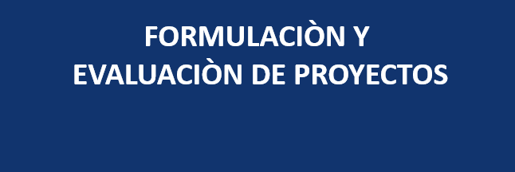
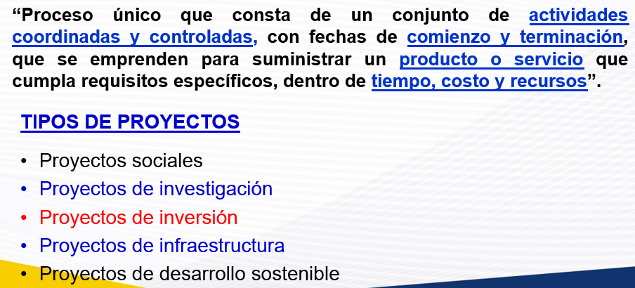
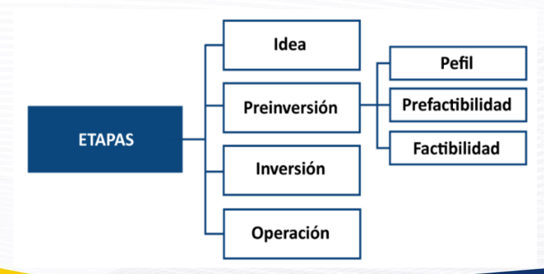
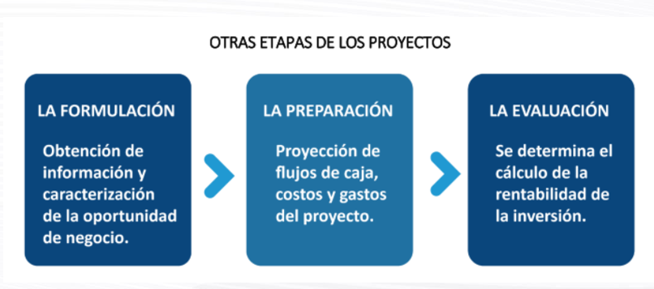
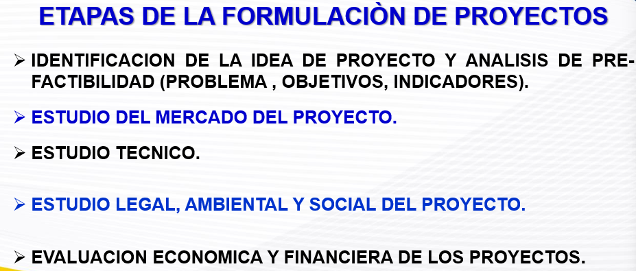
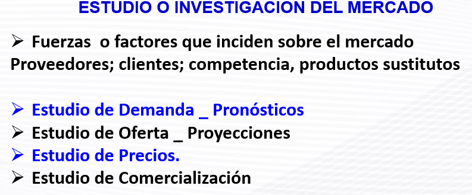
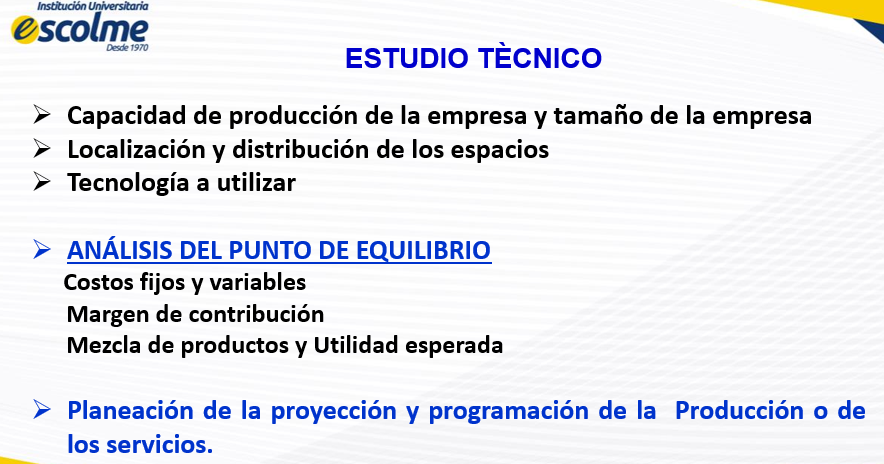
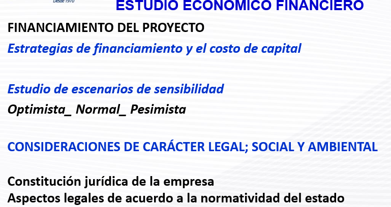
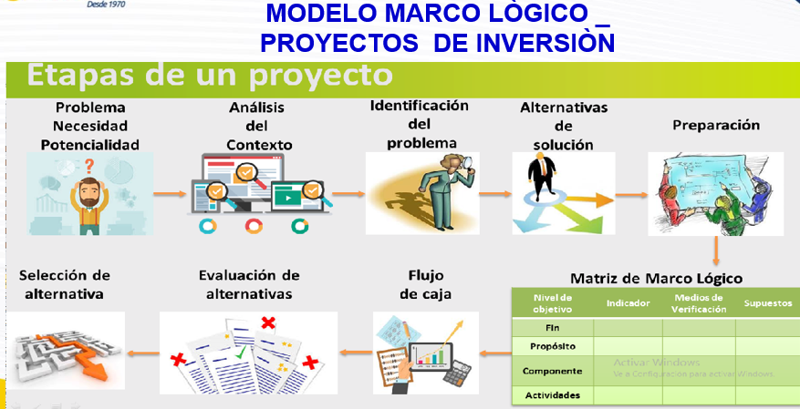

# 2. Unidad 1_ FORMULACION DE PROYECTOS

> **Captura de pantalla** — 2026-08-09 10:40
>
> 

# FORMULACIÒN Y EVALUACIÒN DE PROYECTOS

> **Captura de pantalla** — 2026-08-09 10:42
>
> 

“Proceso único de un conjunto de actividades coordinadas y controladas, con fechas de comienzo y terminación, que emprenden para suministrar un producto o servicio que cumpla requisitos específicos, dentro de tiempo, costo y recursos”

## TIPOS DE PROYECTOS

*   Proyectos sociales
*   Proyectos de investigación
*   Proyectos de inversión
*   Proyectos de infraestructura
*   Proyectos de desarrollo sostenible
penas
> **Captura de pantalla** — 2026-08-09 10:47
>
> 

## ETAPAS
*   Idea
*   Preinversión
    *   Idea
    *   Prefactibilidad
    *   Factibilidad
*   Inversión
*   Operación

> **Captura de pantalla** — 2026-08-09 17:43
>
> 

OTRAS ETAPAS DE LOS PROYECTOS

**LA FORMULACIÓN**
Obtención de información y caracterización de la oportunidad de negocio.

**LA PREPARACIÓN**
Proyección de flujos de caja, costos y gastos del proyecto.

**LA EVALUACIÓN**
Se determina el cálculo de la rentabilidad de la inversión.

> **Captura de pantalla** — 2026-08-09 17:44
>
> 

## ETAPAS DE LA FORMULACIÓN DE PROYECTOS
* IDENTIFICACION DE LA IDEA DE PROYECTO Y ANALISIS DE PRE-FACTIBILIDAD (PROBLEMA, OBJETIVOS, INDICADORES).
* ESTUDIO DEL MERCADO DEL PROYECTO.
* ESTUDIO TECNICO.
* ESTUDIO LEGAL, AMBIENTAL Y SOCIAL DEL PROYECTO.
* EVALUACION ECONOMICA Y FINANCIERA DE LOS PROYECTOS.

> **Captura de pantalla** — 2026-08-09 17:46
>
> 

## ESTUDIO O INVESTIGACION DEL MERCADO

* Fuerzas o factores inciden sobre el mercado
    * Proveedores; clientes; competencia, productos sustitutos

### Estudio de Demanda _ Pronósticos
### Estudio de Oferta _ Proyecciones
### Estudio de Precios.
### Estudio de Comercialización

> **Captura de pantalla** — 2026-08-09 17:47
>
> 

## ESTUDIO TÉCNICO

* Capacidad de producción de la empresa y tamaño de la empresa
* Localización y distribución de los espacios
* Tecnología a utilizar

### ANÁLISIS DEL PUNTO DE EQUILIBRIO

* Costos fijos y variables
* Margen de contribución
* Mezcla de productos y Utilidad esperada
* Planeación de la proyección y programación de la Producción o de los servicios.

> **Captura de pantalla** — 2026-08-09 17:55
>
> 

## ESTUDIO ECONÓMICO FINANCIERO

Estrategias de financiamiento y el costo de capital

Estudio de escenarios de sensibilidad
Optimista_Normal_Pesimista

CONSIDERACIONES DE CARÁCTER LEGAL; SOCIAL Y AMBIENTAL

Constitución jurídica de la empresa
Aspectos legales de acuerdo a la normatividad del estado

> **Captura de pantalla** — 2026-08-09 17:56
>
> 

# MODELO MARCO LÓGICO PROYECTOS DE INVERSIÓN

## Etapas de un proyecto

### Modelo Marco Lógico

*   Problema
*   Necesidad
*   Potencialidad

$\rightarrow$ Análisis del Contexto

$\rightarrow$ Identificación del problema

$\rightarrow$ Alternativas de solución

$\rightarrow$ Preparacion

*   Selección de alternativa
*   Evaluación de alternativas
*   Flujo de caja

$\rightarrow$ Matriz de Marco Lógico

## Matriz de Marco Lógico

| Nivel de objetivo | Indicador | Medios de Verificación | Supuestos |
| :--- | :--- | :--- | :--- |
| Fin | | | |
| Propósito | | | |
| Componente | Activar Windows | | |
| Actividades | Ve a Configuración para activar Windows | | |
