# ASPECTOS GENERALES DEL PROYECTO

> **Captura de pantalla** — 2026-08-07 20:26
>
> 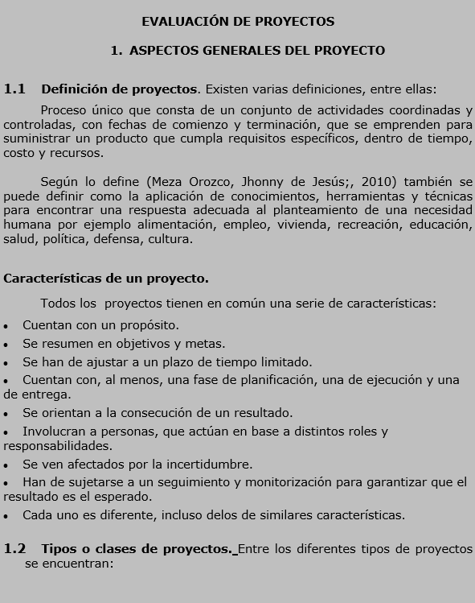

EVALUACIÓN DE PROYECTOS

# 1. ASPECTOS GENERALES DEL PROYECTO

## 1.1 Definición de proyectos.
Existen varias definiciones, entre ellas:
- Proceso único que consta de un conjunto de actividades coordinadas y controladas, con fechas de comienzo y terminación, que se emprenden para suministrar un producto que cumpla requisitos específicos, dentro de tiempo, costo y recursos.

## Características de un proyecto.
Todos los proyectos tienen en común una serie de características:
- Cuentan con un propósito.
- Se resumen en objetivos y metas.
- Se han de ajustar a un plazo de tiempo limitado.
- Cuentan con, al menos, una fase de planificación, una de ejecución y una de entrega.
- Se orientan a la consecución de un resultado.
- Involucran a personas, que actúan en base a distintos roles y responsabilidades.
- Se ven afectados por la incertidumbre.
- Han de sujetarse a un seguimiento y monitorización para garantizar que el resultado es el esperado.

## 1.2 Tipos o clases de proyectos. Entre los diferentes tipos de proyectos se encuentran:

> **Captura de pantalla** — 2026-08-07 20:31
>
> 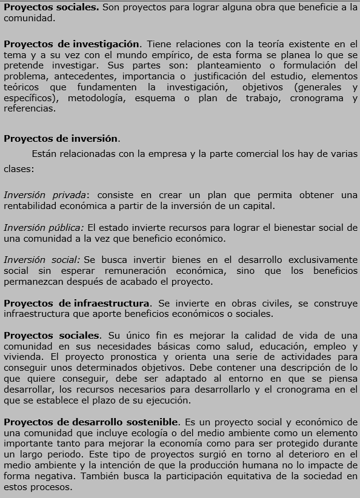

Proyectos sociales. Son proyectos para lograr alguna obra que beneficie a la comunidad.

Inversión privada: consiste en crear un plan que permita obtener una rentabilidad económica a partir de la inversión de un capital.

Inversión pública: El estado invierte recursos para lograr el bienestar social de una comunidad a la vez que beneficio económico.

Proyectos de investigación. Tiene relaciones con la teoría existente en el tema y a su vez con el mundo empírico, de esta forma se planea lo que se pretende investigar. Sus partes son: planteamiento o formulación del problema, antecedentes, importancia o justificación del estudio, elementos teóricos que fundamenten la investigación, objetivos (generales y específicos), metodología, esquema o plan de trabajo, cronograma y referencias.

Proyectos de infraestructura. Se invierte en obras civiles, se construye infraestructura que aporte beneficios económicos o sociales.

Proyectos sociales. Su único fin es mejorar la calidad de vida de una comunidad en sus necesidades básicas como salud, educación, empleo y vivienda. El proyecto pronostica y orienta una serie de actividades para conseguir unos determinados objetivos. Debe contener una descripción de lo que quiere conseguir, debe ser adaptado al entorno en que se piensa desarrollar, los recursos necesarios para desarrollarlo y el cronograma en el que se establece el plazo de su ejecución.

Proyectos de inversión. Están relacionadas con la empresa y la parte comercial los hay de varias clases:

> **Captura de pantalla** — 2026-08-07 20:32
>
> 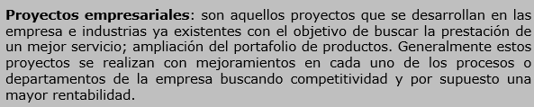

Proyectos empresariales: son aquellos proyectos que desarrollan las empresa e industrias ya existentes con el objetivo de buscar la prestación de un mejor servicio; ampliación del portafolio de productos. Generalmente estos proyectos se realizan con mejoramientos en cada uno de los procesos o departamentos de la empresa buscando competitividad y por supuesto una mayor rentabilidad.

> **Captura de pantalla** — 2026-08-07 20:34
>
> 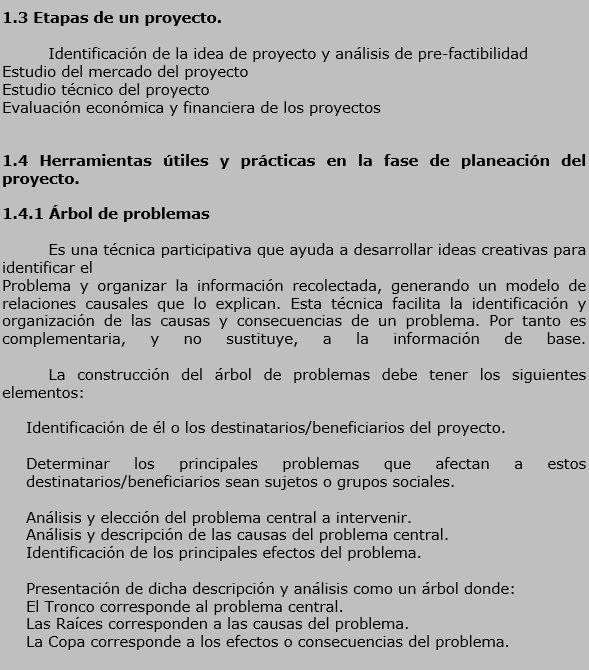

## 1.3 Etapas de un proyecto.
Identificación de la idea de proyecto y análisis de pre-factibilidad
Estudio del mercado del proyecto
Estudio técnico del proyecto
Evaluación económica y financiera de los proyectos

## 1.4 Herramientas útiles y prácticas en la fase de planeación del proyecto.
### 1.4.1 Árbol de problemas
Es una técnica participativa que ayuda a desarrollar ideas creativas para identificar el Problema y organizar la información recolectada, generando un modelo de relaciones causales que lo explican. Esta técnica facilita la identificación y organización de las causas y consecuencias de un problema. Por tanto es complementaria, y no sustituye, la información de base.

La construcción del árbol de problemas debe tener los siguientes elementos:
* Identificación de él o los destinatarios/beneficiarios del proyecto.
* Determinar los principales problemas que afectan a estos destinatarios/beneficiarios sean sujetos o grupos sociales.
* Análisis y elección del problema central a intervenir.
* Análisis y descripción de las causas del problema central.
* Identificación de los principales efectos del problema.

Presentación de dicha descripción y análisis como un árbol donde:
* El Tronco corresponde al problema central.
* Las Raíces corresponden a las causas del problema.
* La Copa corresponde a los efectos o consecuencias del problema.
ernesi

> **Captura de pantalla** — 2026-08-07 20:43
>
> 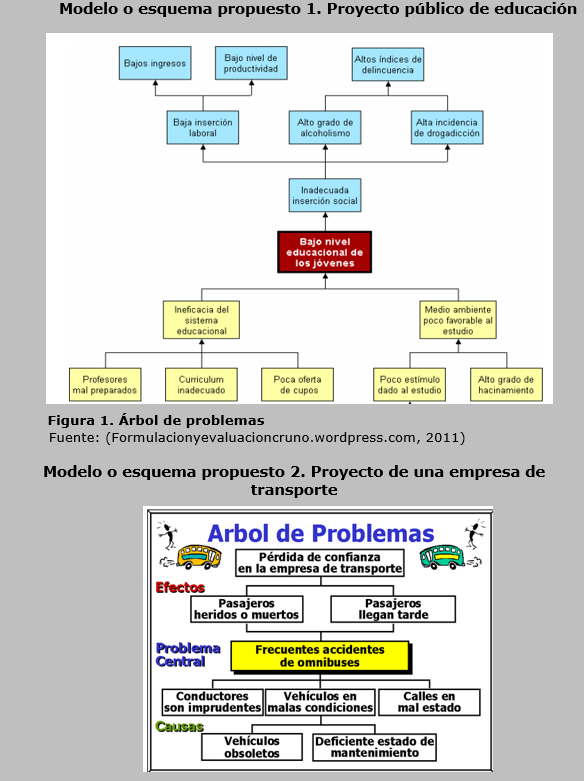

Modelo o esquema propuesto 1. Proyecto público de educación

- Bajos ingresos
- Bajo nivel de productividad
    - Bajos ingresos laboral
    - Bajo nivel de productividad
        - Altos índices de delincuencia
- Bajo nivel de educación

Figura 1. Árbol de problemas Fuente: Formulaciónyevaluacioncruno.wordpress.com, 2011

Modelo o esquema propuesto 2. Proyecto de una empresa de transporte

Arbol de Problemas
- Efectos
    - Pérdida de confianza en la empresa de transporte
- Problema Central
    - Bajos nivel educacional de los jóvenes
        - Profesores mal preparados
        - Bajos ingresos
    - Bajo nivel de productividad
        - Altos índices de delincuencia
- Causas
    - Bajos ingresos
    - Alto grado de alcoholismo
    - Vehículos en malas condiciones
    - Calles en mal estado
    - Vehículos obsoletos
    - Deficiente estado de mantenimiento

> **Captura de pantalla** — 2026-08-07 20:46
>
> 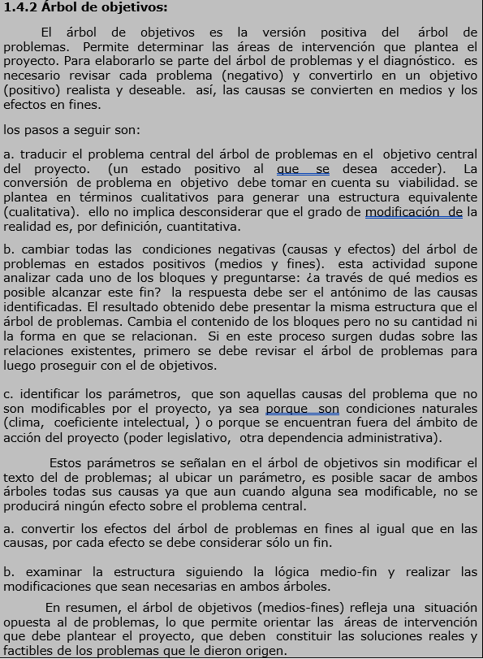

### 1.4.2 Árbol de objetivos:

El árbol de objetivos es la versión positiva del árbol de problemas. Permite determinar las áreas de intervención que plantea el proyecto. Para elaborarlo se parte del árbol de problemas y el diagnóstico. Es necesario revisar cada problema (negativo) y convertirlo en un objetivo (positivo) realista y deseable. así, las causas se convierten en medios y los efectos en fines.

a. traducir el problema central del árbol de problemas en el objetivo central del proyecto. un estado positivo al que se desea acceder.
b. cambiar todas las condiciones negativas (causas y efectos) del árbol de problemas en estados positivos (medios y fines). esta actividad supone analizar cada uno de los bloques y preguntarse: ¿a través de qué medios es posible alcanzar este fin? la respuesta debe ser el antónimo de las causas identificadas. el resultado obtenido debe presentar la misma estructura que el árbol de problemas. Cambia el contenido de los bloques pero no su cantidad ni la forma en que se relacionan. Si en este proceso surgen dudas sobre las relaciones existentes, primero se debe revisar el árbol de problemas para lograr con el de objetivos.

c. identificar los parámetros, que son aquellas causas del problema que no son modificables por el proyecto, ya sea porque son condiciones naturales (clima, coeficiente intelectual), o porque se encuentran fuera del ámbito de acción del proyecto (poder legislativo, otra dependencia administrativa).

> **Captura de pantalla** — 2026-08-07 20:49
>
> 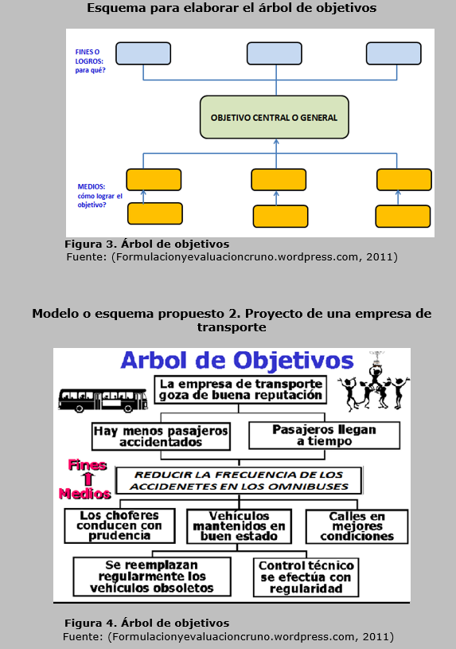

#### Figura 3. Árbol de objetivos
*   OBJETIVO CENTRAL O GENERAL
    *   FINES O LOGROS: para qué?
        *   MEDIOS: cómo lograr el objetivo?

#### Modelo o esquema propuesto 2. Proyecto de una empresa de transporte

##### Árbol de Objetivos

*   OBJETIVO CENTRAL O GENERAL
    *   FINES O LOGROS: para qué?
        *   REDUCIR LA FRECUENCIA DE LOS ACCIDENTES EN LOS OMNIBUSES
    *   MEDIOS: cómo lograr el objetivo?
        *   Los choferes conducen con prudencia
        *   Vehículos mantenidos en buen estado
        *   Calles en mejores condiciones

Fuente: (Formulacionyevaluacioncruno.wordpress.com, 2011)

---

#### Figura 4. Árbol de objetivos
*   Árbol de Objetivos

> **Captura de pantalla** — 2026-08-07 20:52
>
> 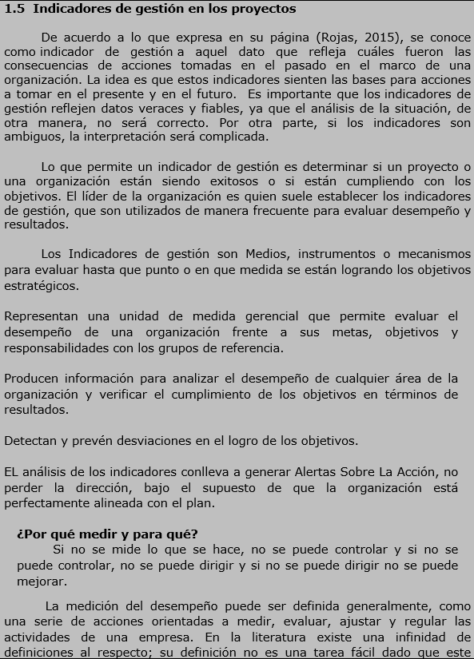

## 1.5 Indicadores de gestión en los proyectos

De acuerdo a lo que expresa en su página (Rojas, 2015), se conoce como indicador de gestión a aquel dato que refleja cuáles fueron las consecuencias de acciones tomadas en el pasado en el marco de una organización. La idea es que estos indicadores sienten las bases para acciones a tomar en el presente y en el futuro.

Los Indicadores de gestión son Medios, instrumentos o mecanismos para evaluar hasta que punto o en que medida se están logrando los objetivos.

¿Por qué medir y para qué?

Si no se mide lo que se hace, no se puede controlar y si no se puede controlar, no se puede dirigir y si no se puede dirigir no se puede mejorar.

La medición del desempeño puede ser definida generalmente, como una serie de acciones orientadas a medir, evaluar, ajustar y regular las actividades de una empresa. En la literatura existe una infinidad de definiciones al respecto; su definición no es una tarea fácil dado que este

> **Captura de pantalla** — 2026-08-07 20:54
>
> 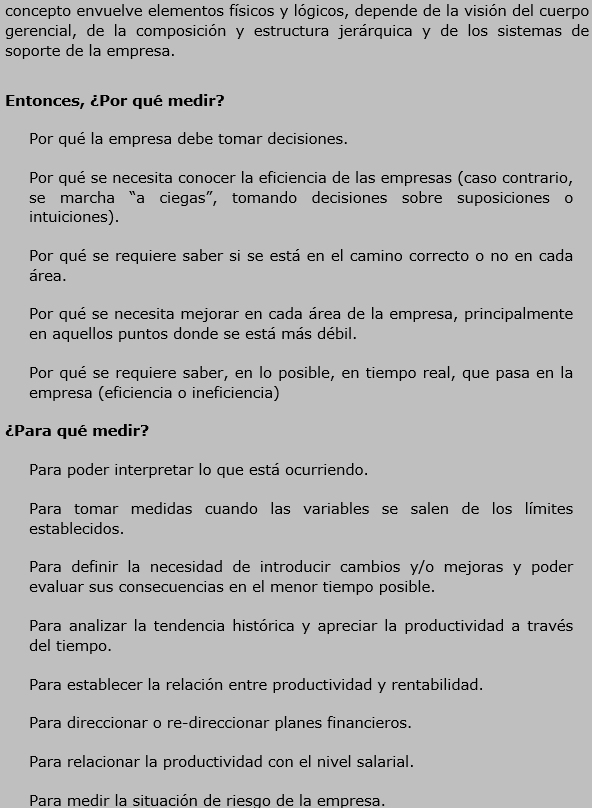

Entonces, ¿Por qué medir?

*   Por qué se necesita conocer la eficiencia de las empresas (caso contrario, se marcha "a ciegas", tomando decisiones sobre suposiciones o intuiciones).
*   Por qué se requiere saber si se está en el camino correcto o no en cada área.

¿Por qué medir?

*   Para poder interpretar lo que está ocurriendo.
*   Para tomar medidas cuando las variables se salen de los límites establecidos.
*   Para definir la necesidad de introducir cambios y/o mejoras y poder evaluar sus consecuencias en el menor tiempo posible.
*   Para analizar la tendencia histórica y apreciar la productividad a través del tiempo.
*   Para restablecer la relación entre productividad y rentabilidad.
*   Para direccionar o re-direccionar planes financieros.
*   Para relacionar la productividad con el nivel salarial.
*   Para medir la situación de riesgo de la empresa.

> **Captura de pantalla** — 2026-08-07 20:54
>
> 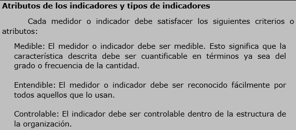

Atributos de los indicadores y tipos de indicadores

Cada medidor o indicador debe satisfacer los siguientes criterios o atributos:

*   **Medible:** El medidor o indicador debe ser medible. Esto significa que la característica descrita debe ser cuantificable en términos ya sea del grado o frecuencia de la cantidad.
*   **Entendible:** El medidor o indicador debe ser reconocido fácilmente por todos aquellos que lo usan.
*   **Controlable:** El indicador debe ser controlable dentro de la estructura de la organización.

> **Captura de pantalla** — 2026-08-07 20:55
>
> 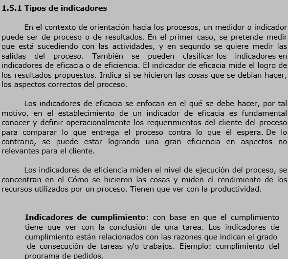

### 1.5.1 Tipos de indicadores

En el contexto de orientación hacia los procesos, un medidor o indicador puede ser de proceso o de resultados. En el primer caso, se pretende medir...

Indicadores de eficacia

Los indicadores de eficacia se enfocan en el qué se debe hacer, por tal motivo, en el establecimiento de un indicador de eficacia es fundamental conocer y definir operacionalmente los requerimientos del cliente del proceso para comparar lo que entrega el proceso contra lo que espera. De lo contrario, se puede estar logrando una gran eficiencia en aspectos no relevantes para el cliente.

Los indicadores de eficiencia miden el nivel de ejecución del proceso, se concentran en el Cómo se hicieron las cosas y miden el rendimiento de los recursos utilizados por un proceso. Tienen que ver con la productividad.

Indicadores de cumplimiento:
con base en que el cumplimiento tiene que ver con la conclusión de una tarea. Los indicadores de cumplimiento están relacionados con las razones que indican el grado de consecución de tareas y/o trabajos. Ejemplo: cumplimiento del programa de pedidos.

> **Captura de pantalla** — 2026-08-07 20:57
>
> 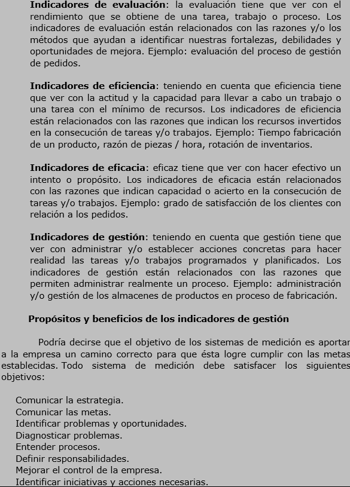

Indicadores de evaluación: la evaluación tiene que ver con el rendimiento que se obtiene de una tarea, trabajo o proceso. Los indicadores de evaluación están relacionados con las razones y/o los métodos que ayudan a identificar nuestras fortalezas, debilidades y oportunidades de mejora. Ejemplo: evaluación del proceso de gestión de pedidos.

Indicadores de eficacia: teniendo en cuenta que eficiencia tiene que ver con el hacer efectivo un intento o propósito. Los indicadores de eficacia están relacionados con las razones que indican permitir administrar realmente un proceso. Ejemplo: administración y/o gestión de los almacenes en proceso de fabricación.

Indicadores de eficiencia: eficaz tiene que ver con hacer efectivo un intento o propósito.

Indicadores de gestión: teniendo en cuenta que gestión tiene que ver con administrar y/o establecer acciones concretas para hacer realidad las tareas y/o trabajos programados. Los indicadores de gestión están relacionados con las razones que permiten administrar realmente un proceso. Ejemplo: tiempo fabricación de productos, razón de piezas / hora, rotación de inventarios.

#### Propósitos y beneficios de los indicadores

Podría decirse que el objetivo de los sistemas de medición es aportar a la empresa un camino correcto para que ésta logre cumplir con las metas establecidas. Todo sistema de medición debe satisfacer los siguientes objetivos:

*   Comunicar la estrategia.
*   Comunicar las metas.
*   Identificar problemas y oportunidades.
*   Diagnosticar problemas.
*   Entender procesos.
*   Definir responsabilidades.
*   Mejorar el control de la empresa.
*   Identificar iniciativas y acciones necesarias.

> **Captura de pantalla** — 2026-08-07 20:59
>
> 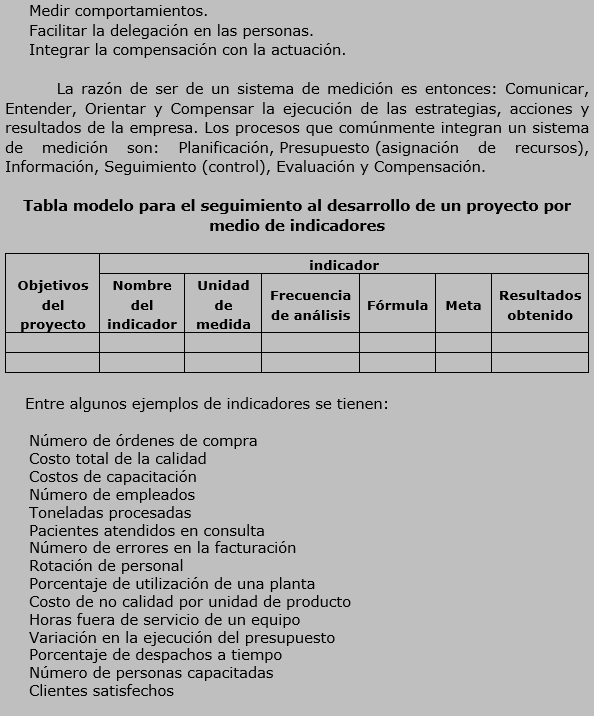

Tabla modelo para el seguimiento al desarrollo de un proyecto por medio de indicadores

Medir comportamientos. Facilitar la delegación en las personas. Integrar la compensación con la actuación.

| Objetivos del proyecto | Nombre del indicador | Unidad de medida | Frecuencia de análisis | Fórmula | Meta | Resultados obtenidos |
|---|---|---|---|---|---|---|
| | | | | | | |
| | | | | | | |

Entre algunos ejemplos de indicadores se tienen:
* Número de órdenes de compra
* Costo total de la calidad
* Costos de capacitación
* Número de empleados
* Toneladas procesadas
* Pacientes atendidos en consulta
* Número de errores en la facturación
* Rotación de personal
* Porcentaje de utilización de una planta
* Costo de no calidad por unidad de producto
* Horas fuera de servicio de un equipo
* Variación en la ejecución del presupuesto
* Porcentaje de despachos a tiempo
* Número de personas capacitadas
* Clientes satisfechos

> **Captura de pantalla** — 2026-08-07 21:00
>
> 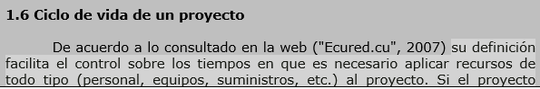

## 1.6 Ciclo de vida de un proyecto
De acuerdo a lo consultado en la web ("Ecured.cu", 2007) su definición facilita el control sobre los tiempos en que es necesario aplicar recursos de todo tipo (personal, equipos, suministros, etc.) al proyecto. Si el proyecto

> **Captura de pantalla** — 2026-08-07 21:01
>
> 

incluye subcontratación de partes a otras organizaciones, el control del trabajo subcontratado se facilita en la medida en que esas partes encajen bien en la estructura de las fases. El control de calidad también se ve facilitado si la separación entre fases se hace corresponder con puntos en los que ésta deba verificarse. penas

> **Captura de pantalla** — 2026-08-07 21:02
>
> 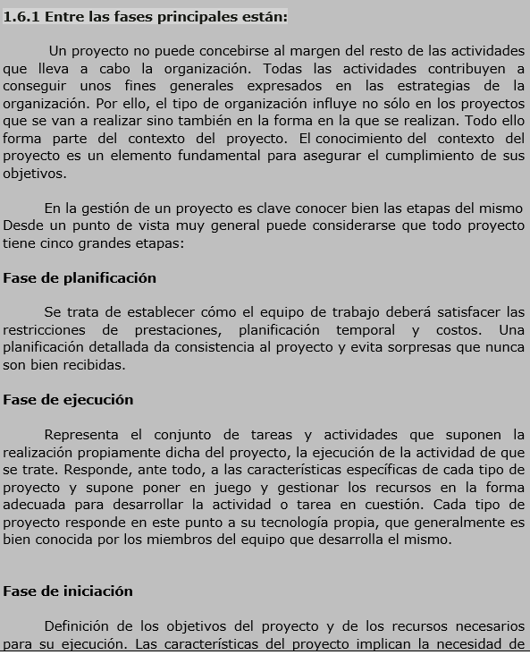

### 1.6.1 Entre las fases principales están:
Un proyecto no puede concebirse al margen del resto de las actividades que lleva a cabo la organización. Todas las actividades contribuyen a conseguir unos fines generales expresados en las estrategias de la organización. Por ello, el tipo de organización influye no sólo en los proyectos que se van a realizar sino también en la forma en que se realizan. Todo ello forma parte del contexto del proyecto. El conocimiento del contexto del proyecto es un elemento fundamental para asegurar el cumplimiento de sus objetivos.

#### Fase de planificación
Se trata de establecer cómo el equipo de trabajo deberá satisfacer las restricciones de prestaciones, planificación temporal y costos. Una planificación detallada da consistencia al proyecto y evita sorpresas que nunca son bien recibidas.

#### Fase de ejecución
Representa el conjunto de tareas y actividades que suponen la realización propiamente dicha del proyecto, la ejecución de la actividad de que se trate. Responde, ante todo, a las características específicas de cada tipo de proyecto y supone poner en juego y gestionar los recursos en la forma adecuada para desarrollar la actividad o tarea en cuestión. Cada tipo de proyecto responde en este punto a su tecnología propia, que generalmente es bien conocida por los miembros del equipo que desarrolla el mismo.

#### Fase de iniciación
Definición de los objetivos del proyecto y de los recursos necesarios para su ejecución. Las características del proyecto implican la necesidad de 

> **Captura de pantalla** — 2026-08-07 21:06
>
> 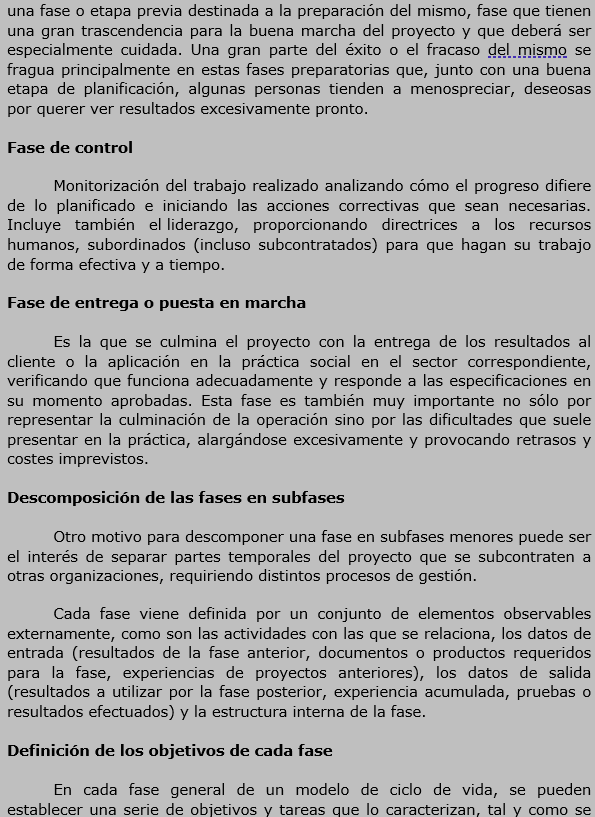

#### Fase de control

Monitoreización del trabajo realizado analizando cómo el progreso difiere de lo planificado e iniciando las acciones correctivas que sean necesarias. Incluye también el liderazgo, proporcionando directrices a los recursos humanos, subordinados (incluso subcontratados) para que hagan su trabajo de forma efectiva y a tiempo.

#### Fase de entrega o puesta en marcha

Es la que culmina el proyecto con la entrega de los resultados al cliente o la aplicación en la práctica social en el sector correspondiente, verificando que funciona adecuadamente y responde a las especificaciones en su momento aprobadas. Esta fase es también muy importante no sólo por representar la culminación de la operación sino por las dificultades que suele presentar en la práctica, alargándose excesivamente y provocando retrasos y costes imprevistos.

#### Fase de entregas en subfases

Otro motivo para descomponer una fase en subfases puede ser el interés de separar partes temporales del proyecto que se subcontraten a otras organizaciones, requiriendo distintos procesos de gestión.

Cada fase viene definida por un conjunto de elementos observables externamente, como son las actividades con las que se relaciona, los datos de entrada (resultados de la fase anterior, documentos o productos requeridos para la fase, experiencias de proyectos anteriores), los datos de salida (resultados a utilizar por la fase posterior, experiencia acumulada, pruebas o resultados efectuados) y la estructura interna de la fase.

#### Definición de los objetivos de cada fase
En cada fase general de un modelo de ciclo de vida, se pueden establecer una serie de objetivos y tareas que lo caracterizan, tal y como se muestra a continuación:

> **Captura de pantalla** — 2026-08-07 21:15
>
> 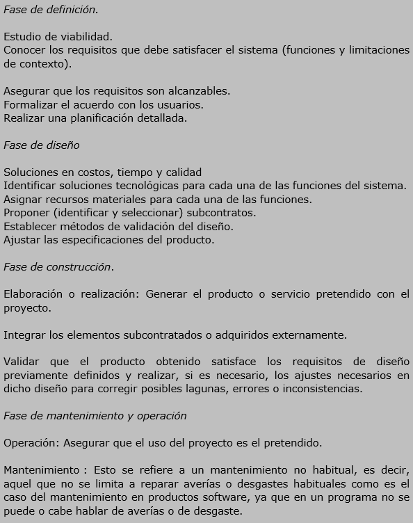

#### Fase de definición
*   Estudio de viabilidad.
*   Conocer los requisitos que debe satisfacer el sistema (funciones y limitaciones de contexto).
*   Asegurar que los requisitos son alcanzables.
*   Formalizar el acuerdo con los usuarios.
*   Realizar una planificación detallada.

#### Fase de diseño
*   Identificar soluciones tecnológicas para cada una de las funciones del sistema.
*   Proponer (identificar y seleccionar) subcontratos.
*   Establecer métodos de validación del diseño.

#### Fase de construcción
*   Asegurar que los requisitos deben satisfacer los requisitos de diseño previamente definidos y realizar, si es necesario, los ajustes necesarios en dicho diseño para corregir posibles lagunas, errores o inconsistencias.

#### Fase de mantenimiento y operación
*   **Operación:** Asegurar que el uso del proyecto es el pretendido.
*   **Mantenimiento:** Esto se refiere a un mantenimiento no habitual, es decir, aquel que no se limita a reparar averías o desgastes habituales como es el caso del mantenimiento en productos software, ya que en un programa no se puede o cabe hablar de averías o de desgaste.

> **Captura de pantalla** — 2026-08-07 21:19
>
> 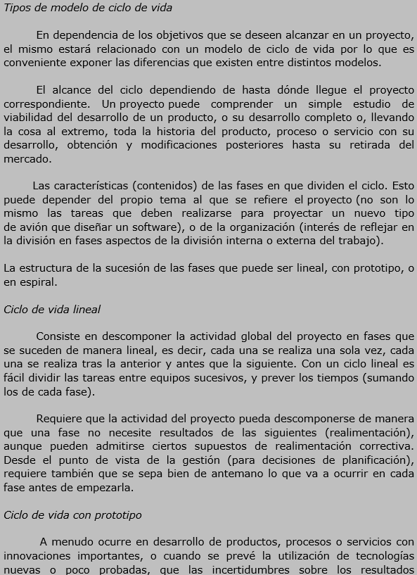

Tipos de modelo de ciclo de vida

En dependencia de los objetivos que se deseen alcanzar en un proyecto, el mismo estará relacionado con un modelo de ciclo de vida por lo que es conveniente exponer las diferencias que existen entre distintos modelos.

#### Ciclo de vida lineal

El alcance del ciclo dependiendo de las fases en que dividen el ciclo. Esto puede depender del propio tema al que se refiere el proyecto (no son lo mismo las tareas que deben realizarse para proyectar un nuevo tipo de desarrollo, o de la organización (interés de reflejar en la división en fases aspectos de la división interna o externa del trabajo).

#### Ciclo de vida con prototipo

A menudo ocurre en desarrollo de productos, procesos o servicios con innovaciones importantes, o cuando se prevé la utilización de tecnologías nuevas o poco probadas, que las incertidumbres sobre los resultados...

> **Captura de pantalla** — 2026-08-07 21:20
>
> 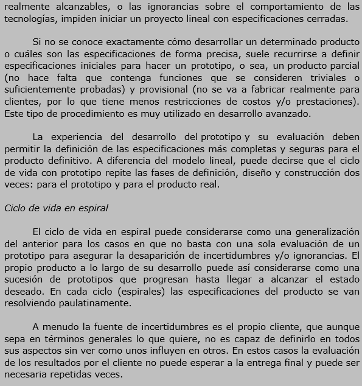

#### Ciclo de vida en espiral

Si no se conoce exactamente cómo desarrollar un determinado producto o cuáles son las especificaciones de forma precisa, suele recurrirse a definir especificaciones iniciales para hacer un prototipo, o sea, un producto parcial (no hace falta que contenga funciones que se consideren triviales o suficientemente probadas) y provisional (no se va a fabricar realmente para tecnologías, impiden iniciar un proyecto lineal con especificaciones cerradas.

La experiencia del desarrollo del prototipo y su evaluación deben permitir la definición de las especificaciones más completas para el producto definitivo. A diferencia del modelo lineal, puede decirse que el ciclo de vida en espiral permite las fases de definición, diseño y construcción dos veces.

A menudo la fuente de incertidumbres es el propio cliente, que aunque sepa en términos generales lo que quiere, no es capaz de definirlo en todos sus aspectos sin ver como unos influyen en otros. En estos casos la evaluación de los resultados por el cliente no puede esperar a la entrega final y puede ser necesaria repetidas veces.
