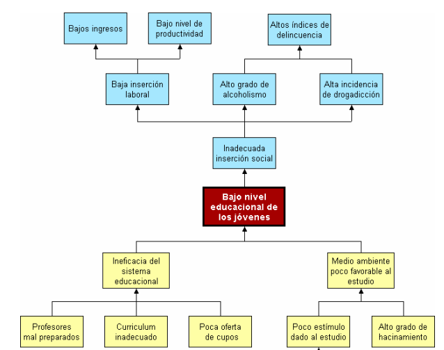
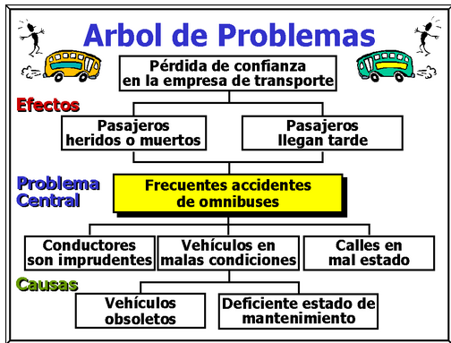
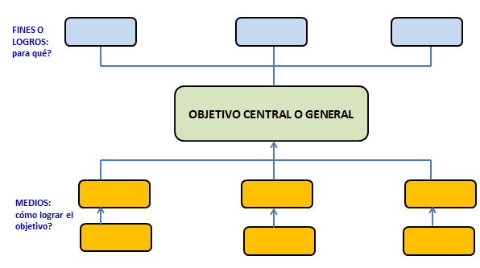
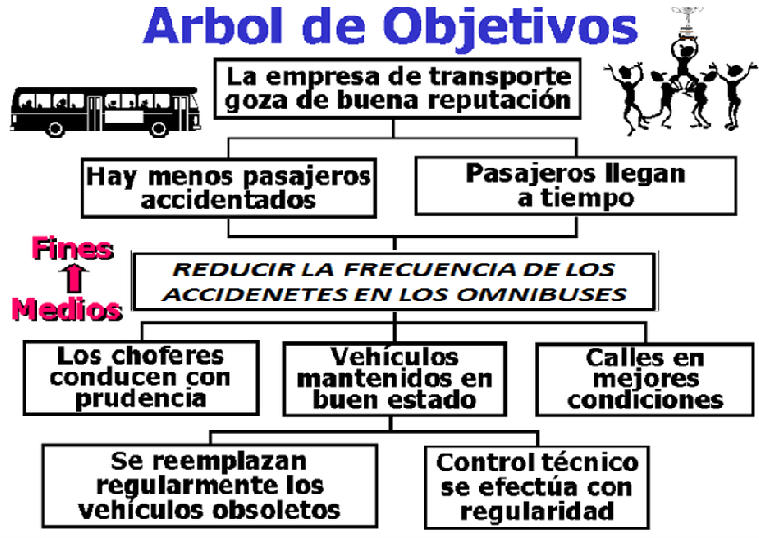

# 0. Aspectos generales del proyecto_Unidad 1_Evaluación de proyectos

| **ASPECTOS GENERALES DEL PROYECTO** |
|-------------------------------------|

> **Descripción de la imagen** — La imagen es una página de diseño o portada para una unidad académica.
>
> El fondo es de color gris claro con un patrón sutil y repetitivo de formas circulares o abstractas muy tenues.
>
> En la esquina inferior izquierda, hay un recuadro de color amarillo pálido que contiene el número "01" en grande y debajo la palabra "UNIDAD".
>
> Una forma rectangular de color turquesa (verde azulado) se extiende desde la parte inferior izquierda hacia el centro de la página.
>
> En la parte inferior central, hay una franja horizontal ancha de color turquesa.
>
> En la esquina inferior derecha, se encuentra el logotipo de la institución educativa, que incluye el texto "educación a distancia - Virtual" y un pequeño gráfico estilizado.

> **Docente:**
>
> JOSÉ ALFREDO JIMÉNEZ LONDOÑO
>
> **Asignatura:**
>
> **EVALUACIÓN DE PROYECTOS**
>
> **Institución Universitaria ESCOLME**

> **Descripción de la imagen** — La imagen es una página de documento con un fondo blanco. Contiene varias líneas horizontales delgadas que sirven como separadores o divisiones. En la parte inferior izquierda, se observa el número "01" en color azul claro o turquesa. Hay algunos caracteres ilegibles y borrosos cerca de la esquina inferior derecha.

<table>
<colgroup>
<col style="width: 100%" />
</colgroup>
<thead>
<tr>
<th>
<strong>EVALUACIÓN DE PROYECTOS</strong>

<ol type="1">
<li>
<strong>ASPECTOS GENERALES DEL PROYECTO</strong>

<ol type="1">
<li>
<strong>Definición de proyectos</strong>. Existen varias definiciones, entre ellas:
</li>
</ol></li>
</ol>

Proceso único que consta de un conjunto de actividades coordinadas y controladas, con fechas de comienzo y terminación, que se emprenden para suministrar un producto que cumpla requisitos específicos, dentro de tiempo, costo y recursos.

Según lo define (Meza Orozco, Jhonny de Jesús;, 2010) también se puede definir como la aplicación de conocimientos, herramientas y técnicas para encontrar una respuesta adecuada al planteamiento de una necesidad humana por ejemplo alimentación, empleo, vivienda, recreación, educación, salud, política, defensa, cultura.

<strong>Características de un proyecto.</strong>

Todos los  proyectos tienen en común una serie de características:

<ul>
<li>
 Cuentan con un propósito.
</li>
<li>
 Se resumen en objetivos y metas.
</li>
<li>
 Se han de ajustar a un plazo de tiempo limitado.
</li>
<li>
 Cuentan con, al menos, una fase de planificación, una de ejecución y una de entrega.
</li>
<li>
 Se orientan a la consecución de un resultado.
</li>
<li>
 Involucran a personas, que actúan en base a distintos roles y responsabilidades.
</li>
<li>
 Se ven afectados por la incertidumbre.
</li>
<li>
 Han de sujetarse a un seguimiento y monitorización para garantizar que el resultado es el esperado.
</li>
<li>
 Cada uno es diferente, incluso delos de similares características.

<ol type="1">
<li>
<strong>Tipos o clases de proyectos.</strong> Entre los diferentes tipos de proyectos se encuentran:
</li>
</ol></li>
</ul>

<strong>Proyectos sociales.</strong> Son proyectos para lograr alguna obra que beneficie a la comunidad.

<strong>Proyectos de investigación</strong>. Tiene relaciones con la teoría existente en el tema y a su vez con el mundo empírico, de esta forma se planea lo que se pretende investigar. Sus partes son: planteamiento o formulación del problema, antecedentes, importancia o  justificación del estudio, elementos teóricos que fundamenten la investigación,  objetivos (generales y específicos), metodología, esquema o plan de trabajo, cronograma y referencias.

<strong>Proyectos de inversión</strong>.

Están relacionadas con la empresa y la parte comercial los hay de varias clases:

<em>Inversión privada</em>: consiste en crear un plan que permita obtener una rentabilidad económica a partir de la inversión de un capital.

<em>Inversión pública:</em> El estado invierte recursos para lograr el bienestar social de una comunidad a la vez que beneficio económico.

<em>Inversión social:</em> Se busca invertir bienes en el desarrollo exclusivamente social sin esperar remuneración económica, sino que los beneficios permanezcan después de acabado el proyecto.

<strong>Proyectos de infraestructura</strong>. Se invierte en obras civiles, se construye infraestructura que aporte beneficios económicos o sociales.

<strong>Proyectos sociales</strong>. Su único fin es mejorar la calidad de vida de una comunidad en sus necesidades básicas como salud, educación, empleo y vivienda. El proyecto pronostica y orienta una serie de actividades para conseguir unos determinados objetivos. Debe contener una descripción de lo que quiere conseguir, debe ser adaptado al entorno en que se piensa desarrollar, los recursos necesarios para desarrollarlo y el cronograma en el que se establece el plazo de su ejecución.

<strong>Proyectos de desarrollo sostenible</strong>. Es un proyecto social y económico de una comunidad que incluye ecología o del medio ambiente como un elemento importante tanto para mejorar la economía como para ser protegido durante un largo periodo. Este tipo de proyectos surgió en torno al deterioro en el medio ambiente y la intención de que la producción humana no lo impacte de forma negativa. También busca la participación equitativa de la sociedad en estos procesos.

<strong>Proyectos empresariales</strong>: son aquellos proyectos que se desarrollan en las empresa e industrias ya existentes con el objetivo de buscar la prestación de un mejor servicio; ampliación del portafolio de productos. Generalmente estos proyectos se realizan con mejoramientos en cada uno de los procesos o departamentos de la empresa buscando competitividad y por supuesto una mayor rentabilidad.

<strong>1.3 Etapas de un proyecto.</strong>

Identificación de la idea de proyecto y análisis de pre-factibilidad

Estudio del mercado del proyecto

Estudio técnico del proyecto

Evaluación económica y financiera de los proyectos

<strong>1.4 Herramientas útiles y prácticas en la fase de planeación del proyecto.</strong>

<strong>1.4.1 Árbol de problemas</strong>

Es una técnica participativa que ayuda a desarrollar ideas creativas para identificar el

Problema y organizar la información recolectada, generando un modelo de relaciones causales que lo explican. Esta técnica facilita la identificación y organización de las causas y consecuencias de un problema. Por tanto es complementaria, y no sustituye, a la información de base.

La construcción del árbol de problemas debe tener los siguientes elementos:

<blockquote>

Identificación de él o los destinatarios/beneficiarios del proyecto.

Determinar los principales problemas que afectan a estos destinatarios/beneficiarios sean sujetos o grupos sociales.

Análisis y elección del problema central a intervenir.

Análisis y descripción de las causas del problema central.

Identificación de los principales efectos del problema.

Presentación de dicha descripción y análisis como un árbol donde:

El Tronco corresponde al problema central.

Las Raíces corresponden a las causas del problema.

La Copa corresponde a los efectos o consecuencias del problema.

<strong>Modelo o esquema propuesto 1. Proyecto público de educación</strong>

> **Descripción de la imagen** — Se trata de un diagrama de flujo o mapa conceptual que ilustra las relaciones causales entre diversos factores socioeconómicos y educativos, culminando en el "Bajo nivel educacional de los jóvenes".
>
> El diagrama se estructura en varios niveles:
>
> **Nivel 1: Factores Iniciales (Inputs)**
> Tres factores iniciales convergen: Bajos ingresos, Bajo nivel de productividad y Altos índices de delincuencia.
>
> **Nivel 2: Factores Intermedios**
> *   Los **Bajos ingresos** y el **Bajo nivel de productividad** conducen a la Baja inser

</blockquote>

<strong>Figura 1. Árbol de problemas</strong>

Fuente: (Formulacionyevaluacioncruno.wordpress.com, 2011)

<strong>Modelo o esquema propuesto 2. Proyecto de una empresa de transporte</strong>

<blockquote>

> **Descripción de la imagen** — Se trata de un diagrama de árbol de problemas que ilustra la relación causal entre los problemas, efectos y causas de los accidentes de autobuses.
>
> El diagrama se estructura jerárquicamente con el problema central en el centro:
>
> 1.  **Problema Central (Caja amarilla):** Frecuentes accidentes de omnibuses.
> 2.  **Efectos (Caja roja):** Se ramifican del problema central y incluyen:
>     *   Pérdida de confianza en la empresa de transporte.
>     *   Pasajeros heridos o muertos.
>     *   Pasajeros llegan tarde.
> 3.  **Causas (Caja verde superior):** Son las causas directas del problema central e incluyen:
>     *   Conductores son imprudentes.
>     *   Vehículos en malas condiciones.
>     *   Calles en mal estado.
> 4.  **Causas Raíz (Caja verde inferior):** Estas causas se ramifican de las causas directas y representan los factores subyacentes:
>     *   Vehículos obsoletos.
>     *   Deficiente estado de mantenimiento.

</blockquote>

<strong>Figura 2. Árbol de problemas</strong>

Fuente: (Formulacionyevaluacioncruno.wordpress.com, 2011)

<strong>1.4.2 Árbol de objetivos:</strong>

El árbol de objetivos es la versión positiva del  árbol de problemas.  Permite determinar las áreas de intervención que plantea el proyecto. Para elaborarlo se parte del árbol de problemas y el diagnóstico.  es necesario revisar cada problema (negativo) y convertirlo en un objetivo (positivo) realista y deseable.  así, las causas se convierten en medios y los efectos en fines.

los pasos a seguir son:

a. traducir el problema central del árbol de problemas en el  objetivo central del proyecto.  (un estado positivo al que  se desea acceder).  La conversión  de problema en  objetivo  debe tomar en cuenta su  viabilidad. se plantea en términos cualitativos para generar una estructura equivalente (cualitativa).  ello no implica desconsiderar que el grado de modificación  de la realidad es, por definición, cuantitativa. 

b. cambiar todas las  condiciones negativas (causas y efectos) del árbol de problemas en estados positivos (medios y fines).  esta actividad supone analizar cada uno de los bloques y preguntarse: ¿a través de qué medios es posible alcanzar este fin?  la respuesta debe ser el antónimo de las causas identificadas. El resultado obtenido debe presentar la misma estructura que el árbol de problemas. Cambia el contenido de los bloques pero no su cantidad ni la forma en que se relacionan.  Si en este proceso surgen dudas sobre las relaciones existentes, primero se debe revisar el árbol de problemas para luego proseguir con el de objetivos.

c. identificar los parámetros,  que son aquellas causas del problema que no son modificables por el proyecto, ya sea porque  son condiciones naturales (clima,  coeficiente intelectual, ) o porque se encuentran fuera del ámbito de acción del proyecto (poder legislativo,  otra dependencia administrativa).

Estos parámetros se señalan en el árbol de objetivos sin modificar el texto del de problemas; al ubicar un parámetro, es posible sacar de ambos árboles todas sus causas ya que aun cuando alguna sea modificable, no se producirá ningún efecto sobre el problema central.

a. convertir los efectos del árbol de problemas en fines al igual que en las causas, por cada efecto se debe considerar sólo un fin.

b. examinar la estructura siguiendo la lógica medio-fin y realizar las modificaciones que sean necesarias en ambos árboles.

En resumen, el árbol de objetivos (medios-fines) refleja una  situación opuesta al de problemas, lo que permite orientar las  áreas de intervención que debe plantear el proyecto, que deben  constituir las soluciones reales y factibles de los problemas que le dieron origen.

<strong>Esquema para elaborar el árbol de objetivos</strong>

<blockquote>

> **Descripción de la imagen** — Se trata de un diagrama jerárquico que ilustra una estructura de planificación o establecimiento de objetivos.
>
> El diagrama comienza en la parte superior con un nodo principal etiquetado como "FINES O LOGROS: para qué?". Este nodo se conecta hacia abajo con líneas a tres cajas intermedias.
>
> Estas tres cajas intermedias convergen y alimentan un concepto central ubicado debajo, denominado "OBJETIVO CENTRAL O GENERAL".
>
> El "OBJETIVO CENTRAL O GENERAL" es el elemento principal del diagrama y se conecta hacia abajo con tres cajas de resultado o método. Estas cajas inferiores están etiquetadas como:
> 1.  "MEDIOS: cómo lograr el objetivo?"
> 2.  Dos cajas adicionales sin etiqueta visible.

</blockquote>

<strong>Figura 3. Árbol de objetivos</strong>

Fuente: (Formulacionyevaluacioncruno.wordpress.com, 2011)

<strong>Modelo o esquema propuesto 2. Proyecto de una empresa de transporte</strong>

> **Descripción de la imagen** — La imagen es un diagrama de flujo o mapa conceptual titulado "Arbol de Objetivos", que estructura los fines y medios relacionados con la seguridad y eficiencia del transporte.
>
> El diagrama se divide en tres ramas principales que convergen en acciones específicas:
>
> 1.  **Fines 1 Medios:** Esta rama principal se desglosa en tres objetivos clave:
>     *   Reducir la frecuencia de los accidentes en los omnibuses.
>     *   Pasajeros llegan a tiempo.
>     *   Gozar de buena reputación.
>
> 2.  **Medios (Acciones):** Las acciones necesarias para alcanzar estos fines se ramifican y incluyen:
>     *   Los choferes conducen con prudencia.
>     *   Vehículos mantenidos en buen estado.
>     *   Calles en mejores condiciones.
>
> 3.  **Mantenimiento y Control:** Una subrama final detalla las medidas de soporte, que son:
>     *   Se reemplazan regularmente los vehículos obsoletos.
>     *   Control técnico se efectúa con regularidad.

<strong>Figura 4. Árbol de objetivos</strong>

Fuente: (Formulacionyevaluacioncruno.wordpress.com, 2011)

<strong>1.5 Indicadores de gestión en los proyectos</strong>

De acuerdo a lo que expresa en su página (Rojas, 2015), se conoce como indicador de gestión a aquel dato que refleja cuáles fueron las consecuencias de acciones tomadas en el pasado en el marco de una organización. La idea es que estos indicadores sienten las bases para acciones a tomar en el presente y en el futuro. Es importante que los indicadores de gestión reflejen datos veraces y fiables, ya que el análisis de la situación, de otra manera, no será correcto. Por otra parte, si los indicadores son ambiguos, la interpretación será complicada.

Lo que permite un indicador de gestión es determinar si un proyecto o una organización están siendo exitosos o si están cumpliendo con los objetivos. El líder de la organización es quien suele establecer los indicadores de gestión, que son utilizados de manera frecuente para evaluar desempeño y resultados.

Los Indicadores de gestión son Medios, instrumentos o mecanismos para evaluar hasta que punto o en que medida se están logrando los objetivos estratégicos.

Representan una unidad de medida gerencial que permite evaluar el desempeño de una organización frente a sus metas, objetivos y responsabilidades con los grupos de referencia.

Producen información para analizar el desempeño de cualquier área de la organización y verificar el cumplimiento de los objetivos en términos de resultados.

Detectan y prevén desviaciones en el logro de los objetivos.

EL análisis de los indicadores conlleva a generar Alertas Sobre La Acción, no perder la dirección, bajo el supuesto de que la organización está perfectamente alineada con el plan.

<blockquote>

<strong>¿Por qué medir y para qué?</strong>

Si no se mide lo que se hace, no se puede controlar y si no se puede controlar, no se puede dirigir y si no se puede dirigir no se puede mejorar.

</blockquote>

La medición del desempeño puede ser definida generalmente, como una serie de acciones orientadas a medir, evaluar, ajustar y regular las actividades de una empresa. En la literatura existe una infinidad de definiciones al respecto; su definición no es una tarea fácil dado que este concepto envuelve elementos físicos y lógicos, depende de la visión del cuerpo gerencial, de la composición y estructura jerárquica y de los sistemas de soporte de la empresa.

<strong>Entonces, ¿Por qué medir?</strong>

<blockquote>

Por qué la empresa debe tomar decisiones.

Por qué se necesita conocer la eficiencia de las empresas (caso contrario, se marcha “a ciegas”, tomando decisiones sobre suposiciones o intuiciones).

Por qué se requiere saber si se está en el camino correcto o no en cada área.

Por qué se necesita mejorar en cada área de la empresa, principalmente en aquellos puntos donde se está más débil.

Por qué se requiere saber, en lo posible, en tiempo real, que pasa en la empresa (eficiencia o ineficiencia)

</blockquote>

<strong>¿Para qué medir?</strong>

<blockquote>

Para poder interpretar lo que está ocurriendo.

Para tomar medidas cuando las variables se salen de los límites establecidos.

Para definir la necesidad de introducir cambios y/o mejoras y poder evaluar sus consecuencias en el menor tiempo posible.

Para analizar la tendencia histórica y apreciar la productividad a través del tiempo.

Para establecer la relación entre productividad y rentabilidad.

Para direccionar o re-direccionar planes financieros.

Para relacionar la productividad con el nivel salarial.

Para medir la situación de riesgo de la empresa.

</blockquote>

<strong>Atributos de los indicadores y tipos de indicadores</strong>

Cada medidor o indicador debe satisfacer los siguientes criterios o atributos:

<blockquote>

Medible: El medidor o indicador debe ser medible. Esto significa que la característica descrita debe ser cuantificable en términos ya sea del grado o frecuencia de la cantidad.

Entendible: El medidor o indicador debe ser reconocido fácilmente por todos aquellos que lo usan.

Controlable: El indicador debe ser controlable dentro de la estructura de la organización.

</blockquote>

<strong>1.5.1 Tipos de indicadores</strong>

En el contexto de orientación hacia los procesos, un medidor o indicador puede ser de proceso o de resultados. En el primer caso, se pretende medir que está sucediendo con las actividades, y en segundo se quiere medir las salidas del proceso. También se pueden clasificar los indicadores en indicadores de eficacia o de eficiencia. El indicador de eficacia mide el logro de los resultados propuestos. Indica si se hicieron las cosas que se debían hacer, los aspectos correctos del proceso. 

Los indicadores de eficacia se enfocan en el qué se debe hacer, por tal motivo, en el establecimiento de un indicador de eficacia es fundamental conocer y definir operacionalmente los requerimientos del cliente del proceso para comparar lo que entrega el proceso contra lo que él espera. De lo contrario, se puede estar logrando una gran eficiencia en aspectos no relevantes para el cliente.

Los indicadores de eficiencia miden el nivel de ejecución del proceso, se concentran en el Cómo se hicieron las cosas y miden el rendimiento de los recursos utilizados por un proceso. Tienen que ver con la productividad.

<blockquote>

<strong>Indicadores de cumplimiento</strong>: con base en que el cumplimiento tiene que ver con la conclusión de una tarea. Los indicadores de cumplimiento están relacionados con las razones que indican el grado

</blockquote>

de consecución de tareas y/o trabajos. Ejemplo: cumplimiento del programa de pedidos.

<blockquote>

<strong>Indicadores de evaluación</strong>: la evaluación tiene que ver con el rendimiento que se obtiene de una tarea, trabajo o proceso. Los indicadores de evaluación están relacionados con las razones y/o los métodos que ayudan a identificar nuestras fortalezas, debilidades y oportunidades de mejora. Ejemplo: evaluación del proceso de gestión de pedidos.

<strong>Indicadores de eficiencia</strong>: teniendo en cuenta que eficiencia tiene que ver con la actitud y la capacidad para llevar a cabo un trabajo o una tarea con el mínimo de recursos. Los indicadores de eficiencia están relacionados con las razones que indican los recursos invertidos en la consecución de tareas y/o trabajos. Ejemplo: Tiempo fabricación de un producto, razón de piezas / hora, rotación de inventarios.

<strong>Indicadores de eficacia</strong>: eficaz tiene que ver con hacer efectivo un intento o propósito. Los indicadores de eficacia están relacionados con las razones que indican capacidad o acierto en la consecución de tareas y/o trabajos. Ejemplo: grado de satisfacción de los clientes con relación a los pedidos.

<strong>Indicadores de gestión</strong>: teniendo en cuenta que gestión tiene que ver con administrar y/o establecer acciones concretas para hacer realidad las tareas y/o trabajos programados y planificados. Los indicadores de gestión están relacionados con las razones que permiten administrar realmente un proceso. Ejemplo: administración y/o gestión de los almacenes de productos en proceso de fabricación.

</blockquote>

<strong>Propósitos y beneficios de los indicadores de gestión</strong>

Podría decirse que el objetivo de los sistemas de medición es aportar a la empresa un camino correcto para que ésta logre cumplir con las metas establecidas. Todo sistema de medición debe satisfacer los siguientes objetivos:

<blockquote>

Comunicar la estrategia.

Comunicar las metas.

Identificar problemas y oportunidades.

Diagnosticar problemas.

Entender procesos.

Definir responsabilidades.

Mejorar el control de la empresa.

Identificar iniciativas y acciones necesarias.

Medir comportamientos.

Facilitar la delegación en las personas.

Integrar la compensación con la actuación.

</blockquote>

La razón de ser de un sistema de medición es entonces: Comunicar, Entender, Orientar y Compensar la ejecución de las estrategias, acciones y resultados de la empresa. Los procesos que comúnmente integran un sistema de medición son: Planificación, Presupuesto (asignación de recursos), Información, Seguimiento (control), Evaluación y Compensación.

<strong>Tabla modelo para el seguimiento al desarrollo de un proyecto por medio de indicadores</strong>

<table style="width:100%;">
<colgroup>
<col style="width: 16%" />
<col style="width: 14%" />
<col style="width: 13%" />
<col style="width: 16%" />
<col style="width: 12%" />
<col style="width: 9%" />
<col style="width: 16%" />
</colgroup>
<thead>
<tr>
<th rowspan="2" style="text-align: center;"><strong>Objetivos del proyecto</strong></th>
<th colspan="6" style="text-align: center;"><strong>indicador</strong></th>
</tr>
<tr>
<th style="text-align: center;"><strong>Nombre del indicador</strong></th>
<th style="text-align: center;"><strong>Unidad de medida</strong></th>
<th style="text-align: center;"><strong>Frecuencia de análisis</strong></th>
<th style="text-align: center;"><strong>Fórmula</strong></th>
<th style="text-align: center;"><strong>Meta</strong></th>
<th style="text-align: center;"><strong>Resultados obtenido</strong></th>
</tr>
</thead>
<tbody>
<tr>
<td style="text-align: center;"></td>
<td style="text-align: center;"></td>
<td style="text-align: center;"></td>
<td style="text-align: center;"></td>
<td style="text-align: center;"></td>
<td style="text-align: center;"></td>
<td style="text-align: center;"></td>
</tr>
<tr>
<td style="text-align: center;"></td>
<td style="text-align: center;"></td>
<td style="text-align: center;"></td>
<td style="text-align: center;"></td>
<td style="text-align: center;"></td>
<td style="text-align: center;"></td>
<td style="text-align: center;"></td>
</tr>
</tbody>
</table>

Entre algunos ejemplos de indicadores se tienen:

<blockquote>

Número de órdenes de compra

Costo total de la calidad

Costos de capacitación

Número de empleados

Toneladas procesadas

Pacientes atendidos en consulta

Número de errores en la facturación

Rotación de personal

Porcentaje de utilización de una planta

Costo de no calidad por unidad de producto

Horas fuera de servicio de un equipo

Variación en la ejecución del presupuesto

Porcentaje de despachos a tiempo

Número de personas capacitadas

Clientes satisfechos

</blockquote>
<ol start="2" type="1">
<li>
<strong>1.6 Ciclo de vida de un proyecto</strong>
</li>
</ol>

De acuerdo a lo consultado en la web ("Ecured.cu", 2007) <mark>su definición facilita el control sobre los tiempos en que es necesario aplicar recursos de todo tipo (personal, equipos, suministros, etc.) al proyecto. Si el proyecto incluye subcontratación de partes a otras organizaciones, el control del trabajo subcontratado se facilita en la medida en que esas partes encajen bien en la estructura de las fases. El control de calidad también se ve facilitado si la separación entre fases se hace corresponder con puntos en los que ésta deba</mark> <mark>verificarse.</mark>

<strong><mark>1.6.1 Entre las fases principales están:</mark></strong>

Un proyecto no puede concebirse al margen del resto de las actividades que lleva a cabo la organización. Todas las actividades contribuyen a conseguir unos fines generales expresados en las estrategias de la organización. Por ello, el tipo de organización influye no sólo en los proyectos que se van a realizar sino también en la forma en la que se realizan. Todo ello forma parte del contexto del proyecto. El <a href="http://www.ecured.cu/Conocimiento">conocimiento</a> del contexto del proyecto es un elemento fundamental para asegurar el cumplimiento de sus objetivos.

En la gestión de un proyecto es clave conocer bien las etapas del mismo

Desde un punto de vista muy general puede considerarse que todo proyecto tiene cinco grandes etapas:

<strong>Fase de planificación</strong>

Se trata de establecer cómo el equipo de trabajo deberá satisfacer las restricciones de prestaciones, planificación temporal y costos. Una planificación detallada da consistencia al proyecto y evita sorpresas que nunca son bien recibidas.

<strong>Fase de ejecución</strong>

Representa el conjunto de tareas y actividades que suponen la realización propiamente dicha del proyecto, la ejecución de la actividad de que se trate. Responde, ante todo, a las características específicas de cada tipo de proyecto y supone poner en juego y gestionar los recursos en la forma adecuada para desarrollar la actividad o tarea en cuestión. Cada tipo de proyecto responde en este punto a su tecnología propia, que generalmente es bien conocida por los miembros del equipo que desarrolla el mismo.

<strong>Fase de iniciación</strong>

Definición de los objetivos del proyecto y de los recursos necesarios para su ejecución. Las características del proyecto implican la necesidad de una fase o etapa previa destinada a la preparación del mismo, fase que tienen una gran trascendencia para la buena marcha del proyecto y que deberá ser especialmente cuidada. Una gran parte del éxito o el fracaso del mismo se fragua principalmente en estas fases preparatorias que, junto con una buena etapa de planificación, algunas personas tienden a menospreciar, deseosas por querer ver resultados excesivamente pronto.

<strong>Fase de control</strong>

Monitorización del trabajo realizado analizando cómo el progreso difiere de lo planificado e iniciando las acciones correctivas que sean necesarias. Incluye también el <a href="http://www.ecured.cu/Liderazgo">liderazgo</a>, proporcionando directrices a los recursos humanos, subordinados (incluso subcontratados) para que hagan su trabajo de forma efectiva y a tiempo.

<strong>Fase de entrega o puesta en marcha</strong>

Es la que se culmina el proyecto con la entrega de los resultados al cliente o la aplicación en la práctica social en el sector correspondiente, verificando que funciona adecuadamente y responde a las especificaciones en su momento aprobadas. Esta fase es también muy importante no sólo por representar la culminación de la operación sino por las dificultades que suele presentar en la práctica, alargándose excesivamente y provocando retrasos y costes imprevistos.

<strong>Descomposición de las fases en subfases</strong>

Otro motivo para descomponer una fase en subfases menores puede ser el interés de separar partes temporales del proyecto que se subcontraten a otras organizaciones, requiriendo distintos procesos de gestión.

Cada fase viene definida por un conjunto de elementos observables externamente, como son las actividades con las que se relaciona, los datos de entrada (resultados de la fase anterior, documentos o productos requeridos para la fase, experiencias de proyectos anteriores), los datos de salida (resultados a utilizar por la fase posterior, experiencia acumulada, pruebas o resultados efectuados) y la estructura interna de la fase.

<strong>Definición de los objetivos de cada fase</strong>

En cada fase general de un modelo de ciclo de vida, se pueden establecer una serie de objetivos y tareas que lo caracterizan, tal y como se muestra a continuación:

<em>Fase de definición.</em>

Estudio de viabilidad.

Conocer los requisitos que debe satisfacer el sistema (funciones y limitaciones de contexto).

Asegurar que los requisitos son alcanzables.

Formalizar el acuerdo con los usuarios.

Realizar una planificación detallada.

<em>Fase de diseño </em>

Soluciones en costos, tiempo y calidad

Identificar soluciones tecnológicas para cada una de las funciones del sistema.

Asignar recursos materiales para cada una de las funciones.

Proponer (identificar y seleccionar) subcontratos.

Establecer métodos de validación del diseño.

Ajustar las especificaciones del producto.

<em>Fase de construcción</em>.

Elaboración o realización: Generar el producto o servicio pretendido con el proyecto.

Integrar los elementos subcontratados o adquiridos externamente.

Validar que el producto obtenido satisface los requisitos de diseño previamente definidos y realizar, si es necesario, los ajustes necesarios en dicho diseño para corregir posibles lagunas, errores o inconsistencias.

<em>Fase de mantenimiento y operación</em>

Operación: Asegurar que el uso del proyecto es el pretendido.

Mantenimiento : Esto se refiere a un mantenimiento no habitual, es decir, aquel que no se limita a reparar averías o desgastes habituales como es el caso del mantenimiento en productos software, ya que en un programa no se puede o cabe hablar de averías o de desgaste.

<em>Tipos de modelo de ciclo de vida</em>

En dependencia de los objetivos que se deseen alcanzar en un proyecto, el mismo estará relacionado con un modelo de ciclo de vida por lo que es conveniente exponer las diferencias que existen entre distintos modelos.

El alcance del ciclo dependiendo de hasta dónde llegue el proyecto correspondiente. Un <a href="http://www.ecured.cu/Proyecto">proyecto</a> puede comprender un simple estudio de viabilidad del desarrollo de un producto, o su desarrollo completo o, llevando la cosa al extremo, toda la historia del producto, proceso o servicio con su desarrollo, obtención y modificaciones posteriores hasta su retirada del mercado.

Las características (contenidos) de las fases en que dividen el ciclo. Esto puede depender del propio tema al que se refiere el <a href="http://www.ecured.cu/Proyecto">proyecto</a> (no son lo mismo las tareas que deben realizarse para proyectar un nuevo tipo de <a href="http://www.ecured.cu/Avi%C3%B3n">avión</a> que <a href="http://www.ecured.cu/index.php?title=Dise%C3%B1ar&amp;action=edit&amp;redlink=1">diseñar</a> un <a href="http://www.ecured.cu/Software">software</a>), o de la organización (interés de reflejar en la división en fases aspectos de la división interna o externa del trabajo).

La estructura de la sucesión de las fases que puede ser lineal, con prototipo, o en espiral.

<em>Ciclo de vida lineal</em>

Consiste en descomponer la actividad global del proyecto en fases que se suceden de manera lineal, es decir, cada una se realiza una sola vez, cada una se realiza tras la anterior y antes que la siguiente. Con un ciclo lineal es fácil dividir las tareas entre equipos sucesivos, y prever los tiempos (sumando los de cada fase).

Requiere que la actividad del proyecto pueda descomponerse de manera que una fase no necesite resultados de las siguientes (realimentación), aunque pueden admitirse ciertos supuestos de realimentación correctiva. Desde el punto de vista de la gestión (para decisiones de planificación), requiere también que se sepa bien de antemano lo que va a ocurrir en cada fase antes de empezarla.

<em>Ciclo de vida con prototipo</em>

A menudo ocurre en desarrollo de productos, procesos o servicios con innovaciones importantes, o cuando se prevé la utilización de tecnologías nuevas o poco probadas, que las incertidumbres sobre los resultados realmente alcanzables, o las ignorancias sobre el comportamiento de las tecnologías, impiden iniciar un proyecto lineal con especificaciones cerradas.

Si no se conoce exactamente cómo desarrollar un determinado producto o cuáles son las especificaciones de forma precisa, suele recurrirse a definir especificaciones iniciales para hacer un prototipo, o sea, un <a href="http://www.ecured.cu/Producto">producto</a> parcial (no hace falta que contenga funciones que se consideren triviales o suficientemente probadas) y provisional (no se va a fabricar realmente para clientes, por lo que tiene menos restricciones de costos y/o prestaciones). Este tipo de procedimiento es muy utilizado en desarrollo avanzado.

La experiencia del desarrollo del <a href="http://www.ecured.cu/Prototipo">prototipo</a> y su evaluación deben permitir la definición de las especificaciones más completas y seguras para el producto definitivo. A diferencia del modelo lineal, puede decirse que el ciclo de vida con prototipo repite las fases de definición, diseño y construcción dos veces: para el prototipo y para el producto real.

<em>Ciclo de vida en espiral</em>

El ciclo de vida en espiral puede considerarse como una generalización del anterior para los casos en que no basta con una sola evaluación de un prototipo para asegurar la desaparición de incertidumbres y/o ignorancias. El propio producto a lo largo de su desarrollo puede así considerarse como una sucesión de prototipos que progresan hasta llegar a alcanzar el estado deseado. En cada ciclo (espirales) las especificaciones del producto se van resolviendo paulatinamente.

A menudo la fuente de incertidumbres es el propio cliente, que aunque sepa en términos generales lo que quiere, no es capaz de definirlo en todos sus aspectos sin ver como unos influyen en otros. En estos casos la evaluación de los resultados por el cliente no puede esperar a la entrega final y puede ser necesaria repetidas veces.

<h1 id="section"></h1>
<h1 id="bibliografía">Bibliografía</h1>

<em>"Ecured.cu"</em>. (2007). Recuperado el 28 de 02 de 2016, de Ecured.cu: http://www.ecured.cu/Ciclo_de_Vida_de_un_Proyecto

<em>Formulacionyevaluacioncruno.wordpress.com</em>. (30 de 06 de 2011). Recuperado el 10 de 02 de 2016, de Formulacionyevaluacioncruno.wordpress.com/: https://formulacionyevaluacioncruno.wordpress.com/arbol-de-objetivos-eml/

Meza Orozco, Jhonny de Jesús;. (2010). <em>Evaluación financiera de proyectos.</em> Bogotá: Ecoe ediciones.

Rojas, F. (12 de 10 de 2015). <em>DEGERENCIA.COM</em>. Recuperado el 05 de 03 de 2016, de DEGERENCIA.COM: http://www.degerencia.com/tema/indicadores_de_gestion

<strong>No hay ninguna fuente en el documento actual.</strong>
</th>
</tr>
</thead>
<tbody>
</tbody>
</table>

> **Descripción de la imagen** — La imagen es una página de diseño con un fondo de color turquesa o verde azulado. En la parte inferior central se encuentra el logotipo de una institución educativa, que incluye un ícono estilizado de una mano tocando un libro abierto, junto al texto "educación a distancia - Virtual". Debajo del logotipo, se muestra información de contacto y web: "WWW.ESCOLME.EDU.CO" y la dirección física en Medellín, Colombia. El diseño utiliza líneas decorativas sutiles que enmarcan el contenido.

