# 2. Unidad 1_ FORMULACIÒN DE PROYECTOS

## Slide 1

FORMULACIÒN Y 

EVALUACIÒN DE PROYECTOS

## Slide 2

TIPOS DE PROYECTOS

Proyectos sociales

Proyectos de investigación

Proyectos de inversión

Proyectos de infraestructura

Proyectos de desarrollo sostenible

“Proceso único que consta de un conjunto de  actividades coordinadas y controladas ,  con fechas de  comienzo y terminación , que se emprenden para suministrar un  producto o servicio   que cumpla requisitos específicos, dentro de  tiempo, costo y recursos ”. 

PROYECTO

## Slide 3

PROYECTO

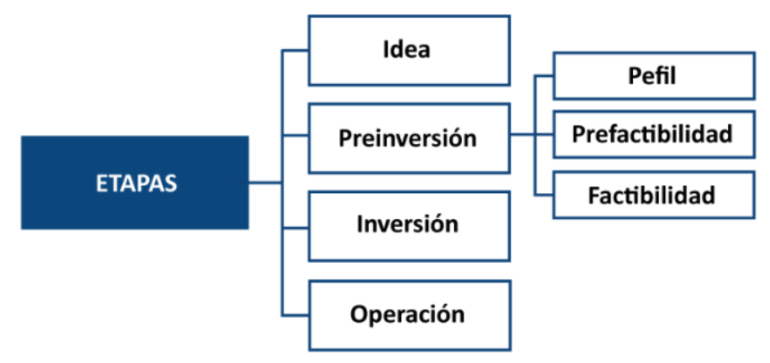

> **Descripción de la imagen** — Se trata de un diagrama jerárquico o mapa conceptual que ilustra las etapas de un proceso, probablemente relacionado con la planificación de proyectos.
>
> El diagrama se estructura de la siguiente manera:
>
> 1.  **Nivel Principal:** En la parte inferior izquierda, se encuentra un recuadro grande de color azul oscuro etiquetado como **ETAPAS**.
> 2.  **Primer Nivel (Etapas Principales):** Cuatro ramas se desprenden directamente de "ETAPAS":
>     *   Idea
>     *   Preinversión
>     *   Inversión
>     *   Operación
> 3.  **Segundo Nivel (Subetapas/Evaluaciones):** Las etapas principales se subdividen en evaluaciones o fases específicas:
>     *   La etapa **Idea** se descompone en tres elementos: Ideal, Prefactibilidad y Factibilidad.
>     *   La etapa **Preinversión** se descompone en tres elementos: Preinversión, Prefactibilidad y Factibilidad.
>     *   La etapa **Inversión** se descompone en un único elemento: Inversión.
>     *   La etapa **Operación** se descompone en un único elemento: Factibilidad.
>
> En resumen, el diagrama muestra que el proceso general (ETAPAS) se compone de cuatro fases principales (Idea, Preinversión, Inversión y Operación),

## Slide 4

PROYECTO

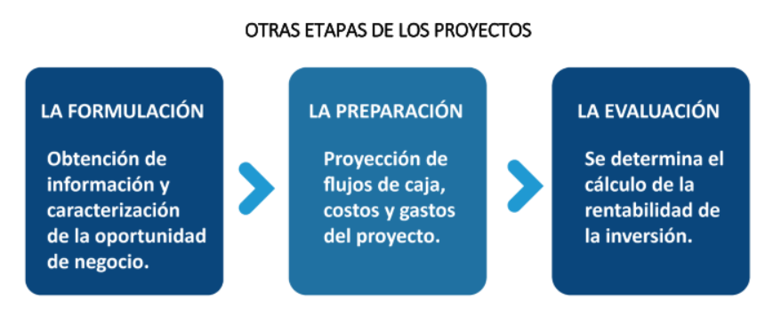

> **Descripción de la imagen** — Se trata de un diagrama de flujo horizontal que ilustra tres etapas secuenciales del proceso de proyectos, conectadas por flechas direccionales.
>
> El diagrama consta de tres bloques principales:
>
> 1.  **LA FORMULACIÓN:** Ubicado a la izquierda, describe la obtención de información y la caracterización de la oportunidad de negocio.
> 2.  **LA PREPARACIÓN:** Situado en el centro, detalla la proyección de flujos de caja, costos y gastos del proyecto.
> 3.  **LA EVALUACIÓN:** Colocado a la derecha, explica que se determina el cálculo de la rentabilidad de la inversión.
>
> Entre estos tres bloques se encuentra un título central que indica: "OTRAS ETAPAS DE PROYECTOS". Las flechas indican una progresión lineal y consecutiva desde la Formulación hacia la Preparación, y luego hacia la Evaluación.

## Slide 5

- IDENTIFICACION DE LA IDEA DE PROYECTO Y ANALISIS DE PRE-FACTIBILIDAD (PROBLEMA , OBJETIVOS, INDICADORES).

- ESTUDIO DEL MERCADO DEL PROYECTO.

- ESTUDIO TECNICO.

- ESTUDIO LEGAL, AMBIENTAL Y SOCIAL DEL PROYECTO.

- EVALUACION ECONOMICA Y FINANCIERA DE LOS PROYECTOS .

ETAPAS DE LA FORMULACIÒN DE PROYECTOS

## Slide 6

> **Descripción de la imagen** — La imagen es un logotipo institucional con elementos gráficos y tipográficos. En la parte superior, hay una banda curva de color amarillo anaranjado que enmarca el texto.
>
> El elemento central del logo consiste en la palabra "escolme" escrita en una fuente gruesa y negra, colocada sobre un círculo amarillo brillante que contiene una letra 'e' estilizada en negro.
>
> Debajo del nombre principal, se encuentra el texto "Institución Universitaria" en una tipografía más pequeña. Finalmente, en la parte inferior, aparece una frase de eslogan: "Hace realidad tu proyecto de vida".

ESTUDIO O INVESTIGACIÒN DEL MERCADO

- Fuerzas  o factores que inciden sobre el mercado 

Proveedores; clientes; competencia, productos sustitutos

- Estudio de Demanda \_ Pronósticos
- Estudio de Oferta \_ Proyecciones
- Estudio de Precios. 
- Estudio de Comercialización

## Slide 7

> **Descripción de la imagen** — La imagen es un logotipo institucional con elementos gráficos y tipográficos. En la parte superior, hay una banda curva de color amarillo anaranjado que enmarca el texto.
>
> El elemento central del logo consiste en la palabra "escolme" escrita en una fuente gruesa y negra, colocada sobre un círculo amarillo brillante que contiene una letra 'e' estilizada en negro.
>
> Debajo del nombre principal, se encuentra el texto "Institución Universitaria" en una tipografía más pequeña. Finalmente, en la parte inferior, aparece una frase de eslogan: "Hace realidad tu proyecto de vida".

- Capacidad de producción de la empresa y tamaño de la empresa
- Localización y distribución de los espacios
- Tecnología a utilizar

- ANÁLISIS DEL PUNTO DE EQUILIBRIO 

       Costos fijos y variables

      Margen de contribución

      Mezcla de productos y Utilidad esperada

- Planeación de la proyección y programación de la  Producción o de los servicios.

- 
- 

ESTUDIO TÈCNICO

## Slide 8

En esta última fase se toman decisiones económicas financieras. 

- Se evalúan presupuestos de inversiones .
- Determinación de ingresos y  egresos (gastos).

Se establecen criterios para la evaluación de la inversión a través de indicadores :  

- Período de Recuperación
- VAN y TIR, para determinar el Riesgo de la inversión , 
- CAUE  \_costo anual equivalente 
- La tasa relación costo_beneficio

ESTUDIO ECONOMICO FINANCIERO

## Slide 9

FINANCIAMIENTO DEL PROYECTO

Estrategias de financiamiento y el costo de capital

Estudio de escenarios de sensibilidad

Optimista\_ Normal\_ Pesimista

CONSIDERACIONES DE CARÁCTER LEGAL; SOCIAL Y AMBIENTAL

Constitución jurídica de la empresa

Aspectos legales de acuerdo a la normatividad del estado

- 

ESTUDIO ECONOMICO FINANCIERO

## Slide 10

MODELO MARCO LÒGICO \_ 

PROYECTOS  DE INVERSIÒN

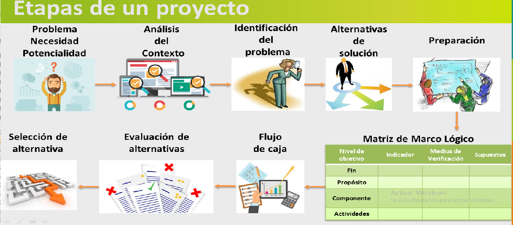

> **Descripción de la imagen** — La imagen es un diagrama de flujo y una matriz estructurada que representan las etapas de un proyecto y el Marco Lógico.
>
> **Diagrama de Flujo (Etapas del Proyecto):**
> El diagrama muestra un proceso secuencial dividido en dos secciones principales, conectadas por flechas:
>
> 1.  **Primera Secuencia:** Comienza con los elementos "Problema", "Necesidad" y "Potencialidad". Una flecha conduce al paso siguiente: "Análisis del Contexto". Este se conecta a la "Identificación del problema", y finalmente a las "Alternativas de solución".
> 2.  **Segunda Secuencia (Subproceso):** La secuencia principal se ramifica hacia abajo, mostrando dos etapas adicionales: "Selección de alternativa" y "Evaluación de alternativas".
>
> **Matriz de Marco Lógico:**
> Debajo del diagrama de flujo se encuentra una tabla titulada "Matriz de Marco Lógico". Esta matriz está organizada en cuatro columnas y cuatro filas, detallando los componentes del proyecto:
>
> *   **Columnas:** Nivel de objetivo, Indicador, Medios de Verificación y Supuestos.
> *   **Filas (Componentes):** Fin (Objetivo final), Propósito, Componente y Actividades.

## Slide 11

MODELO MARCO LÒGICO \_ 

PROYECTOS  DE  MAYOR INVERSIÒN

(OBLIGAORIO EN LOS PROYECTOS DE INVERSIÒN PÙBLICA)

PLANTEAMIENTOY FORMULACIÒN DEL PROYECTO

IDEA DEL PROYECTO (PROBLEMA O NECESIDAD A RESOLVER).

ÀRBOL DE PROBLEMAS

ÀRBOL DE OBJETIVOS

DISEÑO DE INDICADORES DE MEDICIÒN DEL PROYECTO

- 

## Slide 12

PROBLEMAS  COMUNES EN LAS EMPRESA Y 

ORGANIZACIONES

GESTIÒN HUMANA

- Clima laboral
- Alta rotación de personal
- Re procesos en la selección del personal
- Error en la definición de perfiles
- Perfiles desactualizados
- Manuales de funciones y procedimientos desactualizados
- Ausencia de manuales de funciones y procedimientos
- 

## Slide 13

PROBLEMAS  COMUNES EN LAS EMPRESA Y 

ORGANIZACIONES

LOGÌSTICA

- Control y rotación de inventarios
- Retraso en los despachos
- Capacidad de almacenamiento
- Error en el despacho de productos
- Novedades en el transporte
- Deterioro del producto
- 

## Slide 14

PROBLEMAS  COMUNES EN LAS EMPRESA Y 

ORGANIZACIONES

PRODUCCIÒN

- Baja productividad 
- Calidad del producto
- Tecnología obsoleta
- Control de inventarios
- Clima laboral
- Capacitación y formaciòn del personal
- Portafolio de productos desactualizados
- 

## Slide 15

PROBLEMAS  COMUNES EN LAS EMPRESA Y 

ORGANIZACIONES

INFORMÀTICA

- Software desactualizado
- Tecnología obsoleta
- Capacidad de respuesta
- Clima laboral
- Capacitación y formaciòn del personal
- Errores en las instalaciones
- 

## Slide 16

PROBLEMAS  COMUNES EN LAS EMPRESA Y 

ORGANIZACIONES

COMERCIAL O MERCADEO

- Servicio al cliente
- Entrega de pedidos
- Clima laboral
- Facturación de los pedidos
- PQRS de los clientes
- 

## Slide 17

PROBLEMAS  COMUNES EN LAS EMPRESA Y 

ORGANIZACIONES

SALUD, SEGURIDAD y MEDIO AMBIENTE

- Accidentes
- Incapacidades
- Incidentes
- Impactos ambientales
- 

## Slide 18

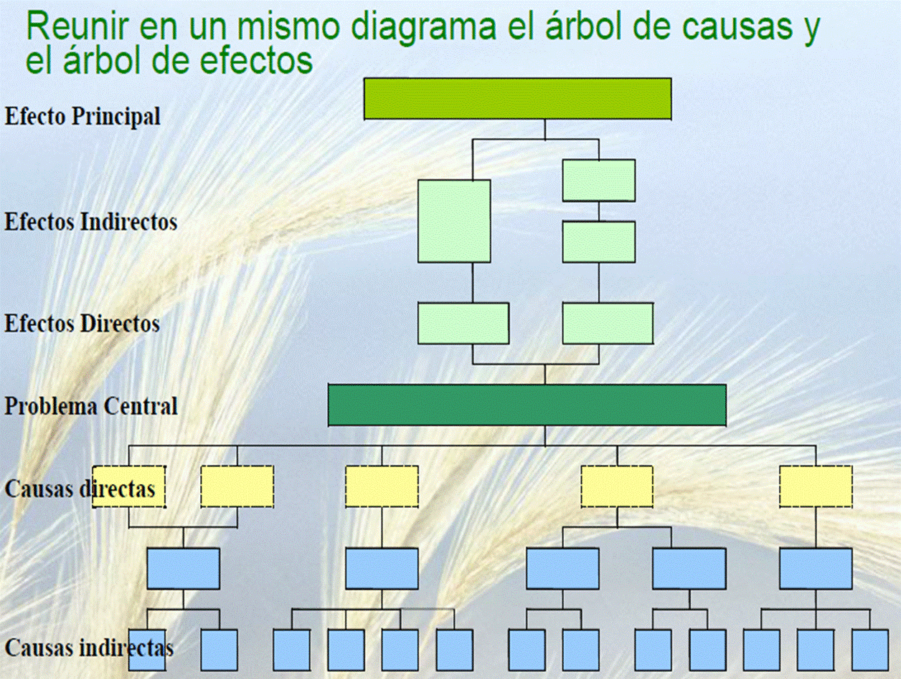

> **Descripción de la imagen** — Se trata de un diagrama jerárquico que ilustra la relación entre el árbol de causas y el árbol de efectos.
>
> El diagrama se estructura en varios niveles y ramas:
>
> 1.  **Nivel Superior:** Se inicia con el nodo principal denominado **"Efecto Principal"**.
> 2.  **Ramas del Efecto:** Desde el "Efecto Principal", se desprenden dos tipos de efectos:
>     *   **"Efectos Indirectos"**: Representados por cajas de color verde claro.
> 3.  **Árbol de Causas (Parte Inferior):** Una sección separada muestra la estructura causal, comenzando con el **"Problema Central"** (caja verde oscuro).
>     *   Desde el "Problema Central", se desprenden dos tipos de causas:
>         *   **"Causas directas"**: Representadas por cajas de color amarillo.
>         *   **"Causas indirectas"**: Representadas por cajas de color azul claro.
>
> La estructura visual muestra una conexión entre el Efecto Principal y los Efectos Indirectos en la parte superior, mientras que el Problema Central se conecta con las Causas directas e indirectas en la parte inferior, creando un esquema dual de análisis causal y de efectos.

## Slide 19

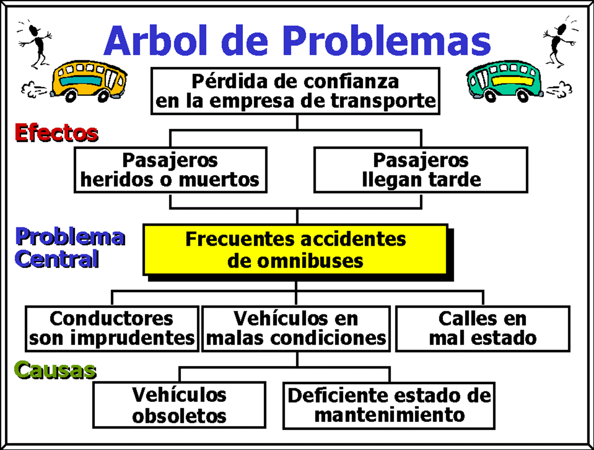

> **Descripción de la imagen** — La imagen es un diagrama de flujo o mapa conceptual que ilustra la estructura de un "Árbol de Problemas" relacionado con los problemas del transporte. El diagrama está organizado jerárquicamente, conectando las causas, el problema central y los efectos.
>
> **Estructura del Diagrama:**
>
> 1.  **Problema Central (Caja Amarilla):** Se encuentra en el centro y se denomina "Arbol de Problemas".
>     *   De este problema central emana una consecuencia: "Pérdida de confianza en la empresa de transporte".
>
> 2.  **Efectos (Caja Roja):** Este nivel está conectado al árbol y muestra las consecuencias directas del problema. Los efectos enumerados son:
>     *   Pasajeros heridos o muertos.
>     *   Pasajeros llegan tarde.
>
> 3.  **Problema Central (Caja Azul):** Se conecta directamente con el "Arbol de Problemas".
>
> 4.  **Causas (Caja Verde):** Este nivel se conecta al problema central y representa las raíces del problema. Las causas enumeradas son:
>     *   Conductores son imprudentes.
>     *   Vehículos en malas condiciones.
>
> 5.  **Subcausas (Conexión de Causas):** La causa "Vehículos en malas condiciones" se desglosa en dos subcausas:
>     *   Vehículos obsoletos.
>     *   Deficiente estado de mantenimiento.

## Slide 20

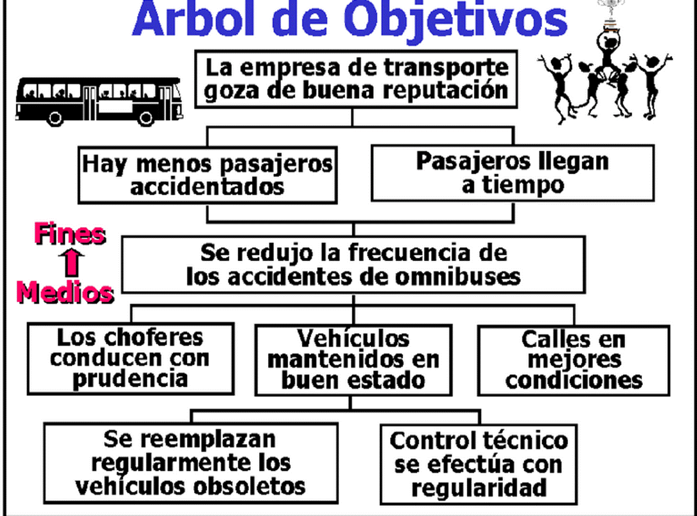

> **Descripción de la imagen** — Se trata de un diagrama conceptual o un mapa de flujo que ilustra la relación entre los objetivos, los fines y los medios en el contexto del transporte.
>
> El diagrama está estructurado jerárquicamente con un título central: "Arbol de Objetivos".
>
> **Estructura y Flujo:**
>
> 1.  **Nivel Central (Fines/Resultados):** En la parte superior se muestran dos resultados principales o fines que se buscan alcanzar, conectados al concepto central.
> 2.  **Nivel Intermedio (Objetivos):** Estos fines conducen a un conjunto de objetivos específicos relacionados con la operación del transporte:
>     *   Se establece la existencia de una empresa de transporte.
>     *   Los pasajeros llegan a tiempo.
> 3.  **Nivel Inferior (Medios/Acciones):** Los objetivos se logran mediante diversas acciones y condiciones, que se ramifican en varias categorías:
>     *   **Seguridad:** Se logra la reducción de la frecuencia de los accidentes de omnibuses.
>     *   **Mantenimiento:** Se asegura que los vehículos estén mantenidos en buen estado.
>     *   **Conducta:** Los choferes deben conducir con prudencia.
>     *   **Infraestructura:** Las calles deben estar

## Slide 21

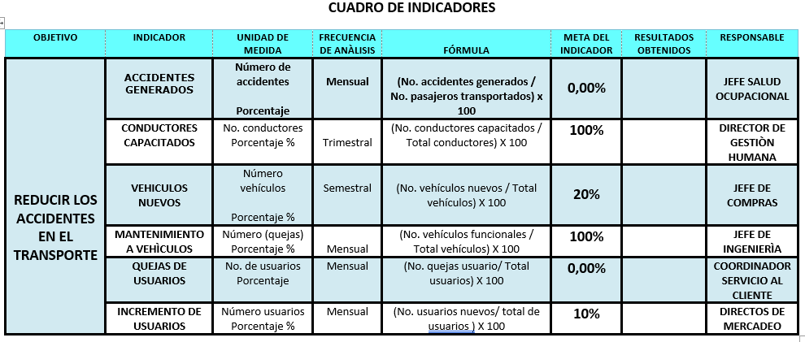

> **Descripción de la imagen** — <|channel>thought
> Here's a thinking process to arrive at the desired description:
>
> 1.  **Analyze the Request:**
>     *   **Goal:** Describe an image (which is provided as text/a table) clearly and completely for someone who cannot see it.
>     *   **Context:** The image appears in an academic/study document.
>     *   **Format Requirements:**
>         *   If it's a diagram/flow: Enumerate elements/steps and connections.
>         *   If it's a table/graph: Describe the data shown.
>         *   If it's a photo/illustration: Describe what is seen.
>     *   **Constraints:** Be concise but complete, in Spanish. Do not repeat text already transcribed (describe only the visual content).
>
> 2.  **Examine the Input Image:**
>     The input is clearly a structured table with multiple rows and columns.
>
> 3.  **Deconstruct the Table Structure (Identify Headers and Data):**
>     *   **Main Title/Context:** CUADRO DE INDICADORES (Table of Indicators).
>     *   **Columns:** OBJETIVO (Objective), INDICADOR (Indicator), UNIDAD DE MEDIDA (Unit of Measure), FRECUENCIA DE ANÁLISIS (Frequency of Analysis), META DEL INDICADOR (Indicator Goal/Target), RESULTADOS OBTENIDOS (Results Obtained).
>
> 4.  **Analyze the Rows (Extract Data):**
>
>     *   **Row 1: ACCIDENTES GENERADOS (Generated Accidents)**
>         *   Objetivo: (Blank/Implied)
>         *   Indicador: Número de accidentes generados (Number of generated accidents)
>         *   Unidad de Medida: Mensual (Monthly)
>         *   Frecuencia de Análisis: Mensual (Monthly)
>         *   Meta del Indicador: 0,00%
>         *   Resultados Obtenidos: (Blank)
>
>     *   **Row 2: CONDUCTORES CAPACITADOS (Trained Drivers)**
>         *   Objetivo: (Blank/Implied)
>         *   Indicador: No. conductores capacitados (Number of trained drivers)
>         *   Unidad de Medida: Porcentaje % (Percentage %)
>         *   Frecuencia de Análisis: Trimestral (Quarterly)
>         *   Meta del Indicador: 100%
>         *   Resultados Obtenidos: DIRECTOR DE GESTIÓN HUMANA (Director of Human Management)
>
>     *   **Row 3: REDUCIR LOS ACCIDENTES EN EL TRANSPORTE (Reduce Accidents in Transport)**
>         *   Objetivo: (Blank/Implied)
>         *   Indicador: Vehículos nuevos (New vehicles)
>         *   Unidad de Medida: Porcentaje % (Percentage %)
>         *   Frecuencia de Análisis: Semestral (Semi-annual)
>         *   Meta del Indicador: 20%
>         *   Resultados Obtenidos: JEFE DE COMPRAS (Purchasing Manager)
>
>     *   **Row 4: MANTENIMIENTO A VEHÍCULOS (Vehicle Maintenance)**
>         *   Objetivo: (Blank/Implied)
>         *   Indicador: Número (quejas) a vehículos (Number of complaints about vehicles)
>         *   Unidad de Medida: Porcentaje % (Percentage %)
>         *   Frecuencia de Análisis: Mensual (Monthly)
>         *   Meta del Indicador: 100%
>         *   Resultados Obtenidos: JEFE DE INGENIERÍA (Engineering Manager)
>
>     *   **Row 5: INCREMENTO DE USUARIOS (Increase Users)**
>         *   Objetivo: (Blank/Implied)
>         *   Indicador: Número usuarios (Number of users)
>         *   Unidad de Medida: Porcentaje % (Percentage %)
>         *   Frecuencia de Análisis: Mensual (Monthly)
>         *   Meta del Indicador: 10%
>         *   Resultados Obtenidos: DIRECTOS DE MERCADEO (Marketing Directors)
>
> 5.  **Synthesize the Description (Drafting the Output):** Structure the description clearly, starting with the overall format and then detailing the table content. (Self-Correction: Ensure I focus on *what* the data is, not just reading the headers.)
>
> 6.  **Final Review against Constraints:**
>     *   Clear and complete? Yes.
>     *   Describes visual content? Yes (it's a table).
>     *   Concise but complete? Yes.
>     *   In Spanish? Yes.

## Slide 22

AUMENTO DE LAS QUEJAS Y RECLAMOS DE LOS CLIENTES

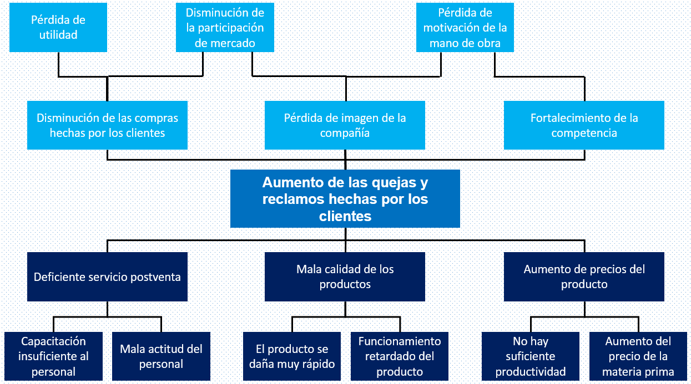

> **Descripción de la imagen** — Se trata de un diagrama de flujo o mapa conceptual que ilustra una estructura jerárquica de causas y efectos, organizado en tres niveles principales.
>
> **Estructura del Diagrama:**
>
> 1.  **Nivel Superior (Factores Iniciales):** Tres conceptos principales se presentan en cajas azules, actuando como factores iniciales:
>     *   Pérdida de utilidad.
>     *   Disminución de la participación de mercado.
>     *   Pérdida de motivación de mano de obra.
>
> 2.  **Nivel Intermedio (Consecuencias y Factores Mediadores):** De estos tres factores iniciales emanan flechas que conducen a un resultado central, pasando por factores intermedios:
>     *   La "Pérdida de utilidad" se conecta con la disminución de las compras hacia los clientes.
>     *   La "Disminución de la participación de mercado" se conecta con la disminución de la participación de mercado (como factor mediador).
>     *   La "Pérdida de motivación de mano de obra" se conecta con el fortalecimiento de la competencia.
>
> 3.  **Resultado Central:** Todos los caminos convergen en un gran recuadro central destacado, que representa el resultado principal: **Aumento de las quejas y reclamos hacia los clientes**.
>
> 4.  **Nivel Inferior (Causas Específicas):** El resultado central se ramifica en tres causas específicas, cada una conectada a un conjunto de factores subyacentes:
>     *   Una rama conecta el aumento de quejas con la "Deficiente servicio post

## Slide 23

AUMENTO DE LAS QUEJAS Y RECLAMOS DE LOS CLIENTES

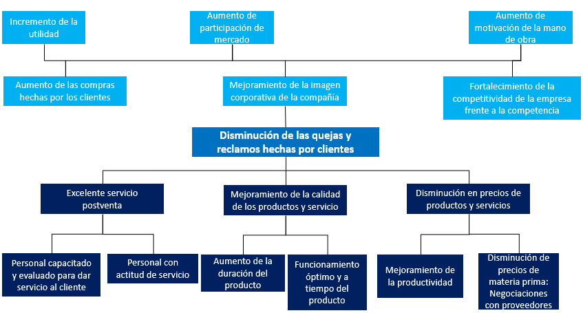

> **Descripción de la imagen** — <|channel>thought
> Here's a thinking process to arrive at the desired description:
>
> 1.  **Analyze the Request:**
>     *   **Goal:** Describe an image (which is provided as text/structure) clearly and completely for someone who cannot see it, assuming it's from an academic document.
>     *   **Format Requirements:**
>         *   If it's a diagram/flowchart: Enumerate elements/steps and connections.
>         *   If it's a table/graph: Describe the data.
>         *   If it's a photo/illustration: Describe what is seen.
>     *   **Constraints:**
>         *   Be concise but complete.
>         *   Language: Spanish.
>         *   Do not repeat text already transcribed (describe *only* the visual content).
>
> 2.  **Examine the Input Image/Structure:**
>     The input is a hierarchical flowchart or mind map structure, centered around a main concept.
>
>     *   **Central Concept (Main Node):** Disminución de las quejas y reclamos hacia los clientes (Decrease in complaints and claims towards customers).
>
>     *   **Level 1 Branches (Directly connected to the center):**
>         1.  Incremento de la utilidad (Increase in utility/profit).
>         2.  Aumento de participación de mercado (Increase in market share).
>         3.  Fortalecimiento de la competitividad de la mano de obra (Strengthening of labor competitiveness).
>
>     *   **Level 2 Branches (Connected to Level 1):**
>         *   *Under Incremento de la utilidad:* Aumento de las compras hechas por los clientes (Increase in purchases made by customers).
>         *   *Under Aumento de participación de mercado:* Mejoramiento de la imagen corporativa de la compañía (Improvement of the company's corporate image).
>         *   *Under Fortalecimiento de la competitividad de la mano de obra:* Disminución en precios de productos y servicios (Decrease in prices of products and services).
>
>     *   **Level 3 Branches (Connected to Level 2):**
>         *   *Under Aumento de las compras hechas por los clientes:* Excelente servicio postventa (Excellent after-sales service).
>         *   *Under Mejoramiento de la imagen corporativa de la compañía:* Personal capacitado y evaluado para dar servicio al cliente (Trained and evaluated personnel to provide customer service).
>         *   *Under Disminución en precios de productos y servicios:* Disminución de precios de materia prima: Negociaciones con proveedores (Decrease in raw material prices: Negotiations with suppliers).
>
>     *   **Level 4 Branches (Connected to Level 3):**
>         *   *Under Excelente servicio postventa:* Personal capacitado y evaluado para dar servicio al cliente (Wait, this seems redundant or a structural error in the provided text. Let's re-examine the structure carefully.)
>             *   *Correction Check:* The node "Personal capacitado y evaluado para dar servicio al cliente" appears twice (once under Level 2/Image, and once under Level 3/Postventa). I must describe the visual flow as presented.
>
>         *   *Under Mejoramiento de la calidad de los productos y servicio:*
>             *   Personal con actitud de servicio (Personnel with service attitude).
>             *   Aumento de la duración del producto (Increase in product duration).
>             *   Funcionamiento óptimo y a tiempo del producto (Optimal and timely functioning of the product).
>
>         *   *Under Disminución de las quejas y reclamos por clientes:* (This is the central node, but it also branches out to Level 3 concepts.)
>
>         *   *Under Mejoramiento de la calidad de los productos y servicio:*
>             *   Mejoramiento de la calidad de los productos y servicio (Wait, this seems like a repeat of the parent node. Let's assume the structure is: Central Goal -> Path A -> Outcome B).
>
>         *   *Under Disminución de las quejas y reclamos por clientes:* (This central goal branches to three main paths):
>             1.  Incremento de la utilidad
>             2.  Aumento de participación de mercado
>             3.  Fortalecimiento de la competitividad de la mano de obra
>
>         *   *Under Disminución de las quejas y reclamos por clientes:* (This central goal also branches to three main paths):
>             1.  Incremento de la utilidad
>             2.  Aumento de participación de mercado
>             3.  Fortalecimiento de la competitividad de la mano de obra
>
>         *   *Under Disminución de las quejas y reclamos por clientes:* (This central goal

## Slide 24

AUMENTO DE LAS QUEJAS Y RECLAMOS DE LOS CLIENTES

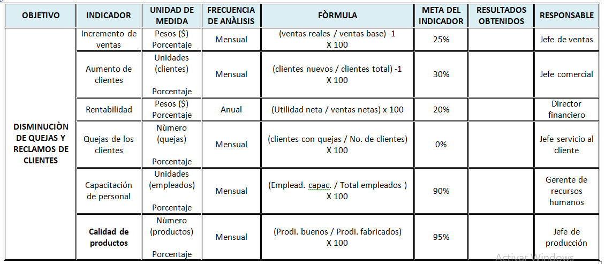

> **Descripción de la imagen** — <|channel>thought
> Here's a thinking process to arrive at the desired description:
>
> 1.  **Analyze the Request:**
>     *   **Goal:** Describe an image (which is provided as text/a screenshot of a table) clearly and completely for someone who cannot see it.
>     *   **Context:** The image appears in an academic or study document.
>     *   **Format Requirements:**
>         *   If it's a diagram/flow: Enumerate elements/steps and connections.
>         *   If it's a table/graph: Describe the data shown.
>         *   If it's a photo/illustration: Describe what is seen.
>     *   **Constraints:**
>         *   No repetition of transcribed text (describe *only* the visual content).
>         *   Be concise but complete.
>         *   Language: Spanish.
>
> 2.  **Examine the Image Content:**
>     *   The image is a structured table with multiple columns and rows, likely outlining objectives, indicators, formulas, targets, and responsible parties.
>     *   It appears to be a performance or management framework (KPIs/Metrics).
>
> 3.  **Deconstruct the Table Structure (Identify Headers and Data):**
>     *   **Main Sections (Top Level):** OBJETIVO, INDICADOR DE MEDIDA, FRECUENCIA DE ANÁLISIS, FÓRMULA, META DEL INDICADOR, RESULTADOS OBTENIDOS, RESPONSABLE.
>     *   **Row 1 (OBJETIVO):** Incremento de ventas
>     *   **Row 2 (INDICADOR DE MEDIDA):** Porcentaje
>     *   **Row 3 (UNIDAD DE MEDIDA):** Pesos ($)
>     *   **Row 4 (FRECUENCIA DE ANÁLISIS):** Mensual
>     *   **Row 5 (FÓRMULA):** (ventas reales / ventas base) x 100
>     *   **Row 6 (META DEL INDICADOR):** 25%
>     *   **Row 7 (RESULTADOS OBTENIDOS):** 30%
>     *   **Row 8 (RESPONSABLE):** Jefe comercial
>
>     *   **Section Break/Sub-Header:** DISMINUCIÓN DE QUEJAS Y RECLAMOS DE CLIENTES
>     *   **Row 9 (OBJETIVO):** (Implied: Disminución de quejas...)
>     *   **Row 10 (INDICADOR DE MEDIDA):** Porcentaje
>     *   **Row 11 (UNIDAD DE MEDIDA):** Unidades (clientes)
>     *   **Row 12 (FRECUENCIA DE ANÁLISIS):** Mensual
>     *   **Row 13 (FÓRMULA):** (clientes con quejas / No. de clientes) x 100
>     *   **Row 14 (META DEL INDICADOR):** 30%
>     *   **Row 15 (RESULTADOS OBTENIDOS):** Jefe servicio al cliente
>
>     *   **Section Break/Sub-Header:** CALIDAD DE PRODUCTOS
>     *   **Row 16 (OBJETIVO):** Calidad de productos
>     *   **Row 17 (INDICADOR DE MEDIDA):** Porcentaje
>     *   **Row 18 (UNIDAD DE MEDIDA):** Número (productos)
>     *   **Row 19 (FRECUENCIA DE ANÁLISIS):** Mensual
>     *   **Row 20 (FÓRMULA):** (Prodi. buenos / Prodi. fabricados) x 100
>     *   **Row 21 (META DEL INDICADOR):** 95%
>     *   **Row 22 (RESULTADOS OBTENIDOS):** Jefe de producción
>
>     *   **Additional Row (Under Calidad de Productos?):** Capacitación de personal
>     *   **Row 23 (OBJETIVO):** Capacitación de personal
>     *   **Row 24 (INDICADOR DE MEDIDA):** Porcentaje
>     *   **Row 25 (UNIDAD DE MEDIDA):** Unidades (empleados)
>     *   **Row 26 (FRECUENCIA DE ANÁLISIS):** Mensual
>     *   **Row 27 (FÓRMULA):** (Emplead. capac. / Total empleados) x 100
>     *   **Row 28 (META DEL INDICADOR):** 90%
>     *   **Row 29 (RESULTADOS

## Slide 25

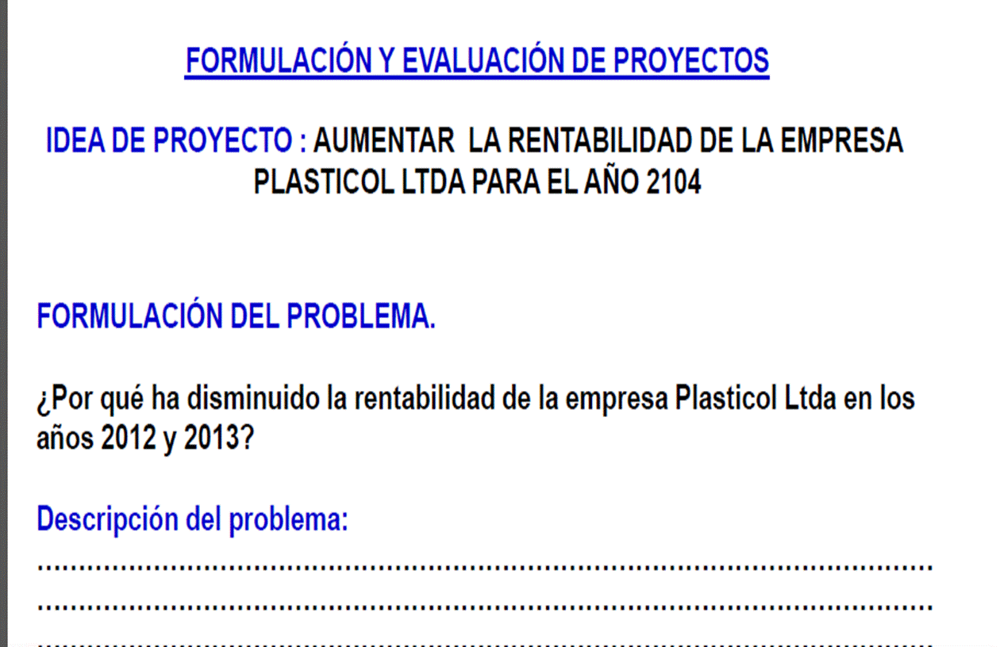

> **Descripción de la imagen** — La imagen es un fragmento de texto estructurado que presenta secciones de un documento académico o de estudio, enfocadas en la formulación y evaluación de proyectos.
>
> El contenido se organiza con los siguientes elementos:
>
> 1.  **Título principal:** "FORMULACIÓN Y EVALUACIÓN DE PROYECTOS".
> 2.  **Idea de Proyecto:** Se especifica el objetivo del proyecto como "AUMENTAR LA RENTABILIDAD DE LA EMPRESA PLASTICOL LTDA PARA EL AÑO 2104".
> 3.  **Formulación del Problema:** Se plantea una pregunta central de investigación: "¿Por qué ha disminuido la rentabilidad de la empresa Plasticol Ltda en los años 2012 y 2013?".
> 4.  **Descripción del problema:** Hay un espacio reservado debajo del título para la descripción detallada del problema, marcado por líneas punteadas que sirven como guías de texto.

EJEMPLO 2

## Slide 26

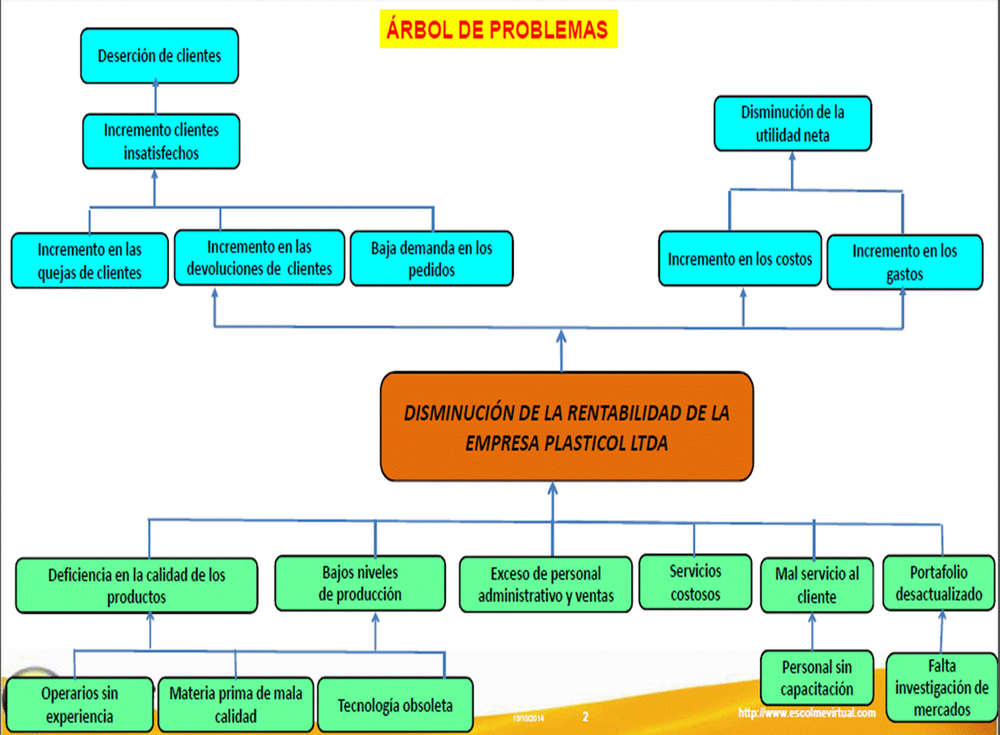

> **Descripción de la imagen** — <|channel>thought
> Here's a thinking process to arrive at the desired description:
>
> 1.  **Analyze the Request:**
>     *   **Goal:** Describe an image (which is provided as an image/diagram) clearly and completely for someone who cannot see it.
>     *   **Context:** The image appears within an academic/study document.
>     *   **Format Requirements:**
>         *   If it's a diagram/flowchart: Enumerate elements/steps and connections.
>         *   If it's a table/graph: Describe the data.
>         *   If it's a photo/illustration: Describe what is seen.
>     *   **Constraints:**
>         *   Be concise but complete.
>         *   Language: Spanish.
>         *   Do not repeat text already transcribed in the document (i.e., focus purely on the visual structure and content).
>
> 2.  **Examine the Image (The Diagram):**
>     *   **Overall Structure:** It is a complex flow/causal diagram, likely illustrating problems leading to a specific outcome. It uses boxes and arrows.
>     *   **Key Components Identification:**
>         *   **Top Level (Problems/Causes):** There are several groups of issues feeding into the central problem.
>         *   **Central Problem (The Core Focus):** A large orange box in the middle.
>         *   **Intermediate Levels (Specific Problems/Symptoms):** Boxes branching out from the top and leading to the center.
>         *   **Bottom Level (Root Causes/Factors):** Boxes at the very bottom feeding into the intermediate levels.
>
> 3.  **Detailed Breakdown of the Diagram's Flow:**
>
>     *   **Section 1: Problems related to Clients/Customers (Left Side)**
>         *   *Top Box:* Deserción de clientes (Client desertion).
>         *   *Intermediate Boxes (Causes of Desertion):*
>             *   Incremento clientes insatisfechos (Increase in dissatisfied clients).
>             *   Incremento en las quejas de clientes (Increase in client complaints).
>         *   *Root Causes (Bottom Level feeding into the intermediate boxes):*
>             *   Operarios sin experiencia (Unexperienced operators) -> feeds into "Incremento en las quejas de clientes".
>             *   Materia prima de mala calidad (Poor quality raw material) -> feeds into "Incremento en las quejas de clientes".
>             *   Tecnología obsoleta (Obsolete technology) -> feeds into "Incremento en las quejas de clientes".
>
>     *   **Section 2: Problems related to Production/Supply (Center-Left)**
>         *   *Intermediate Boxes:*
>             *   Incremento en las devoluciones de clientes (Increase in client returns).
>             *   Baja demanda en los pedidos (Low demand in orders).
>         *   *Root Causes (Bottom Level feeding into the intermediate boxes):*
>             *   Deficiencia en la calidad de los productos (Deficiency in product quality) -> feeds into "Incremento en las devoluciones de clientes".
>             *   Bajos niveles de producción (Low production levels) -> feeds into "Baja demanda en los pedidos".
>
>     *   **Section 3: Problems related to Administration/Costs (Center-Right)**
>         *   *Intermediate Boxes:*
>             *   Exceso de personal administrativo y ventas (Excess administrative and sales staff).
>             *   Servicios costosos (Costly services).
>             *   Mal servicio al cliente (Poor customer service).
>         *   *Root Causes (Bottom Level feeding into the intermediate boxes):*
>             *   Personal sin capacitación (Uncapacitated personnel) -> feeds into "Exceso de personal administrativo y ventas".
>             *   Incremento en los costos (Increase in costs) -> feeds into "Servicios costosos".
>             *   Falta investigación de mercados (Lack of market research) -> feeds into "Mal servicio al cliente".
>
>     *   **Section 4: Problems related to Profitability/Net Income (Right Side)**
>         *   *Intermediate Boxes:*
>             *   Disminución de la utilidad neta (Decrease in net profit).
>             *   Incremento en los gastos (Increase in expenses).
>         *   *Root Causes (Bottom Level feeding into the intermediate boxes):*
>             *   Personal en los costos (Personnel in costs) -> feeds into "Incremento en los gastos".
>
>     *   **Central Outcome:** All these branches converge into a large orange box labeled: DISMINUCIÓN DE LA RENTABILIDAD DE LA EMPRESA PLASTICOL LTDA. (Decrease in the profitability of the company Plasticol Ltd.).
>
> 4.  **Draft the

## Slide 27

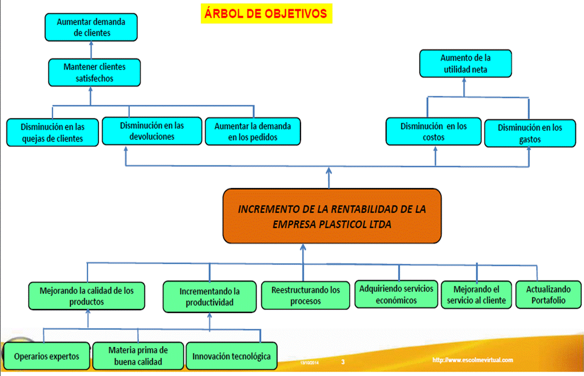

> **Descripción de la imagen** — Se trata de un diagrama de flujo o mapa conceptual jerárquico que ilustra la relación entre los objetivos, las acciones y el incremento de la rentabilidad de una empresa.
>
> El diagrama se estructura en tres niveles principales: la base (factores), los objetivos intermedios (Árbol de Objetivos) y el resultado final.
>
> **Estructura del Diagrama:**
>
> 1.  **Base (Fundamentos):** En la parte inferior, hay tres elementos fundamentales que sirven de base para las acciones: Operarios expertos, Materia prima de buena calidad e Innovación tecnológica.
> 2.  **Objetivos Intermedios (Árbol de Objetivos):** Se ramifican desde la base hacia el centro del diagrama. Estos objetivos se dividen en dos ramas principales:
>     *   **Rama Izquierda (Enfoque en Clientes):** Incluye los objetivos de Aumentar demanda de clientes, Mantener clientes satisfechos y Disminución en las quejas de clientes.
>     *   **Rama Derecha (Enfoque Financiero/Operacional):** Incluye el objetivo de Aumento de la utilidad neta y Disminución en los

## Slide 28

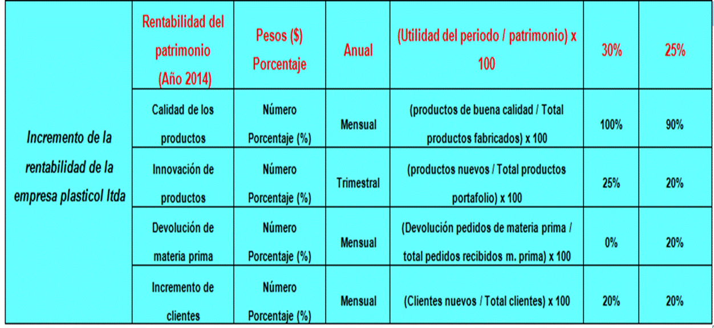

> **Descripción de la imagen** — La imagen es una tabla de datos que presenta métricas financieras y de rendimiento para la empresa plasticol Ltda, organizada en varias secciones y periodos temporales (Anual, Trimestral, Mensual).
>
> La tabla se divide en cuatro secciones principales:
>
> **1. Rentabilidad del patrimonio (Año 2014):**
> Esta sección incluye métricas sobre el incremento de la rentabilidad de la empresa y la rentabilidad del patrimonio. Muestra datos clas

META

RESULTADO

## Slide 29

DEFICIENCIA EN EL SISTEMA DE COMUNICACIÓN

 INTERNO DE EL PERIODICO EL COLOMBIANO

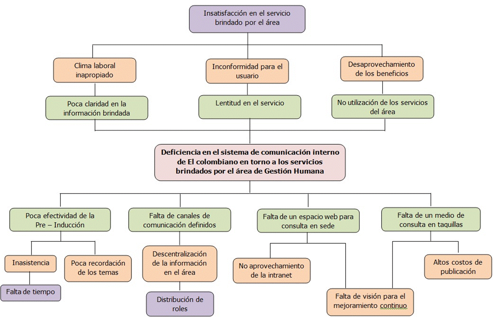

> **Descripción de la imagen** — <|channel>thought
> Here's a thinking process to arrive at the desired description:
>
> 1.  **Analyze the Request:**
>     *   **Goal:** Describe the provided image (which is a flowchart/diagram) clearly and completely for someone who cannot see it.
>     *   **Context:** The image appears in an academic/study document.
>     *   **Format Requirement:** If it's a diagram, map, or flow, enumerate elements/steps and their connections. If it's a table/graph, describe the data. If it's a photo, describe what is seen.
>     *   **Constraint:** Do not repeat text already transcribed in the document (i.e., focus only on the visual content).
>     *   **Tone/Language:** Concise but complete, in Spanish.
>
> 2.  **Examine the Image (The Visual Content):**
>     *   The image is a hierarchical flowchart structure, likely illustrating problems or deficiencies related to human resource management/service management ("Gestión Humana").
>     *   It starts with a central theme and branches out into various sub-issues.
>
> 3.  **Deconstruct the Flowchart (Step-by-Step Analysis):**
>
>     *   **Level 1 (Central Theme/Main Box):** "Insatisfacción en el servicio brindado por el área" (Dissatisfaction with the service provided by the area).
>     *   **Level 2 (First Branching):** This central theme splits into three main categories:
>         1.  "Inconformidad para el usuario" (Dissatisfaction for the user).
>         2.  "Lentitud en el servicio" (Slowness/Lateness in the service).
>         3.  "Desaprovechamiento de los beneficios del área" (Underutilization of the area's benefits).
>     *   **Level 3 (Sub-branches under each Level 2 point):**
>         *   *Under "Inconformidad para el usuario":*
>             *   "Clima laboral inapropiado" (Inappropriate work climate).
>             *   "Poca claridad en la información brindada" (Lack of clarity in the information provided).
>         *   *Under "Lentitud en el servicio":*
>             *   "Deficiencia en el sistema de comunicación interno de El colombiano en torno a los servicios brindados por el área de Gestión Humana" (Deficiency in the internal communication system...).
>         *   *Under "Desaprovechamiento de los beneficios del área":*
>             *   "No utilización de los servicios del área" (Non-utilization of the area's services).
>     *   **Level 4 (Further Sub-branches):** These branches expand further:
>         *   *Under "Clima laboral inapropiado":*
>             *   "Inasistencia".
>             *   "Poca recordación de los temas".
>             *   "Falta de tiempo".
>         *   *Under "Deficiencia en el sistema de comunicación interno...":* (This branch is complex and has multiple sub-points):
>             *   "Descentralización de la información en el área".
>             *   "Falta de canales de comunicación definidos".
>             *   "Descentralización de la información en el área" (Wait, this seems duplicated or a typo in the original image structure, but I must describe what is shown). *Correction: The text under "Deficiencia..." branches into three distinct issues.*
>         *   *Under "Inconformidad para el usuario":* (This branch has its own sub-points):
>             *   "Falta de un espacio web para consulta en sede".
>         *   *Under "Lentitud en el servicio":* (This branch has its own sub-points):
>             *   "No aprovechamiento de la intranet".
>         *   *Under "Desaprovechamiento de los beneficios del área":* (This branch has its own sub-points):
>             *   "Falta de visión para el mejoramiento continuo".
>             *   "Altos costos de publicación".
>
> 4.  **Synthesize and Structure the Description (Drafting the Output):** (Focus on clarity, hierarchy, and flow.) (Self-Correction: Ensure the description captures the *relationship* between the boxes.)
>
> 5.  **Final Review against Constraints:**
>     *   Clear and complete? Yes.
>     *   Describes as a diagram/flow? Yes.
>     *   Enumerates elements/steps and connections? Yes.
>     *   No repetition of transcribed text (just visual content)? Yes.
>     *   Concise but complete? Yes.
>     *

## Slide 30

ÀRBOL DE OBJETIVOS

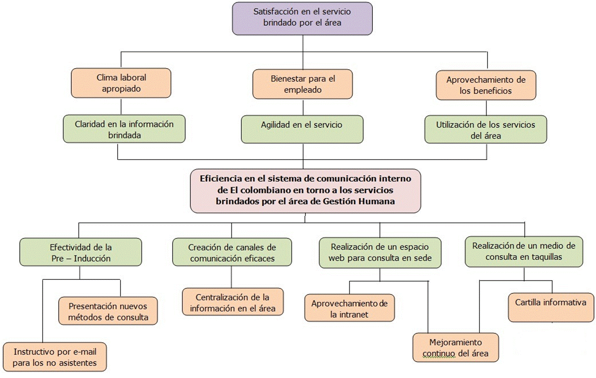

> **Descripción de la imagen** — <|channel>thought
> Here's a thinking process to arrive at the desired description:
>
> 1.  **Analyze the Request:**
>     *   **Goal:** Describe an image (which is provided as a flowchart/diagram) clearly and completely for someone who cannot see it, assuming it's part of an academic document.
>     *   **Format Requirements:**
>         *   If it's a diagram/flowchart: Enumerate elements/steps and how they connect.
>         *   If it's a table/graph: Describe the data.
>         *   If it's a photo/illustration: Describe what is seen.
>     *   **Constraints:**
>         *   Be concise but complete.
>         *   Language: Spanish.
>         *   Do not repeat text already transcribed in the document (i.e., describe the *visual structure*, not just listing the labels).
>
> 2.  **Examine the Image (The Visual Input):**
>     *   The image is a complex hierarchical flowchart/mind map, structured around a central theme and branching out into various components.
>
> 3.  **Deconstruct the Flowchart (Identify Structure and Nodes):**
>
>     *   **Central Theme (Top Level):** "Satisfacción en el servicio brindado por el área" (Satisfaction in the service provided by the area).
>     *   **First Level Branches (Directly under the center):**
>         1.  Eficiencia en el sistema de comunicación interno de El colombiano en torno a los servicios brindados por el área.
>         2.  Bienestar para el empleado.
>         3.  Agilidad en el servicio.
>     *   **Second Level Branches (Under the first level):**
>
>         *   *Under Eficiencia...:*
>             *   Clima laboral apropiado
>             *   Claridad en la información brindada
>         *   *Under Bienestar para el empleado:* (No visible sub-branches, just a node)
>         *   *Under Agilidad en el servicio:* (No visible sub-branches, just a node)
>
>     *   **Third Level Branches (Under the second level):**
>
>         *   *Under Clima laboral apropiado:*
>             *   Efectividad de la Pre – Inducción
>             *   Presentación nuevos métodos de consulta
>             *   Instructivo por e-mail para los no asistentes
>         *   *Under Claridad en la información brindada:* (No visible sub-branches, just a node)
>
>         *   *Under Eficiencia... (Second branch):*
>             *   Creación de canales de comunicación eficaces
>             *   Centralización de la información en el área
>
>         *   *Under Bienestar para el empleado (Second branch):*
>             *   Aprovechamiento de la intranet
>
>         *   *Under Agilidad en el servicio (Second branch):*
>             *   Realización de un espacio web para consulta en sede
>
>     *   **Fourth Level Branches (Under the third level):**
>
>         *   *Under Creación de canales...:* (No visible sub-branches, just a node)
>         *   *Under Centralización de la información...:* (No visible sub-branches, just a node)
>         *   *Under Aprovechamiento de la intranet:* (No visible sub-branches, just a node)
>         *   *Under Realización de un espacio web...:* (No visible sub-branches, just a node)
>
>     *   **Fifth Level Branches (Under the fourth level):**
>
>         *   *Under Efectividad de la Pre – Inducción:* (No visible sub-branches, just a node)
>         *   *Under Presentación nuevos métodos...:* (No visible sub-branches, just a node)
>         *   *Under Instructivo por e-mail...:* (No visible sub-branches, just a node)
>         *   *Under Realización de un medio de consulta en taquillas:* (No visible sub-branches, just a node)
>         *   *Under Utilización de los servicios del área:* (No visible sub-branches, just a node)
>         *   *Under Mejoramiento continuo del área:* (No visible sub-branches, just a node)
>         *   *Under Cartilla informativa:* (No visible sub-branches, just a node)
>
> 4.  **Synthesize and Draft the Description (Focusing on Hierarchy and Connections):** (Self-Correction: Ensure I describe the *flow* rather than just listing every box.)
>
> 5.  **Final Review against Constraints:**
>     *   Clear and complete? Yes.
>     *   Describes structure/connections? Yes.
>     *   Concise but complete? Yes

## Slide 31

INDICADORES DEL PROYECTO

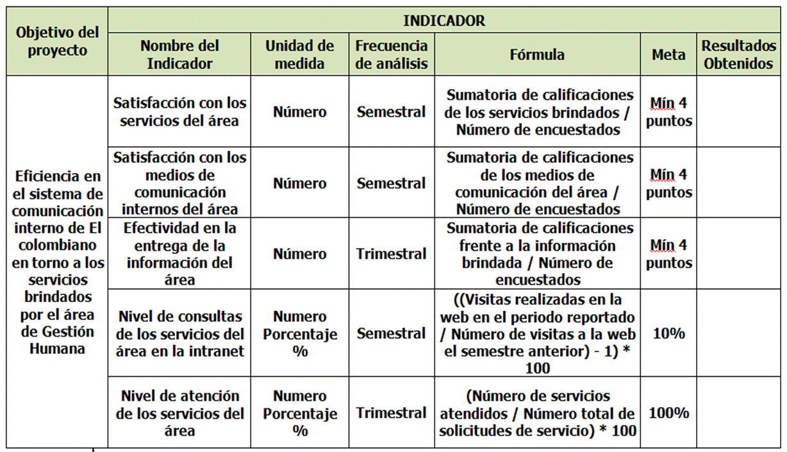

> **Descripción de la imagen** — <|channel>thought
> Here's a thinking process to arrive at the desired description:
>
> 1.  **Analyze the Request:**
>     *   **Goal:** Describe an image (which is presented as a table/document snippet) clearly and completely for someone who cannot see it.
>     *   **Context:** The image appears within an academic or study document.
>     *   **Format Requirement:** If it's a diagram/flow, list elements/steps and connections. If it's a table/graph, describe the data. If it's a photo/illustration, describe what is seen.
>     *   **Constraint 1 (Crucial):** Do not repeat text already transcribed in the document (i.e., focus only on the visual content).
>     *   **Constraint 2:** Be concise but complete, in Spanish.
>
> 2.  **Examine the Image Content:**
>     *   The image is a structured table with multiple columns and rows.
>     *   It appears to be an indicator/metric framework for a project evaluation (Objetivo del proyecto).
>
> 3.  **Deconstruct the Table Structure (Identify Headers and Data):**
>
>     *   **Main Columns (Headers):**
>         1.  Objetivo del proyecto
>         2.  Nombre del Indicador
>         3.  Unidad de medida
>         4.  Frecuencia de análisis
>         5.  Fórmula
>         6.  Meta
>         7.  Resultados Obtenidos
>
>     *   **Row 1 (Eficacia en el sistema de comunicación interno...):**
>         *   Objetivo: Eficiencia en el sistema de comunicación interno en torno a los servicios brindados por el área de Gestión Humana.
>         *   Indicador: Satisfacción con los medios de comunicación internos del área.
>         *   Unidad de medida: Número.
>         *   Frecuencia de análisis: Semestral.
>         *   Fórmula: Sumatoria de calificaciones de los servicios brindados / Número de encuestados.
>         *   Meta: Mín 4 puntos.
>         *   Resultados Obtenidos: (Empty/Blank).
>
>     *   **Row 2 (Eficacia en el sistema de comunicación interno...):**
>         *   Objetivo: Eficiencia en el sistema de comunicación interno en torno a los servicios brindados por el área de Gestión Humana.
>         *   Indicador: Efectividad en la entrega de la información del área.
>         *   Unidad de medida: Número.
>         *   Frecuencia de análisis: Trimestral.
>         *   Fórmula: Sumatoria de calificaciones frente a la información brindada / Número de encuestados.
>         *   Meta: Mín 4 puntos.
>         *   Resultados Obtenidos: (Empty/Blank).
>
>     *   **Row 3 (Eficacia en el sistema de comunicación interno...):**
>         *   Objetivo: Eficiencia en el sistema de comunicación interno en torno a los servicios brindados por el área de Gestión Humana.
>         *   Indicador: Nivel de consultas de los servicios del área en la intranet.
>         *   Unidad de medida: Número Porcentaje %.
>         *   Frecuencia de análisis: Semestral.
>         *   Fórmula: Sumatoria de calificaciones de los medios de comunicación del área / Número de encuestados. (Wait, the formula seems identical to Row 1's formula, but the indicator is different).
>         *   Meta: 10%.
>         *   Resultados Obtenidos: (Empty/Blank).
>
>     *   **Row 4 (Eficacia en el sistema de comunicación interno...):**
>         *   Objetivo: Eficiencia en el sistema de comunicación interno en torno a los servicios brindados por el área de Gestión Humana.
>         *   Indicador: Nivel de atención de los servicios del área.
>         *   Unidad de medida: Número Porcentaje %.
>         *   Frecuencia de análisis: Trimestral.
>         *   Fórmula: (Número de servicios atendidos / Número total de solicitudes de servicio) * 100.
>         *   Meta: 100%.
>         *   Resultados Obtenidos: (Empty/Blank).
>
> 4.  **Draft the Description (Focusing on Structure and Data, avoiding direct transcription):** (Self-Correction: Ensure I describe *what* the table is, not just reading the text.)
>
> 5.  **Final Review against Constraints:**
>     *   Clear and complete? Yes.
>     *   Describes data/structure? Yes.
>     *   No repetition of

