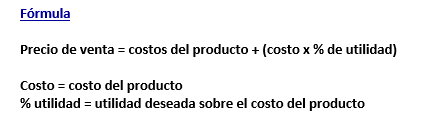
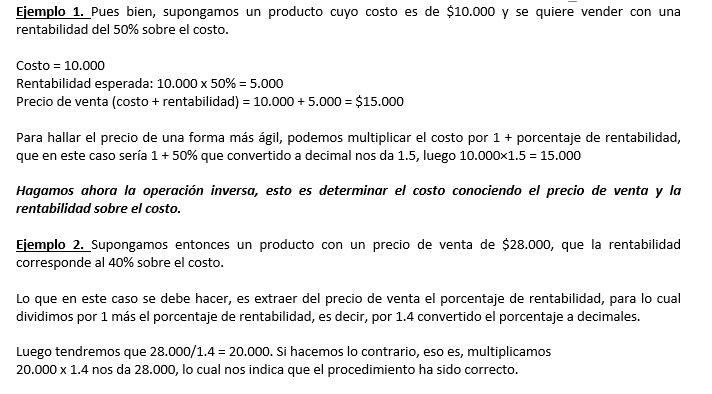

# ESTUDIO DE MERCADO DEL PROYECTO

> Borrador vacío. Aquí van tus apuntes de síntesis de esta unidad (no el material crudo, eso vive en `../fuentes/`).

## Los precios y margenes comerciales

cuantificar coste de transporte, almacenamiento y distribucion, margenes comerciales segun posisiones en los canales de distribucion y precios de la conpetencia. 

### precios de venta con base al costo
> **Captura de pantalla** — 2026-08-30 16:06
>
> 

Precio de venta = costos del producto + (costo x % de utilidad)

Costo = costo del producto

% utilidad = utilidad deseada sobre el costo del producto

> **Captura de pantalla** — 2026-08-30 16:08
>
> 

Ejemplo 1. Pues bien, supongamos un producto cuyo costo es de $10.000 y se quiere vender con una rentabilidad del 50% sobre el costo.
Costo = 10.000
Rentabilidad esperada: 10.000 x 50% = 5.000
Precio de venta (costo + rentabilidad) = 10.000 + 5.000 = 15.000

Para hallar el precio de una forma más ágil, podemos multiplicar el costo por 1 + porcentaje de rentabilidad, que en este caso sería 1 + 50% que convertido a decimales.

Hagamos ahora la operación inversa, esto es determinar el costo conociendo el precio de venta y la rentabilidad sobre el costo.

Ejemplo 2. Supongamos entonces un producto con un precio de venta de $28.000, que la rentabilidad corresponde al 40% sobre el costo.
Lo que en este caso se debe hacer, es extraer del precio de venta el porcentaje de rentabilidad, para lo cual dividimos por 1 más el porcentaje de rentabilidad, es decir, por 1.4 convertido el porcentaje a decimales.

Luego tendremos que 28.000 / 1.4 = 20.000. Si hacemos lo contrario, eso es, multiplicamos 20.000 x 1.4 nos da 28.000, lo cual nos indica que el procedimiento ha sido correcto.

### precios de venta con margen de utilidad sobre la venta
