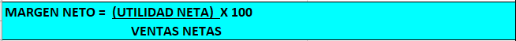
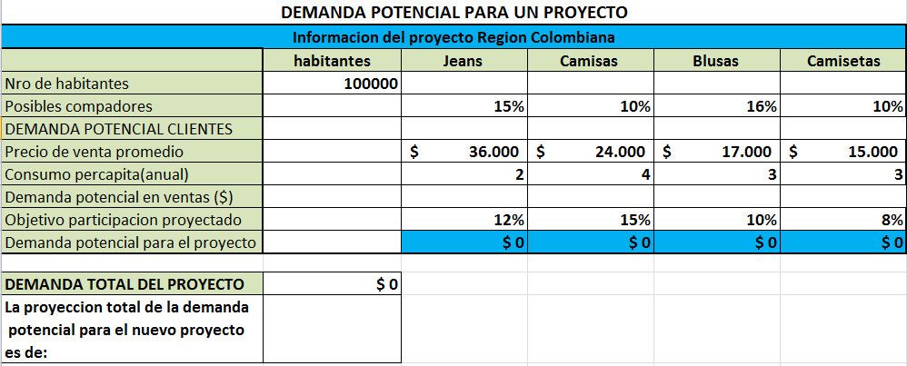
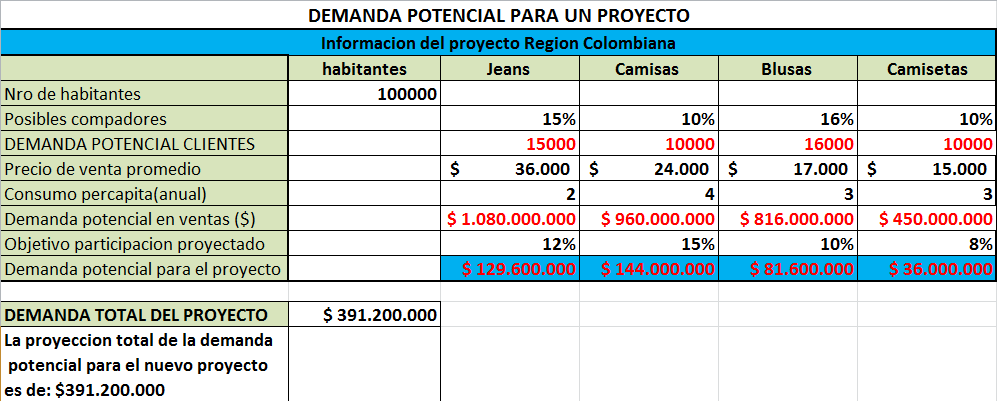
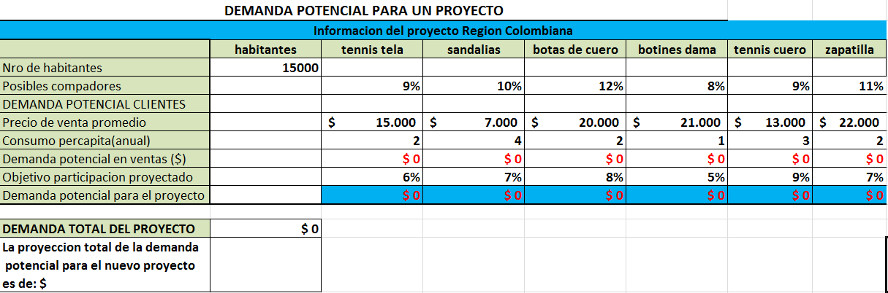
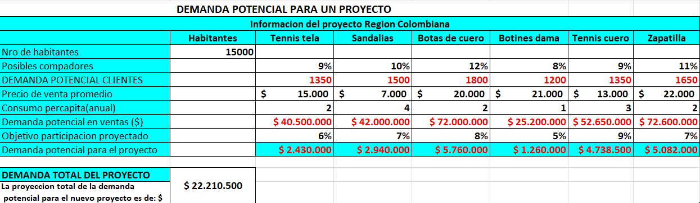
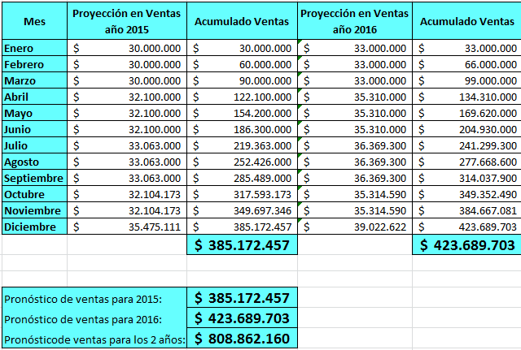

# 1. Precios, demanda potencial y pronóstico de ventas

**<u>ESTUDIO DE MERCADO DEL PROYECYO</u>**

**HERRAMIENTAS CLAVES Y FUNDAMENTALES**

1.  <u>**LOS PRECIOS Y MÁRGENES COMERCIALES**.</u>

Interesa conocer todo el proceso de formación de precios desde que el producto sale de fábrica en el país de origen hasta llegar a conocer el precio final para ser competitivo en el mercado destino. Habría que cuantificar. El coste de transporte, almacenamiento y distribución, márgenes comerciales según distintas posiciones en los canales de distribución, Precios de la competencia.

Con respecto a los precios también es muy importante tener claros los siguientes conceptos:

El análisis de las series históricas y de los mecanismos de formación de los precios del bien o servicio a ser producido por el proyecto, nos permite estimar el precio probable y en función de ello, tener una idea preliminar del volumen de recursos que el proyecto podría generar en concepto \
de ingresos.

 

a\) Análisis de las series históricas de precios

b\) Estructura de los mecanismos de formación de precios.

 \
c) Posibilidad del proyecto de influir en la formación de los precios.

d\) Mecanismos externos de formación de precios: precios fijados por el sector público; \
precios del mercado internacional; precios diferenciados regionalmente.

e\) Mecanismos internos de formación de precios, en función del costo de producción o del libre juego de la oferta y la demanda.

**1.1. Precio de venta con base al costo (utilidad con base al costo):** En estos casos, debemos hallar el precio de venta, puesto que el ejercicio no lo da, y para ello hay que primero determinar el valor del costo de producto o mercancía.

Una vez determinado el costo del producto, para lo cual el ejercicio debe contener los elementos necesarios, se calcula la rentabilidad exigida, y en consecuencia, el costo más la rentabilidad será el precio de venta.

De allí que el precio de venta se suele representar como costo + más utilidad esperada, puesto que el precio de venta debe cubrir el costo del producto más la rentabilidad esperada por el empresario.

Esto en la representación más simple, puesto que en la determinación del precio de venta se deben evaluar una serie de variables y elementos propios y diferentes para cada empresa, que aquí para efectos de simplicidad no se contemplarán.

**<u>Fórmula</u>**

**Precio de venta = costos del producto + (costo x % de utilidad)**

**Costo = costo del producto**

**% utilidad = utilidad deseada sobre el costo del producto**

**<u>Ejemplo 1.</u>** Pues bien, supongamos un producto cuyo costo es de \$10.000 y se quiere vender con una rentabilidad del 50% sobre el costo.

Costo = 10.000\
Rentabilidad esperada: 10.000 x 50% = 5.000\
Precio de venta (costo + rentabilidad) = 10.000 + 5.000 = \$15.000

Para hallar el precio de una forma más ágil, podemos multiplicar el costo por 1 + porcentaje de rentabilidad, que en este caso sería 1 + 50% que convertido a decimal nos da 1.5, luego 10.000×1.5 = 15.000

***Hagamos ahora la operación inversa, esto es determinar el costo conociendo el precio de venta y la rentabilidad sobre el costo.***

**<u>Ejemplo 2.</u>** Supongamos entonces un producto con un precio de venta de \$28.000, que la rentabilidad corresponde al 40% sobre el costo.

Lo que en este caso se debe hacer, es extraer del precio de venta el porcentaje de rentabilidad, para lo cual dividimos por 1 más el porcentaje de rentabilidad, es decir, por 1.4 convertido el porcentaje a decimales.

Luego tendremos que 28.000/1.4 = 20.000. Si hacemos lo contrario, eso es, multiplicamos

20.000 x 1.4 nos da 28.000, lo cual nos indica que el procedimiento ha sido correcto.

**1. 2. Precio de venta con base al margen de utilidad sobre la venta.** En este caso se debe calcular los costos del producto y luego se debe determinar el margen de utilidad o de rentabilidad que se desea obtener sobre el precio de venta.

Esta fórmula permite que se obtenga una mayor utilidad y de esta forma se pueda hacer descuentos y pagar impuestos.

**<u>Fórmula</u>**

**Precio de venta = costos del producto / (1 - % de rentabilidad)**

**Costo =costo del producto**

**1 = constante**

**% de rentabilidad = rentabilidad deseada sobre el costo del producto**

**Ejemplo 1.**

Costo = 10.000\
Rentabilidad esperada: 50%\
Precio de venta = 10.000 / (1 – 0,50) = **\$20.000**

**Compárenos ahora las 2 fórmulas y veamos su diferencia:**

**Precio de venta con base al costo vs precio de venta con base al precio de venta**

Precio de venta (costo + rentabilidad) = 10.000 x 1,50 = \$**15.000**

Precio de venta = 10.000 / (1 – 0,50) = **\$20.000**

*Si revisamos las 2 formulas se puede observar que es más recomendable la segunda fórmula ya que queda una utilidad de \$10.000 y la empresa puede otorgar descuentos a los clientes , puede cubrir los gastos administrativos y de ventas y puede separar el margen para el inversionista. En la primer formula solamente queda una utilidad de \$5.000.*

**Nota importante**: la aplicación de la fórmula dependerá de la política de precios de las empresas o del proyecto a ejecutar.

**<u>1. 3. Precio de venta para los proyectos con base a variables internas y externas</u>**

A continuación, se presenta otra forma de calcular el precio con base a factores o variables internas como son los gastos y el margen de utilidad y externas como son la inflación.

> **Descripción de la imagen** — La imagen muestra una fórmula matemática o ecuación presentada en un recuadro de color azul cian. La fórmula establece la relación entre el "PRECIO DE VENTA" y otros componentes financieros.
>
> La estructura de la ecuación es:
> **PRECIO DE VENTA = (COSTO UNITARIO) / (1 - % INFLACIÓN - % MARGEN DE UTILIDAD)**

Así mismo, se presenta una fórmula de como calcular el MARGEN NETO DE los proyectos teniendo en cuenta el comportamiento de las variables que conforman el precio de venta de un producto o servicio.

> **Descripción de la imagen** — La imagen es una fórmula matemática presentada en un recuadro de fondo azul brillante. La ecuación principal define el "MARGEN NETO" mediante la siguiente relación: MARGEN NETO = (UTILIDAD NETA) X 100. Debajo de esta fórmula, se encuentra el texto "VENTAS NETAS".

Para una mejor aplicación de los conceptos se plantearán ejercicios en los cuales se definen unas condiciones para la ejecución de los proyectos para evaluar los efectos generados por los cambios en los precios de venta.

**Se debe revisar el planteamiento y desarrollo de los ejercicios de repaso en el archivo de Excel.**

**<u>Ejercicios sobre los efectos del precio de venta en la ejecución y viabilidad de un proyecto</u>**

**Ejercicio 1: La empresa TRAPOS MALOS S.A desea ejecutar el siguiente proyecto de inversión y presenta los siguientes datos:**

Unidades a vender: 10.000

Costo unitario del producto: \$20.000

Margen esperado por el inversionista: 10% sobre las ventas netas

Inflación esperada: 6% anual

Gastos fijos totales: \$12.000.000

**<u>Condiciones para la aprobación y ejecución del proyecto</u>**

- El precio de venta del producto debe ser menor a \$25.000

- El margen neto para el inversionista debe ser mayor o igual al 10% sobre las ventas netas

- La utilidad neta debe ser igual o mayor a \$25.000.000

**<u>Pregunta a resolver:</u> Se debe evaluar si el proyecto se puede ejecutar o no se puede ejecutar**

***NOTA IMPORTANTE: El proyecto debe cumplir las 3 condiciones o de lo contrario NO se podrá ejecutar.***

**<u>La empresa decide implementar las siguientes estrategias o alternativas para mejorar las condiciones del proyecto</u>**

Alternativa A: se decide aumentar el número de unidades vendidas a 11.500 unidades

Alternativa B: se decide aumentar el número de unidades vendidas a 11.200 unidades y disminuir el costo unitario a \$18.000.

Alternativa C: se decide disminuir los costos fijos totales a \$11.000.000

**<u>Pregunta a resolver.</u> Se debe evaluar y seleccionar la mejor alternativa que cumpla las 3 condiciones para ejecutar el proyecto.**

***RESPUESTA:** la mejor alternativa para ejecutar el proyecto **<u>es la alternativa B</u>**, que consiste en disminuir el costo unitario del producto a \$18.000 e incrementar el número de unidades vendidas a 11.200 unidades; con estos datos se cumplen las 3 condiciones del proyecto*

**Ejercicio 2: La empresa CUERO LIXO LTDA desea ejecutar el siguiente proyecto de inversión y presenta los siguientes datos:**

Unidades a vender: 20.000

Costo unitario del producto: \$24.000

Margen esperado por el inversionista: 12% sobre las ventas netas

Inflación esperada: 6% anual

Gastos fijos totales: \$30.000.000

**<u>Condiciones para la aprobación y ejecución del proyecto</u>**

- El precio de venta del producto debe ser menor a \$29.000

- El margen neto para el inversionista debe ser mayor al 12% sobre las ventas netas

- La utilidad neta debe ser igual o mayor a \$80.000.000

**<u>Pregunta a resolver</u>**

**Se debe evaluar si el proyecto se puede ejecutar o no se puede ejecutar**

***NOTA IMPORTANTE: El proyecto debe cumplir las 3 condiciones o de lo contrario NO se podrá ejecutar.***

**<u>La empresa decide implementar las siguientes estrategias o alternativas para mejorar las condiciones del proyecto</u>**

Alternativa A: se decide aumentar el número de unidades vendidas a 25.000 unidades y disminuir los costos fijos totales a \$24.000.000.

Alternativa B: se decide aumentar el número de unidades vendidas a 25.000 unidades y que la inflación disminuya al 4,00%.

Alternativa c: se decide aumentar el número de unidades vendidas a 23.000 unidades; disminuir el costo unitario a \$23.000 y disminuir los gastos fijos totales a \$25.000.000.

**<u>Pregunta a resolver:</u> Se debe evaluar y seleccionar la mejor alternativa que cumpla las 3 condiciones para ejecutar el proyecto.**

**Ejercicio 3: La empresa de muebles COMEJEN S.A desea ejecutar el siguiente proyecto de inversión y presenta los siguientes datos:**

Unidades a vender: 8.000

Costo unitario del producto: \$35.000

Margen esperado por el inversionista: 12,5% sobre las ventas netas

Inflación esperada: 5% anual

Gastos fijos totales: \$60.000.000

**<u>Condiciones para la aprobación y ejecución del proyecto</u>**

- El precio de venta del producto debe ser menor a \$50.000

- El margen neto para el inversionista debe ser mayor al 12,5% sobre las ventas netas

- La utilidad neta debe ser igual o mayor a \$50.000.000

**<u>Pregunta a resolver.</u> Se debe evaluar si el proyecto se puede ejecutar o no se puede ejecutar**

***NOTA IMPORTANTE: El proyecto debe cumplir las 3 condiciones o de lo contrario NO se podrá ejecutar.***

**<u>La empresa decide implementar las siguientes estrategias o alternativas para mejorar las condiciones del proyecto</u>**

Alternativa A: se decide disminuir el costo unitario a \$34.000 y disminuir los costos fijos totales a \$55.000.000.

Alternativa B: se decide aumentar el número de unidades vendidas a 9.000 unidades.

Alternativa c: se decide disminuir el costo unitario a \$34.000 y disminuir los costos fijos totales a \$58.000.000.

**<u>Pregunta a resolver.</u> Se debe evaluar y seleccionar la mejor alternativa que cumpla las 3 condiciones para ejecutar el proyecto.**

**<u>2. LA DEMANDA POTENCIAL</u>**

La Demanda Potencial es el volumen máximo que podría alcanzar un producto o servicio en unas condiciones y tiempo determinado, y se expresa en unidades físicas o monetarias. La Demanda Potencial del Mercado es la hipótesis respecto a cuantos individuos son posibles compradores del producto y se forma a partir de demandas individuales. Las Variables que determinan la demanda potencial son: Las determinantes genéricas de la demanda: precios, renta y preferencias. El esfuerzo comercial realizado en su máxima intensidad, para modificar las preferencias de los consumidores. En la demanda futura hay que tener en cuenta el transcurso del tiempo.

Para calcular la demanda potencial de un proyecto de inversión se deben tener en cuenta los siguientes componentes:

1.  Seleccionar la región

2.  Número total de habitantes

3.  Las líneas de productos que se van a ofrecer

4.  Porcentaje de posibles compradores para cada producto o línea de producto.

5.  **Calcular la demanda potencial clientes**: multiplicar número total de habitante por % de posibles compradores por línea de productos.

6.  Asignar el precio de venta a cada producto

7.  Asignar el consumo per cápita por producto: el número posible de productos que puede comprar el consumidos

8.  **Calcular la demanda potencial en ventas**: Multiplicar la demanda potencial de clientes por el precio de venta de cada producto por el consumo per cápita de cada línea de productos.

9.  **Objetivo de participación del proyecto**: de la demanda potencial en ventas se debe asignar el porcentaje que la empresa está en capacidad de atender en la región para cada línea de proyectos.

10. **Calcular la demanda potencial para el proyecto**: se multiplica la demanda potencial en ventas por el % del objetivo de participación para cada línea de productos.

11. Demanda potencial total: se deben sumar las demandas potenciales de cada línea de productos y esa será la demanda total para el proyecto de la empresa.

**Ejemplo 1.** Se tiene un nuevo proyecto para una empresa que presenta la siguiente información con el objetivo de determinar la demanda potencial en ventas para posicionar sus productos de confecciones en un mercado de una región Colombiana. ***Se debe revisar la solución del ejemplo en la plantilla de Excel.***

> **Descripción de la imagen** — La imagen es una tabla que presenta proyecciones de demanda potencial para un proyecto, dividida por diferentes categorías de productos y segmentos de mercado.
>
> **Estructura de la Tabla:**
>
> La tabla está organizada con varias filas que detallan métricas financieras y porcentuales, y cinco columnas que representan diferentes variables o productos: "habitantes", "Jeans", "Camisas", "Blusas" y "Camisetas".
>
> **Contenido Detallado:**
>
> 1.  **Nro de habitantes:** Se indica un valor de 100,000.
> 2.  **Posibles compradores (Porcentajes):** Muestra porcentajes asociados a cada columna: 15% (habitantes), 10% (Jeans), 16% (Camisas), 10% (Blusas) y 8% (Camisetas).
> 3.  **DEMANDA POTENCIAL CLIENTES:** Esta sección desglosa la demanda potencial por producto:
>     *   **Precio de venta promedio ($):** Muestra los precios proyectados para cada categoría: $36,000 (habitantes), $24,000 (Jeans), $17,000 (Camisas), $15,000 (Blusas) y $15,000 (Camisetas).
>     *   **Consumo percapita(anual):** Muestra

***<u>Calcular la demanda potencial para el proyecto</u>***

> **Descripción de la imagen** — La imagen es una tabla detallada que presenta la información y las proyecciones de la demanda potencial para un proyecto, titulada "Informacion del proyecto Region Colombiana".
>
> La tabla está estructurada con cuatro columnas principales que representan diferentes categorías de productos o segmentos: "habitantes", "Jeans", "Camisas" y "Blusas".
>
> Las filas de la tabla desglosan diversas métricas financieras y porcentuales:
>
> 1.  **Nro de habitantes:** Se indica un valor base de 10,000.
> 2.  **Posibles compadres:** Muestra un porcentaje del 15%.
> 3.  **Demanda potencial clientes:** Presenta proyecciones para cada categoría de producto (Jeans, Camisas, Blusas), incluyendo el precio de venta promedio y el consumo per cápita anual asociado a cada una.
> 4.  **Demanda potencial en ventas:** Muestra las cifras proyectadas de ventas monetarias para cada segmento: $1.080.000 (habitantes), $960.000 (Jeans), $816.000 (Camisas) y $450.000 (Blusas).
> 5.  **Objet

**RESPUESTA: La demanda potencial del proyecto es de \$391.200.00**

**Ejemplo 2.** Se tiene un nuevo proyecto para una empresa que presenta la siguiente información con el objetivo de determinar la demanda potencial en ventas para posicionar sus productos de CALZADO en un mercado de una región Colombiana. ***Se debe revisar la solución del ejemplo en la plantilla de Excel.***

> **Descripción de la imagen** — La imagen es una tabla que presenta la "Información del proyecto Region Colombiana" y detalla la demanda potencial para un proyecto, organizada por diferentes tipos de calzado.
>
> La tabla tiene las siguientes columnas principales:
> 1.  **Categorías de producto:** habitantes, tennis tela, sandalias, botas de cuero, tennis cuero, zapatilla.
> 2.  **Proyeccion de venta promedio ($):** Muestra el valor proyectado de ventas para cada categoría.
> 3.  **Consumo percapita(anual (%)):** Indica el porcentaje de consumo anual asociado a cada categoría.
>
> La tabla también incluye filas de resumen y totales:
> *   Una fila que muestra la "Demanda potencial en ventas ($)" y el "Objetivo participación proyectado" para cada producto.
> *   Una fila

***<u>Calcular la demanda potencial para el proyecto</u>***

> **Descripción de la imagen** — La imagen es una tabla de datos que presenta la proyección de la demanda potencial para un proyecto, dividida en tres secciones principales: información del proyecto, demanda potencial de clientes y demanda total del proyecto.
>
> **1. Información del proyecto Region Colombiana:**
> Esta sección muestra las proyecciones monetarias basadas en diferentes categorías de productos o segmentos de mercado, con las siguientes columnas: Habitantes, Tennis tela, Sandalias, Botas de cuero, Botines dama, Tennis cuero y Zapatilla.
>
> **2. DEMANDA POTENCIAL CLIENTES:**
> Esta sección detalla la proyección de ventas promedio (en dólares) para cada categoría mencionada anteriormente, junto con el porcentaje de participación proyectado:
>
> *   **Proyección de venta promedio ($):** Se detallan montos específicos para cada segmento (ejemplo: Habitantes $15.000, Tennis tela $7.000, Sandalias $20.000, etc.).
> *   **Porcentaje de participación:** Debajo de cada proyección monetaria se indica el porcentaje que representa esa demanda potencial (ejemplo: 9%, 10%, 12%, 8%, 9%, 11%).
>
> **3. DEMANDA TOTAL DEL PROYECTO:**
> Esta sección resume la proyección total de la demanda potencial para el nuevo proyecto,

***<u>RESPUESTA: La demanda potencial para el proyecto es de \$22.210.500</u>***

**<u>3. EL PRONÓSTICO DE VENTAS</u>**

El pronóstico de ventas es una estimación de las ventas futuras (ya sea en términos físicos o monetarios) de uno o varios productos (generalmente todos) para un periodo de tiempo determinado. Realizar el pronóstico de ventas nos permite elaborar el presupuesto de ventas y, a partir de éste, elaborar los demás presupuestos, tales como el de producción, el de compra de insumos o mercadería, el de requerimiento de personal, el de flujo de efectivo, etc.

En otras palabras, hacer el pronóstico de ventas nos permite saber cuántos productos vamos a producir, cuánto necesitamos de insumos o mercadería, cuánto personal vamos a requerir, cuánto vamos a requerir de inversión, etc., y, de ese modo, lograr una gestión más eficiente del negocio, permitiéndonos planificar, coordinar y controlar actividades y recursos.

Asimismo, el pronóstico de ventas nos permite conocer las utilidades de un proyecto (al restarle los futuros egresos a las futuras ventas), y, de ese modo, conocer la viabilidad del proyecto; razón por la cual el pronóstico de ventas suele ser uno de los aspectos más importantes de un plan de negocios.

La forma más común de elaborar el pronóstico de ventas, consiste en tener en cuenta las ventas históricas y analizar la tendencia, por ejemplo, si las ventas de mes antepasado fueron de US\$1 000, las del mes pasaron fueron de US\$1 100, y las de este mes fueron de US\$1 210, lo más probable es que las ventas del próximo mes también tengan también un incremento del 10%, es decir, que sean de US\$1 331.

Al usar este método, también podemos tener en cuenta otros factores como, por ejemplo, la temporada, por ejemplo, si el próximo mes es un mes festivo en donde aumenta el consumo en general, entonces podríamos pronosticar que las ventas para el próximo mes no aumenten en un 10%, sino en un 20%, es decir, no sean de US\$1 331, sino de US\$1 452.

**Factores claves para realizar un buen pronóstico de ventas**

En el escenario económico existen factores externos que de cierta forma afectan la proyección o pronóstico de las ventas que realizan la empresa o en los nuevos proyectos de inversión, entre ellos están:

1.  Fluctuación de la oferta que realizan las empresas y la competencia.

2.  Fluctuación de la demanda de clientes

3.  Cambios en los precios

4.  Crecimiento de la población

5.  Ingreso per cápita de los clientes

6.  Salarios de los clientes y de la población

7.  Cambios en las divisas (importaciones y exportaciones)

***<u>Sin embargo en todos los proyectos se deben hacer pronósticos a corto, mediano y largo plazo que permita tomar decisiones de manera oportuna.</u>***

***<u>Ejemplo 1.</u>*** Se tiene un nuevo proyecto para una empresa que presenta la siguiente información con el objetivo de determinar el pronóstico de ventas para el año 2015 y 2016 teniendo en cuenta el impacto de algunas variables del mercado.

1.  Para cada mes del primer trimestre del año 2015 se prevén ventas por \$30.000.000.

2.  Para los meses del segundo trimestre por rebaja en los precios se prevé (proyecta) un aumento del 7% en las ventas con respecto a los meses del trimestre anterior.

3.  Para cada mes del tercer trimestre por crecimiento en la población, se prevé un aumento en las ventas del 3,0% con respecto a los meses trimestre anterior.

4.  Para los meses de octubre y noviembre por una suba en los precios se prevé una disminución en las ventas del 2,9% con respecto a los meses del trimestre anterior.

5.  Para el mes de diciembre se prevé un aumento en ventas del 10,5% con respecto al mes de noviembre.

**Para el pronóstico del año 2016 se inicia para cada mes del primer trimestre del año con un aumento del 10% de las ventas que se obtuvieron en cada mes del primer trimestre del año 2015; para los siguientes trimestres se deben aplicar las mismas condiciones o políticas establecidas en los numerales b,c,d,e.**

Respuesta: se puede observar en la siguiente tabla el pronóstico de ventas para el año 2015, para el año 2016 y el pronóstico para los 2 años.

> **Descripción de la imagen** — La imagen es una tabla comparativa de proyecciones y acumulados de ventas para dos años, 2015 y 2016, organizada por meses.
>
> La tabla se divide en tres columnas principales:
> 1. **Mes:** Enumera los doce meses del año (Enero a Diciembre).
> 2. **Proyección en Ventas año 2015:** Muestra la proyección de ventas para cada mes en el año 2015.
> 3. **Acumulado Ventas año 2016:** Muestra el total acumulado de ventas hasta ese mes en el año 2016.
>
> **Datos clave mostrados en la tabla:**
>
> *   **Proyecciones de Ventas 2015 (por mes):**
>     *   Enero: $30.000.00
>     *   Febrero: $30.000.00
>     *   Marzo: $30.000.00
>     *   Abril: $32.100.00
>     *   Mayo: $32.100.00
>     *   Junio: $32.100.00
>     *   Julio: $33.063.00
>     *   Agosto: $33.063.00
>     *   Septiembre: $33.063.00
>     *   Octubre: $32.104.173
>     *   Noviembre: $35.475.111
>     *   Diciembre: $35.475.111
>
> *   **Acumulados de Ventas 2016 (por mes):**
>     *   Enero: $33.000.00
>     *   Febrero: $33.000.00
>     *   Mar

***<u>EJEMPLO 2</u>***

**Se tiene un nuevo proyecto para una empresa que presenta la siguiente información con el objetivo de *determinar el pronóstico de ventas* para el año 2015, 2016 y 2017 teniendo en cuenta el impacto de algunas variables del mercado.**

1.  Para cada mes del primer trimestre del año 2015 se prevén ventas por \$20.000.000.

2.  Para los meses del segundo trimestre por rebaja en los precios se prevé (proyecta) un aumento del 4% en las ventas con respecto a los meses del trimestre anterior.

3.  Para cada mes del tercer trimestre por crecimiento en la población, se prevé un aumento en las ventas del 3,5% con respecto a los meses trimestre anterior.

4.  Para los meses de octubre y noviembre por una suba en los precios se prevé una disminución en las ventas del 4% con respecto a los meses del trimestre anterior.

5.  Para el mes de diciembre se prevé un aumento en ventas del 10% con respecto al mes de noviembre.

> **Para el pronóstico del año 2016** se inicia para cada mes del primer trimestre del año con un aumento del 10% de las ventas que se obtuvieron en cada mes del primer trimestre del año 2015; para los siguientes trimestres se deben aplicar las mismas condiciones o políticas establecidas en los numerales b,c,d y e
>
> **Para el pronóstico del año 2017** se inicia para cada mes del primer trimestre del año con un aumento del 7,5% de las ventas que se obtuvieron en cada mes del primer trimestre del año 2016; para los siguientes trimestres se deben aplicar las mismas condiciones o políticas establecidas en los numerales b,c,d y e

**BIBLIOGRAFÌA_CIBERGRAFÍA.**

Los conceptos consolidados en este documento fueron tomados de las siguientes páginas web e información construida por el docente de la asignatura**<u>.</u>**

- Marcial Córdoba Padilla; Formulación y evaluación de proyectos. Ecoe Ediciones. Año 2011

<!-- -->

- <http://es.kioskea.net/contents/582-metodo-pert>

- <http://www.monografias.com/trabajos13/planeco/planeco.shtml>

- <http://www.monografias.com/trabajos13/mercado/mercado.shtml>

- <http://www.agrobit.com/Documentos/I_2_Marketin%5C239_mi000014co%5B1%5D.htm>

- <http://proyectos.ingenotas.com/2008/07/estructura-del-anlisis-de-mercado-parte.html>

- <http://www.mujeresdeempresa.com/negocios/071202-el-producto-o-servicio.asp>

**<u>EJERCICIOS DE REPASO DE LA DEMANDA POTENCIAL Y EL PRONÓSTICO DE VENTAS</u>**

**DEMANDA POTENCIAL PARA LA EJECUCIÒN DE UN PROYECTO DE INVERSIÒN**

**Ejercicio 1. A continuación se presenta la información de una empresa de confecciones la cual desea invertir en un proyecto nuevo y presenta la siguiente información: Determinar ¿Cuál es la demanda total en pesos para el proyecto de la empresa?**

<table>
<colgroup>
<col style="width: 28%" />
<col style="width: 7%" />
<col style="width: 5%" />
<col style="width: 8%" />
<col style="width: 11%" />
<col style="width: 9%" />
<col style="width: 9%" />
<col style="width: 8%" />
<col style="width: 10%" />
</colgroup>
<thead>
<tr>
<th colspan="9" style="text-align: center;"><strong>DEMANDA POTENCIAL PARA PROYECTO_ EMPRESA DE CONFECCIONES</strong></th>
</tr>
</thead>
<tbody>
<tr>
<td> </td>
<td> <strong>Total de Habitantes</strong></td>
<td style="text-align: center;"><strong>BLUSAS</strong></td>
<td style="text-align: center;"><strong>JEANS DAMA</strong></td>
<td style="text-align: center;"><strong>JEANS HOMBRE</strong></td>
<td style="text-align: center;"><strong>CAMISETAS</strong></td>
<td style="text-align: center;"><strong>CAMISAS</strong></td>
<td style="text-align: center;"><strong>BERMUDAS</strong></td>
<td style="text-align: center;"><strong>PANTALONETAS</strong></td>
</tr>
<tr>
<td>NUMERO TOTAL DE HABITANTES</td>
<td style="text-align: right;"><strong>25000</strong></td>
<td style="text-align: center;"> </td>
<td style="text-align: center;"> </td>
<td style="text-align: center;"> </td>
<td style="text-align: center;"> </td>
<td style="text-align: center;"> </td>
<td style="text-align: center;"> </td>
<td style="text-align: center;"> </td>
</tr>
<tr>
<td>POSIBLES COMPRADORES DE PRODUCTOS</td>
<td> </td>
<td style="text-align: right;">10,50%</td>
<td style="text-align: right;">8,50%</td>
<td style="text-align: right;">18,00%</td>
<td style="text-align: right;">15,00%</td>
<td style="text-align: right;">18,00%</td>
<td style="text-align: right;">22,00%</td>
<td style="text-align: right;">12,00%</td>
</tr>
<tr>
<td><strong>DEMANDA POTENCIAL (CLIENTES)</strong></td>
<td> </td>
<td style="text-align: center;"> </td>
<td style="text-align: center;"> </td>
<td style="text-align: center;"> </td>
<td style="text-align: center;"> </td>
<td style="text-align: center;"> </td>
<td style="text-align: center;"> </td>
<td style="text-align: center;"> </td>
</tr>
<tr>
<td>PRECIO DE VENTA PROMEDIO</td>
<td> </td>
<td style="text-align: right;">$28.000</td>
<td style="text-align: right;">$12.000</td>
<td style="text-align: right;">$35.000</td>
<td style="text-align: right;">$38.000</td>
<td style="text-align: right;">$34.000</td>
<td style="text-align: right;">$42.000</td>
<td style="text-align: right;">$10.000</td>
</tr>
<tr>
<td>CONSUMO PER CAPITAL ANUAL</td>
<td> </td>
<td style="text-align: right;">3</td>
<td style="text-align: right;">2</td>
<td style="text-align: right;">3</td>
<td style="text-align: right;">1</td>
<td style="text-align: right;">2</td>
<td style="text-align: right;">2</td>
<td style="text-align: right;">3</td>
</tr>
<tr>
<td>DEMANDA POTENCIAL EN VENTAS (PESOS)</td>
<td> </td>
<td style="text-align: center;"> </td>
<td style="text-align: center;"> </td>
<td style="text-align: center;"> </td>
<td style="text-align: center;"> </td>
<td style="text-align: center;"> </td>
<td style="text-align: center;"> </td>
<td style="text-align: center;"> </td>
</tr>
<tr>
<td><strong>OBJETIVO DE PARTICIPACION DEL PROYECTO DE LA EMPRESA</strong></td>
<td style="text-align: center;"></td>
<td style="text-align: center;">12,00%</td>
<td style="text-align: center;">15,00%</td>
<td style="text-align: center;">13,00%</td>
<td style="text-align: center;">16,00%</td>
<td style="text-align: center;">10,00%</td>
<td style="text-align: center;">10,00%</td>
<td style="text-align: center;">14,00%</td>
</tr>
<tr>
<td><strong>DEMANDA POTENCIAL PARA EL PROYECTO ($)</strong></td>
<td> </td>
<td style="text-align: center;"> </td>
<td style="text-align: center;"> </td>
<td style="text-align: center;"> </td>
<td style="text-align: center;"> </td>
<td style="text-align: center;"> </td>
<td style="text-align: center;"> </td>
<td style="text-align: center;"> </td>
</tr>
<tr>
<td><strong>DEMANDA TOTAL DEL PROYECTO</strong></td>
<td><strong>$</strong></td>
<td style="text-align: center;"></td>
<td style="text-align: center;"></td>
<td style="text-align: center;"></td>
<td style="text-align: center;"></td>
<td style="text-align: center;"></td>
<td style="text-align: center;"></td>
<td style="text-align: center;"></td>
</tr>
</tbody>
</table>

**Ejercicio 2. A continuación se presenta la información de una empresa de productos de cuero la cual desea invertir en un proyecto nuevo y presenta la siguiente información: Determinar ¿Cuál es la demanda total en pesos para el proyecto de la empresa?**

<table style="width:100%;">
<colgroup>
<col style="width: 23%" />
<col style="width: 11%" />
<col style="width: 10%" />
<col style="width: 12%" />
<col style="width: 13%" />
<col style="width: 12%" />
<col style="width: 14%" />
</colgroup>
<thead>
<tr>
<th colspan="7" style="text-align: center;"><strong>DEMANDA POTENCIAL PARA UN PROYECTO DE PRODUCTOS DE CALZADO</strong></th>
</tr>
</thead>
<tbody>
<tr>
<td colspan="7" style="text-align: center;"><strong>Informacion del proyecto Region Colombiana</strong></td>
</tr>
<tr>
<td style="text-align: center;"></td>
<td style="text-align: center;"><strong>Total de Habitantes</strong></td>
<td style="text-align: center;"><strong>Zapatillas</strong></td>
<td style="text-align: center;"><strong>Tenis de tela</strong></td>
<td style="text-align: center;"><strong>Tenis de tela</strong></td>
<td style="text-align: center;"><strong>Botines dama</strong></td>
<td style="text-align: center;"><strong>Botas de cuero</strong></td>
</tr>
<tr>
<td style="text-align: center;">Nro de habitantes</td>
<td style="text-align: right;"><strong>40000</strong></td>
<td style="text-align: center;"> </td>
<td style="text-align: center;"> </td>
<td style="text-align: center;"> </td>
<td style="text-align: center;"> </td>
<td style="text-align: center;"> </td>
</tr>
<tr>
<td style="text-align: center;">Posibles compradores</td>
<td style="text-align: center;"> </td>
<td style="text-align: right;"><strong>14,30%</strong></td>
<td style="text-align: right;"><strong>15,80%</strong></td>
<td style="text-align: right;"><strong>14,00%</strong></td>
<td style="text-align: right;"><strong>13,50%</strong></td>
<td style="text-align: right;"><strong>15,00%</strong></td>
</tr>
<tr>
<td style="text-align: center;"><strong>DEMANDA POTENCIAL CLIENTES</strong></td>
<td style="text-align: center;"> </td>
<td style="text-align: center;"><strong> </strong></td>
<td style="text-align: center;"><strong> </strong></td>
<td style="text-align: center;"><strong> </strong></td>
<td style="text-align: center;"><strong> </strong></td>
<td style="text-align: center;"><strong> </strong></td>
</tr>
<tr>
<td style="text-align: center;">Precio de venta promedio</td>
<td style="text-align: center;"> </td>
<td style="text-align: center;"><strong>$ 15.000</strong></td>
<td style="text-align: center;"><strong>$ 7.000</strong></td>
<td style="text-align: center;"><strong>$ 20.000</strong></td>
<td style="text-align: center;"><strong>$ 21.000</strong></td>
<td style="text-align: center;"><strong>$ 13.000</strong></td>
</tr>
<tr>
<td style="text-align: center;">Consumo per cápita (anual)</td>
<td style="text-align: center;"> </td>
<td style="text-align: right;"><strong>3</strong></td>
<td style="text-align: right;"><strong>4</strong></td>
<td style="text-align: right;"><strong>2</strong></td>
<td style="text-align: right;"><strong>2</strong></td>
<td style="text-align: right;"><strong>3</strong></td>
</tr>
<tr>
<td style="text-align: center;">Demanda potencial en ventas ($)</td>
<td style="text-align: center;"> </td>
<td style="text-align: center;"><strong> </strong></td>
<td style="text-align: center;"><strong> </strong></td>
<td style="text-align: center;"><strong> </strong></td>
<td style="text-align: center;"><strong> </strong></td>
<td style="text-align: center;"><strong> </strong></td>
</tr>
<tr>
<td style="text-align: center;">Objetivo participación proyectado</td>
<td style="text-align: center;"> </td>
<td style="text-align: right;"><strong>9,50%</strong></td>
<td style="text-align: right;"><strong>15,00%</strong></td>
<td style="text-align: right;"><strong>13,80%</strong></td>
<td style="text-align: right;"><strong>14,50%</strong></td>
<td style="text-align: right;"><strong>11,80%</strong></td>
</tr>
<tr>
<td style="text-align: center;">Demanda potencial para el proyecto</td>
<td style="text-align: center;"> </td>
<td style="text-align: center;"><strong> </strong></td>
<td style="text-align: center;"><strong> </strong></td>
<td style="text-align: center;"><strong> </strong></td>
<td style="text-align: center;"><strong> </strong></td>
<td style="text-align: center;"><strong> </strong></td>
</tr>
<tr>
<td style="text-align: center;"><strong>DEMANDA TOTAL DEL PROYECTO</strong></td>
<td style="text-align: center;"></td>
<td style="text-align: center;"></td>
<td style="text-align: center;"></td>
<td style="text-align: center;"></td>
<td style="text-align: center;"></td>
<td style="text-align: center;"></td>
</tr>
</tbody>
</table>

**<u>PRONÒSTICO DE VENTAS EN EL ESTUDIO DE MERCADO DE UN PROYECTOS DE INVERSIÒN.</u>**

1.  **Se tiene un nuevo proyecto para una empresa que presenta la siguiente información con el objetivo de *determinar el pronóstico de ventas* para el año 2018 , 2019 y 2020 teniendo en cuenta el impacto de algunas variables del mercado.**

<!-- -->

1.  Para cada mes del primer trimestre del año 2018 se prevén ventas por \$32.000.000.

2.  Para los meses del segundo trimestre por rebaja en los precios se prevé (proyecta) un aumento del 4,5% en las ventas con respecto a los meses del trimestre anterior.

3.  Para cada mes del tercer trimestre por crecimiento en la población, se prevé un aumento en las ventas del 3,8% con respecto a los meses trimestre anterior.

4.  Para los meses de octubre y noviembre por una suba en los precios se prevé una disminución en las ventas del 5% con respecto a los meses del trimestre anterior.

5.  Para el mes de diciembre se prevé un aumento en ventas del 10,80% con respecto al mes de noviembre.

- Para el pronóstico del año 2019 se inicia para cada mes del primer trimestre del año con un aumento del 12% de las ventas que se obtuvieron en cada mes del primer trimestre del año 2018; para los siguientes trimestres se deben aplicar las mismas condiciones o políticas establecidas en los numerales b,c,d,e

- Para el pronóstico del año 2020 se inicia para cada mes del primer trimestre del año con un aumento del 9,85% de las ventas que se obtuvieron en cada mes del primer trimestre del año 2019; para los siguientes trimestres se deben aplicar las mismas condiciones o políticas establecidas en los numerales b,c,d.

- Para el mes de diciembre del 2020 se provee un aumento en ventas del 15% con respecto al mes de noviembre del año en estudio

**<u>Se debe calcular cual es pronóstico de ventas totales para los 3 años en estudio.</u>**

2.  **Se tiene un nuevo proyecto para una empresa que presenta la siguiente información con el objetivo de *determinar el pronóstico de ventas* para el año 2018 , 2019 y 2020 teniendo en cuenta el impacto de algunas variables del mercado.**

<!-- -->

1.  Para cada mes del primer trimestre del año 2018 se prevén ventas por \$42.000.000.

2.  Para los meses del segundo trimestre por aumento en los precios se prevé (proyecta) una disminución del 7,8% en las ventas con respecto a los meses del trimestre anterior.

3.  Para cada mes del tercer trimestre por crecimiento en la población, se prevé un aumento en las ventas del 4,9% con respecto a los meses trimestre anterior.

4.  Para los meses de octubre y noviembre por rebaja en los precios en los precios se prevé un aumento en las ventas del 5,9% con respecto a los meses del trimestre anterior.

5.  Para el mes de diciembre se prevé un aumento en ventas del 12,50% con respecto al mes de noviembre.

- Para el pronóstico del año 2019 se inicia para cada mes del primer trimestre del año con un aumento del 9,30% de las ventas que se obtuvieron en cada mes del primer trimestre del año 2018; para los siguientes trimestres se deben aplicar las mismas condiciones o políticas establecidas en los numerales b,c,d,e

- Para el pronóstico del año 2020 se inicia para cada mes del primer trimestre del año con un aumento del 8,55% de las ventas que se obtuvieron en cada mes del primer trimestre del año 2019; para los siguientes trimestres se deben aplicar las mismas condiciones o políticas establecidas en los numerales b,c,d.

- Para el mes de diciembre se provee un aumento en ventas del 13,85% con respecto al mes de noviembre del año en estudio

**<u>Se debe calcular cual es pronóstico de ventas totales para los 3 años en estudio.</u>**

