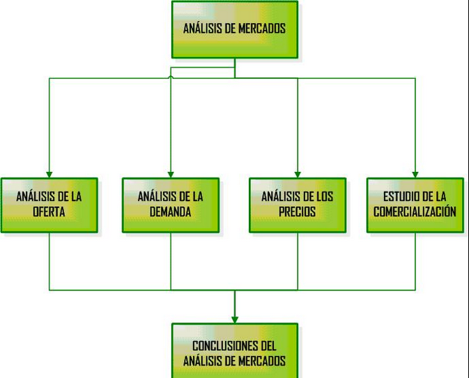
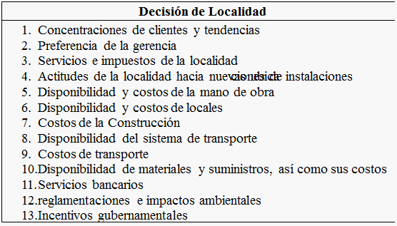

# 1. Unidad2_Estudio de mercado

| **ESTUDIO DEL MERCADO** |
|-------------------------|

> **Descripción de la imagen** — La imagen es una diapositiva o página de título/sección con un diseño minimalista y colores predominantes amarillo y blanco.
>
> En el lado izquierdo, hay un recuadro amarillo con bordes redondeados que contiene el número "02" en grande y debajo la palabra "UNIDAD".
>
> En la parte inferior central, se extiende una barra horizontal ancha de color amarillo sólido.
>
> El fondo de la página es de color blanco o gris muy claro y presenta un patrón sutil y repetitivo de formas circulares abstractas en tonos grises claros.
>
> En la parte inferior, hay un pie de página que incluye el logotipo de "educación a distancia - Virtual" con un pequeño gráfico asociado.

> **Docente:**
>
> JOSÉ ALFREDO JIMÉNEZ LONDOÑO
>
> **Asignatura:**
>
> FORMULACIÓN Y EVALUACIÓN DE PROYECTOS\_ AÑO 2026
>
> **Institución Universitaria ESCOLME**

> **Descripción de la imagen** — La imagen es una página en blanco con elementos de formato. En la parte superior se observa una línea horizontal delgada de color amarillo o naranja. En la parte inferior izquierda, aparece el número "02" en un color amarillo pálido o beige. Hay una línea horizontal más gruesa de color negro que separa visualmente el contenido superior del área inferior donde se encuentra el número.

<table>
<colgroup>
<col style="width: 100%" />
</colgroup>
<thead>
<tr>
<th>
<strong>1. ESTUDIO DE MERCADOS</strong>

<strong>1.1 Conceptos Fundamentales para la formulación y Evaluación de proyectos</strong>

De acuerdo a lo consultado en la web (anónimo, 2013) El estudio de mercado es una de las fases más importantes en la formulación de proyectos ya que en esta se tienen unos conceptos importantes que identificados de una manera adecuada contribuyen a determinar la viabilidad del proyecto.

El mercado es el ambiente social (o virtual) que propicia las condiciones para el intercambio. En otras palabras, debe interpretarse como la institución u organización social a través de la cual los ofertantes (productores, vendedores) y demandantes (consumidores o compradores) de un determinado tipo de bien o de servicio, entran en estrecha relación comercial a fin de realizar abundantes transacciones comerciales.

<strong>1.1.1 Estructura del estudio de mercado</strong>

Para un Director de proyectos es muy importante tener en cuenta que la investigación de mercados internacionales más extensa y costosa que la que se pueda realizar para el mercado nacional. En primer lugar la empresa deberá contar con un sistema de información que identifique y estime el potencial de compra de un cierto número de mercados nacionales y extranjeros, muy dispares entre si.

Además habrá que considerar variables del entorno político, la normativa legal o las costumbres del país, que para el mercado interior son ya conocidas. Por último, la distancia física, cultural e idiomática eleva el coste de obtención de información.

<strong><u>Estructura básica de un estudio de mercados</u></strong>

> **Descripción de la imagen** — Se trata de un diagrama de flujo o mapa conceptual que ilustra la estructura del Análisis de Mercados.
>
> El diagrama se organiza en tres niveles principales:
>
> 1.  **Nivel Central:** En el centro superior se encuentra el concepto principal: **ANÁLISIS DE MERCADOS**.
> 2.  **Nivel Intermedio (Componentes):** Cuatro cajas rectangulares se ramifican desde el concepto central, representando los componentes clave del análisis:
>     *   ANÁLISIS DE LA OFERTA
>     *   ANÁLISIS DE LA DEMANDA
>     *   ANÁLISIS DE LOS PRECIOS
>     *   ESTUDIO DE LA COMERCIALIZACIÓN
> 3.  **Nivel Final (Conclusión):** Una flecha descendente conecta las cuatro cajas intermedias, llevando a una caja final en la parte inferior que resume el proceso: **CONCLUSIONES DEL ANÁLISIS DE MERCADOS**.
>
> En resumen, el diagrama muestra que el Análisis de Mercados se compone de la evaluación simultánea de la Oferta, la Demanda, los Precios y la Comercialización, las cuales convergen para generar las Conclusiones del Análisis de Mercados.

<strong>Figura 1. Estructura básica del estudio de mercados</strong>

<strong>Fuente:</strong> Tomado de <strong><a href="https://prezi.com/2df2puybeai7/estructura-del-estudio-de-mercado-y-tecnico-de-un%20proyecto/">https://prezi.com/2df2puybeai7/estructura-del-estudio-de-mercado-y-tecnico-de-un proyecto/</a></strong>

<strong>1.1.2 Elementos de un estudio de mercado</strong>

Como lo expresa <a href="http://www.mujeresdeempresa.com/author/schauvin/">Silvia Chauvin</a> (Chauvin, 2015) El qué analizar en los mercados exteriores tiene en común con la investigación nacional el estudio de las variables que afectan a los cuatro componentes del marketing mix (producto, precio, distribución y promoción) y, además: la demanda (consumidores/ usuarios), la oferta (competencia interior y promoción), la forma de presencia en el mercado y la estrategia comercial que permita alcanzar los objetivos previstos.

De una manera genérica, que es válida para bienes de consumo, industriales y servicios, pueden distinguirse los siguientes elementos que configuran un estudio de mercado para productos nacionales y de exportación:

<strong>La demanda</strong>: Tiene que hacerse un análisis detallado, cuantitativo y cualitativo, de la demanda potencial real del mercado. Entre los aspectos cuantitativos deberán figurar:

Demanda o consumo aparente por subsectores.

Demanda o consumo aparente por regiones, áreas geográficas o principales núcleos urbanos.

Demanda por habitante y año, y porcentaje del gasto familiar para el producto concreto (si se trata de productos de consumo) en comparación con países representativos del entorno de la empresa.

<strong>Tipología de consumidores o usuarios</strong>.

Tipología del comprador: motivaciones de compra; hábitos y ritmos de consumo, preferencias en calidad o precio.

Comportamiento del consumidor ante las distintas opciones de producto que se le ofrecen.

Segmentación del mercado. Segmentos objetivo.

Identificación del comprador con el país de origen del producto.

Importancia del made in en la venta del producto.

<strong>La oferta:</strong> En un mercado competitivo como el actual será necesario conocer en profundidad a la competencia, ya que sólo así podrán descubrirse segmentos o nichos de mercado en donde situar el producto. Deberán analizarse, básicamente, los siguientes puntos:

<ul>
<li>
Estructura, situación y perspectivas de la industria local
</li>
<li>
Principales fabricantes nacionales: número valor de la producción y localización geográfica.
</li>
<li>
Volumen, origen y cuota de mercado que representan las importaciones.
</li>
<li>
Principales fabricantes extranjeros: empresas y marcas presentes en el mercado, formas de implantación, características comunes de los productos que se ofrecen.
</li>
<li>
Posicionamiento de la competencia.
</li>
<li>
Segmentos de mercado cubiertos por los competidores nacionales y extranjeros.
</li>
</ul>
<ul>
<li>
Ranking de cuotas de mercado y zonas geográficas dominadas por cada competidor
</li>
</ul>

<strong>Precios y márgenes comerciales</strong>.

Interesa conocer todo el proceso de formación de precios desde que el producto sale de fábrica en el país de origen hasta llegar a conocer el precio final para ser competitivo en el mercado destino. Habría que cuantificar.

El coste de transporte, almacenamiento y distribución.

Márgenes comerciales según distintas posiciones en los canales de distribución.

Precios de la competencia.

Con respecto a los precios también es muy importante tener claros los siguientes conceptos:

El análisis de las series históricas y de los mecanismos de formación de los precios del bien o servicio a ser producido por el proyecto, nos permite estimar el precio probable y en función de ello, tener una idea preliminar del volumen de recursos que el proyecto podría generar en concepto de ingresos.

  
Análisis de las series históricas de precios

Estructura de los mecanismos de formación de precios. 

Posibilidad del proyecto de influir en la formación de los precios.

  
Mecanismos externos de formación de precios: precios fijados por el sector público

Precios del mercado internacional; precios diferenciados regionalmente.

Mecanismos internos de formación de precios, en función del costo de producción o del libre juego de la oferta y la demanda.

<strong>Canales de comercialización</strong>

Conjuntamente con el análisis dedicado a la demanda, los canales de comercialización constituyen el apartado más importante de los estudios de mercado. Una vez detectada la oportunidad de mercado hay que analizar cómo puede venderse el producto. Un análisis detallado de los canales de comercialización será costoso, especialmente a la hora de obtener información fidedigna sobre los distintos agentes que intervienen en el mercado. La organización del sistema de distribución del país y las distintas categorías de intermediarios.

Descripción de cada categoría según la gama de productos ofrecidos, así como porcentaje de los importados. Nivel de especialización. Desarrollo de técnicas de gestión y de venta. Métodos comerciales propios de cada intermediario.

<ul>
<li>
Principales importadores y distribuidores regionales. Exigencias y prácticas en materia de exclusividad
</li>
<li>
Para bienes de equipo y proyectos industriales que tengan una demanda institucional habrá que estudiar el sistema de compra por parte de la Administración (licitaciones, concursos, niveles de negociación y decisión, existencia de planes de compra y calendario de convocatorias).
</li>
<li>
Principales sistemas de promoción y comunicación con el mercado (catálogos, publicidad, participación en ferias) y su coste.
</li>
<li>
Presentación del producto: embalaje, material y tamaño del envase. Importancia de la presentación a la hora de vender el producto.
</li>
</ul>

<strong>Pautas para elaborar un estudio de mercado.</strong>

En caso de que vayamos a utilizar proveedores externos debemos tener siempre presente que la obtención de datos a través de investigación está sujeto a seguir un diseño previamente definido: desde la fijación de los objetivos a la selección de las técnicas de análisis, pasando por la obtención de datos.

<strong>1.1.3 Análisis del producto o servicio</strong>

<h2 id="qué-es-un-producto-desde-el-punto-de-vista-de-la-empresa-el-producto-es-aquello-que-comprará-nuestro-cliente.-sabemos-que-un-cliente-compra-si-tiene-una-necesidad-no-cubierta-o-un-deseo-por-satisfacer-y-sabe-o-cree-que-pagando-una-cantidad-de-dinero-por-un-producto-o-servicio-resolverá-su-problema.">¿Qué es un Producto? Desde el punto de vista de la empresa el producto es aquello que comprará nuestro cliente. Sabemos que un cliente compra si tiene una necesidad no cubierta, o un deseo por satisfacer, y sabe, o cree, que pagando una cantidad de dinero por un producto o servicio resolverá su problema. </h2>

Aunque esta definición pueda parecer obvia, son muchas las empresas que lo ignoran y siguen empeñadas en vender lo que sale de fábrica a sus clientes, en lugar de fabricar lo que sus clientes quieren comprar. Para el emprendedor, el producto o servicio es el medio por el cual va a conseguir la satisfacción del cliente, con el consiguiente intercambio económico -dinero por producto-.

Hay que analizar con detalle como satisface el producto una necesidad del mercado. A este proceso se le conoce como desarrollo del concepto del producto. El producto debe tener una serie de características o atributos que lo identifiquen y, preferiblemente, los diferencien de los demás productos que compiten por satisfacer la misma necesidad.

<h3 id="el-concepto-de-producto-debe-definir">El concepto de producto debe definir: </h3>
<ul>
<li>
<strong>El público objetivo</strong>: a qué segmento del mercado va dirigido: hombres, mujeres, pequeñas empresas, etc.
</li>
<li>
<strong>Beneficios que aporta</strong>: qué necesidad de este público satisface.
</li>
<li>
<strong>Tipo de producto</strong>: clasificar el producto: un cosmético o un producto farmacéutico; servicio imprescindible o accesorio, etc.
</li>
<li>
<strong>Nivel de precio</strong>: si será un producto de bajo coste o de precio elevado, por encima de la media del sector o en la media, etc.
</li>
<li>
<strong>Forma de utilización o consumo</strong>: cuando se usará, en que ocasiones, por quien, donde.
</li>
<li>
<strong>Integración en la gama de productos</strong>: ¿es el producto coherente con el resto de productos de la empresa?, ¿es nuestro producto de consumo?, ¿es de alta calidad?, etc.
</li>
</ul>
<blockquote>

<strong>Ejemplo:</strong>

</blockquote>

Empieza a resultar evidente que es muy distinto "hacer las mejores pizzas de la ciudad" que vender pizzas sabiendo, por ejemplo:

<blockquote>

<strong>el público objetivo:</strong> jóvenes, de cierto poder adquisitivo y que les gusta comer bien

<strong>los beneficios:</strong> no hay que cocinar, puede invitar a los amigos a casa a cenar, resuelve una comida rápidamente

<strong>el tipo de producto:</strong> comida informal pero apetitosa y que es sana si no se abusa y con ingredientes de calidad

<strong>el nivel de precio:</strong> moderado aunque hay que pagar un poco más por no cocinar

<strong>el uso:</strong> normalmente varias personas reunidas para pasar un rato agradable.

<strong>Gama de productos:</strong> es el producto principal que se reforzará con acompañamientos y bebidas de marca.

</blockquote>
<h2 id="qué-es-un-servicio.-existen-muchas-clases-de-productos-que-los-expertos-se-han-entretenido-en-clasificar.-así-tenemos-productos-de-consumo-o-industriales-productos-básicos-o-de-conveniencia-productos-duraderos-o-perecederos-etc.">¿Qué es un Servicio. Existen muchas clases de productos que los expertos se han entretenido en clasificar. Así tenemos productos de consumo o industriales, productos básicos o de conveniencia, productos duraderos o perecederos, etc. </h2>

A los efectos prácticos debemos considerar los servicios como productos intangibles, pero productos al fin y al cabo. Por tanto, sobre los servicios se aplican todas las ideas que sirven para los productos. Es cierto, sin embargo, que los servicios tienen características propias que los diferencian, y mucho, de los productos tangibles, los que influirán en la forma de comercializar el servicio.

En resumen, el producto o servicio va a ser el vehículo para vender a los clientes. Por tanto es importante estudiar con detalle sus características pero sin olvidarse del objetivo perseguido que es satisfacer una necesidad del mercado. Como no tenemos, en principio, control sobre las necesidades del mercado solo nos queda diseñar o adaptar el producto de la mejor manera posible.

<strong>1.2 CONCEPTOS CLAVES Y FUNDAMENTALES QUE DEBEN APLICARSE EN LA FASE DE MERCADEO</strong>

De acuerdo a lo consultado en gerencie.com ( Ortiz Varga, 2008) En la gestión y administración de proyectos y en especial en los proyectos de emprendimiento y creación de empresas es muy importante conocer y controlar el comportamiento de las ventas, pero se debe tener en cuenta que las ventas dependen de muchas variables y entre ellas están los costos fijos y los costos variables ya que del conocimiento y manejo de estos depende en gran parte el precio de venta que determine la empresa. Existen herramientas prácticas y útiles que facilitan el seguimiento y control de las variables mencionadas y entre ellas está <em><strong>el punto de equilibrio</strong></em>.

<em><strong>¿Para Qué Calcular el Punto de Equilibrio?</strong></em>

El punto de equilibrio es una referencia importante, que influye en la planificación y el desarrollo de las actividades de la empresa. Al entender claramente el nivel de ventas que se necesitan para cubrir todos los costos, se sabe cuántas unidades hay que producir, en el caso de una empresa que fabrica o compra productos para la venta. En una empresa de servicios, el punto de equilibrio indica la cantidad de horas cobrables que hay que trabajar para cubrir los costos.

<em><strong>El Cálculo</strong></em>

<em><strong>En el punto de equilibrio los ingresos = costos fijos + costos variables</strong></em>.

Por lo tanto, para calcular el punto de equilibrio, es necesario determinar todos los costos fijos y variables involucrados en la operación:

Los costos fijos son aquellos que son invariables, con cualquier nivel de ventas.

Los costos variables se incurren en forma proporcional al nivel de ventas.

<strong>Costos Fijos</strong>

Algunos ejemplos de los costos fijos incluyen:

Arriendo de la oficina, taller, bodega, fábrica u otras instalaciones, Sueldos base del personal contratado, Planes de beneficios para el personal, Planes de mantenimiento contratado, Servicios contratados de aseo y seguridad, Publicidad contratada, Seguros.

Los cargos base para los servicios públicos, como la energía eléctrica, gas, agua y alcantarillado.

El cargo básico para el servicio de teléfono o el plan básico para un celular, Costo de la conexión a Internet, Costo sobre los bienes inmuebles y muebles, Licencias y permisos, Depreciación y amortización y Gastos financieros, como los intereses sobre la deuda.

<strong>Costos Variables</strong>

Ejemplos de costos variables incluyen:

Materias primas e insumos, Flete, Arriendo de maquinaria, equipos y herramientas para trabajos específicos, Combustible, Horas extras del personal, Mano de obra contratado en forma temporal, Reparaciones y mantenimiento, Útiles de oficina, Llamadas telefónicas, Gastos de viajes y Comisiones de ventas.

Cabe notar que algunos costos pueden ser parte fijos y parte variables. Por ejemplo, puede haber un costo fijo de energía eléctrica para mantener iluminadas las instalaciones y para que funcionen todos los equipos según un nivel mínimo de actividad. Pero para fabricar los productos, se consume más energía y este exceso constituye un costo variable que depende del nivel de producción.

Otra consideración en el cálculo del punto de equilibrio, en el caso de empresas que fabrican sus productos o compran la mercancía que vende, es que los costos variables corresponden a las unidades vendidas y no las unidades que están en inventario.

<em><strong>La Formula</strong></em>

El punto de equilibrio se puede calcular en términos de ingresos y en unidades físicas.

Es recomendable calcularlo en términos de ingresos totales cuando la actividad no es fácilmente reconocible en unidades físicas, o cuando hay varios productos. Pero incluso cuando hay varios productos, en la medida que se puede separar los costos fijos y variables e imputarlos a los distintos productos, se puede calcular el punto de equilibrio por producto y así contar con una herramienta de gestión más dinámica.

<strong>Punto de Equilibro en Base de Costos Totales</strong>

Una vez determinados los totales de los costos fijos y los costos variables, se puede calcular el punto de equilibrio en base de los costos y ventas reales de la siguiente manera:

<em><strong>Ventas en el punto de equilibrio = <u>Costos fijos____________</u></strong></em>

<em><strong>1 - (Costos variables / Ventas reales)</strong></em>

<strong>Punto de Equilibrio en Base del Porcentaje de Margen</strong>

El margen bruto es el exceso de los ingresos respecto a los costos variables:

<em><strong>Margen bruto = <u>Total de ventas – total de costos variables</u> x 100</strong></em>

<em><strong>Total de ventas</strong></em>

<em><strong>%Margen bruto = <u>Precio de venta – costos variable</u> x 100</strong></em>

<em><strong>Precio de venta</strong></em>

Entonces, otra forma de aplicar la fórmula para calcular el punto de equilibrio es en base del porcentaje del margen bruto:

<em><strong>Ventas en el punto de equilibrio = <u>Costos fijos totales</u></strong></em>

<em><strong>% de margen bruto</strong></em>

<strong>Punto de Equilibrio en Número de Unidades</strong>

Para determinar el número de unidades que tiene que vender para llegar al punto de equilibrio, se usa la siguiente formula:

<strong><u>No. de unids. en punto de equilibrio</u> = <u>Costos fijos totales_________ </u></strong>

<strong>(Precio de venta por unid.– Costo variable por unid.)</strong>

<em><strong><u>Ejemplo 1</u></strong></em>

Para un nuevo proyecto de idea de negocio se tiene la siguiente información:

Se esperan ingresos por ventas reales de $14.000.000; Sus costos fijos mensuales de $5.000.000 y sus costos variables mensuales de $7.000.000.

El punto de equilibrio calculado en base de los totales de ventas y costos:

<strong>Ventas en el punto de equilibrio</strong> <u>= 5.000.000______</u>

1 - (7.000.000/14.000.000) =

<strong>Ventas en el punto de equilibrio =</strong> 5.000.000 / 0,5 = <strong>$10.000.000</strong>

La empresa tiene que cubrir $5.000.000 en costos fijos todos los meses y la proporción entre los costos variables y las ventas es 50% ($7.000.000 / $14.000.000), así cuando tiene ventas de $10.000.000 al mes, puede cubrir los costos fijos de $5.000.000 más los costos variables de $5.000.000 (50% de $10.000.000).

<strong>El margen bruto es = <u>(14.000.000 – 7.000.000)</u> x 100 = 50%</strong>

<strong>14.000.000</strong>

Si la empresa vende sus productos en $20.000 cada uno, su margen bruto por unidad es $10.000. La empresa tendría que vender 250 unidades por mes para cubrir sus costos fijos ($20.000 X 250 = $5.000.000), pero esto no cubre los costos variables.

Al aplicar la fórmula para calcular el punto de equilibrio en base del porcentaje de margen bruto, tenemos lo siguiente:

<strong>Punto de equilibrio = $5.000.000 / 0,50 = $10.000.000</strong>

El resultado es el mismo; la empresa tiene que vender $10.000.000 para llegar al punto de equilibrio.

Ahora, para determinar cuántas unidades tiene que vender, podría simplemente dividir las ventas que se requieren para llegar al punto de equilibrio ($10.000.000) por el precio de venta por unidad ($20.000 en este ejemplo) para llegar a 500 unidades por mes.

<strong>Punto de equilibrio (unidades)</strong> = <u>$5.000.000_____</u>

$20.000 - $10.000

<strong>Punto de equilibrio (unidades)</strong> = <u>$5.000.000___ =</u> <strong>500 unidades</strong>

$10.000

<strong><u>Que pasa Cuando Cambia el Porcentaje del Margen Bruto?</u></strong>

De lo anterior, se puede concluir que con una reducción del % de margen, causado por una rebaja del precio o un aumento de los costos variables, tendría que vender más para llegar al punto de equilibrio. Por ejemplo, si el margen se reduce a 40%:

<strong>Punto de equilibrio = $5.000.000 / 0,40 = $12.500.000</strong>

Si la reducción del margen fue debido a mayores costos variables; es decir, el precio se mantiene en $20.000 por unidad y los costos variables suben de $10.000 a $12.000, tendría que vender 625 unidades ($12.500.000 / $20.000) para llegar al punto de equilibrio, en vez de los 500 en el ejemplo anterior.

Si la reducción del margen fue debido a una reducción del precio de venta, de $20.000 a $16.670, y el costo variable se mantiene igual en $10.000 por unidad, tendría que vender aproximadamente 750 unidades ($12.500.000 / $16.670) para llegar al punto de equilibrio.

Si la reducción del margen se debe en parte a un incremento en los costos variables de $10.000 por unidad a $11.000 y en parte a una reducción del precio de $20.000 por unidad a $18.330, tendría que vender 682 unidades ($12.500.000 / 18.330) para llegar al punto de equilibrio.

Por lo anterior, se puede concluir:

1. que un margen bruto menor requiere que se vende más para llegar al punto de equilibrio.

2. La cantidad de unidades adicionales que tiene que vender para llegar al punto de equilibrio es mayor cuando la reducción en el margen se debe a una reducción del precio, con los costos variables iguales.

Hay varios factores que afectan la decisión de rebajar los precios, como las siguientes:

Las condiciones generales en el mercado, 
La posición de la empresa en el mercado, 
Lo que están haciendo los competidores y 
La estrategia comercial de la empresa, por ejemplo, si quiere competir en base del precio.

Pero al tener claro el punto de equilibrio y lo que significa en términos de la cantidad de unidades que tiene que vender para ser rentable, se puede tomar decisiones más informadas en cuanto a la determinación de los precios.

<em><strong>Ejemplo 2 (para practicar)</strong></em>

Para un nuevo proyecto de idea de negocio se tiene la siguiente información:

Se esperan ingresos por ventas reales de $70.000.000; Sus costos fijos mensuales de $25.000.000 y sus costos variables mensuales de $42.000.000.

Precio de venta del producto: La empresa establece un precio de venta de $50.000 por unidad y costo variable por unidad de $30.000.

<strong>2. FASE – ESTUDIO TÉCNICO - Localización óptima del proyecto</strong>

De acuerdo a lo que expresa Córdoba Padilla (Cordoba Padilla, 2015) La localización del proyecto Incide sobre el nivel de las inversiones y costos que se calculen y, por tanto, sobre la estimación de la rentabilidad que podría generar su implementación. La decisión que se tome al respecto determinará el nivel de operación que posteriormente explicará la estimación de los ingresos por venta.

Se define a la escala o nivel de producción que puede alcanzar, es decir, la capacidad de producción a la que se ha decidido operarlo durante un periodo de tiempo.

Dependerá de las dimensiones de sus instalaciones y la capacidad máxima de producción, teniendo en cuenta los aspectos económicos y técnicos. Por ejemplo:

<ul>
<li>
El tamaño de un proyecto industrial se mide por el número de unids/año.
</li>
<li>
En un proyecto de educación será la cantidad de alumnos admitidos en cada año escolar.
</li>
<li>
En proyectos agrícolas será productos obtenidos en cada cíclo agrícola.
</li>
<li>
En un proyecto hotelero será número de habitaciones construidas o instaladas.
</li>
<li>
En proyectos mineros será las toneladas métricas tratadas en un periodo determinado.
</li>
</ul>

El estudio del tamaño comprende los diversos aspectos referentes al funcionamiento y operatividad del propio proyecto, lo cual lleva implícito el análisis del:

<ul>
<li>
Tamaño óptimo
</li>
<li>
La localización
</li>
<li>
El proceso productivo
</li>
<li>
El programa de producción
</li>
<li>
Insumos requeridos, disponibilidad y costos
</li>
<li>
Características de los equipos e instalaciones físicas
</li>
</ul>

Después de definida la unidad de medida del tamaño del proyecto, se establece la cantidad de producción o de prestación de servicio por unidad de tiempo. Ejem: En una fábrica de camisas sería el número de camisas producidas en 1 mes ó 1 año; en un hotel sería el número de camas disponibles. El tamaño del proyecto también se puede medir por:

<ul>
<li>
El monto de la inversión aplicada
</li>
<li>
El número de empleos generados
</li>
<li>
El área física ocupada
</li>
<li>
Participación en el mercado
</li>
<li>
Niveles de ventas alcanzados
</li>
<li>
Generación de valor agregado para la región
</li>
</ul>

En proyecto de inversión se presentan tres tipos de capacidad:

<ol type="1">
<li>
<strong>Capacidad Diseñada</strong>: Es el nivel máximo posible de producción o de prestación de servicio.
</li>
<li>
<strong>Capacidad Instalada</strong>: Nivel máximo de producción o prestación de servicios que los trabajadores con la maquinaria, equipos e infraestructura disponible pueden generar permanentemente.
</li>
<li>
<strong>Capacidad Real</strong>: % de la capacidad instalada que en promedio se está utilizando, teniendo en cuenta las contingencias de producción y ventas, durante un tiempo determinado.
</li>
</ol>

Ejemplo: La capacidad diseñada puede ser la de fabricación de 500 docenas de camisas semanales o de 200 camas; la capacidad instalada de 480 camisas semanales o 180 camas y la capacidad real de 408 camisas semanales (85% de la capacidad instalada) o de 178 camas (89% de la capacidad instalada).

<strong>2.1 FACTORES QUE DETERMINAN EL TAMAÑO DE UN PROYECTO</strong>

Según lo consultado en aula fácil (Anónimo, 2013)En un proyecto los factores Indican las razones por las cuales el proyecto NO ofrece un mayor número de productos o servicios. Entre los principales factores están:

<ul>
<li>
Tamaño del Mercado
</li>
<li>
Capacidad financiera
</li>
<li>
Disponibilidad de insumos, materiales y recursos humanos
</li>
<li>
Problemas de transporte
</li>
<li>
Problemas institucionales
</li>
<li>
Capacidad administrativa
</li>
<li>
Proceso tecnológico
</li>
<li>
Problemas legales
</li>
</ul>

La determinación del tamaño responde a un análisis interrelacionando una gran cantidad de variables de un proyecto: demanda, disponibilidad de insumos, localización y plan estratégico comercial de desarrollo futuro de la empresa que se crearía con el proyecto.

La cantidad demandada proyectada a futuro es el factor condicionante más importante del tamaño; aunque no necesariamente deberá definirse en función de un crecimiento esperado del mercado, ya que el nivel óptimo de operación no siempre será el que maximice las ventas.

<em><strong>El análisis de la cantidad demandada proyectada</strong></em> conducirá a seleccionar distintos tamaños, dependiendo de la decisión respecto a definir una ó varias fábricas, de tamaño igual o diferente, en distintos lugares y con un número de turnos que pudiera variar entre ellos.

<em><strong>La disponibilidad de insumos</strong></em>, tanto humanos como materiales y financieros es otro factor que condiciona el tamaño de un proyecto. Los insumos podrían no estar disponibles en la cantidad y calidad deseada, limitando la capacidad de uso del proyecto o aumentando los costos del abastecimiento. Entonces, será necesario investigar las reservas de recursos renovables y no renovables, la existencia de sustitutos e incluso la posibilidad de cambios en los precios reales de los insumos a futuro. La disponibilidad de insumos se interrelacionan a su vez con otro factor determinante del tamaño: la localización del proyecto. Mientras más lejos esté de las fuentes de insumo, más alto será el costo de su abastecimiento.

De allí la necesidad de evaluar la opción de una gran planta para atender un área extendida de la población ó varias plantas para atender cada una de las demandas locales menores. Mientras mayor sea el área de cobertura de una planta, mayor será el tamaño del proyecto y su costo de transporte, aunque probablemente pueda acceder a ahorros por economías de escala por la posibilidad de obtener mejores precios al comprar mayor cantidad de materia prima, por la distribución de gastos de administración, de ventas y de producción, entre más unids. Producidas.

<em><strong>Tamaño y materias primas.</strong></em> Se refiere a la provisión de materias primas o insumos suficientes en cantidad y calidad para cubrir las necesidades del proyecto durante los años de vida del mismo. La fluidez de la materia prima, su calidad y cantidad son vitales para el desarrollo del proyecto. Levantar un listado de todos los proveedores así como las cotizaciones de los productos requeridos para el proceso productivo.

Si el mercado interno no tiene capacidad para atender los requerimientos del proyecto, se debe acudir al mercado externo, siempre que el precio de la MP o insumo esté en relación con el nivel esperado del costo de producción.

Se debe dar respuestas a las interrogantes:

<ul>
<li>
A qué distancia se encuentra el mercado proveedor de MP o insumos requeridos por el proyecto?
</li>
<li>
Cuáles son las características de ese mercado proveedor?
</li>
<li>
Se producen en el país? ó de qué país se importará y a qué precio?
</li>
<li>
Existen diferencias entre calidad y precio de MP nacionales e importadas?
</li>
<li>
El aprovisionamiento de la MP está asegurada para cubrir los años de la vida del proyecto?
</li>
</ul>

<em><strong>Tamaño y financiamiento.</strong></em> Si los recursos financieros son insuficientes para cubrir las necesidades de inversión, el proyecto no se ejecuta, por tal razón, el tamaño del proyecto debe ser aquel que pueda financiarse fácilmente y que en lo posible presente menores costos financieros. La disponibilidad de recursos financieros que el proyecto requiere para inversiones fijas, diferidas y/o capital de trabajo, es un condicionante que determina la cantidad a producir. Se resuelve definiendo:

<ul>
<li>
Desarrollo del proyecto por etapas …
</li>
<li>
Factibilidad de expansiones modulares …
</li>
<li>
Intereses = costos administrativos
</li>
</ul>

<em><strong>Tamaño y tecnología.</strong></em> El tamaño también está en función del mercado de maquinarias y equipos, porque el número de unids. que pretende producir el proyecto depende de la disponibilidad y existencias de activos de capital. En muchos casos el tamaño se define por la capacidad estándar de los equipos y maquinarias existentes.

<em><strong>Tamaño propuesto.</strong></em> Analizando los puntos anteriores, se determina el tamaño del proyecto considerando:

<ul>
<li>
El volumen de producción (año, mes, día, hr), el cual está dentro de los márgenes de la demanda insatisfecha del mercado.
</li>
<li>
Aspectos relacionados con el abastecimiento de MP, insumos, materiales, equipos, personal suficiente, etc.
</li>
</ul>

<em><strong>Localización del proyecto.</strong></em> Es el análisis de las variables (factores) que determinan el lugar donde el proyecto logra la máxima utilidad o el mínimo costo. Las alternativas de instalación de la planta deben compararse en función de las fuerzas ocasionales típicas de los proyectos. Los siguientes factores:

<ul>
<li>
Medios y costos de transporte
</li>
<li>
Disponibilidad y costo de mano de obra
</li>
<li>
Cercanías de las fuentes de abastecimiento
</li>
<li>
Factores ambientales
</li>
<li>
Cercanía del mercado
</li>
<li>
Costo y disponibilidad de terrenos
</li>
<li>
Topografía de suelos
</li>
<li>
Estructura impositiva y legal
</li>
<li>
Disponibilidad de agua, energía y otros suministros
</li>
<li>
Comunicaciones
</li>
<li>
Manejo de desechos
</li>
</ul>

La decisiones sobre la localización son importantes y es necesario realizar largos y costosos estudios que generalmente concluyen que no hay una ubicación óptima evidente. Hoy en día con la globalización de los negocios hay que decidir dónde es más conveniente la nueva instalación y tomar en cuenta los factores que afectan las decisiones de ubicación, ya sea de tipo nacional, regional, local y sitio.

<blockquote>

> **Descripción de la imagen** — La imagen es una lista estructurada bajo el título principal "Decisión de Localidad". La lista contiene trece puntos numerados que detallan diferentes factores o costos relacionados con la decisión de localidad:
>
> 1. Concentraciones de clientes y tendencias
> 2. Preferencia de gerencia
> 3. Servicios e impuestos de la localidad
> 4. Actitudes de la localidad hacia nuevas instalaciones
> 5. Disponibilidad y costos de mano de obra
> 6. Disponibilidad y costos de obras
> 7. Costos de la construcción
> 8. Disponibilidad del sistema de transporte
> 9. Costos de transporte
> 10. Disponibilidad de materiales y suministros, así como sus costos
> 11. Servicios bancarios
> 12. Reglamentaciones e impactos ambientales
> 13. Incentivos gubernamentales

</blockquote>

<strong>Procedimiento del análisis de localización</strong>

Al hacer el análisis de localización se debe tener en cuenta el siguiente proceso:

<ul>
<li>
Análisis preliminar: Estudiar las estrategias empresariales y políticas de las diversas áreas (operaciones, marketing, etc.) para traducirlas en requerimientos en la localización de las instalaciones. Cada empresa debe determinar cuáles son los criterios importantes en la evaluación de alternativas: necesidades de transporte, suelo, suministros, personal, infraestructuras, servicios, condiciones medioambientales, etc.
</li>
<li>
Estudio de disponibilidad de MP: características de las MP y distribución geográfica.
</li>
<li>
Estudio de Mercado: características de los productos y distribución geográfica.
</li>
<li>
Tarifas de transporte
</li>
<li>
Posibles puntos de localización
</li>
<li>
Distancia de transporte
</li>
</ul>
<blockquote>

Determinación del tamaño de la planta: volumen de MP, volumen del producto, determinación de costos de transporte.

</blockquote>
<ul>
<li>
Preselección de puntos alternativos de localización: Se establece un conjunto de localizaciones candidatas para un análisis más profundo, rechazándose aquellas que no satisfagan los factores dominantes de la empresa: Revisión de otros factores de localización, disposiciones legales vigentes, y disponibilidad y costos de otros insumos.
</li>
<li>
Otros criterios de selección: Estímulos fiscales, leyes, reglamentos, condiciones de vida, clima, facilidades administrativas, factores externos, preferencias personales y ventajas sociales.
</li>
<li>
Evaluación de alternativas: Análisis detallado, es una medida cuantitativa si es un factor tangible o una emisión de juicio si el factor es cualitativo.
</li>
<li>
Selección de alternativas a través de análisis cuantitativos y/o cualitativos se comparan entre sí las diferentes alternativas.
</li>
</ul>

<em><strong>2.2 MÉTODOS DE EVALUACIÓN.</strong></em> En la evaluación de la localización se utilizan diferentes métodos y entre ellos están:

<blockquote>

<strong>2.2.1 Método cualitativo por puntos</strong>. Consiste en definir los principales factores determinantes de una localización, para asignarles valores ponderados de peso relativo, de acuerdo con la importancia que les atribuye. El peso relativo, sobre la base de una suma igual a 1, depende fuertemente del criterio y experiencia del evaluador.

</blockquote>

Al comparar 2 o más localizaciones opcionales, se procede a asignar una calificación a cada factor en una localización de acuerdo con una escala predeterminada (ejemplo de 1 a 10). La suma de las calificaciones ponderadas permitirá seleccionar la localización que acumule el MAYOR PUNTAJE.

<blockquote>

</blockquote>

<strong>Interpretación.</strong> La zona A y la zona B presentan mejor calificación, se observa que ambas tienen una buena calificación en la disponibilidad de m. prima; la zona A presenta mejor calificación para cercanía a los clientes; pero la zona B presenta mejor calificación para la distribución logística y la disponibilidad de materia prima; en conclusión la opción mejor evaluada para la localización del proyecto es la zona B.

<ol type="1">
<li>
<em><strong>Método de los factores ponderados.</strong></em> Es el método más general, ya que permite incorporar en el análisis toda clase de consideraciones, sean éstas de carácter cuantitativo o cualitativo.
</li>
</ol>

Procedimiento:

<ol type="1">
<li>
Se identifican los valores más relevantes a tener en cuenta en la decisión
</li>
<li>
Se establece la ponderación entre ellos en función de su importancia relativa
</li>
<li>
Se puntúa cada alternativa para cada uno de los criterios a partir de una escala previamente determinada.
</li>
<li>
Se obtiene una calificación global, teniendo en cuenta la puntuación de la misma en cada factor y el peso relativo del mismo.
</li>
</ol>
<blockquote>

Ejemplo

</blockquote>

<strong>Interpretación.</strong> Las alternativas B y C parecen mejores que A. Luego entre B y C hay una pequeña diferencia entre ellas. Se ve que C tiene la ventaja principal de estar muy próxima a la fuente de abastecimiento de MP, lo cual es un factor importante, mientras que su punto débil es el costo de instalación, que es bastante elevado.

<h1 id="bibliografía">Bibliografía</h1>

Ortiz Varga, G. (07 de 09 de 2008). <em>Gerencie.com</em>. Recuperado el 15 de 03 de 2016, de Gerencie.com: http://www.gerencie.com/punto-de-equilibrio.html

Anónimo. (04 de 11 de 2013). <em>http://infoautonomos.eleconomista.es/</em>. Recuperado el 15 de 04 de 2016, de http://infoautonomos.eleconomista.es/: http://infoautonomos.eleconomista.es/estudio-de-mercado/breve-guia-para-estudio-de-mercado/

Anónimo. (15 de 08 de 2013). <em>http://www.aulafacil.com/</em>. Recuperado el 25 de 03 de 2016, de http://www.aulafacil.com/: http://www.aulafacil.com/cursos/l19691/empresa/organizacion/gestion-de-proyectos/el-tamano-del-proyecto

Chauvin, S. (15 de 10 de 2015). <em>mujeresdeempresa.com</em>. Recuperado el 20 de 03 de 2016, de mujeresdeempresa.com: http://www.mujeresdeempresa.com/estudio-de-mercado-guia-basica/

Cordoba Padilla, M. (2015). <em>Formulacion y Evaluacion de Proyectos.</em> Bogotá: Ecoe ediciones.
</th>
</tr>
</thead>
<tbody>
</tbody>
</table>

> **Descripción de la imagen** — La imagen es un diseño gráfico con fondo predominantemente amarillo brillante y bordes horizontales en tonos amarillos y blancos. En la parte inferior central se encuentra el logotipo de la institución educativa, que incluye un ícono circular estilizado junto al texto "educación a distancia - Virtual". Debajo del logo, se muestra información de contacto y dirección: la URL del sitio web (WWW.ESCOLME.EDU.CO), la dirección física (CALLE 50 #40-39), el correo electrónico (ESCOLMEVIRTUAL@ESCOLME.EDU.CO), el número de teléfono (4442828 EXT. 113) y la ubicación (MEDELLÍN/COLOMBIA).

