# 2. Unidad2_Estudio de mercados

## ESTUDIO DEL MERCADO

Docente Autor: JOSÉ ALFREDO JIMÉNEZ LONDOÑO

Asignatura: FORMULACIÓN Y EVALUACIÓN DE PROYECTOS..

Trimestre 1\_ Año 2026

## ESTUDIO DE MERCADOS

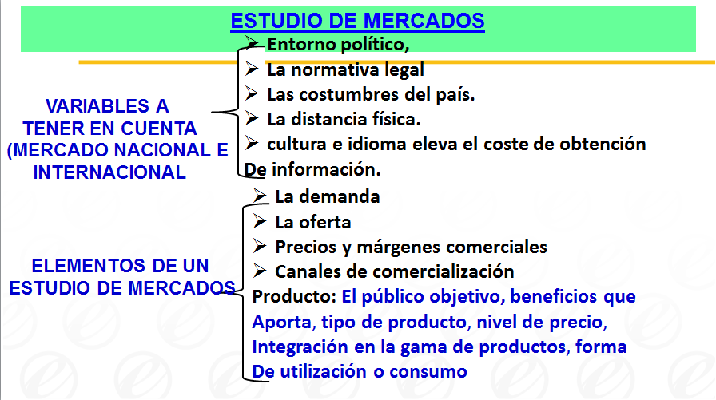

> **Descripción de la imagen** — La imagen es un diagrama jerárquico o mapa conceptual que estructura los componentes de un "Estudio de Mercados". La información se organiza en tres niveles principales, mostrando las variables y elementos clave del estudio.
>
> **Estructura General:**
>
> 1.  **Nivel Principal (Variables):** Se inicia con la sección de **"VARIABLES A TENER EN CUENTA (MERCADO NACIONAL E INTERNACIONAL)"**.
>     *   Bajo esta variable se desprenden factores externos como: Entorno político, La normativa legal y Las costumbres del país.
>
> 2.  **Nivel Intermedio (Elementos del Estudio):** Se centra en los **"ELEMENTOS DE UN ESTUDIO DE MERCADOS"**. Este nivel se divide en dos grandes grupos de componentes:
>
>     *   **Componentes del Producto:** Incluye detalles sobre el producto, como: El público objetivo, beneficios que aporta, tipo de producto, nivel de precio, integración en la gama de productos, y forma de utilización o consumo.
>     *   **Componentes de Mercado (Demanda y Oferta):** Se detallan los aspectos económicos del mercado, incluyendo: La demanda, La oferta, Precios y márgenes comerciales

## ANALISIS DE LA COMPETENCIA MATRIZ DE PERFIL COMPETITIVO

Es una herramienta analítica que identifica a los competidores más importantes de una empresa e informa sobre sus fortalezas y debilidades particulares. Los resultados de ellas dependen en parte de juicios subjetivos en la selección de factores, en la asignación de ponderaciones y en la determinación de clasificaciones, por ello debe usarse en forma cautelosa como ayuda en el proceso de la toma de decisiones.

Procedimiento para su desarrollo

Se identifican los factores decisivos de éxito en la industria, así como los competidores más representativos del mercado.

2. Asignar una ponderación a cada factor ponderante de éxito con el objeto de indicar la importancia relativa de ese factor para el éxito de la industria.

0.0 = sin importancia.

1.0 = muy importante

NOTA: La suma debe ser igual a 1.

## ANALISIS DE LA COMPETENCIA MATRIZ DE PERFIL COMPETITIVO

3. Se asigna a cada uno de los competidores, así como también a la empresa que se esta estudiando, al debilidad o fortaleza de esa firma a cada factor clave de éxito.

> **Descripción de la imagen** — La imagen es una clasificación estructurada que presenta cuatro categorías divididas en dos columnas. La columna izquierda enumera los niveles de debilidad y la columna derecha enumera los niveles de fortaleza.
>
> Los elementos son:
> *   En la primera columna se encuentran: "1 = Debilidad grave" y "2 = Debilidad menor".
> *   En la segunda columna se encuentran: "3 = Fortaleza menor" y "4 = Fortaleza importante".
>
> La estructura visual sugiere una correspondencia o un sistema de escala que relaciona los niveles de debilidad con los niveles de fortaleza.

4.  Multiplicar la ponderación asignada a cada factor clave por la clasificación correspondiente otorgada a cada empresa.

5. Sumar la columna de resultados ponderados para cada empresa. El más alto indicara al competidor más amenazador y el menor al más débil.

Fuente: Tomado de  http://www.webyempresas.com/la-matriz-del-perfil-competitivo/ .  

## ESTUDIO DE MERCADOS

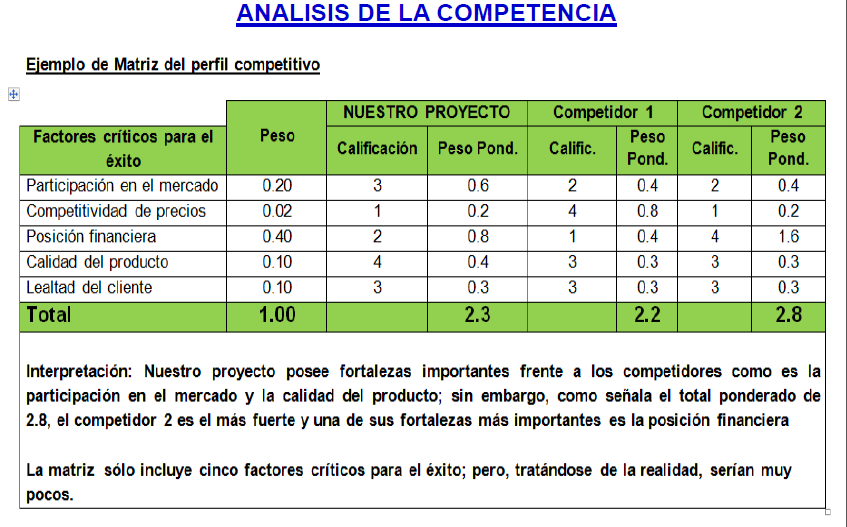

> **Descripción de la imagen** — La imagen es una matriz o tabla de análisis comparativo titulada "ANALISIS DE LA COMPETENCIA".
>
> La tabla está estructurada con cinco filas que representan factores críticos para el éxito, y tres columnas que identifican a los actores a comparar: "NUESTRO PROYECTO", "Competidor 1" y "Competidor 2".
>
> Las filas (factores) son:
> 1. Factores críticos para el éxito
> 2. Competitividad de precios
> 3. Posición financiera
> 4. Calidad del producto
> 5. Lealtad del cliente
>
> Las columnas representan a los tres competidores mencionados. Las celdas contienen valores numéricos que parecen ser ponderaciones o puntuaciones. Por ejemplo, en la fila "Competitividad de precios", el proyecto tiene un valor de 0.02, mientras que el Competidor 1 tiene un valor de 0.2.
>
> La tabla incluye una fila final denominada "Total" que resume las sumas de los valores para cada columna (NUESTRO PROYECTO, Competidor 1 y Competidor 2). Los totales mostrados son: 1.00, 2.3 y 2.8 respectivamente.

## LOCALIZACIÓN ÓPTIMA DE LA PLANTA

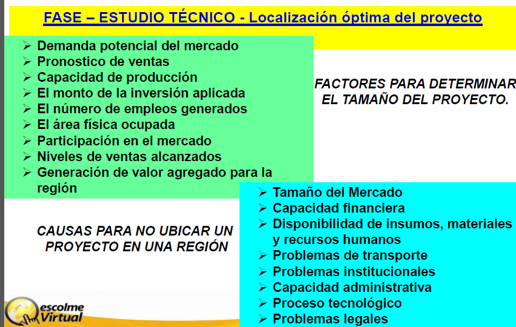

> **Descripción de la imagen** — La imagen es un esquema o mapa conceptual estructurado, dividido en tres columnas principales que detallan factores y causas relacionados con la ubicación y el estudio de un proyecto.
>
> El contenido se organiza en torno a dos temas centrales: "FASE – ESTUDIO TÉCNICO - Localización óptima del proyecto" y "CAUSAS PARA NO UBICAR UN PROYECTO EN UNA REGIÓN", complementados por una lista de "FACTORES PARA DETERMINAR EL TAMAÑO DEL PROYECTO".
>
> **Estructura detallada:**
>
> 1.  **Estudio Técnico y Localización Óptima del Proyecto (Columna Izquierda Superior):** Se enumeran indicadores clave que deben considerarse en el estudio, incluyendo:
>     *   Demanda potencial del mercado.
>     *   Pronóstico de ventas.
>     *   Capacidad de producción.
>     *   Monto de la inversión aplicada.
>     *   Número de empleos generados.
>     *   Área física ocupada.
>     *   Participación en el mercado.
>     *   Niveles de ventas alcanzados.
>     *   Generación de valor agregado para la región.
>
> 2.  **Causas para No Ubicar un Proyecto (Columna Izquierda Inferior):** Se presenta como un título o tema principal que aborda las razones por las cuales un proyecto podría no ser viable en una determinada región.
>
> 3.

## LOCALIZACIÓN ÓPTIMA DE LA PLANTA

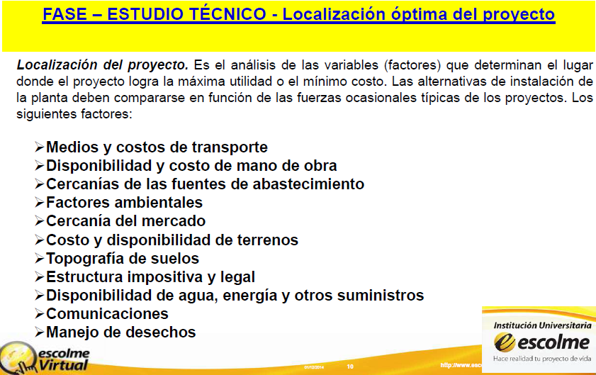

> **Descripción de la imagen** — La imagen es una lista jerárquica de temas relacionados con la "Localización del proyecto". La estructura se presenta como un menú o esquema con categorías principales y subcategorías anidadas.
>
> Los elementos principales son:
>
> *   **FASE – ESTUDIO TÉCNICO – Localización óptima del proyecto** (Este es el título principal).
> *   **Categorías de nivel superior:**
>     *   Medios y costos de transporte
>     *   Disponibilidad y costo de mano de obra
>     *   Cercanías de las fuentes de abastecimiento
>     *   Factores ambientales
>     *   Cercanía del mercado
>     *   Costo y disponibilidad de terrenos
>     *   Topografía de suelos
>     *   Estructura impositiva y legal
>     *   Disponibilidad de agua, energía y otros suministros
>     *   Comunicaciones
>     *   Manejo de desechos
>
> Cada categoría principal contiene subtemas detallados (por ejemplo, bajo "Medios y costos de transporte" se encuentran los elementos específicos de esa categoría).

## LOCALIZACIÓN ÓPTIMA DE LA PLANTA

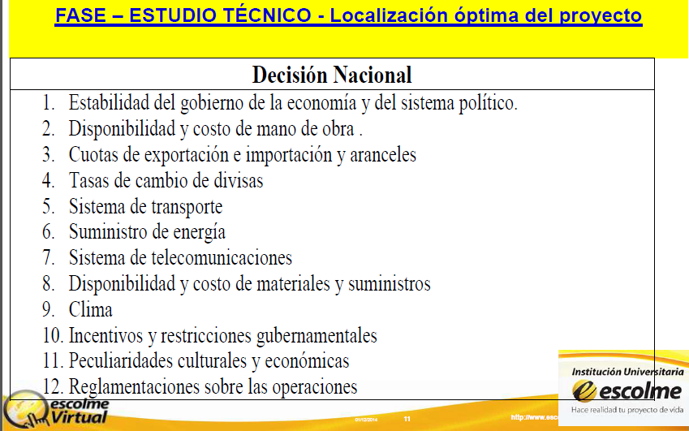

> **Descripción de la imagen** — La imagen es una tabla o lista estructurada que presenta un índice o una enumeración de temas.
>
> En la parte superior, hay un encabezado destacado en un recuadro amarillo con el texto: "FASE – ESTUDIO TÉCNICO - Localización óptima del proyecto". Debajo, centrado, se encuentra el título "Decisión Nacional".
>
> El cuerpo principal es una lista numerada que va del 1 al 12. Cada punto de la lista corresponde a un tema específico y está presentado en formato de texto. Los temas incluyen: Estabilidad del gobierno de la economía y del sistema político; Disponibilidad y costo de obra; Cuotas de exportación e importación y aranceles; Sistema de transporte; Suministro de energía; Sistema de telecomunicaciones; Disponibilidad y costo de materiales y suministros; Clima; Incentivos y restricciones gubernamentales; Peculiaridades culturales y económicas; Reglamentaciones sobre las operaciones.

## LOCALIZACIÓN ÓPTIMA DE LA PLANTA

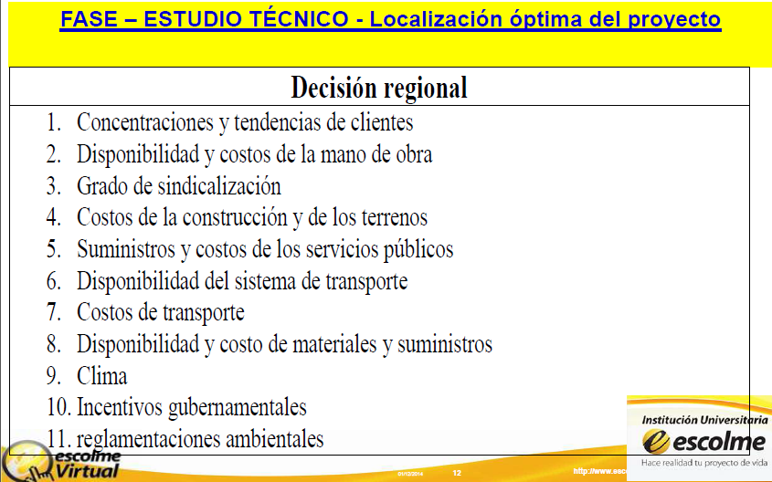

> **Descripción de la imagen** — La imagen es una lista estructurada o tabla que enumera los factores y costos relacionados con la "Decisión regional" dentro del contexto de la fase de "Estudio Técnico - Localización óptima del proyecto".
>
> La lista consta de once puntos numerados, que detallan diversos aspectos económicos, sociales y ambientales:
>
> 1. Concentraciones y tendencias de clientes
> 2. Disponibilidad y costos de la mano de obra
> 3. Grado de sindicalización
> 4. Costos de la construcción y de los terrenos
> 5. Suministros y costos de los servicios públicos
> 6. Disponibilidad del sistema de transporte
> 7. Costos de transporte
> 8. Disponibilidad y costo de materiales y suministros
> 9. Clima
> 10. Incentivos gubernamentales
> 11. Reglamentaciones ambientales

## LOCALIZACIÓN ÓPTIMA DE LA PLANTA

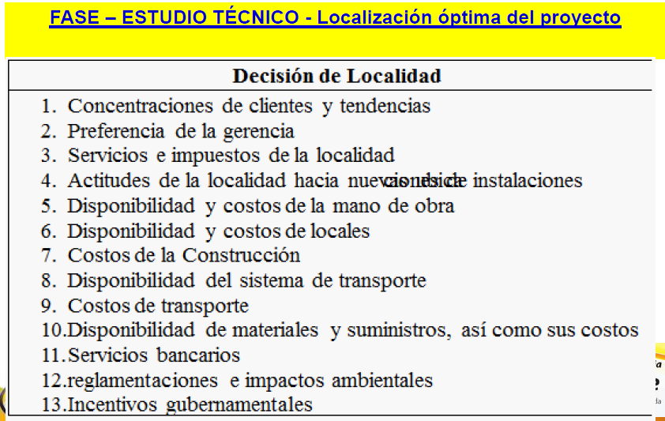

> **Descripción de la imagen** — La imagen es una lista estructurada que detalla los componentes o factores considerados en la "Decisión de Localidad" dentro del marco de la fase de "Estudio Técnico - Localización óptima del proyecto".
>
> El contenido se presenta como un listado numerado de trece puntos, que representan variables a evaluar:
>
> 1. Concentraciones de clientes y tendencias
> 2. Preferencia de la gerencia
> 3. Servicios e impuestos de la localidad
> 4. Actitudes de la localidad hacia inversiones
> 5. Disponibilidad y costos de la mano de obra
> 6. Disponibilidad y costos de locales
> 7. Costos de la Construcción
> 8. Disponibilidad del sistema de transporte
> 9. Costos de transporte
> 10. Disponibilidad de materiales y suministros, así como sus costos
> 11. Servicios bancarios
> 12. Reglamentaciones e impactos ambientales
> 13. Incentivos gubernamentales

## MÉTODO DE LOS FACTORES PONDERADOS

Este modelo permite una fácil identificación de los costos difíciles de evaluar que están relacionados con la localización de instalaciones. 

Los pasos a seguir son: 

1. Desarrollar una lista de factores relevantes (factores que afectan la selección de la localización). 

2. Asignar un peso a cada factor para reflejar su importancia relativa en los objetivos de la compañía. 

3. Desarrollar una escala de calificación para cada factor (por ejemplo, 1-10 o 1-100 puntos). 

4. Hacer que la administración califique cada localidad para cada factor, utilizando la escala del paso 3. 

5. Multiplicar cada calificación por los pesos de cada factor, y totalizar la calificación para cada localidad. 

6. Hacer una recomendación basada en la máxima calificación en puntaje, considerando los resultados de sistemas cuantitativos también. 

     FUENTE: Tomado de  http://distplantaml.blogspot.com.co/2013/05/metodo-de-los-factores-ponderados.html  

## LOCALIZACIÓN ÓPTIMA DE LA PLANTA

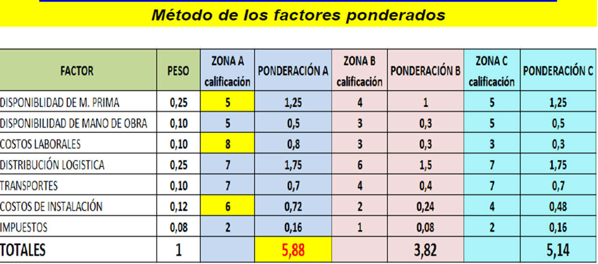

> **Descripción de la imagen** — La imagen es una tabla de datos titulada "Método de los factores ponderados". La tabla presenta un análisis de varios factores, sus pesos y su distribución en diferentes zonas de calificación.
>
> La tabla está estructurada con las siguientes columnas:
> 1.  **FACTOR:** Enumera los elementos analizados (ej. DISPONIBILIDAD DE M. PRIMA, COSTOS LABORALES).
> 2.  **PESO:** Indica el peso asignado a cada factor.
> 3.  **ZONA A calificación:** Muestra un valor numérico asociado a la Zona A.
> 4.  **PONDERACIÓN A:** Muestra un valor numérico asociado a la ponderación de la Zona A.
> 5.  **ZONA B calificación:** Muestra un valor numérico asociado a la Zona B.
> 6.  **PONDERACIÓN B:** Muestra un valor numérico asociado a la ponderación de la

La mejor alternativa de localización es la zona A ya que obtuvo una puntuación de 5,88 , esto se debe a que 

Tiene factores claves de éxito como son: la disponibilidad de materia prima, bajos costos laborales y bajos costos de 

instalación

## MÉTODO CUALITATIVO POR PUNTOS

Consiste en asignar factores cuantitativos a una serie de factores que se consideran relevantes para la localización Esto conduce a una comparación cuantitativa de diferentes sitios. El método permite ponderar factores de preferencia para el investigador al tomar la decisión. Se sugiere aplicar el siguiente procedimiento para jerarquizar los factores cualitativos. 

1. Desarrollar una lista de factores relevantes. 

2. Asignar un peso a cada factor para indicar su importancia relativa (los pesos deben sumar I 00), y el peso asignado dependerá exclusivamente del criterio del investigador. 

3. Asignar una escala común a cada factor (por ejemplo, de 0 a 10) y elegir cualquier mínimo 

4. Calificar a cada sitio potencial de acuerdo con la escala designada y multiplicar la calificación por el peso 

5. Sumar la puntación de cada sitio y elegir el de máxima puntuación

     FUENTE: Tomado de  http://proyectos.ingenotas.com/2014/02/metodo-cualitativo-por-puntos-ventajas.html  

## LOCALIZACIÓN ÓPTIMA DE LA PLANTA

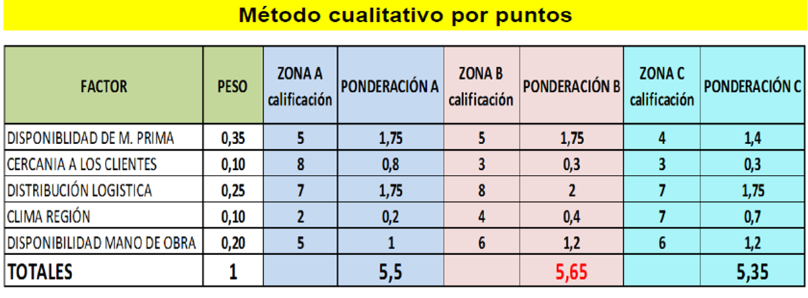

> **Descripción de la imagen** — La imagen es una tabla que presenta un método de evaluación cualitativa por puntos. La tabla está estructurada con seis filas de datos y cinco columnas principales: FACTOR, PESO, ZONA A calificación, ZONA B calificación y ZONA C calificación.
>
> **Estructura y Contenido:**

La mejor alternativa de localización es la zona B ya que obtuvo un puntaje de 5,65;  ésto  se debe a que tiene factores claves como son: la distribución logística, la disponibilidad de mano de obra y la disponibilidad de materia prima.

## DEMANDA ÓPTIMA DEL PROYECTO

El tamaño del proyecto,  expresa la cantidad de producto  o servicio, por unidad de tiempo, por esto lo podemos definir en 

función de su capacidad  de producción de bienes o prestación de servicios, durante un período de tiempo determinado.

ay que tener en cuenta la naturaleza del proyecto para definir el tamaño; como el caso de un proyecto de transporte de pasajeros: sería la capacidad para transportar mil pasajeros por día utilizando diez vehículos; y la capacidad  de un estadio deportivo sería: el número de sillas disponibles para los espectadores.

Debemos buscar siempre un tamaño óptimo, es decir el  lque  asegure la más alta rentabilidad desde el punto de vista privado o la mayor diferencia entre beneficios y costos sociales.

VARIABLES DEL TAMAÑO DEL PROYECTO

Los Factores que determinan o condicionan el tamaño de una planta que se implementará con la propuesta del proyecto, es una tarea limitada por las relaciones recíprocas que existen entre el tamaño y la demanda, la disponibilidad de las materias primas, la tecnología, los equipos y el financiamiento. Todos estos factores contribuyen a simplificar el proceso de aproximaciones sucesivas, y las alternativas de tamaño entre las cuáles se puede escoger, se van reduciendo a medida que se examinan los factores condicionantes mencionados, y que detallaremos a continuación.

## DEMANDA ÓPTIMA DEL PROYECTO

DIMENSIONES DEL MERCADO

De acuerdo al segmento del mercado que se obtuvo mediante el estudio de mercado, se determina la cantidad de productos a producir y así el tamaño de la planta, se puede también basar tanto en la demanda presente y en la futura.

LA CAPACIDAD DE FINANCIAMIENTO

Esta Segunda variable que condiciona el tamaño del proyecto, es la capacidad de financiamiento de los gestores del proyecto; hay que tener en cuenta que el proyecto no solo se puede desarrollar con recursos propios, sino que también es posible acudir a las diferentes fuentes de financiamiento que propone el sector financiero del país, pero siempre teniendo en cuenta las siguientes consideraciones:

Cuando los recursos propios y los financiados no son suficientes para atender las exigencias del tamaño mínimo a producir, se hace imposible la implementación y operación del proyecto.

Cuando estos dos recursos (los propios y los del crédito), solo responden por un tamaño mínimo, se puede aceptar, la implementación y operación del proyecto, pero por etapas, iniciando con un tamaño mínimo ye irlo ampliando en transcurso del tiempo, en la medida que se vayan superando los problemas financieros.

Cuando los recursos financieros son suficientes y facilitan la selección del mejor tamaño, se tendrá una financiación cómoda y confiable del proyecto.

## DEMANDA ÓPTIMA DEL PROYECTO

LA TECNOLOGÍA UTILIZADA

Esta otra variable condicionante del tamaño, tiene que ver con ciertos procesos tecnológicos que exigen un volumen mínimo de producción que puede ser superior las necesidades y programación del proyecto, de tal manera que los costos de operación pueden resultar muy elevados, que no permiten la implementación y por ende la operación del proyecto.

DISPONIBILIDAD DE INSUMOS

Esta otra variable determinante del tamaño, y nos obliga analizar la oferta actual y futura de los insumos más importantes, con el fin de conocer  a corto y largo plazo su existencia; a demás se debe  evaluar la posibilidad de emplear insumos sustitutos si el proyecto lo permite.

Por lo tanto, debemos tener seguridad de conseguir las materias primas en cualquier momento para darle confiabilidad al proyecto y así poder definir con toda seguridad su tamaño.

LA DISTRIBUCIÓN GEOGRÁFICA DEL MERCADO

Igualmente, se debe tener en cuenta la ubicación geográfica de los consumidores y / clientes del proyecto, para pensar en:

Una sola unidad productiva para atender todo el mercado.

Varias unidades de producción, ubicadas en diferentes zonas geográficas para atender las necesidades de cada una.

Una unidad productiva central, y varias unidades satélites de menor tamaño para cubrir con las exigencias del mercado en las diferentes zonas.

VARIABLES ESTACIONALES

Tiene que ver con el comportamiento de la demanda de los insumos principales en el trascurso del año, provocada por períodos de lluvia o sequía; también las marcadas por las festividades tradicionales, como por ejemplo la semana santa y la navidad entre otras.

FUENTE: Tomado de   http://soda.ustadistancia.edu.co/enlinea/Proyecto%20de%20Grado%20Fase%20I%20(Segundo%20Momento)/tamao_del_proyecto.html  

## DEMANDA ÓPTIMA DEL PROYECTO

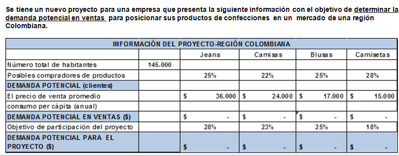

> **Descripción de la imagen** — La imagen es una tabla titulada "INFORMACIÓN DEL PROYECTO - REGIÓN COLOMBIANA" que presenta datos comparativos para diferentes productos en la región colombiana, utilizando cuatro columnas de referencia: Jeans, Camisas, Blusas y Camisetas.
>
> La tabla está organizada con filas que representan métricas relacionadas con el proyecto, incluyendo:
>
> 1.  **Número total de habitantes:** 145.000
> 2.  **Posibles compradores de productos:** 25% (Jeans), 22% (Camisas), 25% (Blusas), 28% (Camisetas).
> 3.  **DEMANDA POTENCIAL (clientes):** Muestra porcentajes de participación del proyecto: 28% (Jeans), 23% (Camisas), 25% (Blusas), 18% (Camisetas).
> 4.  **El precio de venta promedio:** Se muestran valores monetarios para cada producto: $36.000 (Jeans), $24.000 (Camisas), $17.000 (Blusas), y $15.000 (Camisetas).
> 5.  **consumo per cápita (anual):** Se muestran valores monetarios: $24.000 (Jeans), $17.000 (Camisas), $15.000 (Blusas), y $15.000 (Camisetas).
> 6.  **DEMANDA POTENCIAL EN VENTAS ($):** Se muestran valores monetarios para cada producto: $

EJEMPLO 

## DEMANDA ÓPTIMA DEL PROYECTO

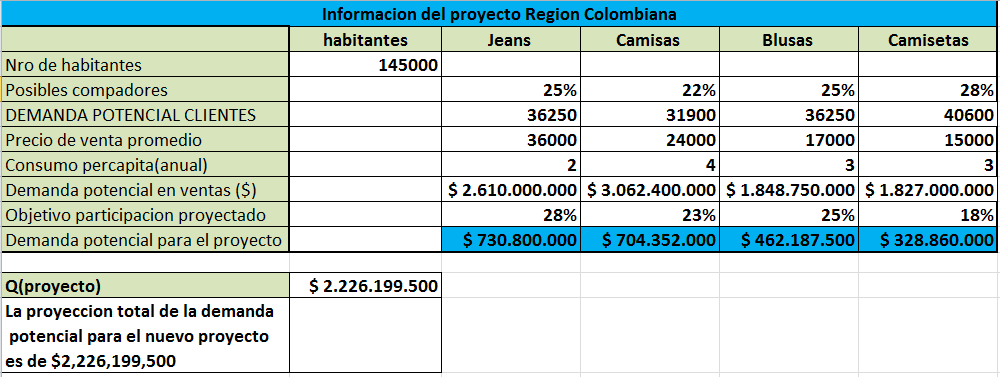

> **Descripción de la imagen** — La imagen es una tabla de datos titulada "Informacion del proyecto Region Colombiana". La tabla presenta información segmentada por diferentes categorías de productos y métricas financieras relacionadas con el proyecto.
>
> **Columnas:**
> La tabla tiene cinco columnas que representan diferentes segmentos o tipos de prendas: habitantes, Jeans, Camisas, Blusas y Camisetas.
>
> **Filas (Datos):**
> La tabla contiene ocho filas de datos que describen aspectos demográficos, potenciales de mercado y proyecciones financieras:
>
> 1.  **Nro de habitantes:** Muestra el valor 145000.
> 2.  **Posibles compadores:** Muestra el valor 36250.
> 3.  **DEMANDA POTENCIAL CLIENTES:** Muestra los siguientes datos por columna:
>     *   Jeans: 31900
>     *   Camisas: 36250
>     *   Blusas: 40600
> 4.  **Precio de venta promedio:** Muestra el valor 36000.
> 5.  **Consumo percapita(anual):** Muestra los siguientes valores por columna:
>     *   Jeans: 2
>     *   Camisas: 4
>     *   Blusas: 3
>     *   Camisetas: 3
> 6.  **Demanda potencial en ventas ($):** Muestra las proyecciones de demanda en dólares para cada segmento:
>     *   Jeans: $2.610.000
>     *   Camisas: $3.062.400
>     *   Blusas: $1.848.750
>     *   Camisetas: $1.827.000
> 7.  **Objetivo participación proyectado:** Muestra los porcentajes de participación esperados:
>     *   Jeans: 25%
>     *   Camisas: 22%
>     *   Blusas: 25%
>     *   Camisetas: 18%
> 8.  **Demanda potencial para el proyecto:** Muestra las proyecciones finales de demanda total para el proyecto en

SOLUCIÓN AL EJERCICIO

## DEMANDA ÓPTIMA DEL PROYECTO

EXPLICACIÓN DEL EJERCICIO.

DEMANDA POTENCIAL DE CLIENTES  = NÚMERO TOTAL DE HABITANTES X EL PORCENTAJE ASIGNADO A CADA LÍNEA DE PRODUCTOS

CONSUMO PERCAPITA ANUAL =   ES ASIGNADO DE ACUERDO AL ESTUDIO DE MERCADO (LA INFORMACIÓN LA DA EL EJERCICIO)

DEMANDA POTENCIAL EN VENTAS =   DEMANDA POTENCIAL DE CLIENTES X EL PRECIO DE VENTA PROMEDIO X CONSUMO 

PERCAPITA ANUAL.

DEMANDA POTENCIAL PARA EL PROYECTO =  DEMANDA POTENCIAL EN VENTAS X OBJETIVO DE PARTICIPACIÓN DEL PROYECTO

## PRONÓSTICO DE VENTAS

El pronóstico de ventas es una estimación de las ventas futuras (ya sea en términos físicos o monetarios) de uno o varios productos (generalmente todos) para un periodo de tiempo determinado.

El pronóstico de ventas es una estimación de las ventas futuras (ya sea en términos físicos o monetarios) de uno o varios productos (generalmente todos) para un periodo de tiempo determinado.

Realizar el pronóstico de ventas nos permite elaborar el presupuesto de ventas y, a partir de éste, elaborar los demás  presupuestos , tales como el de producción, el de compra de insumos o mercadería, el de requerimiento de personal, el de flujo de efectivo, etc.

En otras palabras, hacer el pronóstico de ventas nos permite saber cuántos productos vamos a producir, cuánto necesitamos de insumos o mercadería, cuánto personal vamos a requerir, cuánto vamos a requerir de inversión, etc., y, de ese modo, lograr una gestión más eficiente del negocio, permitiéndonos planificar, coordinar y controlar actividades y recursos.

 

## PRONÓSTICO DE VENTAS

Métodos para realizar el pronóstico de ventas

Veamos a continuación cuáles son los principales métodos que podemos usar para realizar el pronóstico de ventas:

Datos históricos

El primer método es el que vimos anteriormente, consiste en tomar como referencia las ventas pasadas y analizar la tendencia, por ejemplo, si en los meses pasados hemos tenido un aumento del 5% en las ventas, podríamos pronosticar que para el próximo mes las ventas también tengan un aumento del 5%.

Al usar este método, podemos tener en cuenta otros métodos o factores, por ejemplo, si para el siguiente mes vamos a aumentar nuestra inversión en publicidad, en vez de pronosticar un aumento del 5%, podríamos pronosticar un aumento del 10%.

Para usar este método, debemos contar con un negocio en marcha; para nuevos negocios o productos, sigamos viendo los demás métodos.

 

## PRONÓSTICO DE VENTAS

Tendencias del mercado

Este método consiste en tomar como referencia a estadísticas o índices del sector o del mercado, analizar las tendencias y, en base a ellas, proyectar o pronosticar nuestras ventas.

Por ejemplo, podemos tomar como referencia el índice de precios al consumidor, la tasa de crecimiento del sector, la tasa de crecimiento poblacional, el ingreso per cápita, etc.

Por ejemplo, si la tasa promedio anual de crecimiento poblacional de nuestro mercado objetivo es de 4%, podríamos pronosticar que nuestras ventas cada año también tengan un crecimiento del 4%

Ventas potenciales del sector o mercado

Este método consiste en hallar primero las ventas potenciales del sector o mercado (las máximas ventas que se podrían dar), y luego, en base a dicha información, determinar nuestro pronóstico de ventas.

Por ejemplo, si a través de publicaciones externas o estudios de mercado, hemos hallado que las ventas potenciales de nuestro mercado ascienden a US\$100 000, y teniendo en cuenta nuestra inversión, nuestra capacidad de producción, y la opinión de expertos, decidimos captar un 10% de dichas ventas potenciales, por lo que nuestro pronóstico de ventas para el próximo mes o año sería de US\$10 000.

                                                             FUENTE:  http://www.crecenegocios.com/el-pronostico-de-ventas/  

## PRONÓSTICO DE VENTAS

EJEMPLO SOBRE PRONÓSTICO DE VENTAS

Se tiene un nuevo proyecto para una empresa que presenta la siguiente información con el objetivo de  determinar el pronóstico de ventas  para el año 2015 y 2016 teniendo en cuenta el impacto de algunas variables del mercado.

 

Para cada mes del primer trimestre del año 2015 se prevén ventas por \$35.000.000.

Para los meses del segundo trimestre por rebaja en los precios se prevé (proyecta) un aumento del 5% en las ventas con respecto a los meses del trimestre anterior.

Para cada mes del tercer trimestre por crecimiento en la población, se prevé un aumento en las ventas del 3,5% con respecto a los meses trimestre anterior.

Para los meses de octubre y noviembre por una suba en los precios se prevé una disminución en las ventas del 2,5% con respecto  a los meses del trimestre anterior.

Para el mes de diciembre se prevé un aumento en ventas del 8,5% con respecto al mes de noviembre.

 

Para el pronóstico  del año 2016  se inicia para cada mes del primer trimestre del año con un aumento del 10% de las ventas que se obtuvieron en cada mes del primer trimestre del año 2015; para los siguientes trimestres se deben aplicar las mismas condiciones o políticas establecidas en los numerales 2, 3, 4 y 5.

 

## PRONÓSTICO DE VENTAS

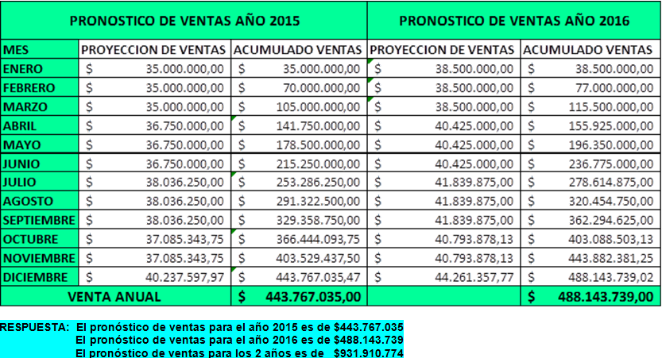

> **Descripción de la imagen** — La imagen es una tabla de datos que presenta proyecciones y acumulados de ventas mensuales para dos años: 2015 y 2016.
>
> La tabla está estructurada con las siguientes secciones principales:
>
> 1.  **Pronóstico de Ventas Año 2015:** Muestra la proyección mensual de ventas y el total acumulado de ventas para el año 2015.
> 2.  **Pronóstico de Ventas Año 2016:** Muestra la proyección mensual de ventas y el total acumulado de ventas para el año 2016.
>
> La tabla incluye las siguientes filas (meses): MES, ENERO, FEBRERO, MARZO, ABRIL, MAYO, JUNIO, JULIO, AGOSTO, SEPTIEMBRE, OCTUBRE, NOVIEMBRE y DICIEMBRE.
>
> Para cada mes, se presentan tres columnas de datos:
> *   **PROYECCIÓN DE VENTAS:** La estimación de ventas para ese mes.
> *   **ACUMULADO VENTAS:** El total acumulado de ventas hasta ese mes.
>
> Al final de la tabla, hay una fila de resumen que muestra el **VENTA ANUAL** (Venta Anual) para ambos años:
> *   **VENTA ANUAL 2015:** $443.767.035,00
> *   **VENTA ANUAL 2016:** $488.143.739,02

SOLUCIÓN AL EJERCICIO

## Slide 26

