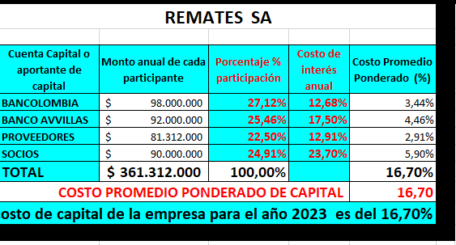

# 2. Documento_ Financiamiento del Costo de capital de los proyectos_0K

**FINANCIAMIENTO DE CAPITAL PARA LOS PROYECTOS EMPRESARIALES**

**LA ESTRUCTURA DEL COSTO DEL CAPITAL DEL PROYECTO**

El costo de capital es la rentabilidad mínima que deben producir los activos de la empresa, teniendo en cuenta la forma como están financiados. Es el [coste](http://www.economia48.com/spa/d/coste/coste.htm) en que incurre una [compañía](http://www.economia48.com/spa/d/compania/compania.htm) para obtener el [capital](http://www.economia48.com/spa/d/capital/capital.htm) de [deuda](http://www.economia48.com/spa/d/deuda/deuda.htm) ([fondos ajenos](http://www.economia48.com/spa/d/fondos-ajenos/fondos-ajenos.htm) y bancos); proveedores y el [capital social](http://www.economia48.com/spa/d/capital-social/capital-social.htm) ([fondos propios](http://www.economia48.com/spa/d/fondos-propios/fondos-propios.htm)) que necesita para [financiar](http://www.economia48.com/spa/d/financiar/financiar.htm) sus [actividad](http://www.economia48.com/spa/d/actividad/actividad.htm)es.

Es el [coste](http://www.economia48.com/spa/d/coste/coste.htm) en que incurre una [compañía](http://www.economia48.com/spa/d/compania/compania.htm) para obtener el [capital](http://www.economia48.com/spa/d/capital/capital.htm) de [deuda](http://www.economia48.com/spa/d/deuda/deuda.htm) ([fondos ajenos](http://www.economia48.com/spa/d/fondos-ajenos/fondos-ajenos.htm) y bancos); proveedores y el [capital social](http://www.economia48.com/spa/d/capital-social/capital-social.htm) ([fondos propios](http://www.economia48.com/spa/d/fondos-propios/fondos-propios.htm)) que necesita para [financiar](http://www.economia48.com/spa/d/financiar/financiar.htm) sus [actividad](http://www.economia48.com/spa/d/actividad/actividad.htm)es.

El costo de capital es una cifra que se utiliza para tres propósitos: Evaluar proyectos, Valorar la empresa, Calcular el EVA.

**Componentes de la estructura del costo de capital**

**<u>1 . costo de los proveedores:</u>** Generalmente las empresas siempre tendrán financiamiento con sus proveedores y éste será, proporcionalmente, el mayor componente de los pasivos corrientes o circulantes en compañías no financieras. El motivo transaccional se ve reflejado en las cuentas por pagar cuando se carece de efectivo y favorece a la empresa que provee recursos pues puede llegar a especular en alguna forma con los precios.

***<u>El costo del crédito comercial está representado por el porcentaje de descuentos perdidos por carecer de liquidez.</u>***

Se deben tener en cuenta los descuentos de pronto pago ya que estos se convierten en un costo de oportunidad para la empresa el cual se debe aprovechar, ***cuando la empresa no aprovecha los descuentos éstos se convierten en un costo de intereses.***

***En el financiamiento con proveedores se debe calcular de la siguiente manera:***

1.  ***Descuento en pesos = Valor de la factura mes \* % de descuento***

2.  ***Valor real de la factura al mes = Valor factura – descuento en pesos***

3.  ***Se debe calcular la compra total al año = Compra mensual real x 12 meses***

4.  Se debe calcular la tasa de interés periódica mensual de la siguiente manera:

- **Valor del descuento en pesos**

- **Valor real de la compra = valor total de la factura – el descuento en pesos**

- **Tasa de interés periódica mensual = (Desc. en pesos / valor real de la factura) x 100**

5.  ***Cuando la empresa NO paga las facturas antes de la fecha pactada*** y no aprovecha el descuento, el costo de interés mensual equivale a la tasa de interés periódica mensual

**La tasa de interés anual =** Tasa de interés periódica mensual x No. de meses al año

**Costo de interés anual final = (tasa de interés anual x (1- Tasa de impuestos)) X 100**

6.  **Cuando la empresa paga las facturas antes de la fecha pactada y aprovecha el descuento**. **El costo de interés mensual y anual** es de cero por ciento (0,00%) y en este caso solamente se calcula las compras totales al año.

***Se debe calcular la compra total al año = Compra mensual real x 12 meses***

**<u>2. Costo entidades bancarias (capital externo)</u>.** Recuerden que todo componente de la estructura financiera tiene un costo pues representan un capital y éste tiene un valor en el tiempo. Pues bien, el costo de obligaciones contraídas con las entidades bancarias es igual a:

**Costo anual o tasa de interés anual = (Tasa de interés del banco \* ( 1 – Tasa de impuestos)) x 100**

**Dónde:**

Tasa de interés es la tasa efectiva anual que cobra el banco

1: es una constante

Tasa de impuesto: es la tasa de impuesto que se paga al estado y se debe descontar de la tasa que cobra el banco

<u>**3. Costo del patrimonio (capital de los socios):** P</u>roveniente del capital aportado por los accionistas. Proveniente de las utilidades retenidas, las acciones preferentes y el costo de la deuda (antes y después de impuestos).

El costo anual de los socios equivale a la tasa efectiva que cobra cada uno de los socios; en este caso no se requiere hacer ninguna operación.

**Estructura recomendada**

<table>
<colgroup>
<col style="width: 27%" />
<col style="width: 16%" />
<col style="width: 17%" />
<col style="width: 20%" />
<col style="width: 18%" />
</colgroup>
<thead>
<tr>
<th style="text-align: center;"><strong>Cuenta Capital o aportante de capital</strong></th>
<th style="text-align: center;"><strong>Monto anual de cada participante</strong></th>
<th style="text-align: center;"><strong>Porcentaje % participación</strong></th>
<th style="text-align: center;">
<strong>Costo de interés</strong>

<strong>Anual (intereses)</strong>
</th>
<th style="text-align: center;"><strong>Costo Promedio Ponderado (%)</strong></th>
</tr>
</thead>
<tbody>
<tr>
<td>Proveedores</td>
<td style="text-align: left;"></td>
<td style="text-align: left;"></td>
<td style="text-align: left;"></td>
<td style="text-align: left;"></td>
</tr>
<tr>
<td>Financiamiento de Bancos</td>
<td style="text-align: left;"></td>
<td style="text-align: left;"></td>
<td style="text-align: left;"></td>
<td style="text-align: left;"></td>
</tr>
<tr>
<td>Financiamiento de socios</td>
<td style="text-align: left;"></td>
<td style="text-align: left;"></td>
<td style="text-align: left;"></td>
<td style="text-align: left;"></td>
</tr>
<tr>
<td style="text-align: left;"><strong>TOTAL DE CAPITAL</strong></td>
<td style="text-align: center;"></td>
<td style="text-align: center;"><strong>100%</strong></td>
<td style="text-align: right;"><strong>Costo de financiamiento de capital</strong></td>
<td style="text-align: center;"></td>
</tr>
</tbody>
</table>

**Monto anual:** es el valor en pesos (\$) correspondiente a cada cuenta o aportante

**% participación:** corresponde al valor en % de cada una de las cuentas dividida en el total de la deuda de la empresa

**Costo promedio ponderado anual:** es la tasa real de interés a la cual se presta el dinero, debe ir en decimales, se deben colocar las tasas de interés anual de los bancos, los proveedores y los socios.

**Promedio ponderado:** es el resultado que se obtiene de multiplicar el porcentaje de participación de cada cuenta por el costo del interés anual.

**<u>EJEMPLOS DE LA ESTRUCTURA DEL COSTO DE CAPITAL</u>**

1.  La empresa **CONFECCIONES SAS** presenta la siguiente estructura de capital para el financiamiento de su empresa durante el año 2023:

- Préstamo Bancolombia por = \$130.000.000 a una tasa del 18,00% E.A (antes de impuestos).

- Préstamo Banco de Bogotá= \$100.000.000 a una tasa del 12,68% E.A (después de impuestos).

- Los Proveedores venden a un plazo de 30 dias y concede un descuento comercial del 3,00% mensual si la empresa paga antes de los 20 días del mes.

La empresa compra mensualmente \$10.000.000 y realiza compras los 12 meses del año. **<u>La empresa durante el año nunca paga antes de los 20 dias</u>**.

- Los socios realizan un aporte de \$80.000.000 y esperan una tasa de rentabilidad del 28,50% E.A

<u>***Se debe manejar una tasa de impuestos del 35***%</u>

**Calcular el costo de financiamiento de capital de la empresa**

**<u>Solución al ejercicio</u>**

Calculamos las tasas de interés para llevarlas a la tabla:

**\*\* Bancolombia = 18,00% antes de impuestos; se debe hacer la siguiente operación:**

Tasa de interés anual = (0,18 x (1 - 0.35)) x 100 = **11,70% anual**

**\*\* B. Bogotá = 12,68% anual (después de impuestos).** No se hace ninguna operación.

**\*\* Proveedores**

Descuento = \$10.000.000 x 3,00% = \$300.000;

Valor real de la factura al mes = \$10.000.000 - \$300.000 = \$9.700.000

Compra real al año = \$9.700.000 x 12 meses = \$116.400.000

Tasa de interés periódica mensual = (\$300.000/ \$9.700.000) x 100 = 3,09% mensual

Tasa de interés anual = 3,09% x 12 meses = **37,08% anual**

**Costo de interés anual final = 0,3708 x (1-0,35) = 0,2410 x 100 = 24,10%**

**Socios:** **28,50% anual.** No se hace ninguna operación

<table>
<colgroup>
<col style="width: 28%" />
<col style="width: 18%" />
<col style="width: 17%" />
<col style="width: 18%" />
<col style="width: 16%" />
</colgroup>
<thead>
<tr>
<th style="text-align: center;"><strong>Cuenta Capital o aportante de capital</strong></th>
<th style="text-align: center;"><strong>Monto anual de cada participante</strong></th>
<th style="text-align: center;"><strong>Porcentaje % participación</strong></th>
<th style="text-align: center;">
<strong>Costo de interés</strong>

<strong>Anual_ intereses</strong>
</th>
<th style="text-align: center;"><strong>Costo Promedio Ponderado (%)</strong></th>
</tr>
</thead>
<tbody>
<tr>
<td style="text-align: right;">Bancolombia</td>
<td style="text-align: right;">$130.000.000</td>
<td style="text-align: right;">30,49%</td>
<td style="text-align: right;">11,70%</td>
<td style="text-align: right;">3,57%</td>
</tr>
<tr>
<td style="text-align: right;">Banco Bogotá</td>
<td style="text-align: right;">$100.000.000</td>
<td style="text-align: right;">23,45%</td>
<td style="text-align: right;">12,68%</td>
<td style="text-align: right;">2,97%</td>
</tr>
<tr>
<td style="text-align: right;">Proveedores</td>
<td style="text-align: right;">$116.400.000</td>
<td style="text-align: right;">27,30%</td>
<td style="text-align: right;">24,10%</td>
<td style="text-align: right;">6,58%</td>
</tr>
<tr>
<td style="text-align: right;">Patrimonio</td>
<td style="text-align: right;">$80.000.000</td>
<td style="text-align: right;">18,76%</td>
<td style="text-align: right;">28,50%</td>
<td style="text-align: right;">5,35%</td>
</tr>
<tr>
<td style="text-align: right;"></td>
<td style="text-align: right;"></td>
<td style="text-align: right;"></td>
<td style="text-align: right;"></td>
<td style="text-align: right;"></td>
</tr>
<tr>
<td style="text-align: right;"><strong>FINANCIAMIENTO TOTAL</strong></td>
<td style="text-align: right;"><strong>$426.400.000</strong></td>
<td style="text-align: right;"><strong>100,00%</strong></td>
<td style="text-align: right;"> </td>
<td style="text-align: right;"> </td>
</tr>
<tr>
<td style="text-align: right;"></td>
<td colspan="3" style="text-align: right;"><strong>COSTO PORMEDIO PONDERADO DE CAPITAL</strong></td>
<td style="text-align: right;"><strong>18,47%</strong></td>
</tr>
</tbody>
</table>

***<u>El costo promedio de capital para la empresa CONFECCIONES SAS para el año 2023 es del 18,47%</u>***

***<u>Ejemplo 2:</u>*** La empresa **MULTITIENDAS LTDA** presenta la siguiente estructura de capital para el financiamiento de su empresa durante el año 2023:

- Préstamo Bancolombia por = \$85.000.000 a una tasa del 15,10% E.A (después de impuestos).

- Préstamo Banco de Bogotá= \$75.000.000 a una tasa del 17,00% E.A (antes de impuestos).

- Los Proveedores venden a un plazo de 30 dias y concede un descuento comercial mensual del 2,80% si la empresa paga antes de 15 dias.

La empresa compra mensualmente \$6.000.000 y realiza compras los 12 meses del año.

**<u>La empresa siempre paga cada mes antes de los 15 dias.</u>**

- Los socios realizan un aporte de \$65.000.000 y esperan una tasa de rentabilidad del 26,00% E.A

***<u>Se debe manejar una tasa de impuestos del 35%</u>***

**<u>Calcular el costo ponderado de capital de la empresa</u>**

**<u>Solución al ejercicio</u>**

Calculamos las tasas de interés para llevarlas a la tabla

**Bancolombia = 15,10 anual% después de impuestos.** (No se hace ninguna operación)

**Banco de Bogotá = 17,00% antes de impuesto**

Tasa de interés anual = (0,17 x(1 - 0,35)) x 100 = **11,05% anual**

**\*\* Proveedores**

Descuento = \$6.000.000 x 2,80% = \$168.000;

Valor real de la factura al mes = \$6.000.000 - \$168.000 = \$5.832.000

Compra real al año = \$5.832.000.000 x 12 meses = \$69.984.000

Tasa de interés periódica mensual = 0,00% mensual

Tasa de interés anual = 0,00% x 12 meses = **0,00% anual**

**Costo de interés anual final = 0,00 x (1-0,35) = x 100 = 0,00%**

**Socios:** 26,00% anual

<table>
<colgroup>
<col style="width: 22%" />
<col style="width: 18%" />
<col style="width: 16%" />
<col style="width: 12%" />
<col style="width: 29%" />
</colgroup>
<thead>
<tr>
<th colspan="5" style="text-align: center;"><strong>COSTO DE CAPITAL EMPRESA MULTITIENDAS LTDA</strong></th>
</tr>
</thead>
<tbody>
<tr>
<td>
<strong> </strong>

<strong>Fuentes</strong>

 
</td>
<td>
<strong> </strong>

<strong> Monto</strong>

 
</td>
<td style="text-align: center;"><strong>% participación</strong></td>
<td style="text-align: center;">
<strong>Costo de interés</strong>

<strong>Anual_ intereses</strong>
</td>
<td style="text-align: center;"><strong>Ponderado</strong></td>
</tr>
<tr>
<td style="text-align: left;">Bancolombia</td>
<td style="text-align: right;">$85.000.000</td>
<td style="text-align: right;">28,82%</td>
<td style="text-align: right;">15,10%</td>
<td style="text-align: center;">4,35%</td>
</tr>
<tr>
<td style="text-align: left;">Banco Bogotá</td>
<td style="text-align: right;">$75.000.000</td>
<td style="text-align: right;">25,43%</td>
<td style="text-align: right;">11,05%</td>
<td style="text-align: center;">2,81%</td>
</tr>
<tr>
<td style="text-align: left;">Proveedores</td>
<td style="text-align: right;">$69.984.000</td>
<td style="text-align: right;">23,72%</td>
<td style="text-align: right;">0,00%</td>
<td style="text-align: center;">0,00%</td>
</tr>
<tr>
<td style="text-align: left;">Patrimonio</td>
<td style="text-align: right;">$65.000.000</td>
<td style="text-align: right;">22,04%</td>
<td style="text-align: right;">26,00%</td>
<td style="text-align: center;"><table style="width:22%;">
<colgroup>
<col style="width: 21%" />
</colgroup>
<thead>
<tr>
<th>5,73%</th>
</tr>
</thead>
<tbody>
</tbody>
</table></td>
</tr>
<tr>
<td style="text-align: right;"><strong>ACTIVOS TOTALES</strong></td>
<td style="text-align: right;"><strong>$294.984.000</strong></td>
<td style="text-align: right;"><strong>100%</strong></td>
<td style="text-align: center;"> </td>
<td style="text-align: center;"></td>
</tr>
<tr>
<td colspan="4" style="text-align: right;"><strong>COSTO DE CAPITAL (CK)</strong></td>
<td style="text-align: right;"><strong>12,89%</strong></td>
</tr>
</tbody>
</table>

***<u>El costo promedio de capital para el año 2023 es del 12,89% E.A</u>***

***Ejemplo 3. La empresa REMATES S.A presenta la siguiente estructura de capital para el financiamiento de su empresa durante el año 2023:***

- Préstamo Bancolombia por = \$98.000.000 a una tasa del 19,50% E.A (antes de impuestos).

- Préstamo Banco AVVILLAS= \$92.000.000 a una tasa del 17,50% E.A (Después de impuestos).

- Los Proveedores venden a un plazo de 30 días y conceden un descuento comercial mensual del 3,20% mensual si la empresa paga antes de los 15 días del mes.

La empresa compra mensualmente \$7.000.000 y realiza compras los 12 meses del año.

La empresa durante el año solamente aprovecha en 6 meses y paga antes de los 15 días; Los otros 6 meses del año no aprovecha el descuento

- Los socios o inversionistas realizan un aporte de \$90.000.000 y esperan una tasa de rentabilidad (tasa de interés) del 23,70% E.A

*<u>Se debe manejar una tasa de impuestos del 35%</u>*

**Calcular y responder cual es el costo promedio ponderado de capital de la empresa**

**<u>Solución al ejercicio</u>**

Calculamos las tasas de interés para llevarlas a la tabla:

**\*\* Bancolombia = 19,50% antes de impuestos; se debe hacer la siguiente operación:**

Tasa de interés anual = (0,195 x (1 - 0.35)) x 100 = **112,68% anual**

**\*\* B. AVVILLAS = 17,50% anual (después de impuestos).** No se hace ninguna operación.

**\*\* Proveedores**

Descuento = \$7.000.000 x 3,20% = \$224.000;

Valor real de la factura al mes = \$7.000.000 - \$300.000 = \$6.776.000

Compra real al año = \$6.776.000 x 12 meses = \$81.312.000

Tasa de interés periódica mensual = (\$224.000/ \$6.776.000) x 100 = 3,31% mensual

Tasa de interés anual = 3,31% x 6 meses = **19,86% anual**

**Costo de interés anual final = 0,1986 x (1-0,35) = 0,2410 x 100 = 12,91%**

**\*\*** Recuerde que la empresa durante el año si paga a tiempo durante 6 meses al proveedor, o sea que no genera costo de interés. Y en los otros 6 meses no paga a tiempo y por eso se genera costo de interés por 6 meses.

**Socios:** **23,70% anual.** No se hace ninguna operación

> **Descripción de la imagen** — La imagen es una tabla que presenta un desglose financiero de los remates de una entidad denominada "REMATES SA".
>
> La tabla tiene cinco columnas principales:
> 1. **Cuenta Capital o aportante de capital:** Indica las entidades participantes.
> 2. **Monto anual de cada participante:** Muestra la cantidad monetaria aportada por cada cuenta.
> 3. **Porcentaje % participación:** Indica la proporción que representa cada participante del total.
> 4. **Costo de interés anual:** Muestra el costo de interés asociado a cada participación.
> 5. **Costo Promedio Ponderado (%):** Muestra el costo promedio ponderado por cada cuenta.
>
> Los datos detallados son los siguientes:
>
> *   **BANCOLOMBIA:** Aporta $98.000.000, representando el 27,12% de la participación, con un costo de interés anual del 12,68% y un costo promedio ponderado del 3,44%.
> *   **BANCO AVILLAS:** Aporta $92.000.000, representando el 25,46% de la participación, con un costo de interés anual del 17,50% y un costo promedio ponderado del 4,46%.
> *   **PROVEEDORES:** Aporta $81.312.000, representando el 22,50% de la participación, con un costo de interés anual del 12,91% y un costo promedio ponderado del 2,91%.
> *   **SOCIOS:** Aporta $90.000.000, representando el 2

**<u>\
</u>**

**<u>EJERCICIOS DE REPASO</u>**

***Ejercicio 1. La empresa CUEROLINO S.A presenta la siguiente estructura de capital para el financiamiento de su empresa durante el año 2023:***

- Préstamo Banco Falabella por = \$90.000.000 a una tasa del 13,45% E.A (después de impuestos).

- Préstamo Banco de Occidente = \$95.000.000 a una tasa del 18,20% E.A (antes de impuestos).

- Los Proveedores venden a un plazo de 30 días y concede un descuento comercial mensual del 3,30% si la empresa paga antes de 20 días.

La empresa compra mensualmente \$6.500.000 y realiza compras los 12 meses del año.

La empresa siempre paga antes de los 20 días.

- Los socios realizan un aporte de \$85.000.000 y esperan una tasa de rentabilidad del 24,30% E.A

*<u>Se debe manejar una tasa de impuestos del 35%</u>*

**Calcular el costo promedio ponderado de capital de la empresa**

***<u>Ejercicio 2.</u> La empresa RETAZOS LTDA presenta la siguiente estructura de capital para el financiamiento de su empresa durante el año 2023:***

- Préstamo Banco AVVILLAS = \$95.000.000 a una tasa del 16,50% E.A (antes de impuestos).

- Préstamo Banco de Occidente = \$82.500.000 a una tasa del 12,40% E.A (después de impuestos).

- Los Proveedores venden a un plazo de 30 días y concede un descuento comercial mensual del 3,50% si la empresa paga antes de 10 días.

La empresa compra mensualmente \$5.400.000 y realiza compras los 12 meses del año.

La empresa siempre paga antes de los 10 días.

- Los socios realizan un aporte de \$75.000.000 y esperan una tasa de rentabilidad del 22,30% E.A

*Se debe manejar una tasa de impuestos del 35%*

**Calcular el costo promedio ponderado de capital de la empresa**

***Ejercicio 3. Se tiene un proyecto de La empresa TEXTILES NACIONALES S.A y se presenta la siguiente estructura de capital para el financiamiento de su empresa durante el año 2023; la empresa tiene las siguientes 2 alternativas:***

**<u>ALTERNATIVA A</u>**

- Préstamo AVVILLAS por = \$85.000.000 a una tasa del 13,20% E.A (después de impuestos).

- Préstamo Banco Davivienda = \$95.000.000 a una tasa del 19,50% E.A (antes de impuestos).

- El proveedor <u>CUEROLIN SAS</u> vende a un plazo de 30 dias y concede un descuento comercial mensual del 4,00% si la empresa paga antes de 15 dias.

La empresa compra mensualmente \$6.500.000 y realiza compras los 12 meses del año.

La empresa durante el año solamente aprovecha en 8 meses y paga antes de los 15 días; Los otros meses del año no aprovecha el descuento.

- El proveedor CUERO <u>VIEJO SAS</u> vende a un plazo de 30 dias y concede un descuento comercial mensual del 3,80% si la empresa paga antes de 20 dias.

La empresa compra mensualmente \$8.000.000 y realiza compras los 12 meses del año.

La empresa SIEMPRE paga antes de los 20 dias.

- Los socios realizan un aporte de \$85.000.000 y esperan una tasa de rentabilidad del 22,30% E.A

\*\* Se debe manejar una tasa de impuestos del 35%

**<u>Calcular el costo promedio de capital de la empresa</u>**

**<u>ALTERNATIVA B</u>**

- Préstamo BANCOLOMBIA por = \$95.000.000 a una tasa del 17,60% E.A (antes de impuestos).

- Préstamo Banco Davivienda = \$85.000.000 a una tasa del 13,20% E.A (después de impuestos).

- El proveedor TRAPOS MALOS SAS vende a un plazo de 30 dias y concede un descuento comercial mensual del 4,15% si la empresa paga antes de 20 dias.

La empresa compra mensualmente \$6.500.000 y realiza compras los 12 meses del año.

La empresa SIEMPRE paga antes de los 20 dias.

- El proveedor CHIROS ROTOS SAS venden a un plazo de 30 dias y concede un descuento comercial mensual del 3,60% si la empresa paga antes de 15 dias.

La empresa compra mensualmente \$8.000.000 y realiza compras los 12 meses del año.

La empresa durante el año solamente aprovecha en 7 meses y paga antes de los 15 días; Los otros meses del año no aprovecha el descuento.

- Los socios realizan un aporte de \$85.000.000 y esperan una tasa de rentabilidad del 21,50% E.A

**\*\* Se debe manejar una tasa de impuestos del 35%**

**Calcular el costo promedio ponderado de capital de la empresa**

**¿Cuál es la mejor alternativa para financiar el capital de la empresa?. Se debe justificar y explicar la respuesta**

***Ejercicio 4. Se tiene un proyecto de La empresa TRAPOS VIEJOS S.A y se presenta la siguiente estructura de capital para el financiamiento de su empresa durante el año 2023; la empresa tiene las siguientes 2 alternativas:***

**<u>ALTERNATIVA A</u>**

- Préstamo BANCOLOMBIA por = \$85.000.000 a una tasa del 17,50% E.A (antes de impuestos).

- Préstamo Banco Bogotá = \$80.000.000 a una tasa del 18,50% E.A (antes de impuestos).

- El proveedor TRAPOS MALOS SAS vende a un plazo de 30 dias y concede un descuento comercial mensual del 2,85% si la empresa paga antes de 20 dias.

La empresa compra mensualmente \$4.500.000 y realiza compras los 12 meses del año.

La empresa durante el año solamente aprovecha en 5 meses y paga antes de los 20 días; Los otros meses del año no aprovecha el descuento.

- El proveedor CHIROS ROTOS SAS venden a un plazo de 30 dias y concede un descuento comercial mensual del 3,30% si la empresa paga antes de 15 dias. La empresa compra mensualmente \$4.200.000 y realiza compras los 12 meses del año.

La empresa durante el año solamente aprovecha en 6 meses y paga antes de los 15 días; Los otros meses del año no aprovecha el descuento.

- El socio Pedro Ruíz realiza un aporte de \$70.000.000 y esperan una tasa de rentabilidad del 22,50% E.A

- El socio Raúl Castro realiza un aporte de \$75.000.000 y esperan una tasa de rentabilidad del 22,80% E.A

Se debe manejar una tasa de impuestos del 35%

**Calcular el costo promedio ponderado de capital de la empresa**

**<u>ALTERNATIVA B</u>**

- Préstamo DAVIVIEMDA por = \$80.000.000 a una tasa del 12,50% E.A (Después de impuestos).

- Préstamo Banco Bogotá = \$85.000.000 a una tasa del 18,50% E.A (antes de impuestos).

- El proveedor TRAPOS MALOS SAS vende a un plazo de 30 dias y concede un descuento comercial mensual del 4,20% si la empresa paga antes de 20 dias.

La empresa compra mensualmente \$4.200.000 y realiza compras los 12 meses del año.

La empresa nunca paga antes de los 20 dias.

- El proveedor CHIROS ROTOS SAS venden a un plazo de 30 dias y concede un descuento comercial mensual del 4,40% si la empresa paga antes de 15 dias.

La empresa compra mensualmente \$4.500.000 y realiza compras los 12 meses del año.

La empresa siempre paga antes de los 15 dias.

- El socio Pedro Ruíz realiza un aporte de \$75.000.000 y esperan una tasa de rentabilidad del 21,00% E.A

- El socio Raúl Castro realiza un aporte de \$70.000.000 y esperan una tasa de rentabilidad del 23,00% E.A

Se debe manejar una tasa de impuestos del 35%.

**<u>Calcular el costo promedio de capital de la empresa</u>**

**¿Cuál es la mejor alternativa para financiar el capital de la empresa?. Se debe justificar y explicar la respuesta**

