# Antioquia2030_Caso_Cafe_de_Montana (2)

## Slide 1

ANTIOQUIA 2030: EL RETO EMPRESARIAL

Actividad interdisciplinaria · Una empresa, diferentes miradas, una decisión gerencial

Caso integrador: Café de Montaña Antioqueño S.A.S.

Facultad de Ciencias Administrativas  ·  Administración de Empresas  ·  Modalidad virtual

Economía  ·  Emprendimiento  ·  Proyectos  ·  Logística y Comercio Exterior  ·  Duración: 2 horas

## Slide 2

De qué se trata este encuentro

Un mismo caso empresarial, analizado al tiempo por cuatro asignaturas. El propósito no es que todos los docentes dicten una clase sobre el mismo tema, sino que cada disciplina aporte una mirada diferente sobre el mismo problema.

1

Una sola empresa

Todos los estudiantes trabajan sobre la misma organización y sobre la misma decisión estratégica.

2

Cuatro miradas simultáneas

Economía, Emprendimiento, Proyectos y Logística contextualizan, analizan y provocan la discusión.

3

Una actividad por asignatura

Al finalizar, cada docente plantea un producto distinto, alineado con sus resultados de aprendizaje.

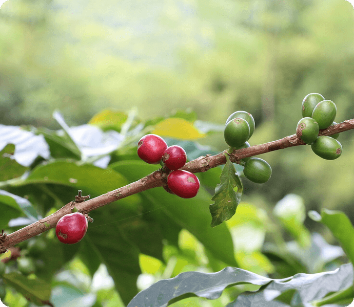

> **Descripción de la imagen** — La imagen es una fotografía de naturaleza que muestra una rama de planta con frutos. La rama es de color marrón y se extiende horizontalmente a través del centro del encuadre. En la rama hay varios frutos pequeños, algunos de color rojo intenso y otros de color verde. Las frutas están agrupadas en racimos o brotes. El fondo está compuesto por abundante follaje verde, que aparece desenfocado (efecto bokeh), lo que sugiere un entorno exterior y una iluminación suave. La composición se centra en la textura de la rama y el contraste entre los frutos rojos y las hojas verdes circundantes.

El café en el árbol: el origen del caso que vamos a analizar

## Slide 3

Cómo vamos a trabajar

La metodología combina estudio de caso, análisis interdisciplinario y actividades disciplinares. El encuentro dura aproximadamente dos horas y reúne a estudiantes y docentes de las cuatro asignaturas participantes.

1

Estudio de caso

Se presenta una empresa antioqueña real en su contexto y la decisión que debe tomar.

2

Encuentro interdisciplinario

Los docentes contextualizan, analizan y muestran las variables que hay detrás de la decisión.

3

Discusión con estudiantes

El grupo participa, aporta criterios y descubre la información que hace falta para decidir.

4

Actividad por asignatura

Cada docente deja un producto distinto sobre el mismo caso, según su asignatura.

Programa:   Administración de Empresas

Modalidad:   Virtual

Duración:   2 horas aproximadamente

Participantes:   Estudiantes y docentes

## Slide 4

Cuatro miradas sobre una misma empresa

Cada docente entra al caso desde su disciplina. Ninguna mirada resuelve el problema por sí sola: la decisión gerencial aparece cuando las cuatro se integran.

ECONOMÍA

El entorno condiciona la decisión

Qué está pasando afuera

EMPRENDIMIENTO

Crecer no significa simplemente vender más

Dónde está la oportunidad

PROYECTOS

Una buena idea necesita convertirse en un proyecto viable

Cómo se convierte en realidad

LOGÍSTICA Y COMERCIO EXTERIOR

Una oportunidad comercial debe poder convertirse en una operación eficiente

Cómo se hace funcionar

La pregunta que acompaña todo el encuentro es la misma para las cuatro asignaturas; lo que cambia es el lente con el que se analiza.

## Slide 5

EL CASO INTEGRADOR

Café de Montaña Antioqueño S.A.S.

Una empresa local frente al reto de crecer

## Slide 6

La historia de la empresa

Café de Montaña Antioqueño S.A.S. es una empresa mediana ubicada en Antioquia, creada hace aproximadamente ocho años por un grupo de emprendedores interesados en transformar y comercializar el café producido por pequeños productores del departamento.

Ocho años de trayectoria

Un proyecto emprendedor que se consolidó como empresa mediana.

Raíz local

Compra café a productores de diferentes municipios de Antioquia.

Marca propia

Transforma el grano y lo comercializa bajo su propio sello.

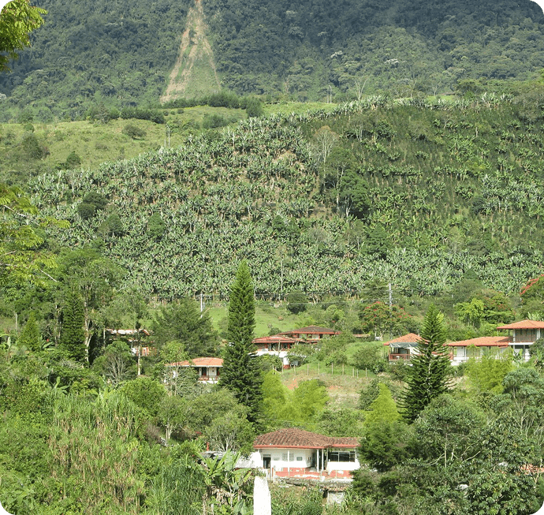

> **Descripción de la imagen** — La imagen es una fotografía de un paisaje natural exuberante y montañoso.
>
> El primer plano y el plano medio están dominados por una densa vegetación verde, compuesta por árboles altos, arbustos y follaje denso que sugiere un entorno tropical o selvático. Se observan varias estructuras residenciales con techos de color terracota o rojo, dispersas entre la vegetación.
>
> El fondo está ocupado por una colina o ladera empinada cubierta por un bosque muy denso y verde, lo que indica una cobertura forestal extensa. La luz es difusa, resaltando los tonos verdes variados del paisaje.

Paisaje cafetero antioqueño: el territorio donde opera la empresa

## Slide 7

El origen: los pequeños productores

La materia prima proviene de fincas de distintos municipios del departamento. Esa dispersión geográfica es, al mismo tiempo, la riqueza de la marca y uno de sus mayores desafíos operativos.

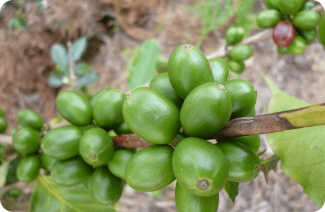

> **Descripción de la imagen** — La imagen es una fotografía de un grupo de frutos verdes y ovalados que crecen agrupados en una rama o tallo. Los frutos son de un color verde intenso y tienen una forma redondeada u ovalada. Están densamente agrupados en la parte superior del tallo. Se observan hojas verdes más oscuras adheridas a la estructura. El fondo está desenfocado, sugiriendo un entorno natural o exterior con tonos terrosos y vegetación difusa.

El grano en el árbol

Café cultivado por familias productoras en varios municipios de Antioquia.

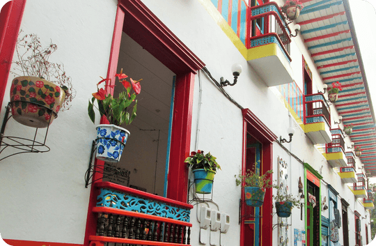

> **Descripción de la imagen** — Es una fotografía que muestra la fachada exterior de un edificio urbano, caracterizada por su arquitectura colorida y detalles ornamentales. La pared principal es de color blanco. En el centro se observa una puerta o ventana enmarcada en rojo intenso.
>
> A la derecha de esta abertura hay un balcón o ventana con molduras y detalles pintados en colores vivos como azul, amarillo y rojo. Hay elementos de hierro forjado decorativo, incluyendo barandales y soportes.
>
> Varias macetas con plantas están colocadas en el exterior, tanto colgando del balcón como adheridas a la pared. La escena captura un detalle arquitectónico vibrante de una calle.

Los territorios

Municipios cafeteros con identidad propia, que la marca reivindica como origen.

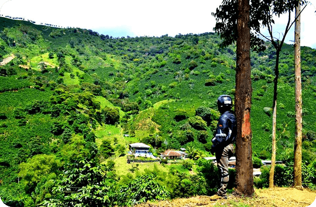

> **Descripción de la imagen** — Es una fotografía de un paisaje natural exuberante.
>
> En primer plano, se observa tierra seca y de color marrón claro o amarillento. A la derecha domina el tronco oscuro y grueso de un árbol con corteza rugosa.
>
> El plano medio y el fondo están dominados por colinas onduladas cubiertas por una densa vegetación verde brillante y frondosa, lo que sugiere un entorno tropical o muy húmedo. Se aprecian varios árboles dispersos entre la maleza. En algunas áreas del valle o las laderas, se distinguen pequeñas estructuras o edificaciones de color claro.
>
> El cielo es claro, con tonos blancos y azules pálidos, indicando un día luminoso. La composición muestra un fuerte contraste entre el suelo seco del primer plano y la vegetación densa y verde del paisaje montañoso de fondo.

Las fincas proveedoras

Unidades productivas pequeñas, dispersas y con capacidades muy distintas entre sí.

## Slide 8

De la finca a la marca: el proceso

La empresa no solo comercializa: transforma. Compra el café, lo selecciona, lo procesa, lo tuesta, lo empaca y lo vende bajo una marca propia. Cada eslabón agrega valor y, también, costo.

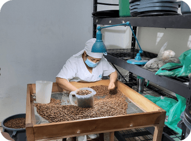

> **Descripción de la imagen** — La imagen es una fotografía que muestra a una persona trabajando con granos de café en lo que parece ser un área de procesamiento o selección.
>
> En primer plano, se observa una bandeja de madera que contiene una gran cantidad de granos de café tostados. Una persona, vestida con una camisa blanca y una mascarilla, está inclinada sobre la bandeja, manipulando los granos.
>
> Detrás de la persona, se distingue un soporte o brazo con un recipiente azul claro (posiblemente una jarra o equipo de preparación) que se extiende hacia el área de trabajo. El fondo muestra estanterías oscuras con diversos elementos y bolsas de plástico verde. La escena sugiere una actividad relacionada con el manejo, clasificación o preparación del café.

1

Selección

Clasificación del grano comprado a los productores.

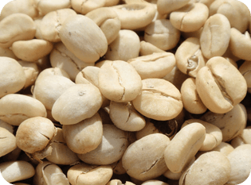

> **Descripción de la imagen** — La imagen es una fotografía de primer plano que muestra una gran cantidad de granos de café tostados. Los granos son de color beige claro o tostado pálido y tienen una textura rugosa característica del café. Están dispuestos densamente, llenando todo el encuadre, creando una composición con mucha textura y profundidad. La iluminación resalta los tonos claros de los granos.

2

Transformación

Beneficio y preparación del café antes del tueste.

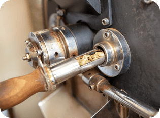

> **Descripción de la imagen** — La imagen es una fotografía de primer plano que muestra una parte de un mecanismo mecánico antiguo o industrial.
>
> En el lado izquierdo se observa un mango o palanca de madera, conectado a una estructura metálica. Esta estructura metálica sostiene un eje cilíndrico.
>
> El eje central está montado en un conjunto de piezas metálicas robustas y tiene un elemento que parece ser un carrete o una polea. En el centro del mecanismo se puede ver material de color claro (posiblemente hilo, fibra o materia prima) enrollado o pasando a través del sistema.
>
> La composición general sugiere un detalle de maquinaria textil o de procesamiento mecánico.

3

Tostión

El perfil de tueste define el carácter del producto.

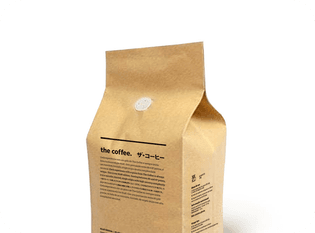

> **Descripción de la imagen** — La imagen es una fotografía de una bolsa de papel kraft de color marrón claro. La bolsa está orientada verticalmente y muestra texto impreso en ella. El texto visible incluye la frase "the coffee." en inglés y caracteres japoneses ("ザ・コーヒー").

4

Empaque

Presentación, conservación y trazabilidad del producto.

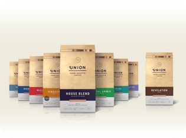

> **Descripción de la imagen** — La imagen muestra una fila horizontal de siete cajas de producto idénticas o muy similares, dispuestas sobre un fondo blanco liso. Cada caja tiene un diseño uniforme en tonos beige y marrón claro con texto oscuro. En la parte superior de cada caja se observa el logotipo "UNION HAND MADE EMPORIO".
>
> Cada caja presenta una etiqueta pequeña de color diferente en la parte frontal, indicando un sabor o variedad distinta (se distinguen etiquetas como Mango, Virgin, Green Tea, etc.). Las cajas están alineadas y orientadas hacia el espectador.

5

Marca propia

El café llega al mercado con sello e identidad propios.

## Slide 9

Dónde vende hoy la empresa

Durante los últimos años la empresa se ha posicionado principalmente en Antioquia, a través de seis canales que conviven al mismo tiempo y que exigen respuestas comerciales y logísticas distintas.

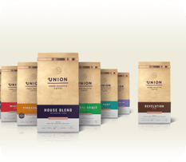

> **Descripción de la imagen** — La imagen es una fotografía de varios paquetes de productos, presumiblemente café o mezclas similares, dispuestos horizontalmente sobre una superficie clara. Los paquetes son de color marrón claro y presentan el logotipo de la marca "UNION" en la parte superior. Se distinguen claramente cuatro variedades diferentes, identificadas por nombres impresos en los empaques: "HOUSE BLEND", "INDIGO", "LAL SPINLET" y "REVELATION".

Supermercados regionales

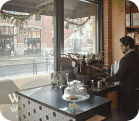

> **Descripción de la imagen** — Es una fotografía de un interior que parece ser el área de un bar o lounge.
>
> En primer plano se observa una superficie oscura, probablemente una barra o mostrador, sobre la cual hay varios objetos, incluyendo cristalería variada y botellas.
>
> A la derecha, se ve parcialmente a un hombre vestido con ropa oscura, de pie frente al mostrador.
>
> El fondo está dominado por grandes ventanales que permiten ver el exterior, donde se distingue una calle o espacio exterior, posiblemente bajo condiciones de luz tenue o nubladas. A la derecha del interior, se aprecia una pared de ladrillo visto. La iluminación general sugiere un ambiente cálido e íntimo.

Tiendas especializadas

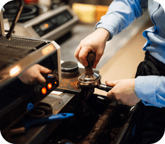

> **Descripción de la imagen** — La imagen es una fotografía en primer plano que muestra dos manos manipulando un componente sobre lo que parece ser una pieza de maquinaria o equipo industrial. La superficie sobre la que se trabaja es metálica y oscura. Las manos están enfocadas en interactuar con los mecanismos del aparato, sugiriendo una acción de ajuste, reparación o operación técnica.

Restaurantes

> **Descripción de la imagen** — La imagen es una fotografía de un vaso alto que contiene una bebida de color ámbar o marrón claro, coronada por una capa espumosa blanca y densa. El vaso está colocado sobre un plato blanco circular. El plato se encuentra sobre una superficie de madera con vetas visibles, lo que sugiere una mesa rústica. La iluminación es cálida y resalta la textura del líquido y la espuma.

Hoteles

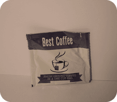

> **Descripción de la imagen** — La imagen muestra un paquete o bolsa de café. El empaque es de color blanco con texto impreso en color oscuro. En la parte superior se lee el texto "Best Coffee". En el centro del paquete hay una ilustración estilizada de una taza de café humeante. Debajo de la ilustración, se encuentra un texto más pequeño que indica: "FRESH GROUND COFFEE IN A ONE CUP BAG".

Clientes institucionales

> **Descripción de la imagen** — Es una fotografía de un escritorio o superficie blanca donde se observa una computadora portátil abierta (de color plateado) en el centro. Delante de la laptop, hay un carrito de compras metálico con estructura de alambre y cesta, posicionado sobre la misma superficie. El fondo está desenfocado, mostrando una pared texturizada de tono marrón cálido y algunas sombras oscuras.

Comercio electrónico

## Slide 10

La promesa que sostiene la marca

Toda la propuesta comercial de la empresa se ha construido alrededor de cuatro conceptos. No son adornos publicitarios: son compromisos que condicionan sus costos, sus proveedores y su forma de operar.

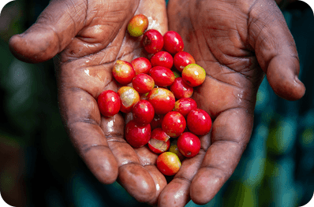

> **Descripción de la imagen** — La imagen es una fotografía de primer plano que muestra un par de manos de tono oscuro sosteniendo un puñado de pequeñas frutas redondas. Las manos están abiertas y rodean el grupo de frutos.
>
> Las frutas son de color rojo intenso, algunas presentan tonos amarillos o anaranjados en la superficie. Están agrupadas en el centro de las palmas. La iluminación resalta la textura de la piel y el brillo de las frutas.

Calidad

Control del grano en cada etapa, desde la compra hasta la taza.

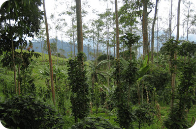

> **Descripción de la imagen** — La imagen es una fotografía de un entorno natural denso, probablemente un bosque tropical o selva.
>
> Se observa una gran cantidad de vegetación exuberante y verde. El primer plano está dominado por arbustos y follaje bajo y denso. Detrás, se elevan numerosos árboles altos con troncos delgados y rectos. La densidad del bosque es muy alta, con múltiples capas de vegetación. Se aprecian helechos y plantas trepadoras cubriendo parte de los tallos de los árboles. La luz sugiere un día soleado que penetra la copa, creando contrastes entre las áreas iluminadas y las sombras profundas del interior del bosque. El fondo muestra más vegetación y colinas o montañas distantes cubiertas de verde.

Origen

El café tiene procedencia identificable y territorio reconocible.

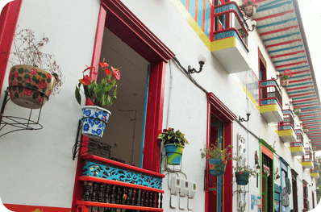

> **Descripción de la imagen** — La imagen es una fotografía de la fachada exterior de un edificio de color blanco, con detalles arquitectónicos y elementos decorativos en colores vivos.
>
> Se observa una puerta o ventana enmarcada en rojo intenso. A la derecha, hay un balcón con barandilla de metal ornamentada que presenta tonos azules y amarillos. En el lado izquierdo de la fachada se aprecian varias plantas: una maceta colgante con follaje rojizo y otra maceta más grande (tipo terracota) con plantas enredadas.
>
> La estructura del edificio incluye múltiples niveles y detalles decorativos, como molduras y barandales de balcones que combinan el blanco de la pared con acentos rojos y azules brillantes. La escena sugiere una calle o un entorno urbano con arquitectura colorida.

Producto local

Valor generado en Antioquia, con productores del departamento.

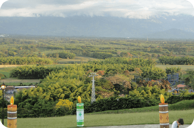

> **Descripción de la imagen** — La imagen es una fotografía de un paisaje exterior, probablemente rural o semi-rural, capturada a nivel del suelo.
>
> En primer plano se observa una extensión de césped verde. El plano medio está dominado por una densa vegetación arbórea, compuesta por árboles frondosos de diversos tonos de verde y algunos toques de amarillo/naranja en la parte superior, sugiriendo un entorno boscoso o parque.
>
> En el centro-derecha del plano medio se destaca una alta torre o poste de electricidad metálico (pylon).
>
> El fondo está formado por colinas o montañas suaves que se extienden horizontalmente bajo un cielo cubierto y nublado, con tonos grises y blancos. La iluminación general es difusa debido a las nubes. En la esquina inferior derecha, se distingue parcialmente una figura humana.

Sostenibilidad

Compromiso con la cadena productiva y con el entorno.

## Slide 11

EL RETO

La empresa ha logrado crecer

Ahora enfrenta una decisión que puede determinar su futuro

## Slide 12

La oportunidad sobre la mesa

La gerencia identificó que existe espacio para ampliar el negocio. Algunos clientes han manifestado interés en comercializar sus productos en otras ciudades del país, y con ello aparecieron otros frentes de crecimiento.

Nuevos productos

Café premium

Comercio electrónico

Mercados especializados

Turismo y experiencias alrededor del café

Nuevos canales de distribución

Internacionalización

> **Descripción de la imagen** — La imagen es una fotografía tomada en un entorno interior, probablemente sobre una mesa de trabajo. En primer plano se observa una laptop de color claro (plateado o blanco) abierta. Frente a la laptop y apoyada sobre la superficie de la mesa hay un carrito de compras metálico con estructura de alambre, que presenta detalles de color azul. El fondo está desenfocado, lo que sugiere una profundidad de campo reducida, y muestra elementos borrosos del entorno.

Siete frentes posibles de crecimiento identificados por la gerencia.

## Slide 13

Crecer exige invertir

La empresa no tiene recursos ilimitados. Para crecer necesita realizar inversiones simultáneas en nueve frentes, y además enfrentar un aumento en la complejidad de su operación.

Maquinaria

Tecnología

Almacenamiento

Talento humano

Marketing

Sistemas de información

Inventarios

Transporte

Distribución

Y con el crecimiento aumenta la complejidad de toda la operación

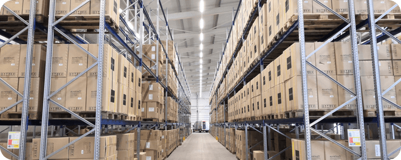

> **Descripción de la imagen** — La imagen es una fotografía de un interior de un almacén o depósito muy grande. Muestra largas filas de estanterías metálicas industriales que se extienden profundamente en la perspectiva, creando un pasillo central.
>
> Las estanterías están completamente llenas de cajas y paquetes apilados, predominantemente de color marrón claro o beige, lo que sugiere mercancía almacenada. La estructura es robusta, compuesta por marcos metálicos verticales y horizontales. El techo industrial con iluminación visible se extiende a lo largo del pasillo.
>
> La composición enfatiza la escala y la profundidad del espacio, mostrando una gran cantidad de inventario organizado en el almacén.

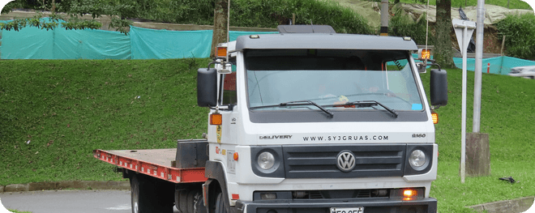

> **Descripción de la imagen** — La imagen es una fotografía de un camión comercial blanco estacionado al aire libre. El vehículo es un camión cabina-motor con una caja de carga o plataforma trasera. La parte frontal del camión es blanca y presenta detalles en la parrilla y el parachoques.
>
> El camión está situado frente a una pared o seto muy alto y denso de color verde oscuro. Detrás del seto, se observa una estructura o lona de color azul claro o turquesa. El entorno es exterior, con vegetación abundante (árboles y arbustos) visible en el fondo derecho. La iluminación sugiere que la foto fue tomada durante el día.

## Slide 14

Las cuatro alternativas de la Junta Directiva

La Junta Directiva puso sobre la mesa cuatro caminos posibles, y considera también la posibilidad de combinar varios de ellos.

1

Alternativa 1

Consolidar el mercado antioqueño antes de crecer

2

Alternativa 2

Expandirse hacia otras ciudades de Colombia

3

Alternativa 3

Desarrollar nuevos productos y fortalecer los canales digitales

4

Alternativa 4

Prepararse para una futura internacionalización

La Junta también contempla combinar varias alternativas antes de definir el rumbo.

## Slide 15

PREGUNTA CENTRAL DEL CASO

¿Qué estrategia debería implementar Café de Montaña Antioqueño S.A.S. para crecer de manera competitiva, rentable y sostenible?

Esta pregunta acompaña todo el encuentro. Cada área del conocimiento la analiza desde una perspectiva diferente.

## Slide 16

Apertura: la primera pregunta es para ustedes

Antes de que intervenga cada área del conocimiento, la discusión arranca con los estudiantes. La respuesta a esta pregunta revela qué información considera necesaria un equipo directivo antes de decidir.

Si ustedes fueran la Junta Directiva de Café de Montaña Antioqueño, ¿qué información necesitarían antes de decidir si la empresa debe crecer?

Las respuestas pueden recogerse por el chat o con una herramienta interactiva. El moderador las agrupa y las conecta con las cuatro áreas del conocimiento.

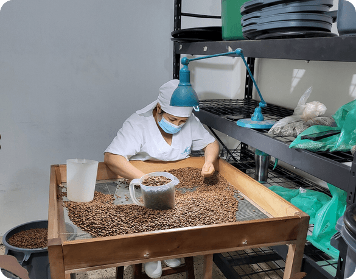

> **Descripción de la imagen** — La imagen es una fotografía que muestra a una persona trabajando en un proceso de preparación o extracción de café.
>
> En primer plano, se observa una bandeja de madera que contiene una gran cantidad de granos de café tostados esparcidos sobre ella. Una persona, vestida con una camisa blanca y una mascarilla quirúrgica azul claro, está inclinada sobre la bandeja, interactuando con el material.
>
> Detrás de la persona y los granos de café, se encuentra un equipo de laboratorio o extracción de café. Este equipo incluye un recipiente o aparato de color azul verdoso con una manguera o tubo largo que se extiende hacia la izquierda.
>
> El fondo está dominado por una estantería metálica oscura llena de diversos objetos, incluyendo bolsas y telas de colores (verde y azul), lo que sugiere un entorno de estudio o producción.

## Slide 17

Preguntas desde Economía

ÁREA: ECONOMÍA

El entorno condiciona la decisión

El propósito no es una clase extensa de teoría económica, sino usar conceptos económicos para leer el caso.

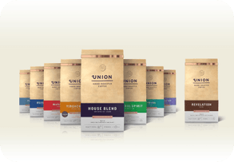

> **Descripción de la imagen** — La imagen muestra una fila de siete cajas de producto idénticas o muy similares, dispuestas horizontalmente sobre una superficie plana. Cada caja tiene un diseño uniforme con un fondo color beige o marrón claro y texto en mayúsculas de color oscuro que identifica el producto como "UNION HOUSE BLEND". Las cajas están alineadas una al lado de la otra.

1

¿Crecer en este momento representa una oportunidad o un riesgo para la empresa?

2

¿Qué variables económicas podrían modificar la decisión de inversión?

3

¿Qué podría ocurrir si la empresa se endeuda para financiar su expansión?

4

¿Es conveniente depender exclusivamente del mercado antioqueño?

5

¿Qué tendría que analizar la empresa antes de considerar un mercado internacional?

PREGUNTA DE CIERRE

¿Qué información económica necesitarían ustedes para recomendarle a la Junta Directiva crecer o no crecer?

## Slide 18

Preguntas desde Emprendimiento

ÁREA: EMPRENDIMIENTO

Crecer no significa simplemente vender más

La discusión se desplaza hacia el mercado y hacia la capacidad de la empresa para generar valor: necesidades del consumidor, propuesta de valor, segmentación, innovación y modelo de negocio.

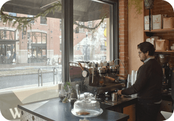

> **Descripción de la imagen** — La imagen es una fotografía de un interior, probablemente el área de servicio o barra de un café o bar.
>
> En primer plano, se observa una superficie oscura (una mesa o mostrador) sobre la cual hay varios objetos dispuestos: vasos, botellas y otros utensilios.
>
> A la derecha, se encuentra un hombre de pie, vestido con ropa oscura, mirando hacia el área del mostrador o la ventana.
>
> El fondo está dominado por una gran abertura de vidrio que da a un exterior iluminado, donde se aprecian edificios y una calle. Hay vegetación colgante o enredaderas visibles cerca del marco de la ventana. La iluminación sugiere un ambiente cálido e íntimo.

1

¿Qué oportunidad de negocio está desaprovechando actualmente Café de Montaña?

2

¿Debería la empresa vender más del mismo producto o crear una nueva propuesta de valor?

3

¿Qué estaría dispuesto a pagar el cliente y por qué?

4

¿Qué tendría que cambiar en su modelo de negocio para llegar a nuevos mercados?

5

¿La sostenibilidad puede convertirse en una ventaja competitiva o solamente representa un costo adicional?

PREGUNTA DE CIERRE

Si ustedes fueran los emprendedores, ¿qué nueva oportunidad desarrollarían y para qué tipo de cliente?

## Slide 19

Preguntas desde Proyectos

ÁREA: PROYECTOS

Una buena idea necesita convertirse en un proyecto viable

Identificar una oportunidad no significa que pueda ejecutarse. La empresa debe definir qué quiere lograr, cuánto cuesta, qué recursos necesita, cuánto tiempo requiere, qué riesgos enfrenta, cómo lo financia y cómo mide resultados.

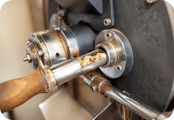

> **Descripción de la imagen** — La imagen es una fotografía de primer plano que muestra una sección de un mecanismo mecánico. Se observa un mango o palanca de madera en el lado izquierdo, conectado a un eje metálico. Este eje se une a una estructura metálica robusta con rodamientos y soportes. En el lado derecho, hay una pieza circular grande y oscura (posiblemente una polea o parte de un volante) que está conectada al mecanismo central. Se puede apreciar material granular o virutas metálicas cerca del punto de conexión entre el eje y la estructura metálica. El conjunto sugiere una pieza de maquinaria o motor.

1

¿Qué proyecto debería ejecutar primero la empresa?

2

¿Debe realizar todas las inversiones al mismo tiempo o hacerlo por etapas?

3

¿Qué recursos necesita para ejecutar la estrategia?

4

¿Cómo podría financiar el proyecto?

5

¿Qué riesgos podrían hacer fracasar la iniciativa?

6

¿Qué indicadores deberían utilizarse para determinar si el proyecto fue exitoso?

PREGUNTA DE CIERRE

Si solamente pudieran ejecutar una iniciativa durante el próximo año, ¿cuál elegirían y por qué?

## Slide 20

Preguntas desde Logística

ÁREA: LOGÍSTICA Y COMERCIO EXTERIOR

Una oportunidad comercial debe poder convertirse en una operación eficiente

Productores → Abastecimiento → Transformación → Almacenamiento → Transporte → Distribución → Cliente. Una empresa puede tener un producto excelente y un mercado atractivo, y aun así fracasar si la cadena no responde.

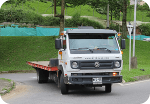

> **Descripción de la imagen** — La imagen es una fotografía tomada al aire libre que muestra un camión blanco estacionado o circulando lentamente en una carretera rural o de campo.
>
> El vehículo es un camión tipo Volkswagen, de color blanco, equipado con una cabina y una plataforma o caja abierta (flatbed) detrás. El camión está orientado hacia la derecha del encuadre.
>
> El entorno es verde y natural: hay abundante vegetación, incluyendo árboles altos y arbustos frondosos que cubren las colinas en el fondo. La carretera sobre la que se encuentra el camión parece ser de asfalto o tierra compactada. La iluminación sugiere que es de día y el clima es soleado.

1

¿La cadena logística actual está preparada para soportar el crecimiento?

2

¿Qué ocurriría con los costos si la empresa empieza a vender en otras ciudades?

3

¿Dónde debería almacenar sus productos?

4

¿Cómo debería gestionar sus inventarios?

5

¿Qué riesgos existen en el abastecimiento desde diferentes municipios?

6

¿Qué tecnología podría mejorar la gestión logística?

7

¿Qué tendría que cambiar si posteriormente decide exportar?

PREGUNTA DE CIERRE

¿Qué debería solucionar primero la empresa en su cadena logística antes de iniciar la expansión?

## Slide 21

Momento de integración

Después de las cuatro intervenciones se retoma la pregunta central. Ahora corresponde relacionar las cuatro perspectivas: cada área responde una pregunta distinta y, encadenadas, conducen a la decisión gerencial.

1

ECONOMÍA

¿Qué está pasando afuera?

→

2

EMPRENDIMIENTO

¿Dónde está la oportunidad?

→

3

PROYECTOS

¿Cómo podemos convertirla en realidad?

→

4

LOGÍSTICA

¿Cómo podemos hacerla funcionar?

→

5

ADMINISTRACIÓN

¿Qué decisión debemos tomar?

La pregunta central vuelve a la mesa: ¿qué estrategia debería implementar la empresa para crecer de manera competitiva, rentable y sostenible?

## Slide 22

Situación sorpresa

Para cerrar el encuentro se introduce una nueva situación que altera el escenario analizado hasta ahora.

La empresa acaba de recibir una propuesta de una importante cadena nacional interesada en comercializar sus productos en diferentes ciudades de Colombia.

La propuesta permitiría aumentar significativamente las ventas, pero exige mayor producción, entregas permanentes, precios competitivos y capacidad de respuesta logística.

PREGUNTA FINAL PARA TODOS

¿Esta nueva oportunidad cambia la decisión que ustedes tomarían para Café de Montaña? ¿Por qué?

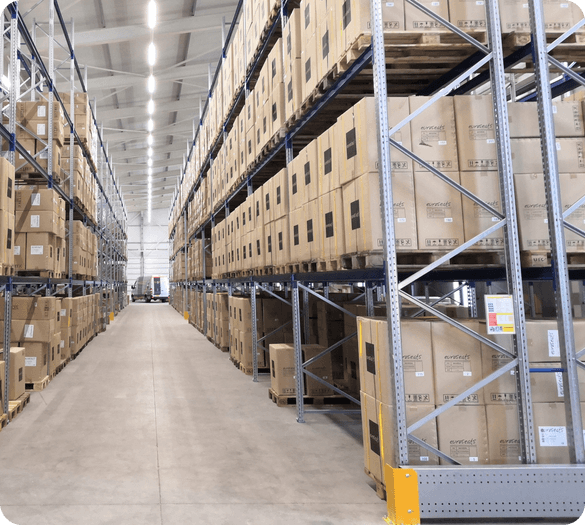

> **Descripción de la imagen** — La imagen es una fotografía de un interior de almacén o centro de distribución. Muestra un pasillo largo y estrecho que se extiende hacia el fondo.
>
> El espacio está dominado por estanterías metálicas industriales muy altas, llenas de cajas y paquetes apilados en paletas de cartón. Las estanterías se extienden a lo largo de ambos lados del pasillo, creando un efecto de túnel de almacenamiento.
>
> La perspectiva es central, mirando hacia el fondo del almacén. El suelo es de concreto liso. En el centro del pasillo, hay iluminación industrial brillante que recorre la longitud del espacio. La estructura superior y los soportes metálicos de las estanterías son claramente visibles.

## Slide 23

Antes de decidir, la Junta Directiva solicita un análisis integral

Hasta aquí llega la historia. Lo que sigue es el trabajo de ustedes: leer esta empresa desde cuatro disciplinas y construir una recomendación gerencial.

Economía

Emprendimiento

Proyectos

Logística

## Slide 24

Registro fotográfico: créditos

Todas las fotografías provienen de Wikimedia Commons y se utilizan con fines académicos, conservando la atribución exigida por cada licencia. Café de Montaña Antioqueño S.A.S. es una empresa ficticia creada con fines pedagógicos; las imágenes ilustran el contexto del sector, no a la empresa del caso.

Coffee berries in Hacienda Guayabal, Colombia · Bernard Gagnon · CC BY-SA 4.0

Paisaje típico Colombiano - Typical Colombian … · Diego Botero P. · CC BY-SA 4.0

Frutas de café caturro-arabica en San Roque Co… · Aliman5040 · CC BY-SA 3.0

Casas coloridas típicas en Colombia · Diego Botero P. · CC BY-SA 4.0

Bolívar cafetales 2 · Moterocolombia · CC BY-SA 4.0

Coffee farm in Colombia · U.S. Fish and Wildlife Ser… · CC BY 2.0

Сoffee plantations around the city · Leon petrosyan · CC BY-SA 4.0

Clasificando café Jardin · Xemenendura · CC BY-SA 4.0

Coffee Beans Drying in the Sun (4261209148) · John Pavelka · CC BY 2.0

Closer look at the coffee beans from the coffe… · Jameswasswa · CC BY-SA 4.0

Coffee beans in a farmer's hands · Jameswasswa · CC BY-SA 4.0

Coffeebag(kraft)-250g · The Coffee · CC BY-SA 4.0

Supermarket Coffee Bags · Jmcronald · CC BY-SA 4.0

Slow By Slow · Tamanoeconomico · CC BY-SA 4.0

Barista prepares espresso at coffee shop · Shixart1985 · CC BY 2.0

The cup of coffee on a wooden table (479390816… · Artem Beliaikin · CC BY 2.0

Coffee package · WanderingTrad · CC BY-SA 4.0

Mini shopping cart placed on a table next to a… · Shixart1985 · CC BY 2.0

Palletstellingen in een warehouse met framebes… · Holland Storage Solutions · CC BY-SA 4.0

Volkswagen Delivery, Colombia · JLaw45 · CC BY 2.0

Fuente de las imágenes: Wikimedia Commons (licencias CC0, CC BY y CC BY-SA).

