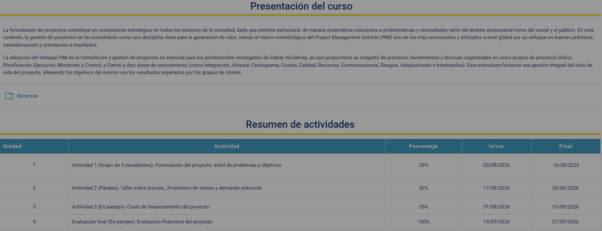
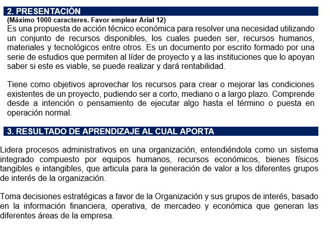
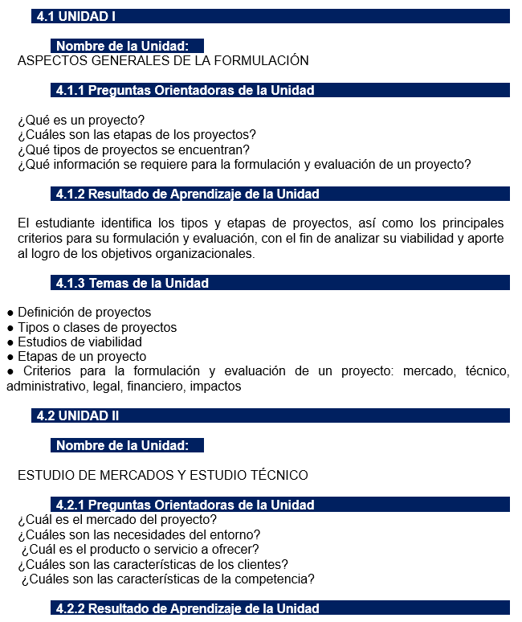
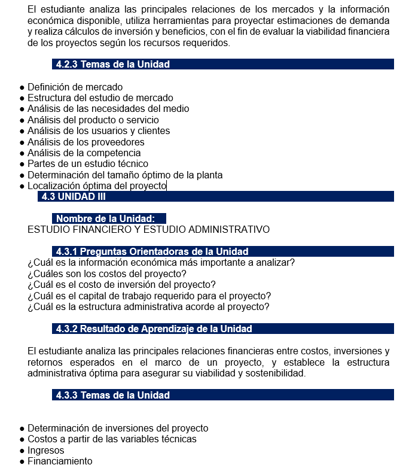
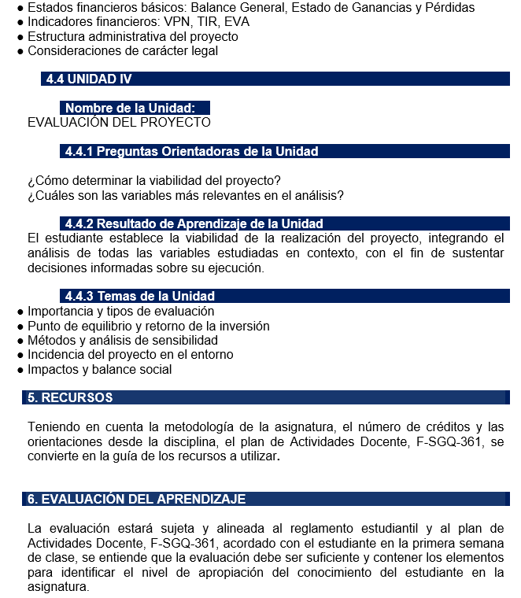

# Formulación y evaluación de proyectos

> Ficha del curso. Completa docente, fechas y temario a medida que avance el periodo.

## Unidades

- [Unidad 1 - Aspectos generales de la formulacion](<Unidad 1 - Aspectos generales de la formulacion>)

---
# Presentación del curso

> **Captura de pantalla** — 20260807-181902
> 
> 

La formulación de proyectos constituye un componente estratégico en todos los sectores de la sociedad, dado que permite estructurar de manera sistemática soluciones a problemáticas y necesidades tanto del ámbito empresarial como del público. En este contexto, la gestión de proyectos se ha consolidado como una disciplina clave para la generación de valor, siendo el marco metodológico del Project Management Institute (PMI) uno de los más reconocidos y utilizados a nivel global por su enfoque en buenas prácticas, estandarización y orientación a resultados.

> **Captura de pantalla** — 20260807-190809
> 
> 

## 2. PRESENTACIÓN
(Máximo 1000 caracteres.
Es una propuesta de acción técnica económica para resolver una necesidad utilizando un conjunto de recursos disponibles, los cuales pueden ser, recursos humanos, materiales y tecnológicos entre otros. Es un documento por escrito formado por una serie de estudios que permiten al líder de proyecto y a las instituciones que lo apoyan saber si este es viable, se puede realizar y dará rentabilidad.)

## 3 RESULTADO DE APRENDIZAJE AL CUAL APORTA:
Lidera procesos administrativos en una organización, entendiéndola como un sistema integrado compuesto por equipos humanos, recursos económicos, bienes físicos tangibles e intangibles, que articula para la generación de valor a los diferentes grupos de interés de la organización.
Toma decisiones estratégicas a favor de la Organización y sus grupos de interés, basado en la información financiera, operativa, de mercadeo y económica que generan las diferentes áreas de la empresa.

> **Captura de pantalla** — 20260807-192112
> 
> 

## 4.1 UNIDAD I

### Nombre de la Unidad:

ASPECTOS GENERALES DE LA FORMULACIÓN

### 4.1.1 Preguntas Orientadoras de la Unidad:

- ¿Qué es un proyecto?
- ¿Cuáles son las etapas de los proyectos?
- ¿Qué tipos de proyectos se encuentran?
- ¿Qué información se requiere para la formulación y evaluación?

#### 4.1.2 Nombre de la Unidad:

ESTUDIO DE MERCADOS Y ESTUDIO TÉCNICO

#### 4.1.3 Temas de la Unidad
- Definición de proyectos
- Tipos o clases de proyectos
- Estudios de viabilidad
- Etapas de un proyecto
- Criterios para la formulación y evaluación
- Aspectos generales de la formulación

## 4.2 UNIDAD II
ESTUDIO DE MERCADOS Y ESTUDIO TÉCNICO

### 4.2.1 Preguntas Orientadoras de la Unidad
- ¿Cuál es el mercado del proyecto?
- ¿Cuáles son las necesidades del entorno?
- ¿Cuál es el producto o servicio a ofrecer?
- ¿Cuáles son las características de los clientes?
- ¿Cuáles son las características de la competencia?

### 4.2.2 Resultado de Aprendizaje de la Unidad

> **Captura de pantalla** — 2026-08-07 20:02
>
> 

El estudiante analiza las principales relaciones de los mercados y la información económica disponible, utiliza herramientas para proyectar estimaciones de demanda y realiza cálculos de inversión, con el fin de evaluar la viabilidad financiera de los proyectos según los recursos requeridos.

### 4.2.3 Temas de la Unidad

*   Definición de mercado
*   Estructura del estudio de mercado
*   Análisis del producto de mercado
*   Análisis del producto o servicios
*   Análisis de los usuarios y clientes
*   Análisis de los proveedores
*   Análisis de la competencia
*   Partes de un estudio técnico
*   Determinación del tamaño óptimo del proyecto

## 4.3 UNIDAD III

### 4.3.1 Preguntas Orientadoras de la Unidad

*   ¿Cuál es la información económica más importante a analizar?
*   ¿Cuáles son los costos del proyecto?
*   ¿Cuál es el costo de inversión del proyecto?
*   ¿Cuál es el capital de trabajo requerido para el proyecto?
*   ¿Cuál es la estructura administrativa acorde al proyecto?

### 4.3.2 Resultado de Aprendizaje de la Unidad

El estudiante analiza las principales relaciones financieras entre costos, inversiones y retornos esperados en el marco de un proyecto, y establece la estructura administrativa óptima para asegurar su viabilidad y sostenibilidad.

### 4.3.3 Temas de la Unidad

*   Determinación de inversiones del proyecto
*   Costos a partir de las variables técnicas
*   Ingresos
*   Financiamiento

> **Captura de pantalla** — 2026-08-07 20:20
>
> 

## 4.4 UNIDAD IV

### Nombre de la Unidad:
EVALUACIÓN DEL PROYECTO

### 4.4.1 Preguntas Orientadoras de la Unidad
* ¿Cómo determinar la viabilidad del proyecto?
* ¿Cuáles son las variables más relevantes en el análisis?

### 4.4.2 Resultado de Aprendizaje de la Unidad
El estudiante establece la viabilidad de la realización del proyecto, integrando el análisis de todas las variables estudiadas en contexto, con el fin de sustentar decisiones informadas sobre su ejecución.

### 4.4.3 Temas de la Unidad
* Importancia y tipos de evaluación
* Punto de equilibrio y retorno de la inversión
* Métodos y análisis de sensibilidad
* Incidencia del proyecto en el entorno
* Impactos y balance social

## 5. RECURSOS

## 6. EVALUACIÓN DEL APRENDIZAJE
La evaluación estará sujeta y alineada al reglamento estudiantil y al plan de Actividades Docente, F-SGQ-361, acordado con el estudiante en la primera semana de clase, se entiende que la evaluación debe ser suficiente y contener los elementos para identificar el nivel de apropiación del conocimiento del estudiante en la asignatura.
ernasura

## Resumen de actividades

| Unidad | Actividad | Porcentaje | Inicio | Final |
| :---: | :--- | :---: | :---: | :---: |
| 1 | Actividad 1 (Grupo de 3 estudiantes): Formulación del proyecto: árbol de problemas y objetivos | 35% | 03/08/2026 | 16/08/2026 |
| 2 | Actividad 2 (Parejas): Taller sobre precios, Pronóstico de ventas y demanda potencial | 30% | 17/08/2026 | 30/08/2026 |
| 3 | Actividad 3 (En parejas): Costo de financiamiento del proyecto | 35% | 31/08/2026 | 13/09/2026 |
| 4 | Evaluación final (En parejas): Evaluación financiera del proyecto | 100% | 14/09/2026 | 27/09/2026 |