 coordenadas: (X,Y)

#### para hallar la distancia entre el origen y un punto:
> ##
> $ h=\sqrt[]{x^2+y^2 }$$ 
> ##
- - - 

#### Dividir un segmento en una razón dada 
$$r = \frac{AP}{PB} = \frac{P - A}{B - P}$$
 
  - ###### esta en una sola dimencion A, P y B = ('x' o 'y')

- - - 
#### Hallar las coordenadas de un punto P, que divide el segmento P1 P2, en una razón 

Formulas:
> ## 
> $$r = \frac{x - x1}{x2 -x}$$
> $$r = \frac{y - y1}{y2 -y}$$
> $$x = \frac{rx2 + x1}{1 + r}$$
> $$y = \frac{ry2 + y1}{1 + r}$$
> ## 

[Ejemplo razon de 'X'](../imgs/ejemplox.PNG) 
- - -  

#### Magnitud vectorial 
- se conformada por 3 propiedades:
  - Magnitud: valor del vector.
  - Direccion: relacion respecto al eje, los grados.
  - Sentido: hacia el lado que esta la flecha.

  se representa con una linea arriba y los valores ban dentro de " _< >_"   ejemplo: $\vec{v} = <12,2 > $

> #  
> $|A|=\sqrt[]{X^2+Y^2+Z^2 }$ 
> #  

- - -  
#### teorema de pitagoras (Cateto opuesto, Cateto adyacente y hipotenusa)
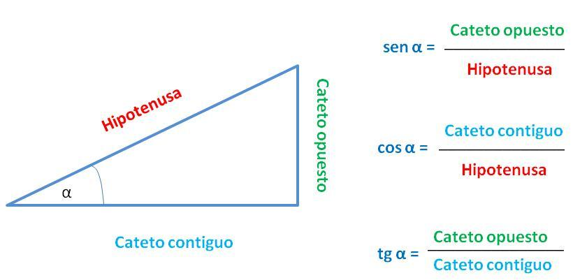
- clase 3 y4.

- ##### Formulas:
  > # 
  > $sen(α) = \frac{Cateto opuesto}{Hipotenusa}$
  > #  
  > $cos(α) = \frac{Cateto adyacente}{Hipotenusa}$  
  > #  
  > $tan(α) = \frac{Cateto opuesto}{Cateto adyacente}$ 
  > #  
  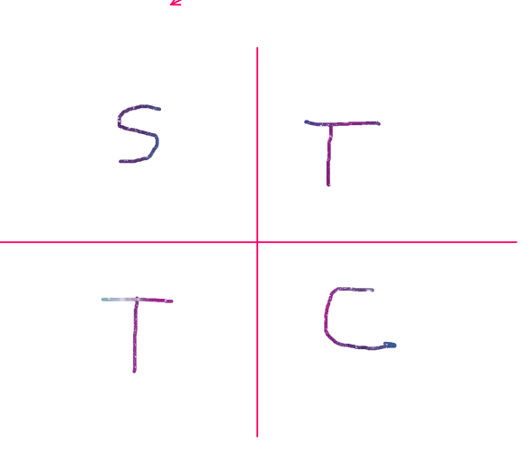

  - - -  
#### Producto Punto y Producto Cruz
 - [Calculador en excel](../producto%20punto,%20cruz.xlsx)
 - producto cruz ejemplo:
  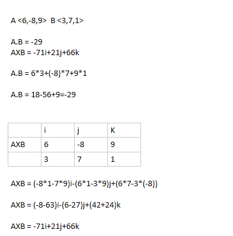
- producto punto ejemplo:
  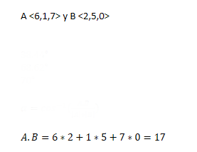

 - - -  
#### Cosenos directores

para tener en cuenta:
angulo con x alfa, $(α)$
agulo con y beta, $(β)$
angulo con z gama, $(γ)$

- Formulas:
  > ##
  > $x = magnitud∗Cos(α)$
  > #####  
  > $y = magnitud∗Cos(β)$
  > #####  
  > $z = magnitud∗Cos(γ)$
  > #####
  > $A.B = |A|∗|B|  cos⁡(α)$
  > ####
  > $cos(α) = \frac{A.B}{|A|∗|B|}$  
  > ####
  > $AXB=|A|∗|B|sen(α)$
  > ####
  > $sen(α)=\frac{AXB}{(|A|∗|B|)}$
  > ####
  > $α=sen^{-1}\left (  \frac{AXB}{(|A|∗|B|)} \right )$
  > ####
  > $ cos^2 (α)+cos^2 (β)+cos^2 (γ)=1 $
  > ## 

- ejemplo implimentacion :
  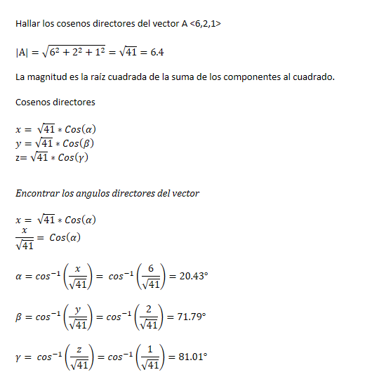

- - -  
#### Ecuación de la recta 2D
- Formulas:
  > ##
  > $m = \frac{y2 - y1}{x2-x1}$
  > ####
  > $y2−y1=m(x2−x1)$
  > ##
- ejemplo implimentacion :
  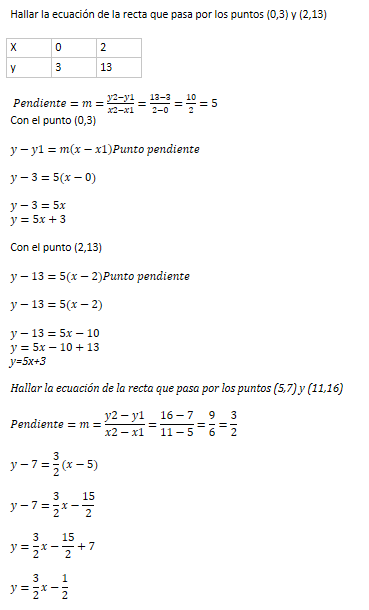

#### Ecuación de la recta 3D
Primero encontrar el vector director:
  > ##
  > $$ \overrightarrow{P1P2} <(X2-X1),(Y2-Y1),(Z2-Z1)> $$
  > ##

- #### Formulas:
  > ##
  > ##### Ecuación paramétrica:
  > $X = X0+α(X2-X1)$
  > ####
  > $Y = Y0+α(Y2-Y1)$
  > ####
  > $Z = Z0+α(Z2-Z1)$
  > ####  
  > ##### Ecuación simétrica:
  > $\frac{X−X0}{X2−X1}=\frac{Y−Y0}{Y2−Y1}=\frac{Z−Z0}{Z2−Z1}$
  > ####
  > ##### Ecuación vectorial:
  > $ < x,y,z> = < x0+α(x2-x1),y0+α(y2-y1), z0+α(z2-z1)>$
  > ####
  > ##
- #### ejemplo implimentacion :

  - ###### Ecuación paramétrica:

    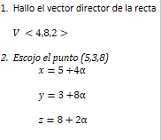

  - ###### Ecuación simétrica:

      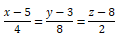
    
  - ###### Ecuación vectorial:

    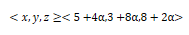

- ##### Otro Ejemplo:
  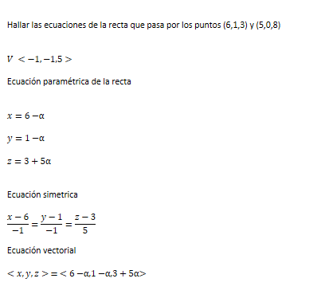

####  posición relativa entre rectas: 

  - Paralelas (AXB=0).
  - Perpendiculares (A.B=0).
  - Cortan (punto en común).
  - Cruzan.

####  posición relativa entre plano: 

>  mitad clase 10

> clase 17
#### Ecuaciones  Cuadraticas 
- ecuacion que modela un eclipse o algo circular 
  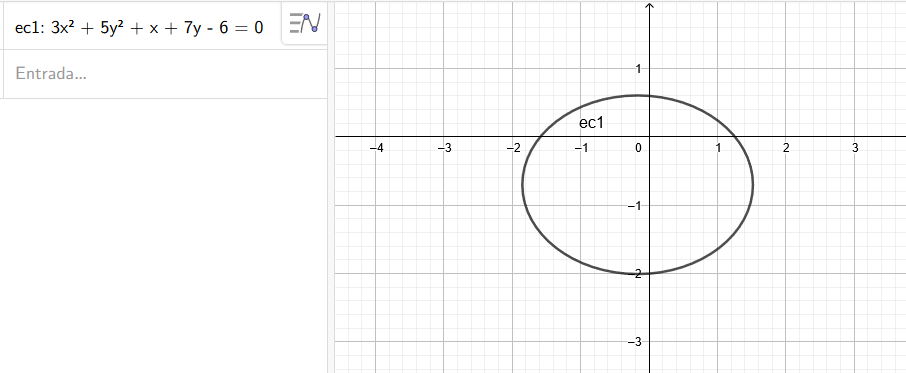

- las variables cuadraticas dan la forma al objeto 
 
> $ 3X^2 + 5Y^2 $

- y los valores elevadoas a la 1 dictan la direccion 

> x+7 y-6

si se usan solo un valor cuadratica forma una parabola 
  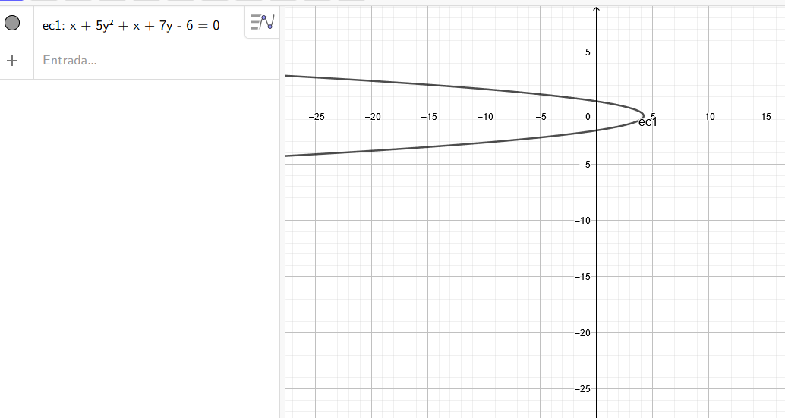

  - iperbola: uno de los valores son negativos 

    > $ 3X^2 - 5Y^2 $ 
    > $ -3X^2 + 5Y^2 $

    ## 
    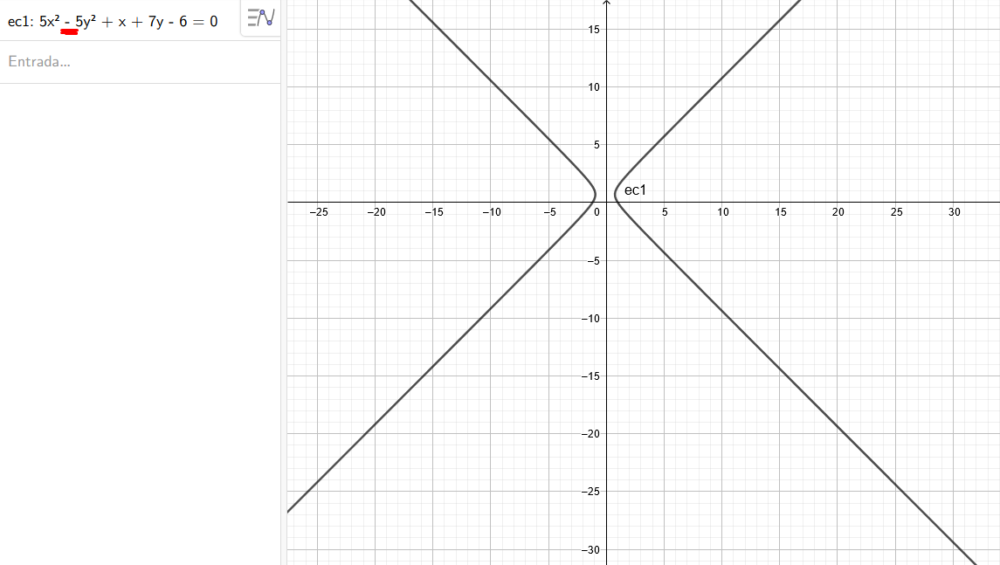
