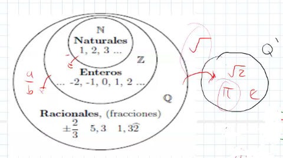
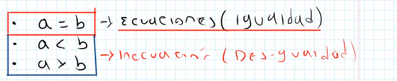
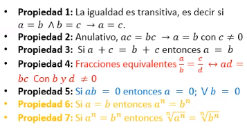

##### Simbolos Importantes
- ∈:𝑃𝑒𝑟𝑡𝑒𝑛𝑒𝑛𝑐𝑖𝑎
- ∉:𝑁𝑜𝑝𝑒𝑟𝑡𝑒𝑛𝑒𝑛𝑐𝑖𝑎
- ∪:𝑢𝑛𝑖ó𝑛
- ∩∶𝐼𝑛𝑡𝑒𝑟𝑠𝑒𝑐𝑐𝑖ó𝑛
- ⊂:𝐼𝑛𝑐𝑙𝑢𝑠𝑖𝑜𝑛
- ⊄:𝐸𝑥𝑐𝑙𝑢𝑠𝑖ó𝑛
- →: Lo mismo
- ↔: si y solo si
- ⋁: y/o
- ∧: 
- - -
##### Conjuntos de numeros:
- Números Naturales (ℕ):
ℕ = {1,2,3,4,5,6,7,8…}
- Números enteros (ℤ): aparecen por la operacion '-' (diferencia entre 2 nuemeros)
ℤ = ℤ−∪{0}∪ℤ+
  - ##### Numeros pares: 
    Un número(A)es par si se puede escribir como 𝐴= 2𝑘 Donde 𝑘 ∈ ℤ.
  - ##### Númerosimpares:
    Un número(B) es par si se puede escribir como 𝐵= 2𝑘±1 Donde 𝑘 ∈ ℤ.
  - #### NúmerosRacionales(ℚ):
    aparece por la operacion '%', Donde 𝐴 ^ 𝐵 ∈ ℤ, 𝑦 𝐵 ≠ 0
  - #### Númerosreales(ℝ):
    El conjunto de los números reales se definen como la unión de los números racionales y los números irracionales.

 
- - - 
#  
#  

- ## Ecuaciones:
  - ### Tricotomia:
    

    las ecuaciones vienen de la igualdad, tine unas condiciones.
    (las dependencias son funciones).
   
  - ### propiedades de las ecuaciones : 
    
  - ## Conjunto Solucion:
    conjunto de posibles soluciones a una ecuacion, tambien se da un conjunto vacio.

  ecuaciones cuadraticas y lineales

